#  Matriz de Referência

“O termo Matriz de Referência ou Quadro Conceitual (em inglês Framework) é utilizado especificamente no contexto das avaliações em larga escala para definir o construto e os fundamentos teóricos de cada teste ou questionário que compõe a avaliação, indicar as habilidades ou traços latentes a serem medidos e orientar a elaboração de itens. Além disso, também orienta a construção de escalas de proficiência, que especificam os níveis em que os estudantes se encontram e quais habilidades provavelmente são capazes de realizar no contexto da avaliação.”

Disponível em: https://www.gov.br/inep/pt-br/areas-de-atuacao/avaliacao-e-exames-educacionais/pisa/matrizes-de-referencia. Acesso em 09 out. 23.

A Matriz de Referência do ENEM é, sem dúvidas, o principal documento da prova do ENEM e, por incrível que pareça, poucos alunos (e me arrisco a dizer que, até mesmo, poucos professores) já pararam para ler o documento e entender, de fato, como é construída a prova do ENEM.

O arquivo, disponibilizado no site do INEP, começa apresentando os EIXOS COGNITIVOS, comuns às quatro áreas de conhecimento: (1) Linguagens, Códigos e suas Tecnologias; (2) Matemática e suas Tecnologias; (3) Ciências da Natureza e suas Tecnologias; e (4) Ciências Humanas e suas Tecnologias.

Na sequência, são apresentadas as COMPETÊNCIAS DE ÁREA de Ciências da Natureza e suas Tecnologias e, para cada competência, as HABILIDADES associadas a ela. É com base nestas habilidades que são elaborados os itens da prova do ENEM!

Por fim, são apresentados os OBJETOS DE CONHECIMENTO associados às matrizes de referência, com os conteúdos da forma como costumam ser apresentados no Ensino Médio.

#  Eixos Cognitivos

São cinco os eixos cognitivos presentes na Matriz de Referência do ENEM:

##  ● EIXO I – Dominar linguagens (DL)

Dominar a norma culta da Língua Portuguesa e fazer uso das linguagens matemática, artística e científica e das línguas espanhola e inglesa.

##  ● EIXO II – Compreender fenômenos (CF)

Construir e aplicar conceitos das várias áreas do conhecimento para a compreensão de fenômenos naturais, de processos histórico-geográficos, da produção tecnológica e das manifestações artísticas.

##  ● EIXO III – Enfrentar situações-problema (SP)

Selecionar, organizar, relacionar, interpretar dados e informações representados de diferentes formas, para tomar decisões e enfrentar situações problema.

##  ● EIXO IV – Construir argumentação (CA)

Relacionar informações, representadas em diferentes formas, e conhecimentos disponíveis em situações concretas, para construir argumentação consistente.

##  ● EIXO V – Elaborar propostas (EP)

Recorrer aos conhecimentos desenvolvidos na escola para elaboração de propostas de intervenção solidária na realidade, respeitando os valores humanos e considerando a diversidade sociocultural.

Como veremos na próxima seção, a Matriz de Referência de Ciências da Natureza e suas Tecnologias é composta de 8 COMPETÊNCIAS de área, cada uma contando com 3 a 5 HABILIDADES associadas a ela, totalizando as 30 HABILIDADES que serão utilizadas neste material para separar as 360 questões das últimas 8 aplicações regulares do ENEM.

#  Competências e Habilidades

A Matriz de Referência Ciências da Natureza e suas Tecnologias é composta por 8 Competências de Área (C1 a C8), cada uma delas com a presença de 3 a 5 habilidades, totalizando 30 Habilidades.

A seguir, são apresentadas cada uma dessas competências e as habilidades associadas a elas.

##  Competência de Área 1 (C1)

Compreender as ciências naturais e as tecnologias a elas associadas como construções humanas, percebendo seus papéis nos processos de produção e no desenvolvimento econômico e social da humanidade.

###  A C1 apresenta quatro habilidades:

####  ● Habilidade 1

Reconhecer características ou propriedades de fenômenos ondulatórios ou oscilatórios, relacionando-os a seus usos em diferentes contextos;

#####  ● Habilidade 2

Associar a solução de problemas de comunicação, transporte, saúde ou outro, com o correspondente desenvolvimento científico e tecnológico;

#  ● Habilidade 3

Confrontar interpretações científicas com interpretações baseadas no senso comum, ao longo do tempo ou em diferentes culturas;

##  ● Habilidade 4

Avaliar propostas de intervenção no ambiente, considerando a qualidade da vida humana ou medidas de conservação, recuperação ou utilização sustentável da biodiversidade.

##  Competência de Área 2 (C2)

Identificar a presença e aplicar as tecnologias associadas às ciências naturais em diferentes contextos.

#  A C2 apresenta três habilidades:

#  ● Habilidade 5

Dimensionar circuitos ou dispositivos elétricos de uso cotidiano;

##  ● Habilidade 6

Relacionar informações para compreender manuais de instalação ou utilização de aparelhos, ou sistemas tecnológicos de uso comum;

#  ● Habilidade 7

Selecionar testes de controle, parâmetros ou critérios para a comparação de materiais e produtos, tendo em vista a defesa do consumidor, a saúde do trabalhador ou a qualidade de vida;

##  Competência de Área 3 (C3)

Associar intervenções que resultam em degradação ou conservação ambiental a processos produtivos e sociais e a instrumentos ou ações científico-tecnológicos.

#  A C3 apresenta cinco habilidades:

##  ● Habilidade 8

Identificar etapas em processos de obtenção, transformação, utilização ou reciclagem de recursos naturais, energéticos ou matérias-primas, considerando processos biológicos, químicos ou físicos neles envolvidos;

#  ● Habilidade 9

Compreender a importância dos ciclos biogeuoquímicos ou do fluxo energia para a vida, ou da ação de agentes ou fenômenos que podem causar alterações nesses processos;

##  ● Habilidade 10

Analisar perturbações ambientais, identificando fontes, transporte e(ou) destino dos poluentes ou prevendo efeitos em sistemas naturais, produtivos ou sociais;

##  ● Habilidade 11

Reconhecer benefícios, limitações e aspectos éticos da biotecnologia, considerando estruturas e processos biológicos envolvidos em produtos biotecnológicos.

###  ● Habilidade 12

Avaliar impactos em ambientes naturais decorrentes de atividades sociais ou econômicas, considerando interesses contraditórios.

#  Competência de Área 4 (C4)

Compreender interações entre organismos e ambiente, em particular aquelas relacionadas à saúde humana, relacionando conhecimentos científicos, aspectos culturais e características individuais.

##  A C4 apresenta quatro habilidades:

###  ● Habilidade 13

Reconhecer mecanismos de transmissão da vida, prevendo ou explicando a manifestação de características dos seres vivos;

###  ● Habilidade 14

Identificar padrões em fenômenos e processos vitais dos organismos, como manutenção do equilíbrio interno, defesa, relações com o ambiente, sexualidade, entre outros;

###  ● Habilidade 15

Interpretar modelos e experimentos para explicar fenômenos ou processos biológicos em qualquer nível de organização dos sistemas biológicos;

####  ● Habilidade 16

Compreender o papel da evolução na produção de padrões, processos biológicos ou na organização taxonômica dos seres vivos.

##  Competência de Área 5 (C5)

Entender métodos e procedimentos próprios das ciências naturais e aplicá-los em diferentes contextos.

#  A C5 apresenta três habilidades:

#  ● Habilidade 17

Relacionar informações apresentadas em diferentes formas de linguagem e representação usadas nas ciências físicas, químicas ou biológicas, como texto discursivo, gráficos, tabelas, relações matemáticas ou linguagem simbólica;

##  ● Habilidade 18

Relacionar propriedades físicas, químicas ou biológicas de produtos, sistemas ou procedimentos tecnológicos às finalidades a que se destinam;

#  ● Habilidade 19

Avaliar métodos, processos ou procedimentos das ciências naturais que contribuam para diagnosticar ou solucionar problemas de ordem social, econômica ou ambiental;

#  Competência de Área 6 (C6)

Apropriar-se de conhecimentos da física para, em situações problema, interpretar, avaliar ou planejar intervenções científico-tecnológicas.

A C6 apresenta quatro habilidades:

#  ● Habilidade 20

Caracterizar causas ou efeitos dos movimentos de partículas, substâncias, objetos ou corpos celestes;

#  ● Habilidade 21

Utilizar leis físicas e (ou) químicas para interpretar processos naturais ou tecnológicos inseridos no contexto da termodinâmica e(ou) do eletromagnetismo;

#  ● Habilidade 22

Compreender fenômenos decorrentes da interação entre a radiação e a matéria em suas manifestações em processos naturais ou tecnológicos, ou em suas implicações biológicas, sociais, econômicas ou ambientais;

#  ● Habilidade 23

Avaliar possibilidades de geração, uso ou transformação de energia em ambientes específicos, considerando implicações éticas, ambientais, sociais e/ou econômicas.

#  Competência de Área 7 (C7)

Apropriar-se de conhecimentos da química para, em situações problema, interpretar, avaliar ou planejar intervenções científico-tecnológicas.

#  A C7 apresenta quatro habilidades:

##  ● Habilidade 24

Utilizar códigos e nomenclatura da química para caracterizar materiais, substâncias ou transformações químicas;

##  ● Habilidade 25

Caracterizar materiais ou substâncias, identificando etapas, rendimentos ou implicações biológicas, sociais, econômicas ou ambientais de sua obtenção ou produção;

##  ● Habilidade 26

Avaliar implicações sociais, ambientais e/ou econômicas na produção ou no consumo de recursos energéticos ou minerais, identificando transformações químicas ou de energia envolvidas nesses processos;

##  ● Habilidade 27

Avaliar propostas de intervenção no meio ambiente aplicando conhecimentos químicos, observando riscos ou benefícios.

#  Competência de Área 8 (C8)

Apropriar-se de conhecimentos da biologia para, em situações problema, interpretar, avaliar ou planejar intervenções científico-tecnológicas.

##  A C8 apresenta três habilidades:

#  ● Habilidade 28

Associar características adaptativas dos organismos com seu modo de vida ou com seus limites de distribuição em diferentes ambientes, em especial em ambientes brasileiros;

##  ● Habilidade 29

Interpretar experimentos ou técnicas que utilizam seres vivos, analisando implicações para o ambiente, a saúde, a produção de alimentos, matérias primas ou produtos industriais;

##  ● Habilidade 30

Avaliar propostas de alcance individual ou coletivo, identificando aquelas que visam à preservação e a implementação da saúde individual, coletiva ou do ambiente;

#  Objetos do Conhecimento

Como comentado na seção anterior, as competências de área das ciências da natureza estão intimamente ligadas aos conhecimentos e objetos do conhecimento apresentados na Matriz de Referência de Ciências da Natureza e suas Tecnologias.

Diferentemente da matemática, cujos objetos do conhecimento ocupam meia página da matriz de referência, os de ciências da natureza ocupam pouco mais de quatro páginas e estão divididos da seguinte maneira:

#  Física

● Conhecimentos básicos e fundamentais;

● O movimento, equilíbrio e a descoberta de leis físicas;

● Energia, trabalho e potência;

● A Mecânica e o funcionamento do Universo;

● Fenômenos Elétricos e Magnéticos;

● Oscilações, ondas, óptica e radiação;

● O calor e os fenômenos térmicos.

#  Química

● Transformações Químicas;

● Representação das transformações químicas;

● Materiais, suas propriedades e usos;

• Água;

● Transformações Químicas e Energia;

● Dinâmica das Transformações Químicas;

● Transformação Química e Equilíbrio;

● Compostos de Carbono;

● Relações da Química com as Tecnologias, a Sociedade e o Meio Ambiente;

● Energias Químicas no Cotidiano.

#  Biologia

● Moléculas, células e tecidos;

● Hereditariedade e diversidade da vida;

● Identidade dos seres vivos;

● Ecologia e ciências ambientais;

● Origem e evolução da vida;

● Qualidade de vida das populações humanas.

Vejamos, em detalhes, tudo o que pode ser cobrado dentro de cada um desses conhecimentos.

#  Física

##  Conhecimentos básicos e fundamentais

● Noções de ordem de grandeza.

● Notação Científica.

● Sistema Internacional de Unidades.

● Metodologia de investigação: a procura de regularidades e de sinais na interpretação física do mundo.

● Observações e mensurações: representação de grandezas físicas como grandezas mensuráveis.

● Ferramentas básicas: gráficos e vetores.

● Conceituação de grandezas vetoriais e escalares.

● Operações básicas com vetores.

##  O movimento, equilíbrio e a descoberta de leis físicas

● Grandezas fundamentais da mecânica: tempo, espaço, velocidade e aceleração.

● Relação histórica entre força e movimento.

● Descrições do movimento e sua interpretação: quantificação do movimento e sua descrição matemática e gráfica.

● Casos especiais de movimentos e suas regularidades observáveis.

● Conceito de inércia.

● Noção de sistemas de referência inerciais e não inerciais.

● Noção dinâmica de massa e quantidade de movimento (momento linear).

● Força e variação da quantidade de movimento.

● Leis de Newton.

● Centro de massa e a ideia de ponto material.

● Conceito de forças externas e internas.

● Lei da conservação da quantidade de movimento (momento linear) e teorema do impulso.

● Momento de uma força (torque).

● Condições de equilíbrio estático de ponto material e de corpos rígidos.

● Força de atrito, força peso, força normal de contato e tração.

● Diagramas de forças.

● Identificação das forças que atuam nos movimentos circulares.

● Noção de força centrípeta e sua quantificação.

● A hidrostática: aspectos históricos e variáveis relevantes.

● Empuxo.

● Princípios de Pascal, Arquimedes e Stevin: condições de flutuação, relação entre diferença de nível e pressão hidrostática.

##  Energia, trabalho e potência

● Conceituação de trabalho, energia e potência.

● Conceito de energia potencial e de energia cinética.

● Conservação de energia mecânica e dissipação de energia.

● Trabalho da força gravitacional e energia potencial gravitacional.

● Forças conservativas e dissipativas.

###  A Mecânica e o funcionamento do Universo

● Força peso.

● Aceleração gravitacional.

● Lei da Gravitação Universal.

● Leis de Kepler.

● Movimentos de corpos celestes.

● Influência na Terra: marés e variações climáticas.

● Concepções históricas sobre a origem do universo e sua evolução.

###  Fenômenos Elétricos e Magnéticos

● Carga elétrica e corrente elétrica.

● Lei de Coulomb.

● Campo elétrico e potencial elétrico.

● Linhas de campo. Superfícies equipotenciais.

● Poder das pontas.

● Blindagem.

● Capacitores.

● Efeito Joule.

● Lei de Ohm.

● Resistência elétrica e resistividade.

● Relações entre grandezas elétricas: tensão, corrente, potência e energia.

● Circuitos elétricos simples.

● Correntes contínua e alternada.

● Medidores elétricos.

● Representação gráfica de circuitos.

● Símbolos convencionais.

● Potência e consumo de energia em dispositivos elétricos.

● Campo magnético.

● Imãs permanentes.

● Linhas de campo magnético.

● Campo magnético terrestre.

#  Oscilações, ondas, óptica e radiação

● Feixes e frentes de ondas.

● Reflexão e refração.

● Óptica geométrica: lentes e espelhos.

● Formação de imagens.

● Instrumentos ópticos simples.

● Fenômenos ondulatórios.

● Pulsos e ondas.

● Período, frequência, ciclo.

● Propagação: relação entre velocidade, frequência e comprimento de onda.

● Ondas em diferentes meios de propagação.

##  O calor e os fenômenos térmicos.

● Conceitos de calor e de temperatura.

● Escalas termométricas.

● Transferência de calor e equilíbrio térmico.

● Capacidade calorífica e calor específico.

● Condução do calor.

● Dilatação térmica.

● Mudanças de estado físico e calor latente de transformação.

● Comportamento de Gases ideais.

● Máquinas térmicas.

● Ciclo de Carnot.

● Leis da Termodinâmica.

● Aplicações e fenômenos térmicos de uso cotidiano.

● Compreensão de fenômenos climáticos relacionados ao ciclo da água.

##  Química

###  Transformações Químicas

● Evidências de transformações químicas.

● Interpretando transformações químicas.

● Sistemas Gasosos: Lei dos gases.

● Equação geral dos gases ideais, Princípio de Avogadro, conceito de molécula; massa molar, volume molar dos gases.

● Teoria cinética dos gases.

● Misturas gasosas.

● Modelo corpuscular da matéria.

● Modelo atômico de Dalton.

● Natureza elétrica da matéria: Modelo Atômico de Thomson, Rutherford, Rutherford-Bohr.

● Átomos e sua estrutura.

● Número atômico, número de massa, isótopos, massa atômica.

● Elementos químicos e Tabela Periódica.

● Reações químicas.

#  Representação das transformações químicas

● Fórmulas químicas.

● Balanceamento de equações químicas.

● Aspectos quantitativos das transformações químicas.

● Leis ponderais das reações químicas.

● Determinação de fórmulas químicas.

● Grandezas Químicas: massa, volume, mol, massa molar, constante de Avogadro.

● Cálculos estequiométricos.

###  Materiais, suas propriedades e usos

● Propriedades de materiais.

● Estados físicos de materiais.

● Mudanças de estado.

● Misturas: tipos e métodos de separação.

● Substâncias químicas: classificação e características gerais.

● Metais e Ligas metálicas.

● Ferro, cobre e alumínio.

● Ligações metálicas.

● Substâncias iônicas: características e propriedades.

● Substâncias iônicas do grupo: cloreto, carbonato, nitrato e sulfato.

● Ligação iônica.

● Substâncias moleculares: características e propriedades.

● Substâncias moleculares: $H_2, O_2, N_2, Cl_2, NH_3, H_2O, HCl, CH_4$.

● Ligação Covalente.

● Polaridade de moléculas.

● Forças intermoleculares.

● Relação entre estruturas, propriedade e aplicação das substâncias.

#  Água

● Ocorrência e importância na vida animal e vegetal.

● Ligação, estrutura e propriedades.

● Sistemas em Solução Aquosa: Soluções verdadeiras, soluções coloidais e suspensões.

● Solubilidade.

● Concentração das soluções.

● Aspectos qualitativos das propriedades coligativas das soluções.

● Ácidos, Bases, Sais e Óxidos: definição, classificação, propriedades, formulação e nomenclatura.

● Conceitos de ácidos e base.

● Principais propriedades dos ácidos e bases: indicadores, condutibilidade elétrica, reação com metais, reação de neutralização.

##  Transformações Químicas e Energia

● Transformações químicas e energia calorífica.

● Calor de reação.

● Entalpia.

● Equações termoquímicas.

● Lei de Hess.

● Transformações químicas e energia elétrica.

● Reação de oxirredução.

● Potenciais padrão de redução.

• Pilha.

● Eltróise.

● Leis de Faraday.

● Transformações nucleares.

● Conceitos fundamentais da radioatividade.

● Reações de fissão e fusão nuclear.

● Desintegração radioativa e radioisótopos.

##  Dinâmica das Transformações Químicas

● Transformações Químicas e velocidade.

● Velocidade de reação.

● Energia de ativação.

● Fatores que alteram a velocidade de reação: concentração, pressão, temperatura e catalisador.

##  Transformação Química e Equilíbrio

● Caracterização do sistema em equilíbrio.

● Constante de equilíbrio.

● Produto iônico da água, equilíbrio ácido-base e pH.

● Solubilidade dos sais e hidrólise.

● Fatores que alteram o sistema em equilíbrio.

● Aplicação da velocidade e do equilíbrio químico no cotidiano.

#  Compostos de Carbono

● Características gerais dos compostos orgânicos.

● Principais funções orgânicas.

● Estrutura e propriedades de Hidrocarbonetos.

● Estrutura e propriedades de compostos orgânicos oxigenados.

● Fermentação.

● Estrutura e propriedades de compostos orgânicos nitrogenados.

● Macromoléculas naturais e sintéticas.

● Noções básicas sobre polímeros.

● Amido, glicogênio e celulose.

● Borracha natural e sintética.

● Polietileno, poliestireno, PVC, Teflon, nálon.

● Óleos e gorduras, sabões e detergentes sintéticos.

● Proteínas e enzimas.

#  Relações da Química com as Tecnologias, a Sociedade e o Meio Ambiente

● Química no cotidiano.

● Química na agricultura e na saúde.

● Química nos alimentos.

● Química e ambiente.

● Aspectos científico-tecnológicos, socioeconômicos e ambientais associados à

● obtenção ou produção de substâncias químicas.

● Indústria Química: obtenção e utilização do cloro, hidróxido de sódio, ácido sulfúrico, amônia e ácido nítrico.

● Mineração e Metalurgia.

● Poluição e tratamento de água.

● Poluição atmosférica.

● Contaminação e proteção do ambiente.

#  Energias Químicas no Cotidiano

● Petróleo, gás natural e carvão.

● Madeira e hulha.

● Biomassa.

● Biocombustíveis.

● Impactos ambientais de combustíveis fosseis.

● Energia nuclear.

● Lixo atômico.

● Vantagens e desvantagens do uso de energia nuclear.

#  Biologia

##  Moléculas, células e tecidos

● Estrutura e fisiologia celular: membrana, citoplasma e núcleo.

● Divisão celular.

● Aspectos bioquímicos das estruturas celulares.

● Aspectos gerais do metabolismo celular.

● Metabolismo energético: fotossíntese e respiração.

● Codificação da informação genética.

● Síntese proteica.

● Diferenciação celular.

● Principais tecidos animais e vegetais.

● Origem e evolução das células.

● Noções sobre células-tronco, clonagem e

● tecnologia do DNA recombinante.

● Aplicações de biotecnologia na produção de alimentos, fármacos e componentes biológicos.

● Aplicações de tecnologias relacionadas ao DNA a investigações científicas, determinação da paternidade, investigação criminal e identificação de indivíduos.

● Aspectos éticos relacionados ao desenvolvimento biotecnológico.

● Biotecnologia e sustentabilidade.

##  Hereditariedade e diversidade da vida

● Princípios básicos que regem a transmissão de características hereditárias.

● Concepções pré-mendelianas sobre a hereditariedade.

● Aspectos genéticos do funcionamento do corpo humano.

● Antígenos e anticorpos.

● Grupos sanguíneos, transplantes e doenças autoimunes.

● Neoplasias e a influência de fatores ambientais.

● Mutações gênicas e cromossômicas.

● Aconselhamento genético.

● Fundamentos genéticos da evolução.

● Aspectos genéticos da formação e manutenção da diversidade biológica.

#  Identidade dos seres vivos

● Níveis de organização dos seres vivos.

● Vírus, procariontes e eucariontes.

● Autótrofos e heterótrofos.

● Seres unicelulares e pluricelulares.

● Sistemática e as grandes linhas da evolução dos seres vivos.

● Tipos de ciclo de vida.

● Evolução   padrões anatômicos e fisiológicos observados nos seres vivos.

● Funções vitais dos seres vivos e sua relação com a adaptação desses organismos a diferentes ambientes.

● Embriologia, anatomia e fisiologia humana.

● Evolução humana.

● Biotecnologia e sistemática.

##  Ecologia e ciências ambientais

● Ecossistemas.

● Fatores bióticos e abióticos.

● Habitat e nicho ecológico.

● A comunidade biológica: teia alimentar, sucessão e comunidade clímax.

● Dinâmica de populações.

● Interações entre os seres vivos.

● Ciclos biogeoaquímicos.

● Fluxo de energia no ecosistema.

● Biogeografia.

● Biomas brasileiros.

● Exploração e uso de recursos naturais.

● Problemas ambientais: mudanças climáticas, efeito estufa; desmatamento; erosão; poluição da água, do solo e do ar.

● Conservação e recuperação de ecossistemas.

● Conservação da biodiversidade.

● Tecnologias ambientais.

● Noções de saneamento básico.

● Noções de legislação ambiental: água, florestas, unidades de conservação; biodiversidade.

#  Origem e evolução da vida

● A biologia como ciência: história, métodos, técnicas e experimentação.

● Hipóteses sobre a origem do Universo, da Terra e dos seres vivos.

● Teorias de evolução.

● Explicações pré-darwinistas para a modificação das espécies.

● A teoria evolutiva de Charles Darwin.

● Teoria sintética da evolução.

● Seleção artificial e seu impacto sobre ambientes naturais e sobre populações humanas.

#  Qualidade de vida das populações humanas

● Aspectos biológicos da pobreza e do desenvolvimento humano.

● Indicadores sociais, ambientais e econômicos.

● Índice de desenvolvimento humano.

● Principais doenças que afetam a população brasileira: caracterização, prevenção e profilaxia.

● Noções de primeiros socorros.

● Doenças sexualmente transmissíveis.

● Aspectos sociais da biologia: uso indevido de drogas; gravidez na adolescência; obesidade.

● Violência e segurança pública.

● Exercícios físicos e vida saudável.

● Aspectos biológicos do desenvolvimento sustentável.

● Legislação e cidadania.

Ufa!

#  A Teoria de Resposta ao Item

A Teoria de Resposta ao Item (TRI) propõe modelos estatísticos que visam medir traços latentes de uma pessoa, ou seja, características que não podem ser observadas diretamente, como é o caso do ENEM, no qual desejamos medir a habilidade do candidato em determinadas áreas de conhecimento.

A partir de tais modelos matemáticos/estatísticos, a TRI busca representar a probabilidade de um indivíduo dar uma resposta certa a um item como função dos parâmetros do item e da habilidade do respondente, de tal sorte que quanto maior for a habilidade/profiência do candidato, maior será a sua probabilidade de acerto no item.

De maneira bem simplificada, o processo de cálculo da sua nota no ENEM envolve as seguintes etapas:

● Estima-se os três parâmetros dos itens (discriminação do item, dificuldade do item e acerto ao acaso);

- Cria-se uma escala de proficiência (régua) para cada uma das quatro áreas de conhecimento (Matemática, Linguagens, Ciências da Natureza e Ciências Humanas);

● Em cada régua posicionam-se os itens mais
fáceis à esquerda e os mais difíceis à direita.

O grande diferencial da TRI é o fato de que tanto a dificuldade dos itens quanto as proficiências dos participantes são posicionados na mesma régua. A partir daí, deseja-se analisar o quão coerente é o conjunto de respostas de determinado candidato.

Para entender melhor esse conceito de coerência, imagine uma analogia com competições de salto com vara. O brasileiro Thiago Braz possui o recorde olímpico da modalidade, tendo saltado 6,03 m em 2 016. Logo, é esperado que ele salte 5,50 m com relativa facilidade e que, à medida em que o sarrafo seja colocado em alturas mais elevadas, ele tenha mais dificuldades ao saltar.

Fonte: Agência Reuters

É justamente isso que a TRI faz! Para que um candidato tenha uma alta proficiência, é esperado que ele consiga “saltar” sarrafos mais baixos com relativa facilidade, isto é, que ele consiga acertar os itens mais fáceis da prova com tranquilidade.

Assim, há uma maior coerência em um competidor que salte sarrafos mais baixos e tenha dificuldade em saltar os mais altos, do que em um competidor que consegue saltar alguns sarrafos mais altos, mas falha com frequência nas tentativas de saltos em sarrafos mais baixos. A imagem abaixo ilustra uma situação hipotética em que dois estudantes acertaram 5 das 10 questões de um teste. Mas com coerências bem distintas...

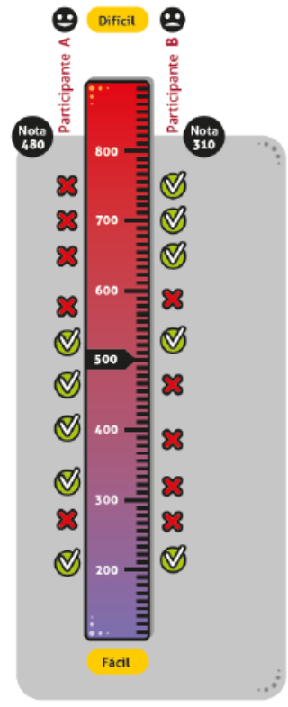

Fonte: INEP

Nota-se que o Participante B acertou as três questões posicionadas na porção superior da régua, ou seja, consideradas mais difíceis. Entretanto, errou 4 das 5 consideradas mais fáceis, o que não é coerente. Por sua vez, o Participante A acertou 5 dentre as 6 mais fáceis e errou as 4 consideradas mais difíceis, o que é coerente pedagogicamente. Dessa forma, o Participante A obteve uma nota 480, superior à nota 310 obtida pelo Participante B.

Para que tenhamos vejamos a importância de uma boa coerência pedagógica no ENEM, a tabela abaixo traz a frequência de candidatos, as menores notas, as notas médias e as maiores notas atingidas por todos os candidatos que tiveram de 23 a 44 acertos na prova de matemática do ENEM 2022.

Note que, mesmo para o patamar de 40 acertos, a nota do candidato pode variar quase 100 pontos! E que tivemos candidato com 41 acertos e nota menor do que outro com 32 acertos!

| Freq. | Acertos | Minima | Média | Máxima |
| --- | --- | --- | --- | --- |
| 22262 | 23 | 482,8 | 741,0 | 807,5 |
| 18572 | 24 | 508,3 | 754,0 | 820,0 |
| 15660 | 25 | 551,1 | 767,0 | 834,3 |
| 13520 | 26 | 618,7 | 779,5 | 841,4 |
| 11539 | 27 | 679,4 | 791,6 | 853,3 |
| 10175 | 28 | 722,7 | 803,6 | 859,7 |
| 8784 | 29 | 735,3 | 815,1 | 870,1 |
| 7516 | 30 | 759,1 | 826,2 | 878,5 |
| 6448 | 31 | 773,0 | 837,1 | 885,7 |
| 5432 | 32 | 770,8 | 847,8 | 898,3 |
| 4648 | 33 | 799,7 | 859,5 | 907,5 |
| 3615 | 34 | 806,8 | 871,0 | 925,3 |
| 2883 | 35 | 818,8 | 882,6 | 931,5 |
| 2072 | 36 | 837,7 | 895,3 | 944,4 |
| 1490 | 37 | 848,4 | 908,9 | 955,8 |
| 1104 | 38 | 848,9 | 921,6 | 967,4 |
| 667 | 39 | 880,6 | 936,2 | 973,3 |
| 384 | 40 | 888,5 | 947,9 | 978,0 |
| 211 | 41 | 896,3 | 960,2 | 981,3 |
| 87 | 42 | 936,8 | 968,7 | 983,9 |
| 24 | 43 | 958,1 | 978,3 | 985,7 |
| 6 | 44 | 985,7 | 985,7 | 985,7 |
| . | 45 | . | . | . |

Fonte: Microdados ENEM 2022

Para finalizar, a título de curiosidade (já que o objetivo deste material não é o de te transformar em um especialista na TRI), o Modelo Logístico Unidimensional de 3 Parâmetros (MLU3P) utilizado no ENEM usa a seguinte expressão para o cálculo da probabilidade de acerto de um determinado item:

$$P = c + \frac{1 - c}{1 + e^{a(\theta - b)}},$$

sendo P a probabilidade de acerto do item por um candidato com habilidade/profiência/traço latente $\theta$, em um item com parâmetros a, b e c pela TRI. Ao estimar os valores dos parâmetros acima, a equação dá origem à chamada Curva Característica do Item (CCI), que é a base do modelo MLU3P e fornece informações gráficas relevantes a respeito da qualidade dos itens.

A partir da CCI, cada questão é posicionada em uma "régua" de dificuldade, no local onde a probabilidade de acerto é próxima de 0,65, valor que que representa que participantes neste nível possuem alta probabilidade de terem obtido o conhecimento necessário para responder corretamente o item.

Questões consideradas mais fáceis são, então, posicionadas na porção inferior da régua, enquanto as mais difíceis se encontram na porção superior. O grande diferencial da TRI é o fato de que tanto os itens quanto os participantes são posicionados na mesma régua.

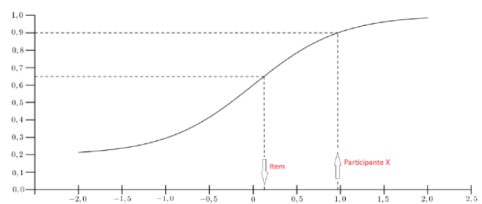

Na figura acima, por exemplo, temos a CCI de um item posicionado próximo ao valor 0,2, o que significa que ele está 0,2 desvios acima da média. Traduzindo para os valores de referência do ENEM (média igual a 500 e desvio padrão igual a 100), este item estaria posicionado no nível de dificuldade 520.

É justamente essa transformação do parâmetro B divulgado nos microdados que utilizaremos neste material! Assim, um parâmetro B igual a 2,137, por exemplo, refletirá em um item com dificuldade igual a 500 + 100*2,137 = 713,7.

Na mesma figura, um participante X que tenha uma proficiência calculada com valor próximo a 600 tem aproximadamente 90% de chance de acertar o item. Naturalmente, o participante pode errar o item. Mas, o mais coerente, é que ele o acerte. Por esse motivo, a coerência das respostas é tão importante na TRI: por mais que um aluno acerte 44 dos 45 itens da matemática, se ele tiver errado um item fácil, para o qual a CCI indicaria uma chance de acerto próxima a 100%, a sua nota pode ser reduzida quando comparada à de um outro aluno que acertou 44 dos 45 itens, mas errando o item mais difícil da prova, para o qual a CCI indicaria uma chance de acerto, por exemplo, inferior a 50%.

Caso queira se aprofundar um pouco mais na TRI, deixo abaixo um QR Code que leva ao meu TCC.

#  Parâmetro B de Dificuldade

Desde o início de 2022, o novo formato de apresentação dos microdados do ENEM pelo INEP trouxe uma ótima novidade: a divulgação dos parâmetros do Modelo Logístico Unidimensional de 3 Parâmetros (modelo 3LP) para cada um dos itens aplicados nas provas do ENEM utilizando a Teoria de Resposta ao Item (TRI).

De maneira simples e objetiva, há três parâmetros que são utilizados neste modelo: o parâmetro de discriminação do item (parâmetro a); o parâmetro de dificuldade do item (parâmetro b) e o parâmetro da assíntota inferior do item, também conhecido como parâmetro do acerto ao acaso ou parâmetro do chute (parâmetro c).

Neste material, a organização das questões dentro de cada habilidade levou em consideração o parâmetro b, uma vez que ele nos permite ranquear os itens pelas dificuldades, do mais fácil ao mais difícil.

#  Como Identificar a Dificuldade?

“Fredão, como faço pra saber se um item é fácil, intermediário ou difícil, de acordo com os valores que aparecem no cabeçalho do item?”

Já me antecipando à principal pergunta que será feita quando vocês forem utilizar esse material, venho dar algumas explicações para vocês.

Em primeiro lugar, o parâmetro B é representado em uma escala padronizada e corresponde a um número real, que pode variar no intervalo de $-\infty$ a $+\infty$. Para a escala utilizada no ENEM, a dificuldade corresponde ao valor $500+100 \times B$. Assim, um item com $B=2,137$ possui dificuldade $713,7$.

Utilizando como referência dados do livro Avaliação Educacional: fundamentos, metodologia e aplicações no contexto brasileiro, da Coleção PROFMAT, do professor Dr. Mauro Rabelo(*) , a partir da dificuldade, os itens poderiam ser classificados como

● Muito fáceis: dificuldade inferior a 373,0;

● Fáceis: dificuldade de 373,0 a 448,9;

● Medianos: dificuldade de 449,0 a 551,9;

● Difíceis: dificuldade de 552,0 a 627,9;

● Muito difíceis: dificuldade superior a 627,9.

Tais valores refletem uma expectativa, de acordo com uma Distribuição Normal Padrão (Gaussiana), de que a avaliação educacional contenha:

● 10% de itens muito fáceis;

● 20% de itens fáceis;

● 40% de itens medianos;

● 20% de itens difíceis;

● 10% de itens muito difíceis.

Trazendo essa análise para a realidade deste material, que contêm 315 questões, são esperadas

● 31 questões muito fáceis;

● 63 questões fáceis;

● 127 questões medianas;

● 63 questões difíceis;

● 31 questões muito difíceis.

Porém, a realidade encontrada nos microdados difere dessa expectativa, o que já era alertado no livro citado (para MT, mas que podemos estender para CN) em "nos testes de matemática, os itens apresentam tendência de dificuldade elevada, o que torna muito árdua a tarefa de atender às faixas indicadas". Considerando as faixas indicadas, temos:

● 0 questões muito fáceis;

● 1 questão fácil;

● 22 questões medianas;

● 92 questões difíceis;

● 193 questões muito difíceis;

● além de 7 questões anuladas (seja pela TRI ou pedagogicamente).

Como corrigir essa distorção? Bom, farei aqui uma proposta baseada na análise dos microdados dos últimos 10 anos, no qual a dificuldade média foi de 648,3 em ciências da natureza, além de um desvio padrão de 80,8. Usando esses valores, em conjunto com os dados da tabela do referido livro e uma aproximação para efeito de simplificação das análises, sugiro que você, aluno, considere como:

● Muito fáceis: dificuldade inferior a 560,0;

● Fáceis: dificuldade de 560,0 a 619,9;

● Medianos: dificuldade de 620,0 a 679,9;

● Difíceis: dificuldade de 680,0 a 739,9;

● Muito difíceis: dificuldade superior a 740,0.

Assim, teremos, neste material, 32 itens muito fáceis, 73 fáceis, 117 medianos, 58 difíceis e 28 muito difíceis, o que considero bem próximo ao esperado de uma avaliação educacional como o ENEM!

#  Observação sobre a prova do ENEM 2019 (e 2017, em menor escala)

Após a elaboração deste material e a separação dos itens de acordo com as suas dificuldades, observei algumas aparentes inconsistências nos parâmetros relativos à prova do ENEM 2019.

Em um material gratuito divulgado em 2020, chamado de O Guia Definitivo da Matemática do ENEM, fiz uma série de análises relativas à prova de 2019, baseado nos microdados que, naquele momento, ainda não apresentavam os parâmetros dos itens. Alguns resultados obtidos naquele material foram confirmados em 2022 após a divulgação dos parâmetros como, por exemplo, a questão da catraca (141 do caderno cinza), que não permitiu a convergência do algoritmo de estimação da TRI, algo que já havia sido relatado como uma suspeita no Guia. Além disso, algumas das questões que esperava que fossem as mais fáceis da prova, de fato se mostraram muito fáceis pelo parâmetro B, como é o caso de uma questão que envolvia notação científica.

Porém, algumas das questões que esperava que estivessem entre as mais difíceis, não figuraram entre as muito difíceis e, sequer, entre as difíceis. Duas se destacam aqui: as questões do pistão (seguramente uma das mais difíceis da história do ENEM) e a questão do alerta (que tinha um peguinha sinistro!).

Para terem ideia: eu gabaritei essa prova e tirei 985,5. Um ex-aluno (que trabalhou como elaborador de questões do Mente Matemática) errou apenas as duas questões citadas acima e tirou 984,2, ou seja, praticamente a mesma nota!!! Isso só se justifica pelo fato de a coerência pedagógica dele ter sido praticamente perfeita, o que implicaria em ele ter errado dois dos itens mais difíceis (ou justamente os dois mais difíceis) da prova do ENEM 2019.

Por esse motivo, os itens relativos à prova do ENEM 2019 devem ser analisados com cautela no que diz respeito à sua classificação pela dificuldade! Em menor escala, mas também presente, estão algumas supostas inconsistências nas dificuldades da prova do ENEM 2017, como é o caso da questão do caminhão cegonha, certamente uma das mais difíceis daquele ano e, também, da história da prova do ENEM na matemática!

Ressalva: Apesar de o alerta acima se referir à prova de Matemática e suas Tecnologias, fica também a ressalva para a prova de Ciências da Natureza e suas Tecnologias, uma vez que os supostos erros podem ter sido propagados também para este componente.

#  Competência 1

Compreender as ciências naturais e as tecnologias a elas associadas como construções humanas, percebendo seus papéis nos processos de produção e no desenvolvimento econômico e social da humanidade.

#  Habilidade 1

Reconhecer características ou propriedades de fenômenos ondulatórios ou oscilatórios, relacionando-os a seus usos em diferentes contextos.

##  Questão 001 (H1 | Enem 2022) Dificuldade 603,4

Em 2002, um mecânico da cidade mineira de Uberaba (MG) teve uma ideia para economizar o consumo de energia elétrica e iluminar a própria casa num dia de sol. Para isso, ele utilizou garrafas plásticas PET com água e cloro, conforme ilustram as figuras. Cada garrafa foi fixada ao telhado de sua casa em um buraco com diâmetro igual ao da garrafa, muito maior que o comprimento de onda da luz. Nos últimos dois anos, sua ideia já alcançou diversas partes do mundo e deve atingir a marca de 1 milhão de casas utilizando a “luz engarrafada”.

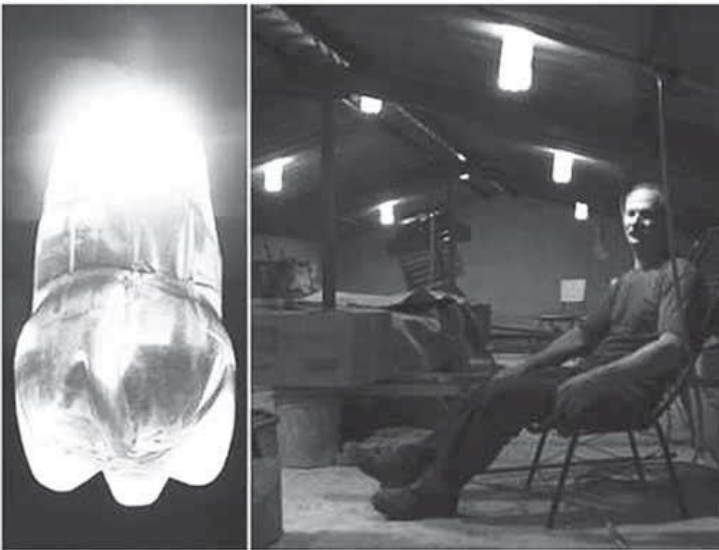

ZOBEL, G. Brasileiro inventor de “luz engarrafada” tem ideia espalhada pelo mundo. Disponível em: www.bbc.com. Acesso em: 23 jun. 2022 (adaptado).

Que fenômeno óptico explica o funcionamento da “luz engarrafada”?

A Difração.

B Absorção.

Polarização.

D Reflexão.

E Refração.

##  Questão 002 (H1 | Enem 2016) Dificuldade 606,0

O morcego emite pulsos de curta duração de ondas ultrassônicas, os quais voltam na forma de ecos após atingirem objetos no ambiente, trazendo informações a respeito das suas dimensões, suas localizações e dos seus possíveis movimentos. Isso se dá em razão da sensibilidade do morcego em detectar o tempo gasto para os ecos voltarem, bem como das pequenas variações nas frequências e nas intensidades dos pulsos ultrassônicos. Essas características lhe permitem caçar pequenas presas mesmo quando estão em movimento em relação a si. Considere uma situação unidimensional em que uma mariposa se afasta, em movimento retilíneo e uniforme, de um morcego em repouso.

A distância e velocidade da mariposa, na situação descrita, seriam detectadas pelo sistema de um morcego por quais alterações nas características dos pulsos ultrassônicos?

A Intensidade diminuída, o tempo de retorno aumentado e a frequência percebida diminuída.

B Intensidade aumentada, o tempo de retorno diminuído e a frequência percebida diminuída.

Intensidade diminuída, o tempo de retorno diminuído e a frequência percebida aumentada.

D Intensidade diminuída, o tempo de retorno aumentado e a frequência percebida aumentada.

E Intensidade aumentada, o tempo de retorno aumentado e a frequência percebida aumentada.

#  Questão 003 (H1 | Enem 2021) Dificuldade 623,2

O eletrocardiograma é um exame cardíaco que mede a intensidade dos sinais elétricos advindos do coração. A imagem apresenta o resultado típico obtido em um paciente saudável e a intensidade do sinal (VEC ) em função do tempo.

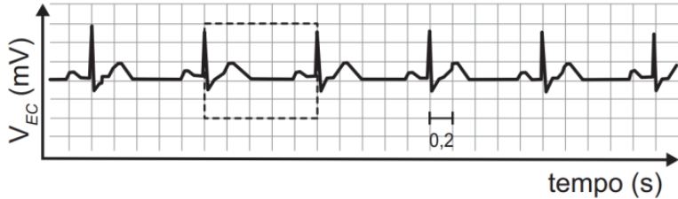

De acordo com o eletrocardiograma apresentado, qual foi o número de batimentos cardíacos por minuto desse paciente durante o exame?

A 30

B 60

©100

D 120

E 180

#  Questão 004 (H1 | Enem 2018) Dificuldade 642,9

O sonorizador é um dispositivo físico implantado sobre a superfície de uma rodovia de modo que provoque uma trepidação e ruído quando da passagem de um veículo sobre ele, alertando para uma situação atípica à frente, como obras, pedágios ou travessia de pedestres. Ao passar sobre os sonorizadores, a suspensão do veículo sofre, vibrações que produzem ondas sonoras, resultando em um barulho peculiar. Considere um veículo que passe com velocidade constante igual a 108 km/h sobre um sonorizador cujas faixas são separadas por uma distância de 8 cm.

Disponível em: www.denatran.gov.br. Acesso em: 2 set. 2015
(adaptado).

A frequência da vibração do automóvel percebida pelo condutor durante a passagem nesse sonorizador é mais próxima de

A 8.6 hertz.

B 13,5 hertz.

© 375 hertz.

D 1 350 hertz.

E 4860 hertz.

##  Questão 005 (H1 | Enem 2019) Dificuldade 658,6

A maioria das pessoas fica com a visão embaçada ao abrir os olhos debaixo d'água. Mas há uma exceção: o povo moken, que habita a costa da Tailândia. Essa característica se deve principalmente à adaptabilidade do olho e à plasticidade do cérebro, o que significa que você também, com algum treinamento, poderia enxergar relativamente bem debaixo d'água. Estudos mostraram que as pupilas de olhos de indivíduos moken sofrem redução significativa debaixo d'água, o que faz com que os raios luminosos incidam quase paralelamente ao eixo óptico da pupila.

GISLÉN, A. et al. Visual Training Improves Underwater Vision in Children. Vision Research, n. 46, 2006 (adaptado).

A acuidade visual associada à redução das pupilas é fisicamente explicada pela diminuição

A da intensidade luminosa incidente na retina.

B da difração dos feixes luminosos que atravessam a pupila.

© da intensidade dos feixes luminosos em uma direção por polarização.

D do desvio dos feixes luminosos refratados no interior do olho.

E das reflexões dos feixes luminosos no interior do olho.

#  Questão 006 (H1 | Enem 2017) Dificuldade 662,1

O trombone de Quincke é um dispositivo experimental utilizado para demonstrar o fenômeno da interferência de ondas sonoras. Uma fonte emite ondas sonoras de determinada frequência na entrada do dispositivo. Essas ondas se dividem pelos dois caminhos (ADC e AEC) e se encontram no ponto C, a saída do dispositivo, onde se posiciona um detector. O trajeto ADC pode ser aumentado pelo deslocamento dessa parte do dispositivo. Com o trajeto ADC igual ao AEC, capta-se um som muito intenso na saída. Entretanto, aumentando-se gradativamente o trajeto ADC, até que ele fique como mostrado na figura, a intensidade do som na saída fica praticamente nula. Desta forma, conhecida a velocidade do som no interior do tubo (320 m/s), é possível determinar o valor da frequência do som produzido pela fonte.

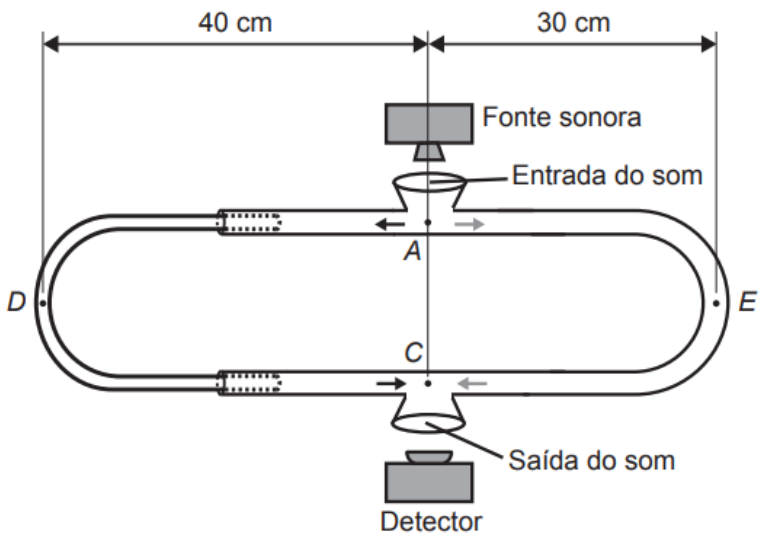

O valor da frequência, em hertz, do som produzido pela fonte sonora é

A 3 200.

B 1600.

800.

D 640.

E 400.

#  Questão 007 (H1 | Enem 2021) Dificuldade 665,7

O sino dos ventos é composto por várias barras metálicas de mesmo material e espessura, mas de comprimentos diferentes, conforme a figura.

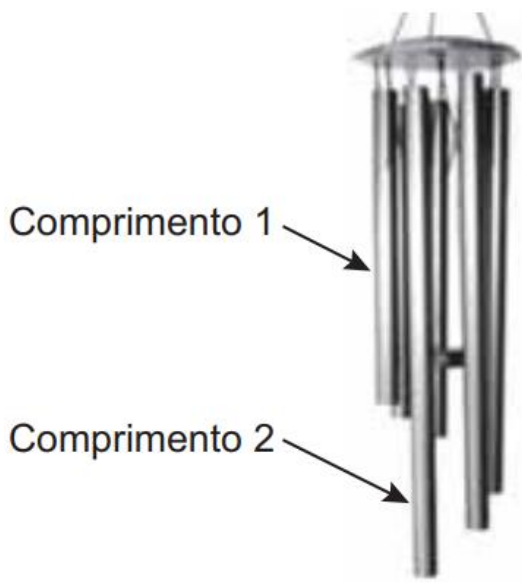

Considere $f_1$ e $v_1$, respectivamente, como a frequência fundamental e a velocidade de propagação do som emitido pela barra de menor comprimento, e $f_2$ e $v_2$ são essas mesmas grandezas para o som emitido pela barra de maior comprimento.

As relações entre as frequências fundamentais e entre as velocidades de propagação são, respectivamente,

A $f_1 < f_2 e v_1 < v_2$.

B f_1< f_2 e v_1= v_2.$

ⓒ  $f_1<f_2~e~v_1>v_2.$

Ⓓ  $f_1>f_2~e~v_1=v_2.$

E $f_1 > f_2 e v_1 > v_2$.

#  Questão 008 (H1 | Enem 2019) Dificuldade 666,7

Quando se considera a extrema velocidade com que a luz se espalha por todos os lados e que, quando vêm de diferentes lugares, mesmo totalmente opostos, [os raios luminosos] se atravessam uns aos outros sem se atrapalharem, compreende-se que, quando vemos um objeto luminoso, isso não poderia ocorrer pelo transporte de uma matéria que venha do objeto até nós, como uma flecha ou bala atravessa o ar; pois certamente isso repugna bastante a essas duas propriedades da luz, principalmente a última.

HUYGENS, C. In: MARTINS, R. A. Tratado sobre a luz, de Cristian Huygens. Caderno de História e Filosofia da Ciência, supl. 4, 1986.

O texto contesta que concepção acerca do comportamento da luz?

O entendimento de que a luz precisa de um meio de propagação, difundido pelos defensores da existência do éter.

Ⓑ O modelo ondulatório para a luz, o qual considera a possibilidade de interferência entre feixes luminosos.

© O modelo corpuscular defendido por Newton, que descreve a luz como um feixe de partículas.

D A crença na velocidade infinita da luz, defendida pela maioria dos filósofos gregos.

A ideia defendida pelos gregos de que a luz era produzida pelos olhos.

#  Questão 009 (H1 | Enem 2020) Dificuldade 669,5

Os fones de ouvido tradicionais transmitem a música diretamente para os nossos ouvidos. Já os modelos dotados de tecnologia redutora de ruído — Cancelamento de Ruído (CR) — além de transmitirem música, também reduzem todo ruído inconsistente à nossa volta, como o barulho de turbinas de avião e aspiradores de pó. Os fones de ouvido CR não reduzem realmente barulhos irregulares como discursos e choros de bebês. Mesmo assim, a supressão do ronco das turbinas do avião contribui para reduzir a “fadiga de ruído”, um cansaço persistente provocado pela exposição a um barulho alto por horas a fio. Esses aparelhos também permitem que nós ouçamos músicas ou assistamos a vídeos no trem ou no avião a um volume muito menor (e mais seguro).

Disponível em: http://tecnologia.uol.com.br. Acesso em: 21 abr. 2015 (adaptado).

A tecnologia redutora de ruído CR utilizada na produção de fones de ouvido baseia-se em qual fenômeno ondulatório?

A Absorção.

B Interferência.

Polarização.

D Reflexão.

E Difração.

#  Questão 010 (H1 | Enem 2018) Dificuldade 707,7

A figura representa um prisma óptico, constituído de um material transparente, cujo índice de refração é crescente com a frequência da luz que sobre ele incide. Um feixe luminoso, composto por luzes vermelha, azul e verde, incide na face A, emerge na face B e, após ser refletido por um espelho, incide num filme para fotografia colorida, revelando três pontos.

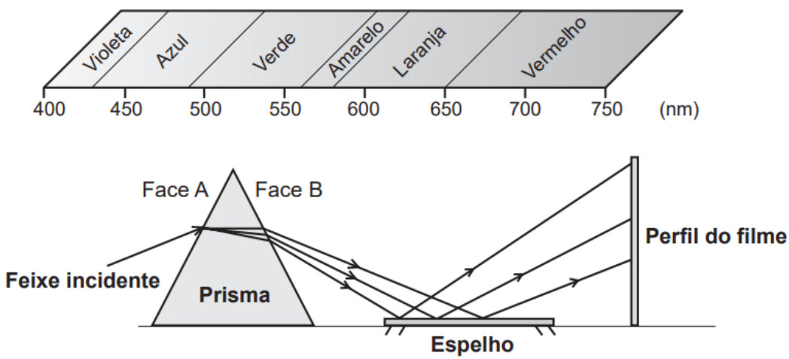

Observando os pontos luminosos revelados no filme, de baixo para cima, constatam-se as seguintes cores:

A Vermelha, verde, azul. B Verde, vermelha, azul.    Azul, verde, vermelha.

D Verde, azul, vermelha. E Azul, vermelha, verde.

#  Questão 011 (H1 | Enem 2016) Dificuldade 719,6

Uma ambulância A em movimento retílineo e uniforme aproxima-se de um observador O, em repouso. A sirene emite um som de frequência constante $f_A$. O desenho ilustra as frentes de onda do som emitido pela ambulância. O observador possui um detector que consegue registrar, no esboço de um gráfico, a frequência da onda sonora detectada em função do tempo $f_O(t)$, antes e depois da passagem da ambulância por ele.

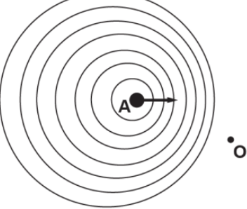

Qual esboço gráfico representa a frequência $f_0(t)$ detectada pelo observador?

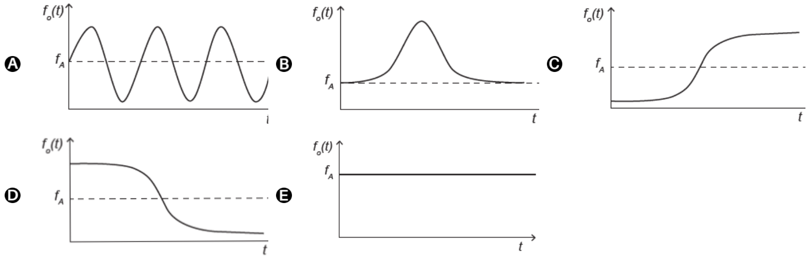

#  Questão 012 (H1 | Enem 2017) Dificuldade 746,8

O brinquedo pula-pula (cama elástica) é composto por uma lona circular flexível horizontal presa por molas à sua borda. As crianças brincam pulando sobre ela, alterando e suas formas de energia. Ao pular verticalmente, desprezando o atrito com o ar e os movimentos de rotação do corpo enquanto salta, uma criança realiza um movimento periódico vertical em torno da posição de equilíbrio da lona ($h = 0$), passando pelos pontos de máxima e de mínima alturas, $h_{máx}$ e $h_{min}$, respectivamente.

Esquematicamente, o esboço do gráfico da energia cinética da criança em função de sua posição vertical na situação descrita é

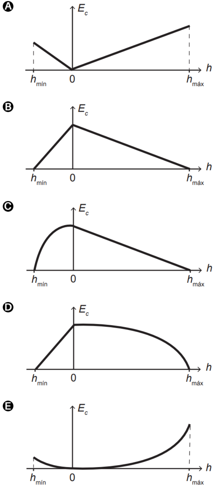

#  Questão 013 (H1 | Enem 2020) Dificuldade 762,9

Dois engenheiros estão verificando se uma cavidade perfurada no solo está de acordo com o planejamento de uma obra, cuja profundidade requerida é de 30 m. O teste é feito por um dispositivo denominado oscilador de áudio de frequência variável, que permite relacionar a profundidade com os valores da frequência de duas ressonâncias consecutivas, assim como em um tubo sonoro fechado. A menor frequência de ressonância que o aparelho mediu foi 135 Hz. Considere que a velocidade do som dentro da cavidade perfurada é de 360 m $s^{-1}$.

Se a profundidade estiver de acordo com o projeto, qual será o valor da próxima frequência de ressonância que será medida?

A 137 Hz B 138 Hz  141 Hz

D 144 Hz E 159 Hz

##  Questão 014 (H1 | Enem 2022) Anulada pela TRI

O sinal sonoro oriundo da queda de um grande bloco de gelo de uma geleira é detectado por dois dispositivos situados em um barco, sendo que o detector A está imerso em água e o B, na proa da embarcação. Sabe-se que a velocidade do som na água é de 1 540 m/s e no ar é de 340 m/s.

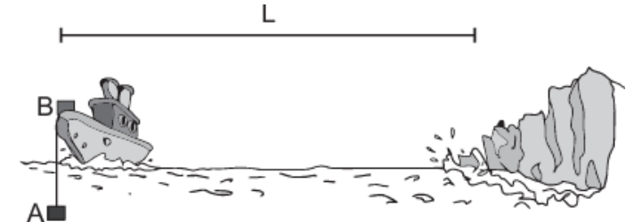

Os gráficos indicam, em tempo real, o sinal sonoro detectado pelos dois dispositivos, os quais foram ligados simultaneamente em um instante anterior à queda do bloco de gelo. Ao comparar pontos correspondentes desse sinal em cada dispositivo, é possível obter informações sobre a onda sonora.

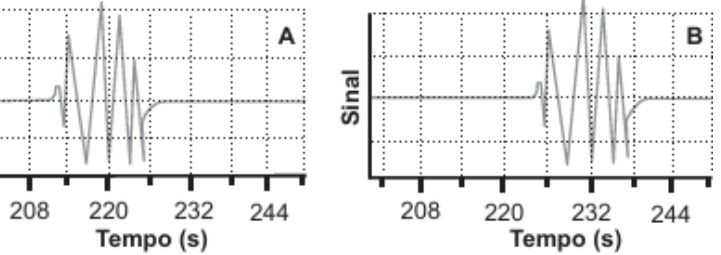

A distância L, em metro, entre o barco e a geleira é mais próxima de

A 339 000. B 78 900.   14 400.
5 240 E 100

D 5240. E 100.

#  Competência 1

Compreender as ciências naturais e as tecnologias a elas associadas como construções humanas, percebendo seus papéis nos processos de produção e no desenvolvimento econômico e social da humanidade.

#  Habilidade 2

Associar a solução de problemas de comunicação, transporte, saúde ou outro, com o correspondente desenvolvimento científico e tecnológico.

##  Questão 015 (H2 | Enem 2018) Dificuldade 537,9

Companhias que fabricam jeans usam cloro para o clareamento, seguido de lavagem. Algumas estão substituindo o cloro por substâncias ambientalmente mais seguras como peróxidos, que podem ser degradados por enzimas chamadas peroxidases. Pensando nisso, pesquisadores inseriram genes codificadores de peroxidases em leveduras cultivadas nas condições de clareamento e lavagem dos jeans e selecionaram as sobreviventes para produção dessas enzimas.

TORTORA, G. J.; FUNKE, B. R.; CASE, C. L. Microbiologia. Rio de Janeiro: Artmed, 2016 (adaptado).

Nesse caso, o uso dessas leveduras modificadas objetiva

A reduzir a quantidade de resíduos tóxicos nos efluentes da lavagem.

B eliminar a necessidade de tratamento da água consumida.

elevar a capacidade de clareamento dos jeans.

D aumentar a resistência do jeans a peróxidos.

E associar ação bactericida ao clareamento.

##  Questão 016 (H2 | Enem 2021) Dificuldade 559,1

O emprego de células de combustível a hidrogênio pode ser uma tecnologia adequada ao transporte automotivo. O quadro apresenta características de cinco tecnologias mais proeminentes de células de combustível.

| Tipo de célula de combustível | Temperatura operacional (°C) | Eletrólito | Semirreações nos eletrodos |
| --- | --- | --- | --- |
| AFC | 90 - 100 | Hidróxido de potássio aquoso | $H_{2}$ + 2 $OH^{-}$ → 2 $H_{2}O$ + 2 $e^{-}$1/2 $O_{2}$ + $H_{2}O$ + 2 $e^{-}$ → 2 $OH^{-}$ |
| MSFC | 600 - 1 000 | Carbonatos de lítio, sódio e/ou potássio fundidos | $H_{2}$ + $CO_{3}^{2-}$ → $H_{2}O$ + $CO_{2}$ + 2 $e^{-}$1/2 $O_{2}$ + $CO_{2}$ + 2 $e^{-}$ → $CO_{3}^{2-}$ |
| PEM | 60 - 100 | Ácido poliperfluorossulfônico sólido | $H_{2}$ → 2 $H^{+}$ + 2 $e^{-}$1/2 $O_{2}$ + 2 $H^{+}$ + 2 $e^{-}$ → $H_{2}O$ |
| PAFC | 175 - 200 | Ácido fosfórico líquido | $H_{2}$ → 2 $H^{+}$ + 2 $e^{-}$1/2 $O_{2}$ + 2 $H^{+}$ + 2 $e^{-}$ → $H_{2}O$ |
| SOFC | 600 - 1 000 | Óxido de zircônio(IV) sólido | $H_{2}$ → 2 $H^{+}$ + 2 $e^{-}$1/2 $O_{2}$ + 2 $H^{+}$ + 2 $e^{-}$ → $H_{2}O$ |

Testes operacionais com esses tipos de células têm indicado que as melhores alternativas para veículos são as que operam em baixos níveis de energia térmica, são formadas por membranas de eletrólitos poliméricos e ocorrem em meio ácido.

THOMAS, S; ZALBOWITZ, M. Full cells: green power. Los Alamos National Laboratory. Los Alamos, NM, 1999 (adaptado).

A tecnología testada mais adequada para o emprego em veículos automotivos é a célula de combustível

A AFC.

B MSFC.

 PEM.

  PAFC.

  SOFC.

#  Questão 017 (H2 | Enem 2017) Dificuldade 591,2

Em uma colisão frontal entre dois automóveis, a força que o cinto de segurança exerce sobre o tórax e abdômen do motorista pode causar lesões graves nos órgãos internos. Pensando na segurança do seu produto, um fabricante de automóveis realizou testes em cinco modelos diferentes de cinto. Os testes simularam uma colisão de 0,30 segundo de duração, e os bonecos que representavam os ocupantes foram equipados com acelerômetros. Esse equipamento registra o módulo da desaceleração do boneco em função do tempo. Os parâmetros como massa dos bonecos, dimensões dos cintos e velocidade imediatamente antes e após o impacto foram os mesmos para todos os testes. O resultado final obtido está no gráfico de aceleração por tempo.

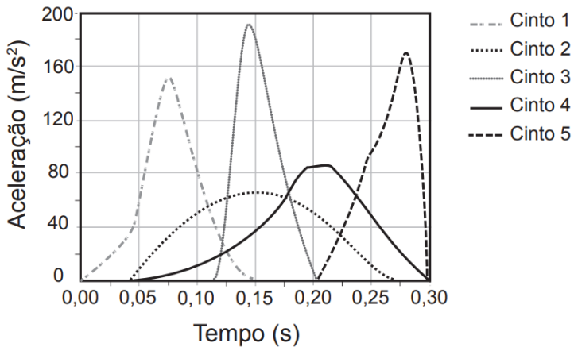

Qual modelo de cinto oferece menor risco de lesão interna ao motorista?

A 1

B 2

© 3

D 4

E 5

#  Questão 018 (H2 | Enem 2019) Dificuldade 607,5

O "The Kidney Project" é um projeto realizado por cientistas que pretendem desenvolver um rim biônico que executará a maioria das funções biológicas do órgão. O rim biônico possuirá duas partes que incorporam recentes avanços de nanotecnologia, filtração de membrana e biologia celular.

Esse projeto significará uma grande melhoria na qualidade de vida para aquelas pessoas que dependem da hemodiálise para sobrevivência.

Disponível em: https://pharm.ucsf.edu. Acesso em: 26 abr. 2019 (adaptado).

O dispositivo criado promoverá diretamente a

A remoção da ureia.

B excreção de lipídios.

c síntese de vasopressina.

D transformação de amônia.

E fabricação de aldosterona.

##  Questão 019 (H2 | Enem 2017) Dificuldade 611,2

Os medicamentos são rotineiramente utilizados pelo ser humano com o intuito de diminuir ou, por muitas vezes, curar possíveis transtornos de saúde. Os antibióticos são grupos de fármacos inseridos no tratamento de doenças causadas por bactérias.

Na terapêutica das doenças mencionadas, alguns desses fármacos atuam

A ativando o sistema imunológico do hospedeiro.

B interferindo na cascata bioquímica da inflamação.

© removendo as toxinas sintetizadas pelas bactérias.

Ⓓ combatendo as células hosppedeiras das bactérias.

E danificando estruturas específicas da célula bacteriana.

#  Questão 020 (H2 | Enem 2022) Dificuldade 620,5

A fim de classificar as melhores rotas em um aplicativo de trânsito, um pesquisador propõe um modelo com base em circuitos elétricos. Nesse modelo, a corrente representa o número de carros que passam por um ponto da pista no intervalo de 1 s. A diferença de potencial (d.d.p.) corresponde à quantidade de energia por carro necessária para o deslocamento de 1 m. De forma análoga à lei de Ohm, cada via é classificada pela sua resistência, sendo a de maior resistência a mais congestionada. O aplicativo mostra as rotas em ordem crescente, ou seja, da rota de menor para a de maior resistência.

Como teste para o sistema, são utilizadas três possíveis vias para uma viagem de A até B, com os valores de d.d.p. e corrente conforme a tabela.

| Rota | d.d.p. $\left(\frac{J}{\text{carro} \cdot \text{m}}\right)$ | Corrente $\left(\frac{\text{carro}}{\text{s}}\right)$ |
| --- | --- | --- |
| 1 | 510 | 4 |
| 2 | 608 | 4 |
| 3 | 575 | 3 |

Nesse teste, a ordenação das rotas indicadas pelo aplicativo será

A 1, 2, 3.

B 1,3,2.

© 2, 1, 3.

ⓑ 3,1,2.

E 3,2,1.

#  Questão 021 (H2 | Enem 2022) Dificuldade 642,4

O protozoário Trypanosoma cruzi, causador da doença de Chagas, pode ser a nova arma da medicina contra o câncer. Pesquisadores brasileiros conseguiram criar uma vacina contra a doença usando uma variação do protozoário incapaz de desencadear a patologia (não patogênico). Para isso, realizaram uma modificação genética criando um T. cruzi capaz de produzir também moléculas fabricadas pelas células tumorais. Quando o organismo inicia o combate ao protozoário, entra em contato também com a molécula tumoral, que passa a ser vista também pelo sistema imune como um indicador de células do protozoário.

Depois de induzidas as defesas, estas passam a destruir todas as células com a molécula tumoral, como se lutassem apenas contra o protozoário.

Disponível em: www.estadao.com.br. Acesso em: 1 mar. 2012
(adaptado).

Qual o mecanismo utilizado no experimento para enganar as células de defesa, fazendo com que ataquem o tumor?

A Autoimunidade.

B Hipersensibilidade.

C Ativação da resposta inata.

D Apresentação de antígeno específico.

E Desencadeamento de processo anti-inflamatório.

##  Questão 022 (H2 | Enem 2020) Dificuldade 657,2

Pesquisadores dos Estados Unidos desenvolveram uma nova técnica, que utiliza raios de luz infravermelha (invisíveis a olho nu) para destruir tumores. Primeiramente, o paciente recebe uma injeção com versões modificadas de anticorpos que têm a capacidade de “grudar” apenas nas células cancerosas. Sozinhos, eles não fazem nada contra o tumor. Entretanto, esses anticorpos estão ligados a uma molécula, denominada IR700, que funcionará como uma “microbomba”, que irá destruir o câncer. Em seguida, o paciente recebe raios infravermelhos. Esses raios penetram no corpo e chegam até a molécula IR700, que é ativada e libera uma substância que ataca a célula cancerosa.

Disponível em: http://super.abril.com.br. Acesso em: 13 dez. 2012
(adaptado).

Com base nas etapas de desenvolvimento, o nome apropriado para a técnica descrita é

A Radioterapia.

B Cromoterapia.

Quimioterapia.

D Fotoimunoterapia.

E Terapia magnética.

#  Questão 023 (H2 | Enem 2016) Dificuldade 658,7

A lipofilia é um dos fatores fundamentais para o planejamento de um fármaco. Ela mede o grau de afinidade que a substância tem com ambientes apolares, podendo ser avaliada por seu coeficiente de partição.

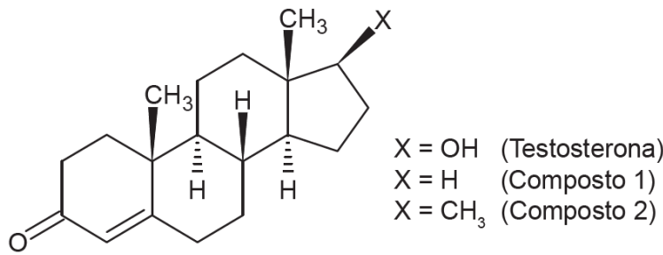

NOGUEIRA, L. J.; MONTANARI, C. A.; DONNICI, C. L. Histórico da evolução da química medicinal e a importância da lipofilia: de Hipócrates e Galeno a Paracelsus e as contribuições de Overton e de Hansch.

Revista Virtual de Química, n. 3, 2009 (adaptado).

Em relação ao coeficiente de partição da testosterona, as lipofilias dos compostos 1 e 2 são, respectivamente,

A menor e menor que a lipofilia da testosterona.

B menor e maior que a lipofilia da testosterona.

© maior e menor que a lipofilia da testosterona.

D maior e maior que a lipofilia da testosterona.

E menor e igual à lipofilia da testosterona.

#  Questão 024 (H2 | Enem 2016) Dificuldade 665,8

Uma invenção que significou um grande avanço tecnológico na Antiguidade, a polia composta ou a associação de polias, é atribuída a Arquimedes (287 a.C. a 212 a.C.). O aparato consiste em associar uma série de polias móveis a uma polia fixa. A figura exemplifica um arranjo possível para esse aparato. É relatado que Arquimedes teria demonstrado para o rei Hierão um outro arranjo desse aparato, movendo sozinho, sobre a areia da praia, um navio repleto de passageiros e cargas, algo que seria impossível sem a participação de muitos homens. Suponha que a massa do navio era de 3 000 kg, que o coeficiente de atrito estático entre o navio e a areia era de 0,8 e que Arquimedes tenha puxado o navio com uma força $\vec{F}$, paralela à direção do movimento e de módulo igual a 400 N. Considere os fios e as polias ideais, a aceleração da gravidade igual a 10 m/s$^{2}$ e que a superfície da praia é perfeitamente horizontal.

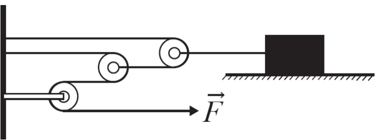

Disponível em: www.histedbr.fae.unicamp.br. Acesso em: 28 fev.

2013 (adaptado).

O número mínimo de polias móveis usadas, nessa situação, por Arquimedes foi

A 3.

B 6.

C 7.

D 8.

E 10.

#  Questão 025 (H2 | Enem 2018) Dificuldade 676,5

Pesquisas demonstram que nanodispositivos baseados em movimentos de dimensões atômicas, induzidos por luz, poderão ter aplicações em tecnologias futuras, substituindo micromotores, sem a necessidade de componentes mecânicos. Exemplo de movimento molecular induzido pela luz pode ser observado pela flexão de uma lâmina delgada de silício, ligado a um polímero de azobenzeno e a um material suporte, em dois comprimentos de onda, conforme ilustrado na figura. Com a aplicação de luz ocorrem reações reversíveis da cadeia do polímero, que promovem o movimento observado.

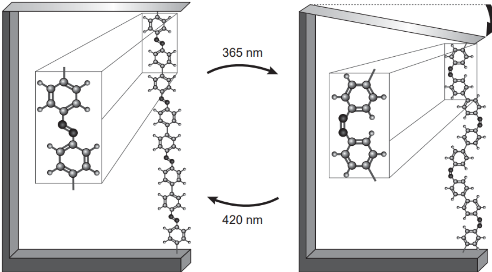

Átomos:

o Hidrogênio

● Carbono

● Nitrogênio

TOMA, H. E. A nanotecnologia das moléculas. Química Nova na Escola, n. 21, maio 2005 (adaptado).

O fenômeno de movimento molecular, promovido pela incidência de luz, decorre do(a)

A movimento vibracional dos átomos, que leva ao encurtamento e à relaxação das ligações.

B isomerização das ligações N=N, sendo a forma cis do polímero mais compacta que a trans.

© tautomerização das unidades monoméricas do polímero, que leva a um composto mais compacto.

Ⓓressonância entre os elétrons $\pi$ do grupo azo e os do anel aromático que encurta as ligações duplas.

E variação conformacional das ligações N=N, que resulta em estruturas com diferentes áreas de superfície.

#  Questão 026 (H2 | Enem 2019) Dificuldade 678,1

A agricultura de precisão reúne técnicas agrícolas que consideram particularidades locais do solo ou lavoura a fim de otimizar o uso de recursos. Uma das formas de adquirir informações sobre essas particularidades é a fotografia aérea de baixa altitude realizada por um veículo aéreo não tripulado (vant). Na fase de aquisição é importante determinar o nível de sobreposição entre as fotografias. A figura ilustra como uma sequência de imagens é coletada por um vant e como são formadas as sobreposições frontais.

Vant com câmera fotográfica

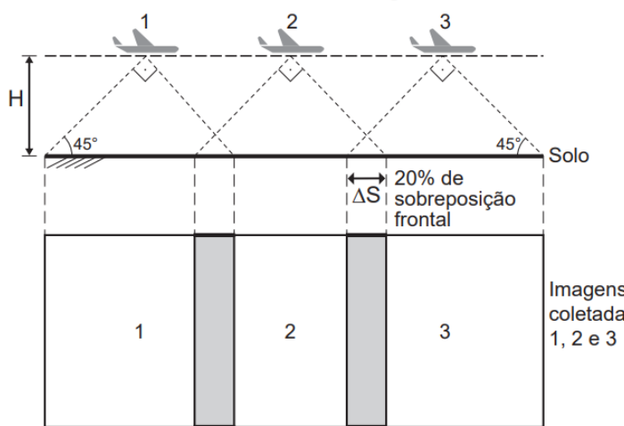

O operador do vant recebe uma encomenda na qual as imagens devem ter uma sobreposição frontal de 20% em um terreno plano. Para realizar a aquisição das imagens, seleciona uma altitude H fixa de voo de 1 000 m, a uma velocidade constante de 50 m s $^{-1}$. A abertura da câmera fotográfica do vant é de 90°. Considere tg(45°) = 1.

Natural Resources Canada. Concepts of Aerial Photography. Disponível em: www.nrcan.gc.ca. Acesso em: 26 abr. 2019 (adaptado).

Com que intervalo de tempo o operador deve adquirir duas imagens consecutivas?

A 40 segundos.

Ⓑ 32 segundos.

C 28 segundos.

D 16 segundos.

E 8 segundos.

#  Competência 1

Compreender as ciências naturais e as tecnologias a elas associadas como construções humanas, percebendo seus papéis nos processos de produção e no desenvolvimento econômico e social da humanidade.

#  Habilidade 3

Confrontar interpretações científicas com interpretações baseadas no senso comum, ao longo do tempo ou em diferentes culturas.

##  Questão 027 (H3 | Enem 2019) Dificuldade 541,5

Em 1962, um jingle (vinheta musical) criado por Heitor Carillo fez tanto sucesso que extrapolou as fronteiras do rádio e chegou à televisão ilustrado por um desenho animado. Nele, uma pessoa respondia ao fantasma que batia em sua porta, personificando o “frio”, que não o deixaria entrar, pois não abriria a porta e compraria lãs e cobertores para aquecer sua casa. Apesar de memorável, tal comercial televisivo continha incorreções a respeito de conceitos físicos relativos à calorimetria.

DUARTE, M. Jingle é a alma do negócio: livro revela os bastidores das músicas de propagandas. Disponível em: https://guiadoscuriosos.uol.com.br. Acesso em: 24 abr. 2019 (adaptado).

Para solucionar essas incorreções, deve-se associar à porta e aos cobertores, respectivamente, as funções de

A Aquecer a casa e os corpos.

B Evitar a entrada do frio na casa e nos corpos.

ⓒ Minimizar a perda de calor pela casa e pelos corpos.

D Diminuir a entrada do frio na casa e aquecer os corpos.

Aquecer a casa e reduzir a perda de calor pelos corpos.

##  Questão 028 (H3 | Enem 2020) Dificuldade 547,5

Nos desenhos animados, com frequência se vê um personagem correndo na direção de um abismo, mas, ao invés de cair, ele continua andando no vazio e só quando percebe que não há nada sob seus pés é que ele para de andar e cai verticalmente. No entanto, para observar uma trajetória de queda num experimento real, pode-se lançar uma bolinha, com velocidade constante ($V_0$), sobre a superfície de uma mesa e verificar o seu movimento de queda até o chão.

Qual figura melhor representa a trajetória de queda da bolinha?

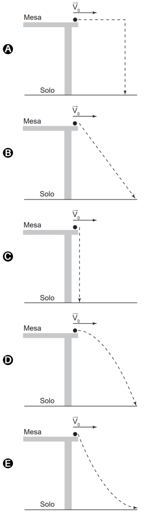

#  Questão 029 (H3 | Enem 2022) Dificuldade 549,5

De modo geral, a palavra “aromático” invoca associações agradáveis, como cheiro de café fresco ou de um pão doce de canela. Associações similares ocorriam no passado da história da química orgânica, quando os compostos ditos “aromáticos” apresentavam um odor agradável e foram isolados de óleos naturais. À medida que as estruturas desses compostos eram elucidadas, foi se descobrindo que vários deles continham uma unidade estrutural específica. Os compostos aromáticos que continham essa unidade estrutural tornaram-se parte de uma grande família, muito mais com base em suas estruturas eletrônicas do que nos seus cheiros, como as substâncias a seguir, encontradas em óleos vegetais.

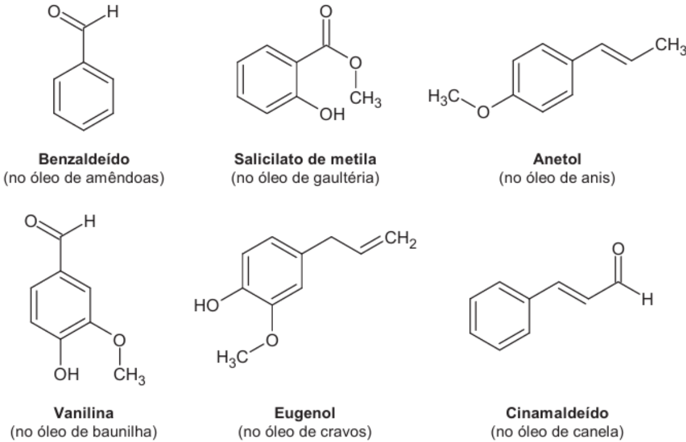

SOLOMONS, T. W. G.; FRYHLE, C. B. Química orgânica. Rio de Janeiro: LTC, 2009 (adaptado).

A característica estrutural dessa família de compostos é a presença de

A ramificações. B insaturações.   anel benzênico.   átomos de oxigênio. E carbonos assimétricos.

#  Questão 030 (H3 | Enem 2020) Dificuldade 563,1

DAVIS, J. Disponível em: http://garfield.com. Acesso em: 10 fev. 2015.

Por qual motivo ocorre a eletrização ilustrada na tirinha?

A Troca de átomos entre a calça e os pelos do gato.

B Diminuição do número de prótons nos pelos do gato.

Criação de novas partículas eletrizadas nos pelos do gato.

Ⓓ Movimentação de elétrons entre a calça e os pelos do gato.

E Repulsão entre partículas elétricas da calça e dos pelos do gato.

#  Questão 031 (H3 | Enem 2021) Dificuldade 565,1

No seu estudo sobre a queda dos corpos, Aristóteles afirmava que se abandonarmos corpos leves e pesados de uma mesma altura, o mais pesado chegaria mais rápido ao solo. Essa ideia está apoiada em algo que é difícil de refutar, a observação direta da realidade baseada no senso comum.

Após uma aula de física, dois colegas estavam discutindo sobre a queda dos corpos, e um tentava convencer o outro de que tinha razão:

Colega A: “O corpo mais pesado cai mais rápido que um menos pesado, quando largado de uma mesma altura. Eu provo, largando uma pedra e uma rolha. A pedra chega antes. Pronto! Tá provado!”.

Colega B: “Eu não acho! Peguei uma folha de papel esticado e deixei cair. Quando amassei, ela caiu mais rápido. Como isso é possível? Se era a mesma folha de papel, deveria cair do mesmo jeito. Tem que ter outra explicação!”.

HÜLSENDEGER, M. Uma análise das concepções dos alunos sobre a queda dos corpos. Caderno Brasileiro de Ensino de Física, n. 3, dez. 2004 (adaptado).

O aspecto físico comum que explica a diferença de comportamento dos corpos em queda nessa discussão é o(a)

A peso dos corpos.

B resistência do ar.

C massa dos corpos.

D densidade dos corpos.

E aceleração da gravidade.

#  Questão 032 (H3 | Enem 2021) Dificuldade 571,7
TEXTO I

No cordel intitulado Senhor dos Anéis, de autoria de Gonçalo Ferreira da Silva, lê-se a sexilha:

##  A distância em relação

Ao nosso planeta amado

Pouco menos que a do Sol

Ele está distanciado

E menos denso que a água

Quando no normal estado

MEDEIROS, A.; AGRA, J. T. M., A astronomia na literatura de cordel, Física na Escola, n. 1, abr. 2010 (fragmento).

#  TEXTO II

Distâncias médias dos planetas ao Sol e suas densidades médias:

| Planetas | Distância média ao Sol (u.a.) | Densidade relativa média |
| --- | --- | --- |
| *Mercúrio | 0,39 | 5,6 |
| *Vênus | 0,72 | 5,2 |
| *Terra | 1,0 | 5,5 |
| *Marte | 1,5 | 4,0 |
| **Ceres | 2,8 | 2,1 |
| *Júpiter | 5,2 | 1,3 |
| *Saturno | 9,6 | 0,7 |
| *Urano | 19 | 1,2 |
| *Netuno | 30 | 1,7 |
| **Plutão | 40 | 2,0 |
| **Éris | 68 | 2,5 |

u.a. = 149 600 000 km, é a unidade astronômica, *Planeta clássico, **Planeta-anão

Características dos planetas. Disponível em: www.astronoo.com.
Acesso em: 8 nov. 2019 (adaptado).

Considerando os versos da sexilha e as informações da tabela, a qual planeta o cordel faz referência?

A Mercúrio.

B Júpiter.

Urano.

D Saturno.

E Netuno.

#  Questão 033 (H3 | Enem 2016) Dificuldade 593,8

Primeiro, em relação àquilo a que chamamos água, quando congela, parece-nos estar a olhar para algo que se tornou pedra ou terra, mas quando derrete e se dispersa, esta torna-se bafo e ar; o ar, quando é queimado, torna-se fogo; e, inversamente, o fogo, quando se contrai e se extingue, regressa à forma do ar; o ar, novamente concentrado e contraído, torna-se nuvem e nevoeiro, mas, a partir destes estados, se for ainda mais comprimido, torna-se água corrente, e de água torna-se novamente terra e pedras; e deste modo, como nos parece, dão geração uns aos outros de forma cíclica.

PLATÃO. Timeu-Crítias. Coimbra: CECH, 2011.

Do ponto de vista da ciência moderna, os “quatro elementos” descritos por Platão correspondem, na verdade, às fases sólida, líquida, gasosa e plasma da matéria. As transições entre elas são hoje entendidas como consequências macroscópicas de transformações sofridas pela matéria em escala microscópica.

Excetuando-se a fase de plasma, essas transformações sofridas pela matéria, em nível microscópico, estão associadas a uma

A troca de átomos entre as diferentes moléculas do material.

B transmutação nuclear dos elementos químicos do material.

redistribuição de prótons entre os diferentes átomos do material.

D mudança na estrutura espacial formada pelos diferentes constituintes do material.

E alteração nas proporções dos diferentes isótopos de cada elemento presente no material.

#  Questão 034 (H3 | Enem 2017) Dificuldade 603,5

Na Idade Média, para elaborar preparados a partir de plantas produtoras de óleos essenciais, as coletas das espécies eram realizadas ao raiar do dia. Naquela época, essa prática era fundamentada misticamente pelo efeito mágico dos raios lunares, que seria anulado pela emissão dos raios solares. Com a evolução da ciência, foi comprovado que a coleta de algumas espécies ao raiar do dia garante a obtenção de material com maiores quantidades de óleos essenciais.

A explicação científica que justifica essa prática se baseia na

A volatilização das substâncias de interesse.

B polimerização dos óleos catalisada pela radiação solar.

ⓒ solubilização das substâncias de interesse pelo orvalho.

D oxidação do óleo pelo oxigênio produzido na fotossíntese.

E liberação das moléculas de óleo durante o processo de fotossíntese.

##  Questão 035 (H3 | Enem 2019) Dificuldade 615,7

Uma cozinheira colocou sal a mais no feijão que estava cozinhando. Para solucionar o problema, ela acrescentou batatas cruas e sem tempero dentro da panela. Quando terminou de cozinhá-lo, as batatas estavam salgadas, porque absorveram parte do caldo com excesso de sal. Finalmente, ela adicionou água para completar o caldo do feijão.

O sal foi absorvido pelas batatas por

A osmose, por envolver apenas o transporte do solvente.

B fagocitose, porque o sal transportado é uma substância sólida.

ⓒ exocitose, uma vez que o sal foi transportado da água para a batata.

D pinocitose, porque o sal estava diluído na água quando foi transportado.

E difusão, porque o transporte ocorreu a favor do gradiente de concentração.

#  Questão 036 (H3 | Enem 2018) Dificuldade 616,9

Em desenhos animados comum vermos a personagem tentando impulsionar um barco soprando ar contra a vela para compensar a falta de vento. Algumas vezes usam o próprio fôlego, foles ou ventiladores. Estudantes de um laboratório didático resolveram investigar essa possibilidade. Para isso, usaram dois pequenos carros de plástico, A e B, instalaram, sobre estes, pequenas ventoinhas e fixaram verticalmente uma cartolina de curvatura parabólica para desempenhar uma função análoga à vela de um barco. No carro B inverteu-se o sentido da ventoinha e manteve-se a vela, a fim de manter as características físicas do barco, massa e formato da cartolina. As figuras representam os carros produzidos. A montagem do carro A busca simular a situação dos desenhos animados, pois a ventoinha está direcionada para a vela.

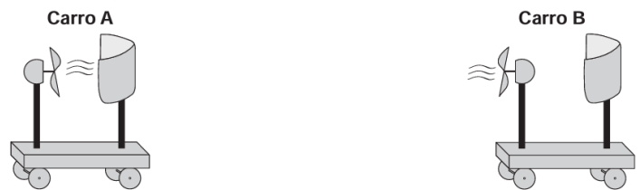

Com os carros orientados de acordo com as figuras, os estudantes ligaram as ventoinhas, aguardaram o fluxo de ar ficar permanente e determinaram os módulos das velocidades médias dos carros  (VA) e B (VB) para o mesmo intervalo de tempo.

A respeito das intensidades das velocidades médias e do sentido de movimento do carro A, os estudantes observaram que

A $V_A = 0$; $V_B > 0$; o carro A não se move.

B 0 < $V_A < V_B$; o carro A se move para a direita.

© 0 < $V_{A}$ < $V_{B}$; o carro A se move para a esquerda.

D 0 < $V_B < V_A$; o carro A se move para a direita.

E 0 < $V_B < V_A$; o carro A se move para a esquerda.

#  Questão 037 (H3 | Enem 2017) Dificuldade 635,3

Um fato corriqueiro ao se cozinhar arroz é o derramamento de parte da água de cozimento sobre a chama azul do fogo, mudando-a para uma chama amarela. Essa mudança de cor pode suscitar interpretações diversas, relacionadas às substâncias presentes na água de cozimento. Além do sal de cozinha (NaCl), nela se encontram carboidratos, proteínas e sais minerais.

Cientificamente, sabe-se que essa mudança de con da chama ocorre pela

A reação do gás de cozinha com o sal volatilizando gás cloro.

B emissão de fótons pelo sódio, excitado por causa da chama.

© produção de derivado amarelo, pela reação com o carboidrato.

D reação do gás de cozinha com a água, formando gás hidrogênio.

E excitação das moléculas de proteínas, com formação de luz amarela.

##  Questão 038 (H3 | Enem 2016) Dificuldade 657,7

Num experimento, um professor deixa duas bandejas de mesma massa, uma de plástico e outra de alumínio, sobre a mesa do laboratório. Após algumas horas, ele pede aos alunos que avaliem a temperatura das duas bandejas, usando para isso o tato. Seus alunos afirmam, categoricamente, que a bandeja de alumínio encontra-se numa temperatura mais baixa. Intrigado, ele propõe uma segunda atividade, em que coloca um cubo de gelo sobre cada uma das bandejas, que estão em equilíbrio térmico com o ambiente, e os questiona em qual delas a taxa de derretimento do gelo será maior.

O aluno que responder corretamente ao questionamento do professor dirá que o derretimento ocorrerá

A mais rapidamente na bandeja de alumínio, pois ela tem uma maior condutividade térmica que a de plástico.

B mais rapidamente na bandeja de plástico, pois ela tem inicialmente uma temperatura mais alta que a de alumínio.

© mais rapidamente na bandeja de plástico, pois ela tem uma maior capacidade térmica que a de alumínio

D mais rapidamente na bandeja de alumínio, pois ela tem um calor específico menor que a de plástico.

E com a mesma rapidez nas duas bandejas, pois apresentarão a mesma variação de temperatura.

#  Questão 039 (H3 | Enem 2022) Dificuldade 677,9

Um Buraco Negro é um corpo celeste que possui uma grande quantidade de matéria concentrada em uma pequena região do espaço, de modo que sua força gravitacional é tão grande que qualquer partícula fica aprisionada em sua superfície, inclusive a luz. O raio dessa região caracteriza uma superfície-limite, chamada de horizonte de eventos, da qual nada consegue escapar. Considere que o Sol foi instantaneamente substituído por um Buraco Negro com a mesma massa solar, de modo que o seu horizonte de eventos seja de aproximadamente 3,0 km.

SCHWARZSCHILD, K. On the Gravitational Field of a Mass Point According to Einstein's Theory. Disponível em: arxiv.org. Acesso em: 26 maio 2022 (adaptado).

Após a substituição descrita, o que aconteceria aos planetas do Sistema Solar?

A Eles se moveriam em órbitas espirais, aproximando-se sucessivamente do Buraco Negro.

B Eles oscilariam aleatoriamente em torno de suas órbitas elípticas originais.

© Eles se moveriam em direção ao centro do Buraco Negro.

Ⓓ Eles passariam a precessionar mais rapidamente.

E Eles manteriam suas órbitas inalteradas.

#  Questão 040 (H3 | Enem 2018) Dificuldade 693,8

Um estudante relatou que o mapeamento do DNA da cevada foi quase todo concluído e seu código genético desvendado. Chamou atenção para o número de genes que compõem esse código genético e que a semente da cevada, apesar de pequena, possui um genoma mais complexo que o humano, sendo boa parte desse código constituída de sequências repetidas. Nesse contexto, o conceito de código genético está abordado de forma equivocada.

##  Cientificamente esse conceito é definido como

A trincas de nucleotídeos que codificam os aminoácidos.

B localização de todos os genes encontrados em um genoma.

* codificação de sequências repetidas presentes em um genoma.

Ⓓ conjunto de todos os RNAs mensageiros transcritos em um organismo.

E todas as sequências de pares de bases presentes em um organismo.

#  Competência 1

Compreender as ciências naturais e as tecnologias a elas associadas como construções humanas, percebendo seus papéis nos processos de produção e no desenvolvimento econômico e social da humanidade.

#  Habilidade 4

Avaliar propostas de intervenção no ambiente, considerando a qualidade da vida humana ou medidas de conservação, recuperação ou utilização sustentável da biodiversidade.

##  Questão 041 (H4 | Enem 2019) Dificuldade 525,5

No quadro estão apresentadas informações sobre duas estratégias de sobrevivência que podem ser adotadas por algumas espécies de seres vivos.

|  | Estratégia 1 | Estratégia 2 |
| --- | --- | --- |
| Hábitat | Mais instável e imprevisível | Mais estável e previsível |
| Potencial biótico | Muito elevado | Baixo |
| Duração da vida | Curta e com reprodução precoce | Longa e com reprodução tardia |
| Descendentes | Muitos e com tamanho corporal pequeno | Poucos e com tamanho corporal maior |
| Tamanho populacional | Variável | Constante |

Na recuperação de uma área desmatada deveriam ser reintroduzidas primeiramente as espécies que adotam qual estratégia?

A Estratégia 1, pois essas espécies produzem descendentes pequenos, o que diminui a competição com outras espécies.

B Estratégia 2, pois essas espécies têm uma longa duração da vida, o que favorece a produção de muitos descendentes.

Estratégia 1, pois essas espécies apresentam um elevado potencial biótico, o que facilita a rápida recolonização da área desmatada.

Estratégia 2, pois essas espécies estão adaptadas a hábitats mais estáveis, o que corresponde ao ambiente de uma área desmatada.

Estratégia 2, pois essas espécies apresentam um tamanho populacional constante, o que propicia uma recolonização mais estável da área desmatada.

#  Questão 042 (H4 | Enem 2021) Dificuldade 530,9

Uma escola iniciou o processo educativo para implantação da coleta seletiva e destino de materiais recicláveis. Para atingir seus objetivos, a instituição planejou:

1) sensibilizar a comunidade escolar, desenvolvendo atividades em sala e extraclasse de maneira contínua;

2) capacitar o pessoal responsável pela limpeza da escola quanto aos novos procedimentos adotados com a coleta seletiva; e

3) distribuir coletores de materiais recicláveis específicos nas salas, pátio e outros ambientes para acondicionamento dos resíduos.

Para completar a ação proposta no ambiente escolar, o que falta ser inserido no planejamento?

A Realizar campanhas educativas de sensibilização em bairros vizinhos para fortalecer a coleta seletiva.

B Firmar parceria com a prefeitura ou cooperativa de catadores para recolhimento dos materiais recicláveis e destinação apropriada.

© Organizar visitas ao lixão ou aterro local para identificar aspectos importantes sobre a disposição final do lixo.

Divulgar na rádio local, no jornal impresso e nas redes sociais que a escola está realizando a coleta seletiva.

E Colocar recipientes coletores de lixo reciclável fora da escola para entrega voluntária pela população.

#  Questão 043 (H4 | Enem 2020) Dificuldade 563,2

Plantas pioneiras são as que iniciam o processo natural de cicatrização de uma área desprovida de vegetação. Em geral, têm pequeno porte e crescem muito rápido, desenvolvem-se a pleno sol e são pouco exigentes quanto às condições do solo. Produzem grande quantidade de sementes e possuem ciclo de vida curto.

BLUM, C. T. Lista preliminar de espécies vegetais pioneiras nativas do Paraná – versão 2008. Disponível em: www.chaua.org.br. Acesso em: 10 fev. 2015.

Essas plantas são importantes em um projeto de restauração ambiental, pois promovem, no solo,

A aumento da incidência de luz solar.

B diminuição da absorção de água.

o estabilização da umidade.

D elevação de temperatura.

E liberação de oxigênio.

##  Questão 044 (H4 | Enem 2022) Dificuldade 585,5

Os resultados de um ensaio clínico randomizado na Indonésia apontaram uma redução de 77% dos casos de dengue nas áreas que receberam o mosquito Aedes aegypti infectado com a bactéria Wolbachia. Trata-se da mesma técnica utilizada no Brasil pelo Método Wolbachia, iniciativa conduzida pela Fundação Oswaldo Cruz — Fiocruz. Essa bactéria induz a redução da carga viral no mosquito e, consequentemente, o número de casos de dengue na área, sendo repassada por meio do cruzamento entre os insetos. Como essa bactéria é um organismo intracelular e o vírus também precisa entrar nas células para se reproduzir, ambos necessitarão de recursos comuns.

COSTA, G. Agência Fiocruz de Notícias. Estudo confirma eficácia do Método Wolbachia para dengue. Disponível em: https://portal.fiocruz.br. Acesso em: 3 jun. 2022 (adaptado).

Essa tecnologia utilizada no combate à dengue consiste na

A predação do vírus pela bactéria.

B esterilização de mosquitos infectados.

C alteração no genótipo do mosquito pela bactéria.

Ⓓ competição do vírus e da bactéria no hospedeiro.

E inserção de material genético do vírus na bactéria.

#  Questão 045 (H4 | Enem 2018) Dificuldade 601,6

Corredores ecológicos visam mitigar os efeitos da fragmentação dos ecossistemas promovendo a ligação entre diferentes áreas, com o objetivo de proporcionar o deslocamento de animais, a dispersão de sementes e o aumento da cobertura vegetal. São instituídos com base em informações como estudos sobre o deslocamento de espécies, sua área de vida (área necessária para o suprimento de suas necessidades vitais e reprodutivas) e a distribuição de suas populações.

Disponível em: www.mma.gov.br. Acesso em: 30 nov. 2017
(adaptado).

Nessa estratégia, a recuperação da biodiversidade é efetiva porque

A propicia o fluxo gênico.

B intensifica o manejo de espécies.

amplia o processo de ocupação humana.

D aumenta o número de indivíduos nas populações.

E favorece a formação de ilhas de proteção integral.

#  Questão 046 (H4 | Enem 2020) Dificuldade 612,4

A fragmentação dos hábitats é caracterizada pela formação de ilhas da paisagem original, circundadas por áreas transformadas. Esse tipo de interferência no ambiente ameaça a biodiversidade. Imagine que uma população de onças foi isolada em uma mata pequena. Elas se extinguiriam mesmo sem terem sido abatidas. Diversos componentes da ilha de hábitat, como o tamanho, a heterogeneidade, o seu entorno, a sua conectividade e o efeito de borda são determinantes para a persistência ou não das espécies originais.

Uma medida que auxilia na conservação da biodiversidade nas ilhas mencionadas no texto compreende a

A formação de micro-hábitats.

B ampliação do efeito de borda.

© construção de corredores ecológicos.

D promoção da sucessão ecológica.

E introdução de novas espécies de animais e vegetais.

##  Questão 047 (H4 | Enem 2016) Dificuldade 641,3

O Painel Intergovernamental de Mudanças Climáticas (na sigla em inglês, IPCC) prevê que nas próximas décadas o planeta passará por mudanças climáticas e propõe estratégias de mitigação e adaptação a elas. As estratégias de mitigação são direcionadas à causa dessas mudanças, procurando reduzir a concentração de gases de efeito estufa na atmosfera. As estratégias de adaptação, por sua vez, são direcionadas aos efeitos dessas mudanças, procurando preparar os sistemas humanos às mudanças climáticas já em andamento, de modo a reduzir seus efeitos negativos.

IPCC, 2014. Climate Change 2014: synthesis report. Disponível em: http://ar5-syr.ipcc.ch. Acesso em: 22 out. 2015 (adaptado).

Considerando as informações do texto, qual ação representa uma estratégia de adaptação?

A Construção de usinas eólicas.

B Tratamento de resíduos sólidos.

Aumento da eficiência dos veículos.

Ⓓ Adoção de agricultura sustentável de baixo carbono.

Criação de diques de contenção em regiões costeiras.

#  Questão 048 (H4 | Enem 2017) Dificuldade 777,2

Os botos-cinza (Sotalia guianensis), mamíferos da família dos golfinhos, são excelentes indicadores da poluição das áreas em que vivem, pois passam toda a sua vida — cerca de 30 anos — na mesma região. Além disso, a espécie acumula mais contaminantes em seu organismo, como o mercúrio, do que outros animais da sua cadeia alimentar.

MARCOLINO, B. Sentinelas do mar. Disponível em: http://cienciahoje.uol.com.br. Acesso em: 1 ago. 2012 (adaptado).

Os botos-cinza acumulam maior concentração dessas substâncias porque

A são animais herbívoros.

B são animais detritívoros.

são animais de grande porte.

D digerem o alimento lentamente.

E estão no topo da cadeia alimentar.

#  Parte IV

##  Competência 2

#  Competência 2

Identificar a presença e aplicar as tecnologias associadas às ciências naturais em diferentes contextos.

#  Habilidade 5

Dimensionar circuitos ou dispositivos elétricos de uso cotidiano.

Questão 049 (H5 | Enem 2021) Dificuldade 617,4

É possível ligar aparelhos elétricos de baixa corrente utilizando materiais comuns de laboratório no lugar das tradicionais pilhas. A ilustração apresenta uma montagem que faz funcionar um cronômetro digital.

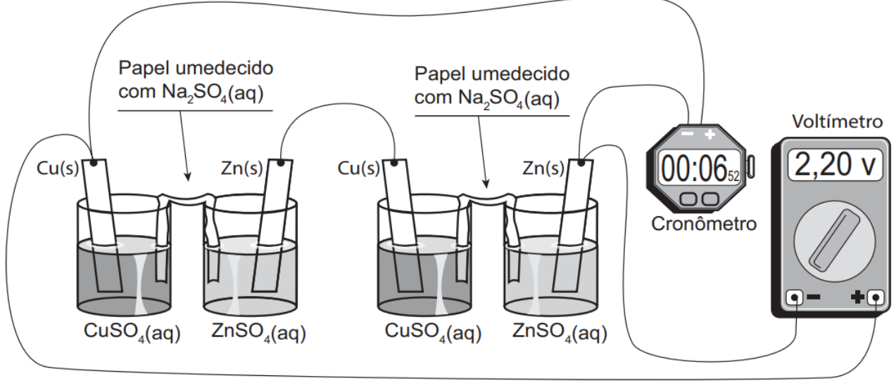

Utilizando a representação de projetos elétricos, o circuito equivalente a esse sistema é

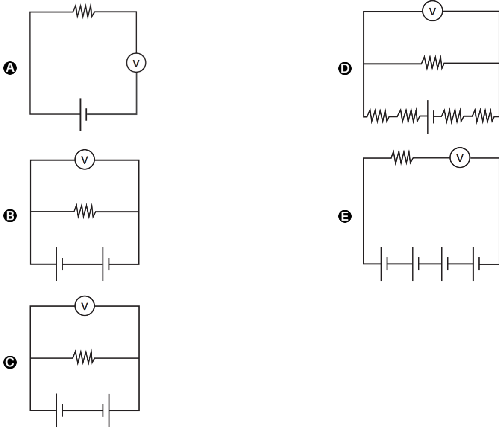

#  Questão 050 (H5 | Enem 2017) Dificuldade 618,8

Fusível um dispositivo de proteção contra sobrecorrente em circuitos. Quando a corrente que passa por esse componente elétrico é maior que sua máxima corrente nominal, o fusível queima. Dessa forma, evita que a corrente elevada danifique os aparelhos do circuito. Suponha que o circuito elétrico mostrado seja alimentado por uma fonte de tensão U e que o fusível suporte uma corrente nominal de 500 mA.

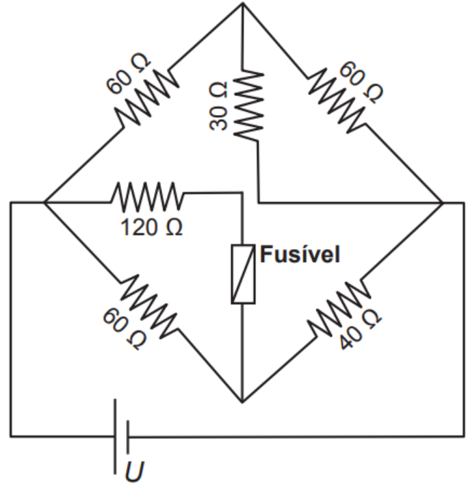

Qual é o máximo valor da tensão U para que o fusível não queime?

A 20 V

Ⓑ 40 V

©60 V

D 120 V

Ⓑ 185 V

#  Questão 051 (H5 | Enem 2016) Dificuldade 620,5

Três lâmpadas idênticas foram ligadas no circuito esquematizado. A bateria apresenta resistência interna desprezível, e os fios possuem resistência nula. Um técnico fez uma análise do circuito para prever a corrente elétrica nos pontos: A, B, C, D e E; e rotulou essas correntes de $l_A, l_B, l_C, l_D$ e $l_E$, respectivamente.

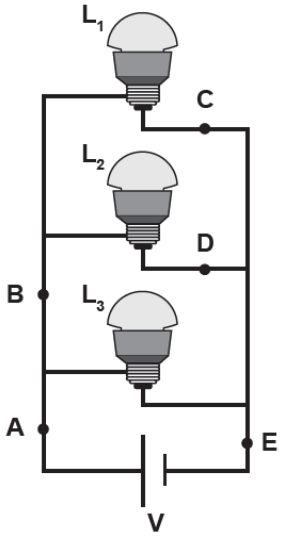

O técnico concluiu que as correntes que apresentam o mesmo valor são

A $l_A = l_E e l_C = l_D$.

B $I_A = I_B = I_E$ e $I_C = I_D$.

ⓒ $I_A = I_B$, apenas.

D $I_A = I_B = I_E$, apenas.

E $l_C = l_B$, apenas.

##  Questão 052 (H5 | Enem 2017) Dificuldade 627,0

Em algumas residências, cercas eletrificadas são utilizadas com o objetivo de afastar possíveis invasores. Uma cerca eletrificada funciona com uma diferença de potencial elétrico de aproximadamente 10 000 V. Para que não seja letal, a corrente que pode ser transmitida através de uma pessoa não deve ser maior do que 0,01 A. Já a resistência elétrica corporal entre as mãos e os pés de uma pessoa é da ordem de 1 000 Ω.

Para que a corrente não seja letal a uma pessoa que toca a cerca eletrificada, o gerador de tensão deve possuir uma resistência interna que, em relação à do corpo humano, é

A praticamente nula.

B aproximadamente igual.

© milhares de vezes maior.

D da ordem de 10 vezes maior.

E da ordem de 10 vezes menor.

#  Questão 053 (H5 | Enem 2018) Dificuldade 631,7

Muitos smartphones e tablets não precisam mais de teclas, uma vez que todos os comandos podem ser dados ao se pressionar a própria tela. Inicialmente essa tecnologia foi proporcionada por meio das telas resistivas, formadas basicamente por duas camadas de material condutor transparente que não se encostam até que alguém as pressione, modificando a resistência total do circuito de acordo com o ponto onde ocorre o toque. A imagem é uma simplificação do circuito formado pelas placas, em que A e B representam pontos onde o circuito pode ser fechado por meio do toque.

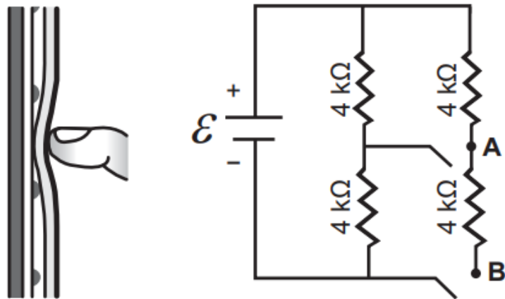

Qual é a resistência equivalente no circuito provocada por um toque que fecha o circuito no ponto A?

A 1,3 kΩ.

B 4,0 kΩ.

© 6,0 kΩ.

D 6,7 kΩ.

E 12,0 kΩ.

#  Questão 054 (H5 | Enem 2018) Dificuldade 650,3

Ao pesquisar um resistor feito de um novo tipo de material, um cientista observou o comportamento mostrado no gráfico tensão versus corrente.

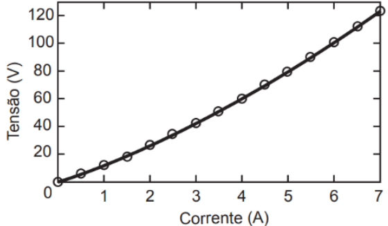

Após a análise do gráfico, ele concluiu que a tensão em função da corrente é dada pela equação V = 10i + i$^{2}$.

O gráfico da resistência elétrica (R) do resistor em função da corrente (i) é

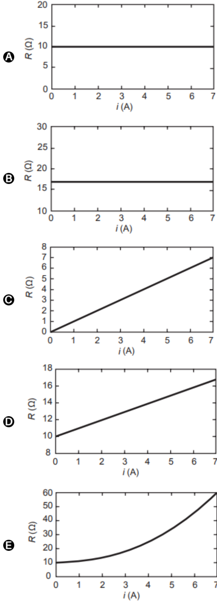

#  Questão 055 (H5 | Enem 2020) Dificuldade 655,4

Uma pessoa percebe que a bateria de seu veículo fica descarregada após cinco dias sem uso. No início desse período, a bateria funcionava normalmente e estava com o total de sua carga nominal, de 60 Ah. Pensando na possibilidade de haver uma corrente de fuga, que se estabelece mesmo com os dispositivos elétricos do veículo desligados, ele associa um amperímetro digital ao circuito do veículo.

Qual dos esquemas indica a maneira com que o amperímetro deve ser ligado e a leitura por ele realizada?

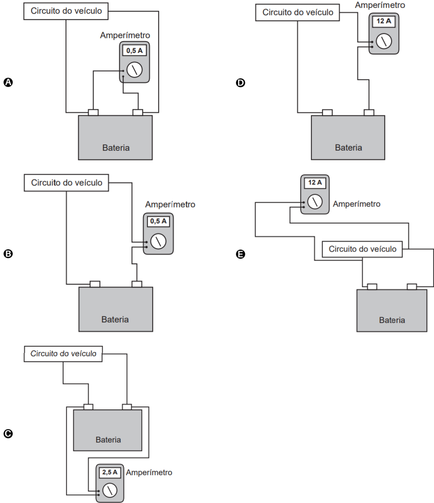

#  Questão 056 (H5 | Enem 2021) Dificuldade 696,7

O quadro lista alguns dispositivos eletrônicos que estão presentes no dia a dia, bem como a faixa de força eletromotriz necessária ao seu funcionamento.

| Dispositivo eletrônico | Dispositivo eletrônico | Faixa de força eletromotriz (V) |
| --- | --- | --- |
| I | Relógio de parede | 1,2 a 1,5 |
| II | Celular | 3,5 a 3,8 |
| III | Câmera digital | 7,5 a 7,8 |
| IV | Carrinho de controle remoto | 10,5 a 10,9 |
| V | Notebook/Laptop | 19,5 a 20,0 |

Considere que uma bateria é construída pela associação em série de três pilhas de lítio-iodo, nas condições-padrão, conforme as semiequações de redução apresentadas.

$$I_2 + 2e^- \rightarrow 2I^- \qquad E^\circ = +0,54 \text{ V}$$
$$Li^+ + e^- \rightarrow Li \qquad E^\circ = -3,05 \text{ V}$$

Essa bateria é adequada para o funcionamento de qual dispositivo eletrônico?

A I

B II

C III

D IV

E V

#  Questão 057 (H5 | Enem 2020) Dificuldade 708,8

Um estudante tem uma fonte de tensão com corrente contínua que opera em tensão fixa de 12 V. Como precisa alimentar equipamentos que operam em tensões menores, ele emprega quatro resistores de 100 Ω para construir um divisor de tensão. Obtém-se este divisor associando os resistores, como exibido na figura. Os aparelhos podem ser ligados entre os pontos A, B, C, D e E, dependendo da tensão especificada.

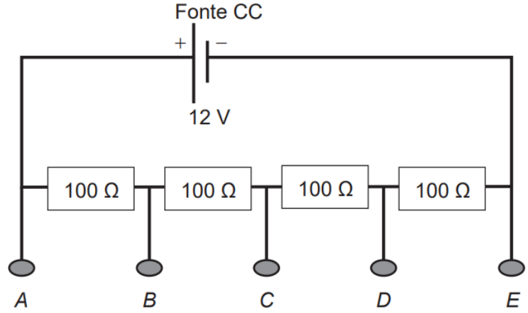

Ele tem um equipamento que opera em 9,0 V com uma resistência interna de 10 kΩ.

Entre quais pontos do divisor de tensão esse equipamento deve ser ligado para funcionar corretamente e qual será o valor da intensidade da corrente nele estabelecida?

A Entre A e C; 30 mA.

Ⓑ Entre B e E; 30 mA.

© Entre A e D; 1,2mA.

D Entre B e E; 0,9 mA.

Entre A e E; 0,9 mA.

#  Questão 058 (H5 | Enem 2021) Dificuldade 712,2

Um garoto precisa montar um circuito que acenda três lâmpadas de cores diferentes, uma de cada vez. Ele dispõe das lâmpadas, de fios, uma bateria e dois interruptores, como ilustrado, junto com seu símbolo de três pontos. Quando esse interruptor fecha AB, abre BC e vice-versa.

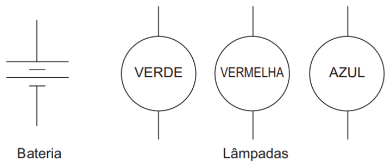

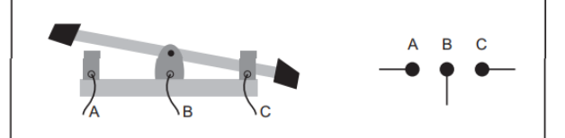

O garoto fez cinco circuitos elétricos usando os dois interruptores, mas apenas um satisfaz a sua necessidade.

Esse circuito é representado por

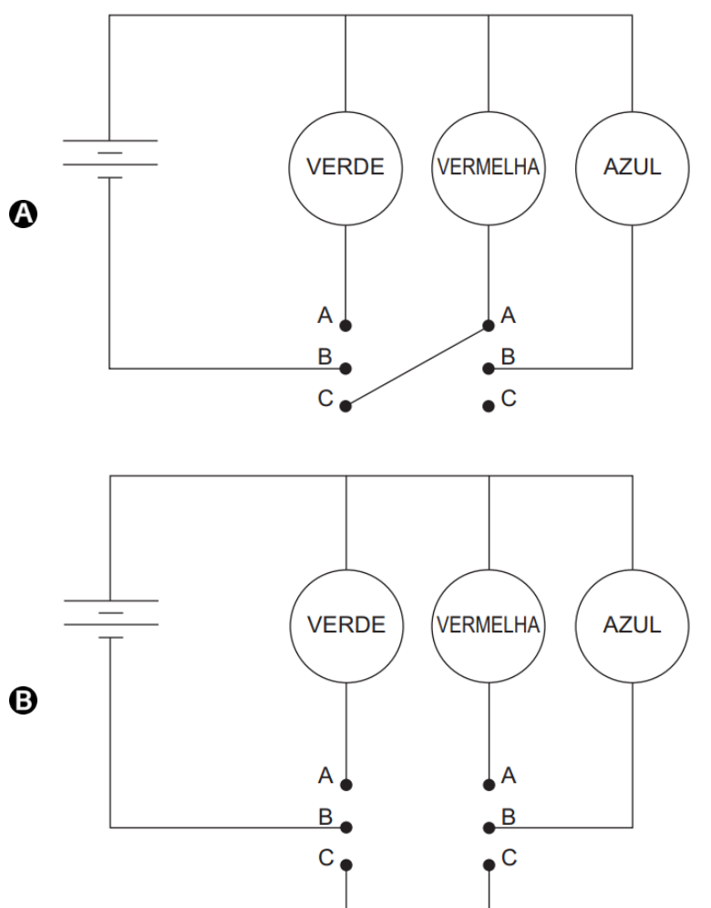

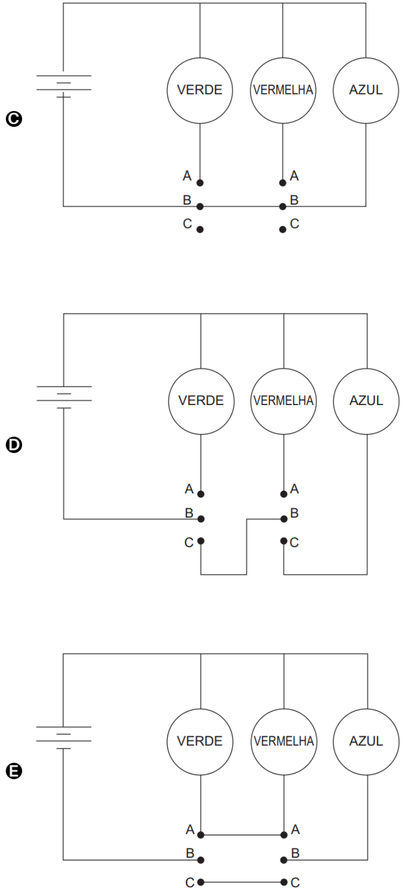

#  Questão 059 (H5 | Enem 2016) Dificuldade 718,6

Por apresentar significativa resistividade elétrica, o grafite pode ser utilizado para simular resistores elétricos em circuitos desenhados no papel, com o uso de lápis e lapiseiras. Dependendo da espessura e do comprimento das linhas desenhadas, é possível determinar a resistência elétrica de cada traçado produzido. No esquema foram utilizados três tipos de lápis diferentes (2H, HB e 6B) para efetuar três traçados distintos.

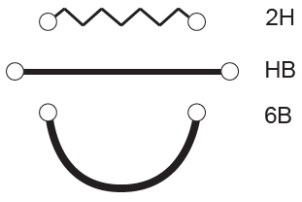

Munido dessas informações, um estudante pegou uma folha de papel e fez o desenho de um sorvete de casquinha utilizando-se desses traçados. Os valores encontrados nesse experimento, para as resistências elétricas (R), medidas com o auxílio de um ohmímetro ligado nas extremidades das resistências, são mostrados na figura. Verificou-se que os resistores obedeciam à Lei de Ohm.

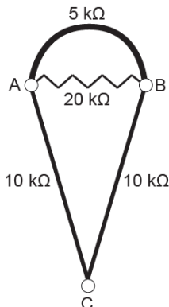

Na sequência, conectou o ohmímetro nos terminais A e B do desenho e, em seguida, conectou-o nos terminais B e C, anotando as leituras $R_{AB}$ e $R_{BC}$, respectivamente. Ao estabelecer a razão $\frac{R_{AB}}{R_{BC}}$, qual resultado o estudante obteve?

A 1

B $\frac{4}{7}$

© $\frac{10}{27}$

D $\frac{14}{81}$

E frac{4}{81}$

#  Questão 060 (H5 | Enem 2019) Dificuldade 742,4

Uma casa tem um cabo elétrico mal dimensionado, de resistência igual a 10 $\Omega$, que a conecta à rede elétrica de 120 V. Nessa casa, cinco lâmpadas, de resistência igual a 200 $\Omega$, estão conectadas ao mesmo circuito que uma televisão de resistência igual a 50 $\Omega$, conforme ilustrado no esquema. A televisão funciona apenas com tensão entre 90 V e 130 V.

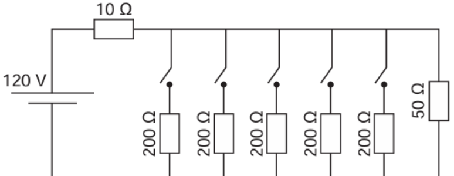

O número máximo de lâmpadas que podem ser ligadas sem que a televisão pare de funcionar é

A 1.

B 2.

© 3.

D 4.

E 5.

##  Questão 061 (H5 | Enem 2022) Anulada pela TRI

Uma lanterna funciona com três pilhas de resistência interna igual a 0,5 $\Omega$ cada, ligadas em série. Quando posicionadas corretamente, devem acender a lâmpada incandescente de especificações 4,5 W e 4,5 V. Cada pilha na posição correta gera uma f.e.m. (força eletromotriz) de 1,5 V. Uma pessoa, ao trocar as pilhas da lanterna, comete o equívoco de inverter a posição de uma das pilhas. Considere que as pilhas mantêm contato independentemente da posição.

Com esse equívoco, qual é a intensidade de corrente que passa pela lâmpada ao se ligar a lanterna?

A 0,25 A

Ⓑ 0,33 A

© 0,75 A

D 1,00 A

E 1,33 A

#  Competência 2

Identificar a presença e aplicar as tecnologias associadas às ciências naturais em diferentes contextos.

#  Habilidade 6

Relacionar informações para compreender manuais de instalação ou utilização de aparelhos, ou sistemas tecnológicos de uso comum.

##  Questão 062 (H6 | Enem 2020) Dificuldade 585,0

Para garantir que produtos eletrônicos estejam armazenados de forma adequada antes da venda, algumas empresas utilizam cartões indicadores de umidade nas embalagens desses produtos. Alguns desses cartões contêm um sal de cobalto que muda de cor em presença de água, de acordo com a equação química:

$$CoCl_2(s) + 6 H_2O(g) \rightleftharpoons CoCl_2 \cdot 6 H_2O(s) \quad \Delta H < 0$$

Como você procederia para reutilizar, num curto intervalo de tempo, um cartão que já estivesse com a coloração rosa?

A Resfriaria no congelador.

B Borrifaria com spray de água.

Envolveria com papel alumínio.

D Aqueceria com secador de cabelos.

Embrulharia em guardanapo de papel.

##  Questão 063 (H6 | Enem 2019) Dificuldade 599,7

Dois amigos se encontram em um posto de gasolina para calibrar os pneus de suas bicicletas. Uma das bicicletas é de corrida (bicicleta A) e a outra, de passeio (bicicleta B). Os pneus de ambas as bicicletas têm as mesmas características, exceto que a largura dos pneus de A é menor que a largura dos pneus de B. Ao calibrarem os pneus das bicicletas A e B, respectivamente com pressões de calibração pA e pB, os amigos observam que o pneu da bicicleta A deforma, sob mesmos esforços, muito menos que o pneu da bicicleta B. Pode-se considerar que as massas de ar comprimido no pneu da bicicleta A, mA, e no pneu da bicicleta B, mB, são diretamente proporcionais aos seus volumes.

Comparando as pressões e massas de ar comprimido nos pneus das bicicletas, temos:

A pA < pb e mA < mB

B $pA > PB \ e mA < mB$

© pA> pB  e mA=mB

Ⓓ $pA < pb e mA = mB$

E pA>PB e mA>MB

#  Questão 064 (H6 | Enem 2017) Dificuldade 620,2

No manual fornecido pelo fabricante de uma ducha elétrica de 220 V é apresentado um gráfico com a variação da temperatura da água em função da vazão para três condições (morno, quente e superquente). Na condição superquente, a potência dissipada é de 6 500 W. Considere o calor específico da água igual a 4 200 J/(kg °C) e densidade da água igual a 1 kg/L.

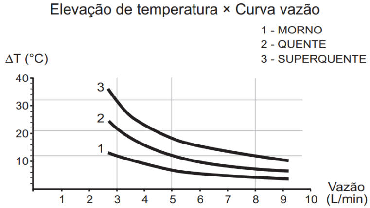

Com base nas informações dadas, a potência na condição morno corresponde a que fração da potência na condição superquente?

A $\frac{1}{3}$

B $\frac{1}{5}$

© $\frac{3}{5}$

D $\frac{3}{8}$

E $\frac{5}{8}$

#  Questão 065 (H6 | Enem 2021) Dificuldade 640,7

O alcoolômetro Gay Lussac é um instrumento destinado a medir o teor de álcool, em porcentagem de volume (v/v), de soluções de água e álcool na faixa de 0 °GL a 100 °GL, com divisões de 0,1 °GL. A concepção do alcoolômetro se baseia no princípio de flutuabilidade de Arquimedes, semelhante ao funcionamento de um densímetro. A escala do instrumento é aferida a 20 °C, sendo necessária a correção da medida, caso a temperatura da solução não esteja na temperatura de aferição. É apresentada parte da tabela de correção de um alcoolômetro, com a temperatura

##  Tabela de correção do alcoolômetro com temperatura 20 °C

| °GL | Leitura da temperatura (°C) | Leitura da temperatura (°C) | Leitura da temperatura (°C) | Leitura da temperatura (°C) | Leitura da temperatura (°C) | Leitura da temperatura (°C) |
| --- | --- | --- | --- | --- | --- | --- |
| °GL | 20 | 21 | 22 | 23 | 24 | 25 |
| 35 | 35,0 | 34,6 | 34,2 | 33,8 | 33,4 | 33,0 |
| 36 | 36,0 | 35,6 | 35,2 | 34,8 | 34,4 | 34,0 |

Manual alcoolômetro Gay Lussac. Disponível em: www.incoterm.com.br. Acesso em: 4 dez. 2018 (adaptado).

É necessária a correção da medida do instrumento, pois um aumento na temperatura promove o(a)

A aumento da dissociação da água.

B aumento da densidade da água e do álcool.

© mudança do volume dos materiais por dilatação.

Ⓓ aumento da concentração de alcool durante a medida.

E alteração das propriedades químicas da mistura alcool e água.

##  Questão 066 (H6 | Enem 2018) Dificuldade 646,1

A identificação de riscos de produtos perigosos para o transporte rodoviário é obrigatória e realizada por meio da sinalização composta por um painel de segurança, de cor alaranjada, e um rótulo de risco. As informações inseridas no painel de segurança e no rótulo de risco, conforme determina a legislação, permitem que se identifique o produto transportado e os perigos a ele associados.

A sinalização mostrada identifica uma substância que está sendo transportada em um caminhão.

Os três algarismos da parte superior do painel indicam o “Número de risco”. O número 268 indica tratar-se de um gás (2), tóxico (6) e corrosivo (8). Os quatro dígitos da parte inferior correspondem ao “Número ONU”, que identifica o produto transportado.

BRASIL. Resolução n. 420, de 12/02/2004, da Agência Nacional de Transportes Terrestres (ANTT)/Ministério dos Transportes (adaptado).

ABNT. NBR 7500: identificação para o transporte terrestre, manuseio, movimentação e armazenamento de produtos. Rio de Janeiro, 2004 (adaptado).

Considerando a identificação apresentada no caminhão, o código 1005 corresponde à substância

Aeteno (C2H4).

B nitrogênio ($N_2$).

© amônia ($NH_3$).

D propano ($C_3H_8$).

E dióxido de carbono ($CO_2$).

#  Questão 067 (H6 | Enem 2020) Dificuldade 673,0

Mesmo para peixes de aquário, como o peixe arcoíris, a temperatura da água fora da faixa ideal (26 °C a 28 °C), bem como sua variação brusca, pode afetar a saúde do animal. Para manter a temperatura da água dentro do aquário na média desejada, utilizam-se dispositivos de aquecimento com termostato. Por exemplo, para um aquário de 50 L, pode-se utilizar um sistema de aquecimento de 50 W otimizado para suprir sua taxa de resfriamento. Essa taxa pode ser considerada praticamente constante, já que a temperatura externa ao aquário é mantida pelas estufas.

Utilize para a água o calor específico 4,0 kJ kg$^{-1}$ K$^{-1}$ e a densidade 1 kg L$^{-1}$.

Se o sistema de aquecimento for desligado por 1 h, qual o valor mais próximo para a redução da temperatura da água do aquário?

A 4,0°C

Ⓑ 3,6°C

© 0,9℃

D 0,6℃

E 0,3°C

#  Questão 068 (H6 | Enem 2021) Dificuldade 677 

Analisando a ficha técnica de um automóvel popular, verificam-se algumas características em relação ao seu desempenho. Considerando o mesmo automóvel em duas versões, uma delas funcionando a álcool e outra, a gasolina, tem-se os dados apresentados no quadro, em relação ao desempenho de cada motor.

| Parâmetro | Motor a gasolina | Motor a álcool |
| --- | --- | --- |
| Aceleração | de 0 a 100 km/h em 13,4 s | de 0 a 100 km/h em 12,9 s |
| Velocidade máxima | 165 km/h | 163 km/h |

Considerando desprezível a resistência do ar, qual versão apresenta a maior potência?

A Como a versão a gasolina consegue a maior aceleração, esta é a que desenvolve a maior potência.

B Como a versão a gasolina atinge o maior valor de energia cinética, esta é a que desenvolve a maior potência.

ⓒ Como a versão a álcool apresenta a maior taxa de variação de energia cinética, esta é a que desenvolve a maior potência.

Ⓓ Como ambas as versões apresentam a mesma variação de velocidade no cálculo da aceleração, a potência desenvolvida é a mesma.

E Como a versão a gasolina fica com o motor trabalhando por mais tempo para atingir os 100 km/h, esta é a que desenvolve a maior potência.

#  Questão 069 (H6 | Enem 2018) Dificuldade 700,3

Nos manuais de instalação de equipamentos de som há o alerta aos usuários para que observem a correta polaridade dos fios ao realizarem as conexões das caixas de som. As figuras ilustram o esquema de conexão das caixas de som de um equipamento de som mono, no qual os alto-falantes emitem as mesmas ondas. No primeiro caso, a ligação obedece às especificações do fabricante e no segundo mostra uma ligação na qual a polaridade está invertida.

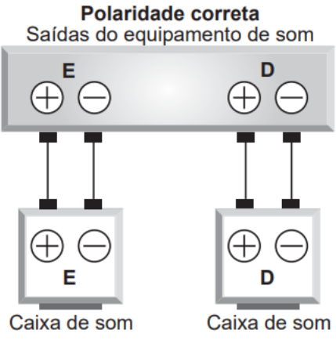

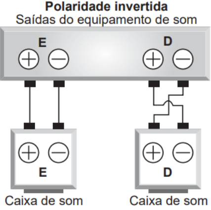

O que ocorre com os alto-falantes E e D se forem conectados de acordo com o segundo esquema?

A O alto-falante E funciona normalmente e o D entra em curto-circuito e não emite som.

B O alto-falante E emite ondas sonoras com frequências ligeiramente diferentes do alto-falante D provocando o fenômeno de batimento.

© O alto-falante E emite ondas sonoras com frequências e fases diferentes do alto-falante D provocando o fenômeno conhecido como ruído.

Ⓓ O alto-falante E emite ondas sonoras que apresentam um lapso de tempo em relação às emitidas pelo alto-falante D provocando o fenômeno de reverberação.

O alto-falante E emite ondas sonoras em oposição de fase às emitidas pelo alto-falante D provocando o fenômeno de interferência destrutiva nos pontos equidistantes aos alto-falantes.

#  Questão 070 (H6 | Enem 2019) Dificuldade 704,7

Numa feira de ciências, um estudante utilizará o disco de Maxwell (ioiô) para demonstrar o princípio da conservação da energia. A apresentação consistirá em duas etapas:

Etapa 1 - a explicação de que, à medida que o disco desce, parte de sua energia potencial gravitacional é transformada em energia cinética de translação e energia cinética de rotação;

Etapa 2 - o cálculo da energia cinética de rotação do disco no ponto mais baixo de sua trajetória, supondo o sistema conservativo.

Ao preparar a segunda etapa, ele considera a aceleração da gravidade igual a 10 m s-2 e a velocidade linear do centro de massa do disco desprezível em comparação com a velocidade angular. Em seguida, mede a altura do topo do disco em relação ao chão no ponto mais baixo de sua trajetória, obtendo $\frac{1}{3}$ da altura da haste do brinquedo.

As especificações de tamanho do brinquedo, isto é, de comprimento (C), largura (L) e altura (A), assim como da massa de seu disco de metal, foram encontradas pelo estudante no recorte de manual ilustrado a seguir.

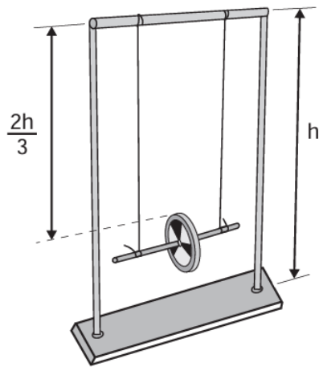

Conteúdo: base de metal, hastes metálicas, barra superior, disco de metal.

Tamanho (C × L × A): 300 mm × 100 mm × 410 mm Massa do disco de metal: 30 g

O resultado do cálculo da etapa 2, em joule, é

A 4, $10\times 10^{-2}$.

B 8, $20 \times 10^{-2}$.

© 1,23  $\times 10^{-1}$  .

D 8,20x104.

E 1,23 $\times 10^5$

#  Questão 071 (H6 | Enem 2022) Dificuldade 740,1

O manual de uma ducha elétrica informa que seus três níveis de aquecimento (morno, quente e superquente) apresentam as seguintes variações de temperatura da água em função de sua vazão:

| Vazão $\left(\frac{L}{\min}\right)$ | ΔT (°C) | ΔT (°C) | ΔT (°C) |
| --- | --- | --- | --- |
| Vazão $\left(\frac{L}{\min}\right)$ | Morno | Quente | Superquente |
| 3 | 10 | 20 | 30 |
| 6 | 5 | 10 | 15 |

Utiliza-se um disjuntor para proteger o circuito dessa ducha contra sobrecargas elétricas em qualquer nível de aquecimento. Por padrão, o disjuntor é especificado pela corrente nominal igual ao múltiplo de 5 A imediatamente superior à corrente máxima do circuito. Considere que a ducha deve ser ligada em 220 V e que toda a energia é dissipada através da resistência do chuveiro e convertida em energia térmica transferida para a água, que apresenta calor específico de 4,2 J g °C e densidade de 1 000 L.

O disjuntor adequado para a proteção dessa ducha é especificado por

A 60 A B 30 A ㉙  20 A

D 10A. E 5A.

##  Questão 072 (H6 | Enem 2020) Dificuldade 880,0

Os manuais de refrigerador apresentam a recomendação de que o equipamento não deve ser instalado próximo a fontes de calor, como fogão e aquecedores, ou em local onde incida diretamente a luz do sol. A instalação em local inadequado prejudica o funcionamento do refrigerador e aumenta o consumo de energia.

O não atendimento dessa recomendação resulta em aumento do consumo de energia porque

a o fluxo de calor por condução no condensador sofre considerável redução.

a temperatura da substância refrigerante no condensador diminui mais rapidamente.

o fluxo de calor promove significativa elevação da temperatura no interior do refrigerador.

a liquefação da substância refrigerante no condensador exige mais trabalho do compressor.

E as correntes de convecção nas proximidades do condensador ocorrem com maior dificuldade.

#  Competência 2

Identificar a presença e aplicar as tecnologias associadas às ciências naturais em diferentes contextos.

#  Habilidade 7

Selecionar testes de controle, parâmetros ou critérios para a comparação de materiais e produtos, tendo em vista a defesa do consumidor, a saúde do trabalhador ou a qualidade de vida.

##  Questão 073 (H7 | Enem 2017) Dificuldade 549,3

As centrífugas são equipamentos utilizados em laboratórios, clínicas e indústrias. Seu funcionamento faz uso da aceleração centrífuga obtida pela rotação de um recipiente e que serve para a separação de sólidos em suspensão em líquidos ou de líquidos misturados entre si.

RODITI, I. Dicionário Houaiss de física. Rio de Janeiro: Objetiva, 2005
(adaptado).

Nesse aparelho, a separação das substâncias ocorre em função

A das diferentes densidades.

B dos diferentes raios de rotação.

ⓒ das diferentes velocidades angulares.

D das diferentes quantidades de cada substância.

E da diferente coesão molecular de cada substância.

##  Questão 074 (H7 | Enem 2020) Dificuldade 595,1

As moedas despertam o interesse de colecionadores, numismatas e investidores há bastante tempo. Uma moeda de 100% cobre, circulante no período do Brasil Colônia, pode ser bastante valiosa. O elevado valor gera a necessidade de realização de testes que validem a procedência da moeda, bem como a veracidade de sua composição. Sabendo que a densidade do cobre metálico é próxima de 9 g cm$^{-3}$, um investidor negocia a aquisição de um lote de quatro moedas A, B, C e D fabricadas supostamente de 100% cobre e massas 26 g, 27 g, 10 g e 36 g, respectivamente. Com o objetivo de testar a densidade das moedas, foi realizado um procedimento em que elas foram sequencialmente inseridas em uma proveta contendo 5 mL de água, conforme esquematizado.

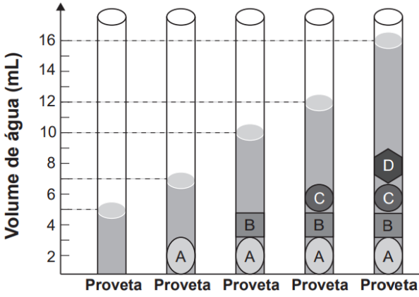

Com base nos dados obtidos, o investidor adquiriu as moedas

A AeB. B AeC. B C.

D BeD. E CeD.

#  Questão 075 (H7 | Enem 2020) Dificuldade 595,8

A Torre Eiffel, com seus 324 metros de altura, feita com treliças de ferro, pesava 7 300 toneladas quando terminou de ser construída em 1889. Um arquiteto resolve construir um protótipo dessa torre em escala 1:100, usando os mesmos materiais (cada dimensão linear em escala de 1:100 do monumento real). Considere que a torre real tenha uma massa $M_{torre}$ e exerça na fundação sobre a qual foi erguida uma pressão $P_{torre}$. O modelo construído pelo arquiteto terá uma massa $M_{modelo}$ e exercerá uma pressão $P_{modelo}$.

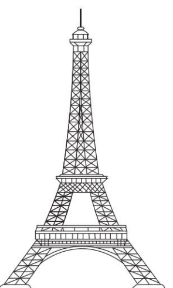

Como a pressão exercida pela torre se compara com a pressão exercida pelo protótipo? Ou seja, qual é a razão entre as pressões $\frac{(P_{\text{torre}})}{(P_{\text{modelo}})}$?

A $10^0$ B $10^1$  $10^2$

D $10^4$ E $10^6$

#  Questão 076 (H7 | Enem 2019) Dificuldade 659,6

Um dos parâmetros de controle de qualidade de polpas de frutas destinadas ao consumo como bebida é a acidez total expressa em ácido cítrico, que corresponde à massa dessa substância em 100 gramas de polpa de fruta. O ácido cítrico é uma molécula orgânica que apresenta três hidrogênios ionizáveis (ácido triprótico) e massa molar 192 g mol $^{-1}$. O quadro indica o valor mínimo desse parâmetro de qualidade para polpas comerciais de algumas frutas.

| Polpa de fruta | Valor mínimo da acidez total expressa em ácido cítrico (g/100 g) |
| --- | --- |
| Acerola | 0,8 |
| Caju | 0,3 |
| Cupuaçu | 1,5 |
| Graviola | 0,6 |
| Maracujá | 2,5 |

A acidez total expressa em ácido cítrico de uma amostra comercial de polpa de fruta foi determinada. No procedimento, adicionou-se água destilada a 2,2 g da amostra e, após a solubilização do ácido cítrico, o sólido remanescente foi filtrado. A solução obtida foi titulada com solução de hidróxido de sódio 0,01 mol L⁻$^{1}$, em que se consumiram 24 mL da solução básica (titulante).

BRASIL. Ministério da Agricultura e do Abastecimento. Instrução normativa n. 1, de 7 de janeiro de 2000. Disponível em: www.agricultura.gov.br. Acesso em: 9 maio 2019 (adaptado).

Entre as listadas, a amostra analisada pode ser de qual polpa de fruta?

A Apenas caju.

B Apenas maracujá.

Caju ou graviola.

D Acerola ou cupuaçu.

E Cupuaçu ou graviola.

#  Questão 077 (H7 | Enem 2017) Dificuldade 660,6

A toxicidade de algumas substâncias é normalmente representada por um índice conhecido como DL50 (dose letal mediana). Ele representa a dosagem aplicada a uma população de seres vivos que mata 50% desses indivíduos e é normalmente medido utilizando-se ratos como cobaias. Esse índice é muito importante para os seres humanos, pois ao se extrapolar os dados obtidos com o uso de cobaias, pode-se determinar o nível tolerável de contaminação de alimentos, para que possam ser consumidos de forma segura pelas pessoas. O quadro apresenta três pesticidas e suas toxicidades. A unidade mg/kg indica a massa da substância ingerida pela massa da cobaia.

| Pesticidas | $DL_{50}$ (mg/kg) |
| --- | --- |
| Diazinon | 70 |
| Malation | 1 000 |
| Atrazina | 3 100 |

Sessenta ratos, com massa de 200 g cada, foram divididos em três grupos de vinte. Três amostras de ração, contaminadas, cada uma delas com um dos pesticidas indicados no quadro, na concentração de 3 mg por grama de ração, foram administradas para cada grupo de cobaias. Cada rato consumiu 100 g de ração.

Qual(ais) grupo(s) terá(ão) uma mortalidade mínima de 10 ratos?

A O grupo que se contaminou somente com atrazina.

B O grupo que se contaminou somente com diazinon.

© Os grupos que se contaminaram com atrazina e malation.

Os grupos que se contaminaram com diazinon e malation.

E Nenhum dos grupos contaminados com atrazina, diazinon e malation.

#  Questão 078 (H7 | Enem 2021) Dificuldade 666,3

Um técnico analisou um lote de analgésicos que supostamente estava fora das especificações. A composição prevista era 100 mg de ácido acetilsalicílico por comprimido (princípio ativo, cuja estrutura está apresentada na figura), além do amido e da celulose (componentes inertes). O técnico realizou os seguintes testes:

1) obtenção da massa do comprimido;

2) medição da densidade do comprimido;

3) verificação do pH com papel indicador;

4) determinação da temperatura de fusão do comprimido;

5) titulação com solução aquosa de NaOH.

Após a realização dos testes, o lote do medicamento foi reprovado porque a quantidade de ácido acetilsalicílico por comprimido foi de apenas 40% da esperada.

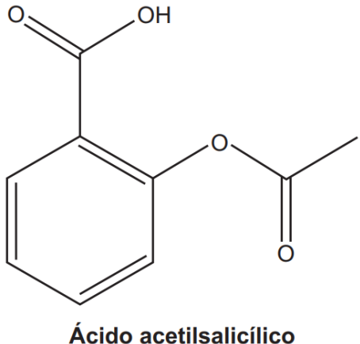

O teste que permitiu reprovar o lote de analgésicos foi o de número

A 1.

B 2.

C 3.

Ⓟ 4.

E 5.

#  Questão 079 (H7 | Enem 2016) Dificuldade 679,5

Em meados de 2003, mais de 20 pessoas morreram no Brasil após terem ingerido uma suspensão de sulfato de bário utilizada como contraste em exames radiológicos. O sulfato de bário é um sólido pouquíssimo solúvel em água, que não se dissolve mesmo na presença de ácidos. As mortes ocorreram porque um laboratório farmacêutico forneceu o produto contaminado com carbonato de bário, que é solúvel em meio ácido.

Um simples teste para verificar a existência de íons bário solúveis poderia ter evitado a tragédia. Esse teste consiste em tratar a amostra com solução aquosa de HCI e, após filtrar para separar os compostos insolúveis de bário, adiciona-se solução aquosa de H₂SO₄ sobre o filtrado e observa-se por 30 min.

TUBINO, M.; SIMONI, J. A. Refletindo sobre o caso Celobar®. Química Nova, n. 2, 2007 (adaptado).

A presença de íons bário solúveis na amostra é indica pela

A liberação de calor.

B alteração da cor para rosa.

ⓒ precipitação de um sólido branco.

D formação de gás hidrogênio.

E volatilização de gás cloro.

##  Questão 080 (H7 | Enem 2018) Dificuldade 698,0

Visando a melhoria estética de um veículo, o vendedor de uma loja sugere ao consumidor que ele troque as rodas de seu automóvel de aro 15 polegadas para aro 17 polegadas, o que corresponde a um diâmetro maior do conjunto roda e pneu.

Duas consequências provocadas por essa troca de aro são:

A Elevar a posição do centro de massa do veículo tornando-o mais instável e aumentar a velocidade do automóvel em relação à indicada no velocímetro.

B Abaixar a posição do centro de massa do veículo tornando-o mais instável e diminuir a velocidade do automóvel em relação à indicada no velocímetro.

© Elevar a posição do centro de massa do veículo tornando-o mais estável e aumentar a velocidade do automóvel em relação à indicada no velocímetro.

Abaixar a posição do centro de massa do veículo tornando-o mais estável e diminuir a velocidade do automóvel em relação à indicada no velocímetro.

E Elevar a posição do centro de massa do veículo tornando-o mais estável e diminuir a velocidade do automóvel em relação à indicada no velocímetro.

#  Questão 081 (H7 | Enem 2019) Dificuldade 836,5

O objetivo de recipientes isolantes térmicos é minimizar as trocas de calor com o ambiente externo. Essa troca de calor é proporcional à condutividade térmica k e à área interna das faces do recipiente, bem como à diferença de temperatura entre o ambiente externo e o interior do recipiente, além de ser inversamente proporcional à espessura das faces.

A fim de avaliar a qualidade de dois recipientes $\mathbf{A}(40\text{cm} \times 40\text{cm} \times 40\text{cm})$ e $\mathbf{B}(60\text{cm} \times 40\text{cm} \times 40\text{cm})$ , de faces de mesma espessura, uma estudante compara suas condutividades térmicas kA e kB. Para isso suspende, dentro de cada recipiente, blocos idênticos de gelo a 0 °C, de modo que suas superfícies estejam em contato apenas com o ar. Após um intervalo de tempo, ela abre os recipientes enquanto ambos ainda contêm um pouco de gelo e verifica que a massa de gelo que se fundiu no recipiente $\mathbf{B}$ foi o dobro da que se fundiu no recipiente $\mathbf{A}$.

A razão $\frac{k_A}{k_B}$ é mais próxima de

A 0.50.

B 0,67.

© 0,75.

D 1,33.

E 2,00.

#  Questão 082 (H7 | Enem 2022) Anulada pela TRI

Um pai faz um balanço utilizando dois segmentos paralelos e iguais da mesma corda para fixar uma tábua a uma barra horizontal. Por segurança, opta por um tipo de corda cuja tensão de ruptura seja 25% superior à tensão máxima calculada nas seguintes condições:

● O ângulo máximo atingido pelo balanço em relação à vertical é igual a 90°;

● Os filhos utilizarão o balanço até que tenham uma massa de 24 kg.

Além disso, ele aproxima o movimento do balanço para o movimento circular uniforme, considera que a aceleração da gravidade é igual a 10 $\frac{m}{s^2}$ e despreza forças dissipativas.

Qual é a tensão de ruptura da corda escolhida?

A 120 N

B 300 N

© 360 N

Ⓓ 450 N

E 900 N

#  Parte IV

##  Competência 3

#  Competência 3

Associar intervenções que resultam em degradação ou conservação ambiental a processos produtivos e sociais e a instrumentos ou ações científico-tecnológicos.

#  Habilidade 8

Identificar etapas em processos de obtenção, transformação, utilização ou reciclagem de recursos naturais, energéticos ou matérias-primas, considerando processos biológicos, químicos ou físicos neles envolvidos.

##  Questão 083 (H8 | Enem 2021) Dificuldade 567,3

A imagem apresenta as etapas do funcionamento de uma estação individual para tratamento do esgoto residencial.

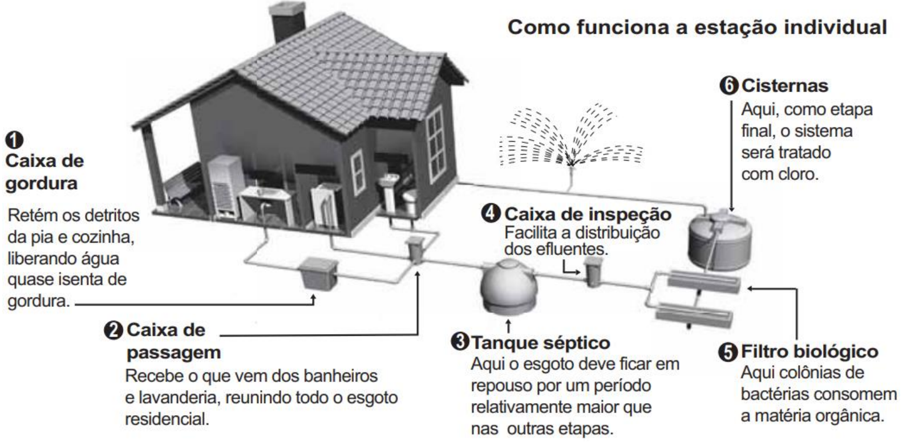

TAVARES, K. Estações de tratamento de esgoto individuais permitem a reutilização da água. Disponível em: https://extra.globo.com. Acesso em: 18 nov. 2014 (adaptado).

Em qual etapa decanta-se o lodo a ser separado do esgoto residencial?

A 1

B 2

© 3

D 5

E 6

#  Questão 084 (H8 | Enem 2019) Dificuldade 586,8

Na família Retroviridae encontram-se diversos vírus que infectam aves e mamíferos, sendo caracterizada pela produção de DNA a partir de uma molécula de RNA. Alguns retrovírus infectam exclusivamente humanos, não necessitando de outros hospedeiros, reservatórios ou vetores biológicos. As infecções ocasionadas por esses vírus vêm causando mortes e grandes prejuízos ao desenvolvimento social e econômico. Nesse contexto, pesquisadores têm produzido medicamentos que contribuem para o tratamento dessas doenças.

Que avanços tecnológicos têm contribuído para o tratamento dessas infecções virais?

A Melhoria dos métodos de controle dos vetores desses vírus.

B Fabricação de soros mutagênicos para combate desses vírus.

© Investimento da indústria em equipamentos de proteção individual.

D Produção de vacinas que evitam a infecção das células hospedeiras.

E Desenvolvimento de antirretrovirais que dificultam a reprodução desses vírus.

#  Questão 085 (H8 | Enem 2016) Dificuldade 629,9

O esquema representa, de maneira simplificada, o processo de produção de etanol utilizando milho como matéria-prima.

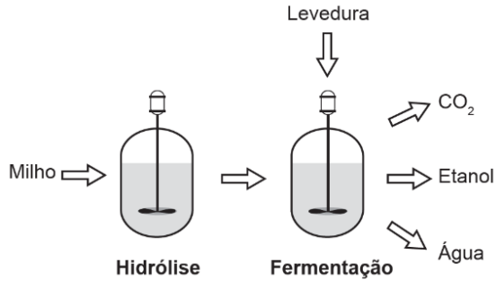

A etapa de hidrólise na produção de etanol a partir do milho é fundamental para que

a glicose seja convertida em sacarose.

B as enzimas dessa planta sejam ativadas.

a maceração favoreça a solubilização em água.

o amido seja transformado em substratos utilizáveis pela levedura.

E os grãos com diferentes composições químicas sejam padronizados.

##  Questão 086 (H8 | Enem 2017) Dificuldade 634,4

Diversos produtos naturais podem ser obtidos de plantas por processo de extração. O lapachol é da classe das naftoquinonas. Sua estrutura apresenta uma hidroxila enólica (pKₐ = 6,0) que permite que este composto seja isolado da serragem dos ipês por extração com solução adequada, seguida de filtração simples. Considere que pKₐ = -log Kₐ, em que Kₐ é a constante ácida da reação de ionização do lapachol.

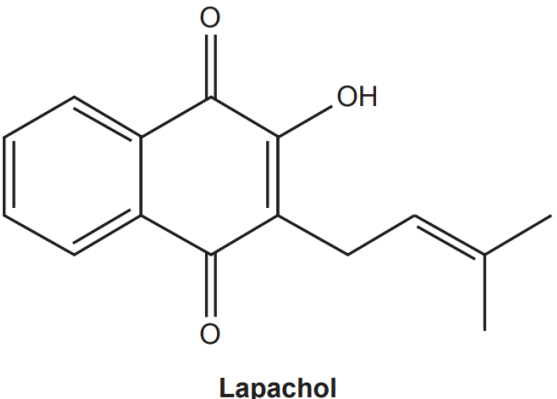

COSTA, P. R. R. et al. Ácidos e bases em química orgânica. Porto Alegre: Bookman, 2005 (adaptado).

Qual solução deve ser usada para extração do lapachol da serragem do ipê com maior eficiência?

A Solução de Na₂CO₃ para formar um sal de lapachol.

B Solução-tampão acido acético/acetato de sódio (pH = 4,5).

Solução de NaCl a fim de aumentar a força iônica do meio.

D Solução de Na₂SO₄ para formar um par iônico com lapachol.

E Solução de HCI a fim de extraí-lo por meio de reação ácido-base.

#  Questão 087 (H8 | Enem 2019) Dificuldade 659,2

Uma das técnicas de reciclagem química do polímero PET [poli(tereftalato de etileno)] gera o tereftalato de metila e o etanodiol, conforme o esquema de reação, e ocorre por meio de uma reação de transesterificação.

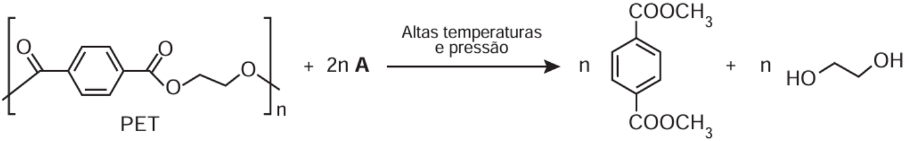

O composto A, representado no esquema de reação, é o

A metano.

B metanol.

©éter metílico.

D ácido etanoico.

E anidrido etanoico.

#  Questão 088 (H8 | Enem 2017) Dificuldade 666,8

A eletrólise é um processo não espontâneo de grande importância para a indústria química. Uma de suas aplicações é a obtenção do gás cloro e do hidróxido de sódio, a partir de uma solução aquosa de cloreto de sódio. Nesse procedimento, utiliza-se uma célula eletroquímica, como ilustrado.

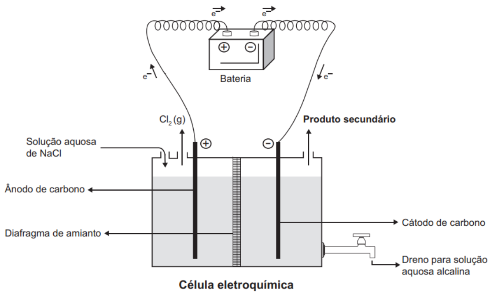

SHREVE, R. N.; BRINK Jr., J. A. Indústrias de processos químicos. Rio de Janeiro: Guanabara Koogan, 1997 (adaptado).

No processo eletrolítico ilustrado, o produto secundário obtido é o

A vapor de água.

B oxigênio molecular.

C hipoclorito de sódio.

D hidrogênio molecular.

E cloreto de hidrogênio.

#  Questão 089 (H8 | Enem 2021) Dificuldade 679,8

Com o aumento da população de suínos no Brasil, torna-se necessária a adoção de métodos para reduzir o potencial poluidor dos resíduos dessa agroindústria, uma vez que, comparativamente ao esgoto doméstico, os dejetos suínos são 200 vezes mais poluentes. Sendo assim, a utilização desses resíduos como matéria-prima na obtenção de combustíveis é uma alternativa que permite diversificar a matriz energética nacional, ao mesmo tempo em que parte dos recursos hídricos do país são preservados.

BECK, A. M. Resíduos suínos como alternativa energética sustentável. XXVII Encontro Nacional de Engenharia de Produção. Anais ENEGEP, Foz do Iguaçu, 2007 (adaptado).

O biocombustível a que se refere o texto é o

A etanol.

B biogás.

Cbutano.

D metanol.

E biodiesel.

#  Questão 090 (H8 | Enem 2020) Dificuldade 688,4

A obtenção de óleos vegetais, de maneira geral, passa pelas etapas descritas no quadro.

| Etapa | Subetapa | O que ocorre |
| --- | --- | --- |
| Preparação da matéria-prima | Seleção dos grãos | Separação das sujidades mais grossas |
| Preparação da matéria-prima | Descascamento | Separação de polpa e casca |
| Preparação da matéria-prima | Trituração | Rompimento dos tecidos e das paredes das células |
| Preparação da matéria-prima | Cozimento | Aumento da permeabilidade das membranas celulares |
| Extração do óleo bruto | Prensagem | Remoção parcial do óleo |
| Extração do óleo bruto | Extração | Obtenção do óleo bruto com hexano |
| Extração do óleo bruto | Destilação | Separação do óleo e do solvente |

Qual das subetapas do processo é realizada em função apenas da polaridade das substâncias?

A Trituração.

B Cozimento.

© Prensagem.

D Extração.

E Destilação.

#  Questão 091 (H8 | Enem 2016) Dificuldade 701,3

A usina de Itaipu é uma das maiores hidrelétricas do mundo em geração de energia. Com 20 unidades geradoras e 14 000 MW de potência total instalada, apresenta uma queda de 118,4 m e vazão nominal de 690 m$^{3}$/s por unidade geradora. O cálculo da potência teórica leva em conta a altura da massa de água represada pela barragem, a gravidade local (10 m/s$^{2}$) e a densidade da água (1 000 kg/m$^{3}$). A diferença entre a potência teórica e a instalada é a potência não aproveitada.

Disponível em: www.itaipu.gov.br. Acesso em: 11 maio 2013
(adaptado).

Qual é a potência, em MW, não aproveitada em cada unidade geradora de Itaipu?

A 0

B 1,18

● 116,96

D 816,96

E 13 183,04

#  Questão 092 (H8 | Enem 2022) Dificuldade 751,7

A água bruta coletada de mananciais apresenta alto índice de sólidos suspensos, o que a deixa com um aspecto turvo. Para se obter uma água límpida e potável, ela deve passar por um processo de purificação numa estação de tratamento de água. Nesse processo, as principais etapas são, nesta ordem: coagulação, decantação, filtração, desinfecção e fluoretação.

Qual é a etapa de retirada de grande parte desses sólidos?

A Coagulação.

B Decantação.

C Filtração.

D Desinfecção.

E Fluoretação.

##  Questão 093 (H8 | Enem 2018) Dificuldade 757,3

A hidroxilamina ($NH_2OH$) é extremamente reativa em reações de substituição nucleofílica, justificando sua utilização em diversos processos. A reação de substituição nucleofílica entre o anidrido acético e a hidroxilamina está representada.

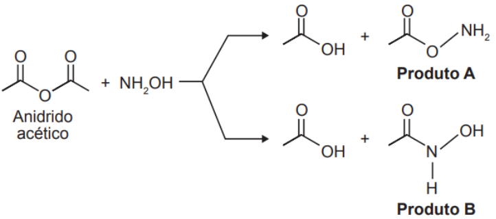

O produto A é favorecido em relação ao B, por um fator de $10^5$. Em um estudo de possível substituição do uso de hidroxilamina, foram testadas as moléculas numeradas de 1 a 5.

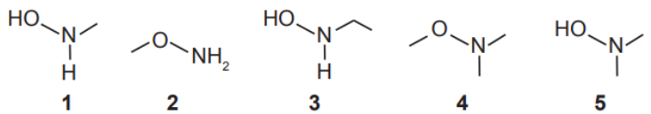

Dentre as moléculas testadas, qual delas apresentou menor reatividade?

A 1

B 2

© 3

D 4

E 5

#  Competência 3

Associar intervenções que resultam em degradação ou conservação ambiental a processos produtivos e sociais e a instrumentos ou ações científicotecnológicos.

#  Habilidade 9

Compreender a importância dos ciclos biogeuoquímicos ou do fluxo energia para a vida, ou da ação de agentes ou fenômenos que podem causar alterações nesses processos.

##  Questão 094 (H9 | Enem 2021) Dificuldade 551,4

Na cidade de São Paulo, as ilhas de calor são responsáveis pela alteração da direção do fluxo da brisa marítima que deveria atingir a região de mananciais. Mas, ao cruzar a ilha de calor, a brisa marítima agora encontra um fluxo de ar vertical, que transfere para ela energia térmica absorvida das superfícies quentes da cidade, deslocando-a para altas altitudes. Dessa maneira, há condensação e chuvas fortes no centro da cidade, em vez de na região de mananciais. A imagem apresenta os três subsistemas que trocam energia nesse fenômeno.

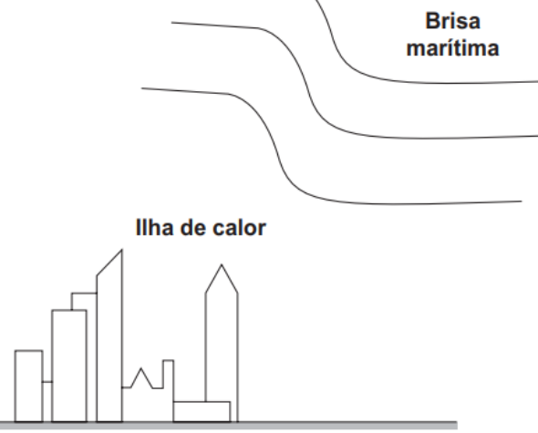

No processo de fortes chuvas no centro da cidade de São Paulo, há dois mecanismos dominantes de transferência de calor: entre o Sol e a ilha de calor, e entre a ilha de calor e a brisa marítima.

VIVEIROS, M. Ilhas de calor afastam chuvas de represas. Disponível em: www2.feis.unesp.br. Acesso em: 3 dez. 2019 (adaptado).

Esses mecanismos são, respectivamente,

A irradiação e convecção.

B irradiação e irradiação.

© condução e irradiação.

D convecção e irradiação.

E convecção e convecção.

##  Questão 095 (H9 | Enem 2020) Dificuldade 567,4

Grandes reservatórios de óleo leve de melhor qualidade e que produz petróleo mais fino foram descobertos no litoral brasileiro numa camada denominada pré-sal, formada há 150 milhões de anos.

A utilização desse recurso energético acarreta para o ambiente um desequilíbrio no ciclo do

A nitrogênio, devido à nitrificação ambiental transformando amônia em nitrito.

B nitrogenênio, devido ao aumento dos compostos nitrogenados no ambiente terrestre.

ⓒ carbono, devido ao aumento dos carbonatos dissolvidos no ambiente marinho.

D carbono, devido à liberação das cadeias carbônicas aprisionadas abaixo dos sedimentos.

E fósforo, devido à liberação dos fosfatos acumulados no ambiente marinho.

##  Questão 096 (H9 | Enem 2016) Dificuldade 624,4

Ao percorrer o trajeto de uma cadeia alimentar, o carbono, elemento essencial e majoritário da matéria orgânica que compõe os indivíduos, ora se encontra em sua forma inorgânica, ora se encontra em sua forma orgânica. Em uma cadeia alimentar composta por fitoplâncton, zooplâncton, moluscos, crustáceos e peixes ocorre a transição desse elemento da forma inorgânica para a orgânica.

Em qual grupo de organismos ocorre essa transição?

A Fitoplâncton.

B Zooplâncton.

© Moluscos.

D Crustáceos.

E Peixes.

#  Questão 097 (H9 | Enem 2021) Dificuldade 640,6

Organismos autótrofos e heterótrofos realizam processos complementares que associam os ciclos do carbono e do oxigênio. O carbono fixado pela energia luminosa ou a partir de compostos inorgânicos é eventualmente degradado pelos organismos, resultando em fontes de carbono como metano ou gás carbônico. Ainda, outros compostos orgânicos são catabolizados pelos seres, com menor rendimento energético, produzindo compostos secundários (subprodutos) que podem funcionar como combustíveis ambientais.

O processo metabólico associado à expressão combustíveis ambientais é a

A fotossíntese.

B fermentação.

C quimiossíntese.

D respiração aeróbica.

E fosforilação oxidativa.

#  Questão 098 (H9 | Enem 2018) Dificuldade 659,5

As células e os organismos precisam realizar trabalho para permanecerem vivos e se reproduzirem. A energia metabólica necessária para a realização desse trabalho é oriunda da oxidação de combustíveis, gerados no ciclo do carbono, por meio de processos capazes de interconverter diferentes formas da energia.

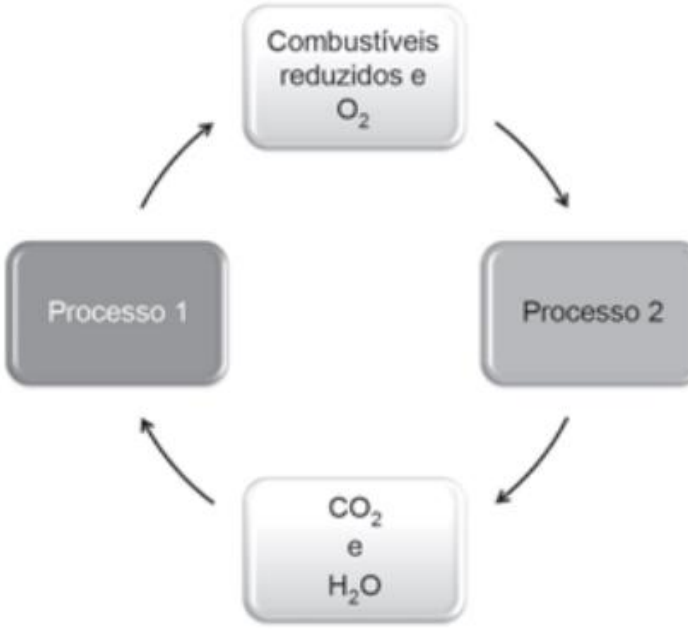

NELSON, D. L.; COX, M. M. Lehninger: principios de bioquímica. São Paulo: Sarvier, 2002 (adaptado).

Nesse ciclo, a formação de combustíveis está vinculada à conversão de energia

A térmica em cinética.

B química em térmica.

ⓒ eletroquímica em calor.

D cinética em eletromagnética.

E eletromagnética em química.

##  Questão 099 (H9 | Enem 2017) Dificuldade 661,0

Uma grande virada na moderna história da agricultura ocorreu depois da Segunda Guerra Mundial. Após a guerra, os governos haviam se deparado com um enorme excedente de nitrato de amônio, ingrediente usado na fabricação de explosivos. A partir daí as fábricas de munição foram adaptadas para começar a produzir fertilizantes tendo como componente principal os nitratos.

SOUZA, F. A. Agricultura natural/orgânica como instrumento de fixação biológica e manutenção do nitrogênio no solo: um modelo sustentável de MDL. Disponível em: www.planetaorganico.com.br. Acesso em: 17 jul. 2015 (adaptado).

No ciclo natural do nitrogênio, o equivalente ao principal componente desses fertilizantes industriais é produzido na etapa de

A nitratação.

B nitrosação.

c amonificação.

D desnitrificação.

E fixação biológica do N2.

#  Questão 100 (H9 | Enem 2022) Dificuldade 670,4

Os ursos, por não apresentarem uma hibernação verdadeira, acordam por causa da presença de termogenina, uma proteína mitocondrial que impede a chegada dos prótons até a ATP sintetase, gerando calor. Esse calor é importante para aquecer o organismo, permitindo seu despertar.

SADAVA, D. et al. Vida: a ciência da biologia. Porto Alegre: Artmed, 2009 (adaptado).

Em qual etapa do metabolismo energético celular a termogenina interfere?

A Glicóise.

B Fermentação lática.

Ciclo do ácido cítrico.

D Oxidação do piruvato.

E Fosforilação oxidativa.

#  Questão 101 (H9 | Enem 2018) Dificuldade 677,7

O alemão Fritz Haber recebeu o Prêmio Nobel de química de 1918 pelo desenvolvimento de um processo viável para a síntese da amônia ($NH_3$). Em seu discurso de premiação, Haber justificou a importância do feito dizendo que:

"Desde a metade do século passado, tornou-se conhecido que um suprimento de nitrogênio é uma necessidade básica para o aumento das safras de alimentos; entretanto, também se sabia que as plantas não podem absorver o nitrogênio em sua forma simples, que é o principal constituinte da atmosfera. Elas precisam que o nitrogênio seja combinado [...] para poderem assimilá-lo.

Economias agrícolas basicamente mantêm o balanço do nitrogênio ligado. No entanto, com o advento da era industrial, os produtos do solo são levados de onde cresce a colheita para lugares distantes, onde são consumidos, fazendo com que o nitrogênio ligado não retorne à terra da qual foi retirado.

Isso tem gerado a necessidade econômica mundial de abastecer o solo com nitrogênio ligado. [...] A demanda por nitrogênio, tal como a do carvão, indica quão diferente nosso modo de vida se tornou com relação ao das pessoas que, com seus próprios corpos, fertilizam o solo que cultivam.

Desde a metade do último século, nós vínhamos aproveitando o suprimento de nitrogênio do salitre que a natureza tinha depositado nos desertos montanhosos do Chile. Comparando o rápido crescimento da demanda com a extensão calculada desses depósitos, ficou claro que em meados do século atual uma emergência seríssima seria inevitável, a menos que a química encontrasse uma saída."

HABER, F. The Synthesis of Ammonia from its Elements. Disponível em: www.nobelprize.org. Acesso em: 13 jul. 2013 (adaptado).

De acordo com os argumentos de Haber, qual fenômeno teria provocado o desequilíbrio no “balanço do nitrogênio ligado”?

A O esgotamento das reservas de salitre no Chile.

B O aumento da exploração de carvão vegetal e carvão mineral.

© A redução da fertilidade do solo nas economias agrícolas.

D A intensificação no fluxo de pessoas do campo para as cidades.

E A necessidade das plantas de absorverem sais de nitrogênio disponíveis no solo.

#  Questão 102 (H9 | Enem 2022) Dificuldade 678,7

O esquema representa o ciclo do nitrogênio:

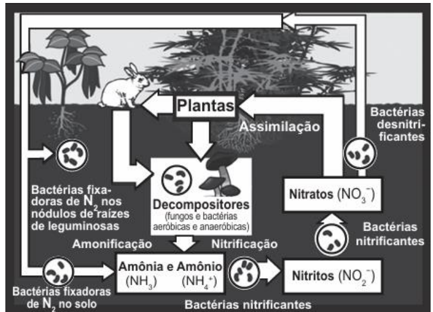

A chuva ácida interfere no ciclo do nitrogênio, principalmente, por proporcionar uma diminuição do pH do solo e da atmosfera, alterando a concentração dos compostos presentes nesse ciclo.

Disponível em: http://scienceprojectideasforkids.com. Acesso em: 6 ago. 2012 (adaptado).

Em um solo de menor pH, será favorecida a formação de

A $N_2$.

B $NH_3$.

C $NH_{4}^{+}$

$$\text{D} NO_{2}^{-}.$$

$$\text{E} NO_{3}^{-}.$$

#  Questão 103 (H9 | Enem 2019) Dificuldade 721,4

Glicólise é um processo que ocorre nas células, convertendo glicose em piruvato. Durante a prática de exercícios físicos que demandam grande quantidade de esforço, a glicose é completamente oxidada na presença de $O_2$. Entretanto, em alguns casos, as células musculares podem sofrer um déficit de $O_2$ e a glicose ser convertida em duas moléculas de ácido lático. As equações termoquímicas para a combustão da glicose e do ácido lático são, respectivamente, mostradas a seguir:

$$C_6H_{12}O_6(s) + 6O_2(g) \rightarrow 6CO_2(g) + 6H_2O(l) \quad \Delta_c H = -2800 \text{ kJ}$$

O processo anaeróbico é menos vantajoso energeticamente porque

A libera 112 kJ por mol de glicose.

B libera 467 kJ por mol de glicose.

© libera 2 688 kJ por mol de glicose.

D absorve 1 344 kJ por mol de glicose.

E absorve 2 800 kJ por mol de glicose.

#  Questão 104 (H9 | Enem 2019) Dificuldade 879,9

O 2,4-dinitrofenol (DNP) é conhecido como desacoplador da cadeia de elétrons na mitocôndria e apresenta um efeito emagrecedor. Contudo, por ser perigoso e pela ocorrência de casos letais, seu uso como medicamento é proibido em diversos países, inclusive no Brasil. Na mitocôndria, essa substância captura, no espaço intermembranas, prótons (H+) provenientes da atividade das proteínas da cadeia respiratória, retornando-os à matriz mitocondrial. Assim, esses prótons não passam pelo transporte enzimático na membrana interna.

GRUNDLINGH, J. et al. 2,4-Dinitrophenol (DNP): a Weight Loss Agent with Significant Acute Toxicity and Risk of Death. Journal of Medical Toxicology, v. 7, 2011 (adaptado).

O efeito emagrecedor desse composto está relacionado ao(à)

A obstrução da cadeia respiratória, resultando em maior consumo celular de ácidos graxos.

B bloqueio das reações do ciclo de Krebs, resultando em maior gasto celular de energia.

© diminuição da produção de acetil CoA, resultando em maior gasto celular de piruvato.

D inibição da glicóise, resultando em maior absorção celular da glicose sanguínea.

E redução da produção de ATP, resultando em maior gasto celular de nutrientes.

#  Competência 3

Associar intervenções que resultam em degradação ou conservação ambiental a processos produtivos e sociais e a instrumentos ou ações científicotecnológicos.

#  Habilidade 10

Analisar perturbações ambientais, identificando fontes, transporte e(ou) destino dos poluentes ou prevendo efeitos em sistemas naturais, produtivos ou sociais.

##  Questão 105 (H10 | Enem 2019) Dificuldade 515,6

A poluição radioativa compreende mais de 200 nuclídeos, sendo que, do ponto de vista de impacto ambiental, destacam-se o césio-137 e o estrôncio-90. A maior contribuição de radionuclídeos antropogênicos no meio marinho ocorreu durante as décadas de 1950 e 1960, como resultado dos testes nucleares realizados na atmosfera. O estrôncio-90 pode se acumular nos organismos vivos e em cadeias alimentares e, em razão de sua semelhança química, pode participar no equilíbrio com carbonato e substituir o cálcio em diversos processos biológicos.

FIGUEIRA, R. C. L.; CUNHA, I. I. L. A contaminação dos oceanos por radionucídeos antropogênicos. Química Nova, n. 21, 1998 (adaptado).

Ao entrar numa cadeia alimentar da qual o homem faz parte, em qual tecido do organismo humano o estrôncio-90 será acumulado predominantemente?

A Cartilaginoso.

B Sanguíneo.

C Muscular.

D Nervoso.

E Ósseo.

##  Questão 106 (H10 | Enem 2018) Dificuldade 579,6

Tensoativos são compostos orgânicos que possuem comportamento anifílico, isto é, possuem duas regiões, uma hidrofóbica e outra hidrofílica. O principal tensoativo aniónico sintético surgiu na década de 1940 e teve grande aceitação no mercado de detergentes em razão do melhor desempenho comparado ao do sabão. No entanto, o uso desse produto provocou grandes problemas ambientais, dentre eles a resistência à degradação biológica, por causa dos diversos carbonos terciários na cadeia que compõe a porção hidrofóbica desse tensoativo aniónico. As ramificações na cadeia dificultam sua degradação, levando à persistência no meio ambiente por longos períodos. Isso levou a sua substituição na maioria dos países por tensoativos biodegradáveis, ou seja, com cadeias alquílicas lineares.

PENTEADO, J. C. P.; EL SEOUD, O. A.; CARVALHO, L. R. F. [...] uma abordagem ambiental e analítica. Química Nova, n. 5, 2006 (adaptado).

Qual a fórmula estrutural do tensoativo persistente no ambiente mencionado no texto?

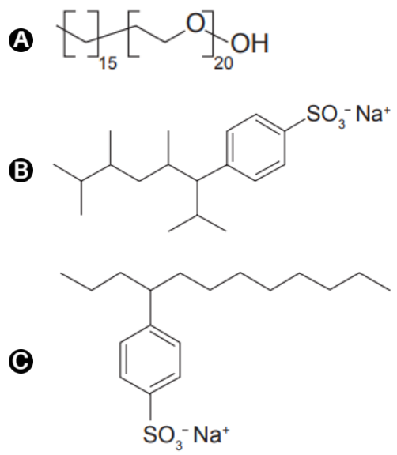

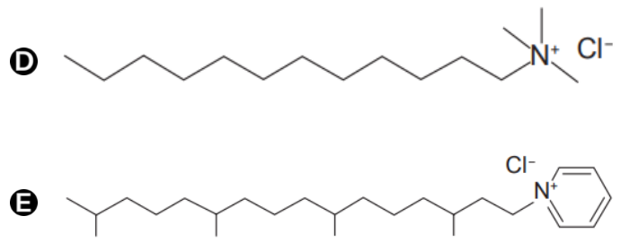

#  Questão 107 (H10 | Enem 2020) Dificuldade 615,1

Pesquisadores coletaram amostras de água de um rio em pontos diferentes, distantes alguns quilômetros um do outro. Ao longo do rio, há locais de águas limpas, como também locais que recebem descarga de esgoto de área urbana, e locais onde há decomposição ativa com ausência de peixes. Os pesquisadores analisaram dois parâmetros: oxigênio dissolvido (OD) e demanda bioquímica de oxigênio (DBO) em cada ponto de coleta de água, obtendo o gráfico:

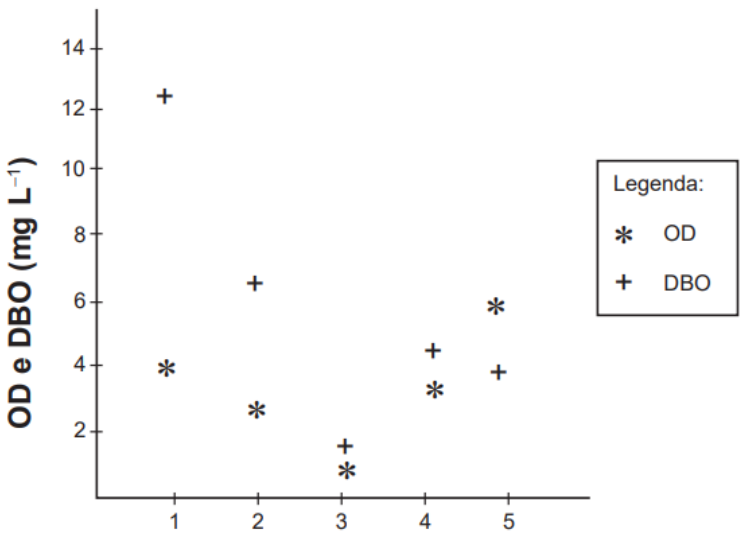

Pontos de amostragem

Valores limites permitidos para águas doces destinadas ao abastecimento para o consumo humano após tratamento convencional, segundo Resolução Conama n. 357/2005: OD ≥ 5 mg L$^{-1}$ e DBO ≤ 5 mg L$^{-1}$.

O OD é proveniente da atmosfera e da fotossíntese que ocorre no curso-d'água e sua concentração é função das variáveis físicas, químicas e bioquímicas locais. A DBO é a quantidade de oxigênio consumido por microrganismos em condições aeróbicas para degradar uma determinada quantidade de matéria orgânica, durante um período de tempo, numa temperatura de incubação específica.

Disponível em: www.programaaguaazul.rn.gov.br. Acesso em: 16 ago. 2014 (adaptado).

Qual ponto de amostragem da água do rio está mais próximo ao local em que o rio recebe despejo de esgoto?

A 1

B 2

© 3

Ⓟ 4

E 5

#  Questão 108 (H10 | Enem 2021) Dificuldade 621,8

O rompimento da barragem de rejeitos de mineração no município mineiro de Mariana e o derramamento de produtos tóxicos nas águas do Rio Doce, ocorridos em 2015, ainda têm consequências para os organismos que habitam o Parque Nacional Marinho de Abrolhos, localizado a mais de 1 000 quilômetros de distância. Esse desastre ambiental afetou o fitoplâncton, as esponjas, as algas macroscópicas, os peixes herbívoros e os golfinhos.

FRAINER, G.; SICILIANO, S.; TAVARES, D. C. Franciscana calls for help: [...]. International Whaling Commission, Conference Paper, jun. 2016 (adaptado).

Concentrações mais elevadas dos compostos citados são encontradas em

A esponjas.

B golfinhos.

ⓒ fitoplâncton.

D peixes.

E algas macroscópicas.

##  Questão 109 (H10 | Enem 2022) Dificuldade 646,4

Durante o ano de 2020, impulsionado pela necessidade de respostas rápidas e eficientes para desinfectar ambientes de possíveis contaminações com o SARS-CoV-2, causador da covid-19, diversas alternativas foram buscadas para os procedimentos de descontaminação de materiais e ambientes. Entre elas, o uso de ozônio em meio aquoso como agente sanitizante para pulverização em humanos e equipamentos de proteção em câmaras ou túneis, higienização de automóveis e de ambientes fechados e descontaminação de trajes. No entanto, pouca atenção foi dada à toxicidade do ozônio, à formação de subprodutos, ao nível de concentração segura e às precauções necessárias.

LIMA, M. J. A.; FELIX, E. P.; CARDOSO, A. A. Aplicações e implicações do ozônio na indústria, ambiente e saúde. Química Nova, n. 9, 2021 (adaptado).

O grande risco envolvido no emprego indiscriminado dessa substância deve-se à sua ação química como

A catalisador.

B oxidante.

redutor.

D ácido.

E base.

#  Questão 110 (H10 | Enem 2016) Dificuldade 676,5

Recentemente um estudo feito em campos de trigo mostrou que níveis elevados de dióxido de carbono na atmosfera prejudicam a absorção de nitrato pelas plantas. Consequentemente, a qualidade nutricional desses alimentos pode diminuir à medida que os níveis de dióxido de carbono na atmosfera atingirem as estimativas para as próximas décadas.

BLOOM, A. J. et al. Nitrate assimilation is inhibited by elevated $CO_2$ in field-grown wheat. Nature Climate Change, n. 4, abr. 2014 (adaptado).

Nesse contexto, a qualidade nutricional do grão de trigo será modificada primariamente pela redução de

Aamido.

B frutose.

lipídeos.

D celulose.

E proteínas.

#  Questão 111 (H10 | Enem 2020) Dificuldade 685,8

O dióxido de carbono passa para o estado sólido (gelo seco) a -78 °C e retorna ao estado gasoso à temperatura ambiente. O gás é facilmente solubilizado em água, capaz de absorver radiação infravermelha da superfície da terra e não conduz eletricidade. Ele é utilizado como matéria-prima para a fotossíntese até o limite de saturação. Após a fixação pelos organismos autotróficos, o gás retorna ao meio ambiente pela respiração aeróbica, fermentação, decomposição ou por resíduos industriais, queima de combustíveis fósseis e queimadas. Apesar da sua importância ecológica, seu excesso causa perturbações no equilíbrio ambiental.

Considerando as propriedades descritas, o aumento atmosférico da substância afetará os organismos aquáticos em razão da

A redução do potencial hidrogeniônico da água.

B restrição da aerobiose pelo excesso de poluentes.

© diminuição da emissão de oxigênio pelos autótrofos.

Ⓓ limitação de transferência de energia entre os seres vivos.

E retração dos oceanos pelo congelamento do gás nos polos.

##  Questão 112 (H10 | Enem 2017) Dificuldade 704,1

Para se adequar às normas ambientais atuais, as construtoras precisam prever em suas obras a questão do uso de materiais de modo a minimizar os impactos causados no local. Entre esses materiais está o chamado concregrama ou pisograma, que é um tipo de revestimento composto por peças de concreto com áreas vazadas, preenchidas com solo gramado. As figuras apresentam essas duas formas de piso feitos de concreto.

Piso tradicional de concreto

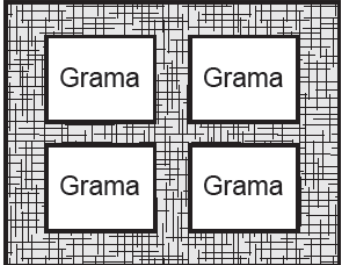

Piso concregrama

PONTES, K. L. F. Estudo de caso de um protótipo experimental [...] Disponível em: http://monoografias.poli.ufri.br. Acesso em: 9 maio

2017 (adaptado).

A utilização desse tipo de piso em uma obra tem o objetivo de evitar, no solo, a

A impermeabilização.

B diminuição da temperatura.

ⓒ acumulação de matéria orgânica.

D alteração do pH.

E salinização.

#  Competência 3

Associar intervenções que resultam em degradação ou conservação ambiental a processos produtivos e sociais e a instrumentos ou ações científicotecnológicos.

#  Habilidade 11

Reconhecer benefícios, limitações e aspectos éticos da biotecnologia, considerando estruturas e processos biológicos envolvidos em produtos biotecnológicos.

##  Questão 113 (H11 | Enem 2021) Dificuldade 427,3

Os búfalos são animais considerados rústicos pelos criadores e, por isso, são deixados no campo sem controle reprodutivo. Por causa desse tipo de criação, a consanguinidade é favorecida, proporcionando o aparecimento de enfermidades, como o albinismo, defeitos cardíacos, entre outros. Separar os animais de forma adequada minimizaria a ocorrência desses problemas.

DAMÉ, M. C. F.; RIET-CORREA, F.; SCHILD, A. L. Pesq. Vet. Bras., n. 7, 2013 (adaptado).

Qual procedimento biotecnológico prévio é recomendado nessa situação?

A Transgenia.

B Terapia gênica.

© Vacina de DNA.

D Clonagem terapêutica.

E Mapeamento genético.

##  Questão 114 (H11 | Enem 2019) Dificuldade 570,9

A eritropoetina (EPO) é um hormônio endógeno secretado pelos rins que influencia a maturação dos eritrócitos. Suas formas recombinantes, sintetizadas em laboratório, têm sido usadas por alguns atletas em esportes de resistência na busca por melhores resultados. No entanto, a administração da EPO recombinante no esporte foi proibida pelo Comitê Olímpico Internacional e seu uso considerado doping.

MARTELLI, A. Eritropoetina: síntese e liberação fisiológica e o uso de sua forma recombinante no esporte. Perspectivas Online: biológicas & saúde, v. 10, n. 3, 2013 (adaptado).

Uma influência que esse doping poderá exercer na melhoria da capacidade física desses atletas está relacionada ao transporte de

A lipídios, para aumento do gasto calórico.

Ⓑ ATP, para aumento da síntese hormonal.

©oxigênio, para aumento da produção de ATP.

D proteínas, para aumento da massa muscular.

E vitamina C, para aumento da integridade dos vasos sanguíneos.

#  Questão 115 (H11 | Enem 2020) Dificuldade 579,2

Instituições acadêmicas e de pesquisa no mundo estão inserindo genes em genomas de plantas que possam codificar produtos de interesse farmacológico. No Brasil, está sendo desenvolvida uma variedade de soja com um viricida ou microbicida capaz de prevenir a contaminação pelo vírus causador da aids. Essa leguminosa está sendo induzida a produzir a enzima cianovirina-N, que tem eficiência comprovada contra o vírus.

OLIVEIRA, M. Remédio na planta. Pesquisa Fapesp, n. 206, abr. 2013.

A técnica para gerar essa leguminosa é um exemplo de

A hibridismo.

B transgenia.

conjugação.

D terapia gênica.

E melhoramento genético.

#  Questão 116 (H11 | Enem 2017) Dificuldade 581,9

Pesquisadores conseguiram estimular a absorção de energia luminosa em plantas graças ao uso de nanotubos de carbono. Para isso, nanotubos de carbono “se inseriram” no interior dos cloroplastos por uma montagem espontânea, através das membranas dos cloroplastos. Pigmentos da planta absorvem as radiações luminosas, os elétrons são “excitados” e se deslocam no interior de membranas dos cloroplastos, e a planta utiliza em seguida essa energia elétrica para a fabricação de açúcares. Os nanotubos de carbono podem absorver comprimentos de onda habitualmente não utilizados pelos cloroplastos, e os pesquisadores tiveram a ideia de utilizá-los como “antenas”, estimulando a conversão de energia solar pelos cloroplastos, com o aumento do transporte de elétrons.

Nanotubos de carbono incrementam a fotossíntese de plantas. Disponível em: http://lges.iqm.unicamp.br. Acesso em: 14 nov. 2014 (adaptado).

O aumento da eficiência fotossintética ocorreu pelo fato de os nanotubos de carbono promoverem diretamente a

A utilização de água.

B absorção de fótons.

© formação de gás oxigênio.

D proliferação dos cloroplastos.

E captação de dióxido de carbono.

#  Questão 117 (H11 | Enem 2016) Dificuldade 592,7

A coleta das fezes dos animais domésticos em sacolas plásticas e o seu descarte em lixeiras convencionais podem criar condições de degradação que geram produtos prejudiciais ao meio ambiente (Figura 1).

Figura 1

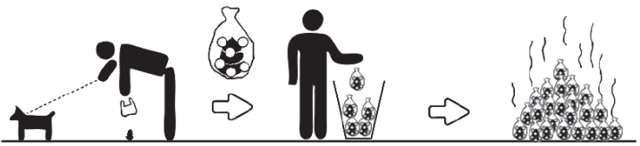

A Figura 2 ilustra o Projeto Park Spark, desenvolvido em Cambridge, MA (EUA), em que as fezes dos animais domésticos são recolhidas em sacolas biodegradáveis e jogadas em um biodigestor instalado em parques públicos; e os produtos são utilizados em equipamentos no próprio parque.

Figura 2

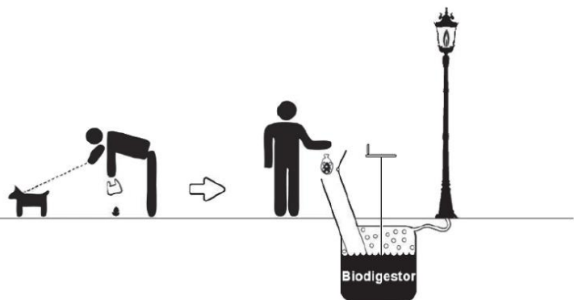

Disponível em: http://parksparkproject.com. Acesso em: 30 ago.2013 (adaptado).

Uma inovação desse projeto é possibilitar o(a)

A queima de gás metano.

B armazenamento de gás carbônico.

© decomposição aeróbica das fezes.

D uso mais eficiente de combustíveis fósseis.

E fixação de carbono em moléculas orgânicas.

##  Questão 118 (H11 | Enem 2022) Dificuldade 610,7

O veneno da cascavel pode causar hemorragia com risco de morte a quem é picado pela serpente. No entanto, pesquisadores do Brasil e da Bélgica desenvolveram uma molécula de interesse farmacêutico, a PEG-collineína-1, a partir de uma proteína encontrada no veneno dessa cobra, capaz de modular a coagulação sanguínea. Embora a técnica não seja nova, foi a primeira vez que o método foi usado a partir de uma toxina animal na sua forma recombinante, ou seja, produzida em laboratório por um fungo geneticamente modificado.

JULIÃO, A. Técnica modifica proteína do veneno de cascavel e permite criar fármaco que modula a coagulação sanguínea. Disponível em: https://agencia.fapesp.br. Acesso em: 22 nov. 2021. (adaptado).

Esse novo medicamento apresenta potencial aplicação para

A impedir a formação de trombos, típicos em alguns casos de acidente vascular cerebral.

B tratar consequências da anemia profunda, em razão da perda de grande volume de sangue.

© evitar a manifestação de urticárias, comumente relacionadas a processos alérgicos.

D reduzir o inchaço dos linfonodos, parte da resposta imunitária de diferentes infecções.

E regular a oscilação da pressão arterial, característica dos quadros de hipertensão.

#  Questão 119 (H11 | Enem 2018) Dificuldade 703,5

O cruzamento de duas espécies da família das Anonáceas, a cherimoia (Annona cherimola) com a fruta-pinha (Annona squamosa), resultou em uma planta híbrida denominada de atemoria. Recomenda-se que o seu plantio seja por meio de enxertia.

Um dos benefícios dessa forma de plantio é a

A ampliação da variabilidade genética.

B produção de frutos das duas espécies.

© manutenção do genótipo da planta híbrida.

D reprodução de clones das plantas parentais.

E modificação do genoma decorrente da transgenia.

#  Competência 3

Associar intervenções que resultam em degradação ou conservação ambiental a processos produtivos e sociais e a instrumentos ou ações científicotecnológicos.

#  Habilidade 12

Avaliar impactos em ambientes naturais decorrentes de atividades sociais ou econômicas, considerando interesses contraditórios.

Questão 120 (H12 | Enem 2019) Dificuldade 499,7

Algumas toneladas de medicamentos para uso humano e veterinário são produzidas por ano. Os fármacos são desenvolvidos para serem estáveis, mantendo suas propriedades químicas de forma a atender a um propósito terapêutico. Após o consumo de fármacos, parte de sua dosagem é excretada de forma inalterada, persistindo no meio ambiente. Em todo o mundo, antibióticos, hormônios, anestésicos, anti-inflamatórios, entre outros, são detectados em concentrações preocupantes no esgoto doméstico, em águas superficiais e de subsolo. Dessa forma, a ocorrência de fármacos residuais no meio ambiente pode apresentar efeitos adversos em organismos aquáticos e terrestres.

BILA, D. M.; DEZOTTI, M. Fármacos no meio ambiente. Química Nova, v. 26, n. 4, ago. 2003 (adaptado).

Qualação minimiza a permanência desses contaminantes nos recursos hídricos?

A Utilização de esterco como fertilizante na agricultura.

B Ampliação das redes de coleta de esgoto zona urbana.

Descarte dos medicamentos fora do prazo de validade em lixões.

Desenvolvimento de novos processos nas estações de tratamento de efluentes.

Reúso dos lodos provenientes das estações de tratamento de esgoto na agricultura.

Questão 121 (H12 | Enem 2020) Dificuldade 532,4

Em 2011, uma falha no processo de perfuração realizado por uma empresa petrolífera ocasionou derramamento de petróleo na bacia hidrográfica de Campos, no Rio de Janeiro.

Os impactos decorrentes desse derramamento ocorrem porque os componentes do petróleo

A reagem com a água do mar e sofrem degradação, gerando compostos com elevada toxicidade.

B acidificam o meio, promovendo o desgaste das conchas calcárias de moluscos e a morte de corais.

© dissolvem-se na água, causando a mortandade dos seres marinhos por ingestão da água contaminada.

D têm caráter hidrofóbico e baixa densidade, impedindo as trocas gasosas entre o meio aquático e a atmosfera.

E têm cadeia pequena e elevada volatilidade, contaminando a atmosfera local e regional em função dos ventos nas orlas marítimas.

Questão 122 (H12 | Enem 2018) Dificuldade 577,7

O petróleo é uma fonte de energia de baixo custo e de larga utilização como matéria-prima para uma grande variedade de produtos. É um óleo formado de várias substâncias de origem orgânica, em sua maioria hidrocarbonetos de diferentes massas molares. São utilizadas técnicas de separação para obtenção dos componentes comercializáveis do petróleo. Além disso, para aumentar a quantidade de frações comercializáveis, otimizando o produto de origem fóssil, utiliza-se o processo de craqueamento.

O que ocorre nesse processo?

A Transformação das frações do petróleo em outras moléculas menores.

B Reação de óxido-redução com transferência de elétrons entre as moléculas.

© Solubilização das frações do petróleo com a utilização de diferentes solventes.

D Decantação das moléculas com diferentes massas molares pelo uso de centrífugas.

E Separação dos diferentes componentes do petróleo em função de suas temperaturas de ebulição.

#  Questão 123 (H12 | Enem 2017) Dificuldade 585,1

O fenômeno da piracema (subida do rio) é um importante mecanismo que influencia a reprodução de algumas espécies de peixes, pois induz o processo que estimula a queima de gordura e ativa mecanismos hormonais complexos, preparando-os para a reprodução. Intervenções antrópicas nos ambientes aquáticos, como a construção de barragens, interferem na reprodução desses animais.

MALTA, P. Impacto ambiental das barragens hidrelétricas. Disponível em: http://futurambiental.com. Acesso em: 10 maio 2013 (adaptado).

Essa intervenção antrópica prejudica a piracema porque reduz o(a)

A percurso da migração.

B longevidade dos indivíduos.

© disponibilidade de alimentos.

D período de migração da espécie.

E número de espécies de peixes no local.

#  Questão 124 (H12 | Enem 2016) Dificuldade 606,5

Os ecossistemas degradados por intensa atividade agrícola apresentam, geralmente, diminuição de sua diversidade e perda de sua estabilidade. Nesse contexto, o uso integrado de árvores aos sistemas agrícolas (sistemas agroflorestais) pode cumprir um papel inovador ao buscar a aceleração do processo sucessional e, ao mesmo tempo, uma produção escalonada e diversificada.

Disponível em: saf.cnpgc.embrapa.br. Acesso em: 21 jan. 2012
(adaptado).

Essa é uma estratégia de conciliação entre recuperação ambiental e produção agrícola, pois

A substitui gradativamente as espécies cultiváveis por espécies arbóreas.

B intensifica a fertilização do solo com o uso de técnicas apropriadas e biocidas.

© promove maior diversidade de vida no solo com o aumento da matéria orgânica.

D favorece a dispersão das sementes cultivadas pela fauna residente nas áreas florestais.

E cria condições para o estabelecimento de espécies pioneiras com a diminuição da insolação sobre o solo.

##  Questão 125 (H12 | Enem 2021) Dificuldade 634,8

No cultivo por hidroponia, são utilizadas soluções nutritivas   contendo   macronutrientes   e micronutrientes essenciais. Além dos nutrientes, o pH é um parâmetro de extrema importância, uma vez que ele afeta a preparação da solução nutritiva e a absorção dos nutrientes pelas plantas. Para o cultivo de alface, valores de pH entre 5,5 e 6,5 são ideais para o seu desenvolvimento. As correções de pH são feitas pela adição de compostos ácidos ou básicos, mas não devem introduzir elementos nocivos às plantas. Na tabela, são apresentados alguns dados da composição da solução nutritiva de referência para esse cultivo. Também é apresentada a composição de uma solução preparada por um produtor de cultivo hidropônico.

| Espécies químicas | Espécies químicas | Concentração, mmol/L | Concentração, mmol/L |
| --- | --- | --- | --- |
| Espécies químicas | Espécies químicas | Composição de referência (5,5 < pH < 6,5) | Solução nutritiva preparada (pH = 4,3) |
| Macronutrientes | N $(NH_{4}^{+})$ | 1,0 | 0,8 |
| Macronutrientes | P $(H_{2}PO_{4}^{-})$ | 1,0 | 1,0 |
| Macronutrientes | $K^{+}$ | 6,0 | 3,5 |
| Macronutrientes | $Ca^{2+}$ | 4,0 | 3,0 |
| Macronutrientes | $SO_{4}^{2-}$ | 2,0 | 1,0 |
| Micronutrientes | $Fe^{2+}$ | 90 × $10^{-3}$ | 70 × $10^{-3}$ |
| Micronutrientes | $Cl^{-}$ | - | 4,5 × $10^{-3}$ |

LENZI, E.; FAVERO, L. O. B.; LUCHESE, E. B. Introdução à química da água: ciência, vida e sobrevivência. Rio de Janeiro: LTC, 2012 (adaptado).

Para correção do pH da solução nutritiva preparada, esse produtor pode empregar uma solução de

A ácido fosfórico, $H_3PO_4$.

B sulfato de cálcio, CaSO₄.

óxido de alumínio, $Al_2O_3$.

D cloreto de ferro(II), $FeCl_2$.

E hidróxido de potássio, KOH.

#  Questão 126 (H12 | Enem 2022) Dificuldade 644,8

A variação da incidência de radiação solar sobre a superfície da Terra resulta em uma variação de temperatura ao longo de um dia denominada amplitude térmica. Edificações e pavimentações realizadas nas áreas urbanas contribuem para alterar as amplitudes térmicas dessas regiões, em comparação com regiões que mantêm suas características naturais, com presença de vegetação e água, já que o calor específico do concreto é inferior ao da água. Assim, parte da avaliação do impacto ambiental que a presença de concreto proporciona às áreas urbanas consiste em considerar a substituição da área concretada por um mesmo volume de água e comparar as variações de temperatura devido à absorção da radiação solar nas duas situações (concretada e alagada). Desprezando os efeitos da evaporação e considerando que toda a radiação é absorvida, essa avaliação pode ser realizada com os seguintes dados:

|  | Densidade(kg/m³) | Calor específico(J/g °C) |
| --- | --- | --- |
| Água | 1 000 | 4,2 |
| Concreto | 2 500 | 0,8 |

ROMERO, M. A. B. et al. Mudanças climáticas e ilhas de calor urbanas. Brasília: UnB; ETB, 2019 (adaptado).

A razão entre as variações de temperatura nas áreas concretada e alagada é mais próxima de

A 1.0.

B 2,1.

© 2,5.

Ⓞ 5,3.

E 13,1.

#  Questão 127 (H12 | Enem 2020) Dificuldade 701,0

O crescimento da frota de veículos em circulação no mundo tem levado à busca e desenvolvimento de tecnologias que permitam minimizar emissões de poluentes atmosféricos. O uso de veículos elétricos é uma das propostas mais propagandeadas por serem de emissão zero. Podemos comparar a emissão de carbono na forma de CO₂ (massa molar igual a 44 g mol⁻$^{1}$) para os dois tipos de carros (a combustão e elétrico). Considere que os veículos tradicionais a combustão, movidos a etanol (massa molar igual a 46 g mol⁻$^{1}$), emitem uma média de 2,6 mol de CO₂ por quilômetro rodado, e os elétricos emitem o equivalente a 0,45 mol de CO₂ por quilômetro rodado (considerando as emissões na geração e transmissão da eletricidade). A reação de combustão do etanol pode ser representada pela equação química:

$$C_2H_5OH(I) + 3 O_2(g) \rightarrow 2 CO_2(g) + 3 H_2O(g)$$

Foram analisadas as emissões de CO₂ envolvidas em dois veículos, um movido a etanol e outro elétrico, em um mesmo trajeto de 1 000 km.

CHIARADIA, C. A. Estudo da viabilidade da implantação de frotas de veículos elétricos e híbridos elétricos no atual cenário econômico, político, energético e ambiental brasileiro.

Guaratinguetá: Unesp, 2015 (adaptado).

A quantidade equivalente de etanol economizada, em quilograma, com o uso do veículo elétrico nesse trajeto, é mais próxima de

A 50.

B 60.

95.

D 99.

E 120.

#  Parte IV

##  Competência 4

#  Competência 4

Compreender interações entre organismos e ambiente, em particular aquelas relacionadas à saúde humana, relacionando conhecimentos científicos, aspectos culturais e características individuais.

#  Habilidade 13

Reconhecer mecanismos de transmissão da vida, prevendo ou explicando a manifestação de características dos seres vivos.

##  Questão 128 (H13 | Enem 2021) Dificuldade 544,9

A deficiência de lipase ácida lisossômica é uma doença hereditária associada a um gene do cromossomo 10. Os pais dos pacientes podem não saber que são portadores dos genes da doença até o nascimento do primeiro filho afetado. Quando ambos os progenitores são portadores, existe uma chance, em quatro, de que seu bebê possa nascer com essa doença.

ANDERSON, R. A. et. al. In: Situ Localization of the Genetic Locus Encoding the Lysosomal Acid Lipase/Cholesteryl Esterase (LIPA) Deficient in Wolman Disease to Chromosome 10q23.2-q23.3. Genomics, n. 1, jan. 1993 (adaptado).

Essa é uma doença hereditária de caráter

A recessivo.

B dominante.

codominante.

D poligênico.

E polialélico.

##  Questão 129 (H13 | Enem 2017) Dificuldade 581,8

A distrofia muscular Duchenne (DMD) é uma doença causada por uma mutação em um gene localizado no cromossomo X. Pesquisadores estudaram uma família na qual gêmeas monozigóticas eram portadoras de um alelo mutante recessivo para esse gene (heterozigóticas). O interessante é que uma das gêmeas apresentava o fenótipo relacionado ao alelo mutante, isto é, DMD, enquanto a sua irmã apresentava fenótipo normal.

RICHARDS, C. S. et al. The American Journal of Human Genetics, n. 4, 1990 (adaptado).

A diferença na manifestação da DMD entre as gêmeas pode ser explicada pela

A dominância incompleta do alelo mutante em relação ao alelo normal.

B falha na separação dos cromossomos X no momento da separação dos dois embriões.

recombinação cromossômica em uma divisão celular embrionária anterior à separação dos dois embriões.

D inativação aleatória de um dos cromossomos X em fase posterior à divisão que resulta nos dois embriões.

E origem paterna do cromossomo portador do alelo mutante em uma das gêmeas e origem materna na outra.

#  Questão 130 (H13 | Enem 2018) Dificuldade 591,3

Considere, em um fragmento ambiental, uma árvore matriz com frutos (M) e outras cinco que produziram flores e são apenas doadoras de pólen (DP1, DP2, DP3, DP4 e DP5). Foi excluída a capacidade de autopolinização das árvores. Os genótipos da matriz, da semente (S1) e das prováveis fontes de pólen foram obtidos pela análise de dois locos (loco A e loco B) de marcadores de DNA, conforme a figura.

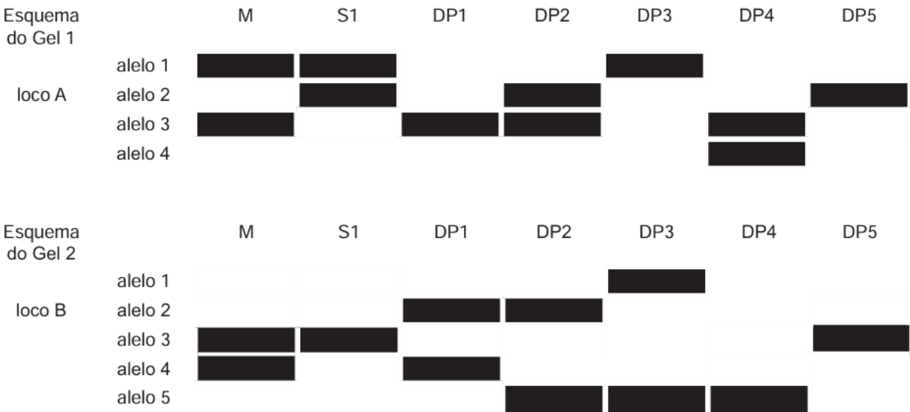

COLLEVATTI, R. G.; TELLES, M. P.; SOARES, T. N. Dispersão do pólen entre pequizeiros: uma atividade para a genética do ensino superior. Genética na Escola, n. 1, 2013 (adaptado).

A progênie S1 recebeu o pólen de qual doadora?

A DP1

B DP2

© DP3

DP4

DP5

#  Questão 131 (H13 | Enem 2016) Dificuldade 619,8

O Brasil possui um grande número de espécies distintas entre animais, vegetais e microrganismos envoltos em uma imensa complexidade e distribuídas em uma grande variedade de ecossistemas.

SANDES, A. R. R.; BLASI, G. Biodiversidade e diversidade química e genética. Disponível em: http://novastecnologias.com.br. Acesso em: 22 set. 2015 (adaptado).

O incremento da variabilidade ocorre em razão da permuta genética, a qual propicia a troca de segmentos entre cromátides não irmãs na meiose.

Essa troca de segmentos é determinante na

A produção de indivíduos mais férteis.

B transmissão de novas características adquiridas.

recombinação genética na formação dos gametas.

D ocorrência de mutações somáticas nos descendentes.

E variação do número de cromossomos característico da espécie.

#  Questão 132 (H13 | Enem 2022) Dificuldade 646,7

Na figura está representado o mosaicismo em função da inativação aleatória de um dos cromossomos X, que ocorre em todas as mulheres sem alterações patológicas.

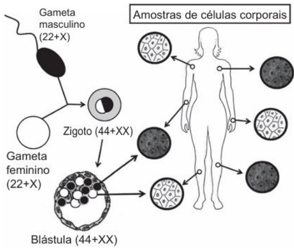

● Células com cromossomo X paterno inativado

O Células com cromossomo X materno inativado

Entre mulheres heterozigotas para doenças determinadas por genes recessivos ligados ao sexo, essa inativação tem como consequência a ocorrência de

A pleiotropia.

B mutação gênica.

interação gênica.

D penetrância incompleta.

E expressividade variável.

#  Questão 133 (H13 | Enem 2020) Dificuldade 665,3

Uma população encontra-se em equilíbrio genético quanto ao sistema ABO, em que 25% dos indivíduos pertencem ao grupo O e 16%, ao grupo A homozigotos. Considerando que: p = frequência de l$^{A}$; q = frequência de l$^{B}$; e r = frequência de i, espera-se encontrar:

| Grupo | Genótipos | Frequências |
| --- | --- | --- |
| A | $ \mathbb{A}^{\mathbb{A}}\text{e}\mathbb{I}^{\mathbb{A}}\text{i} $ | $p^{2}$ + 2pr |
| B | $ \mathbb{B}^{\mathbb{B}}\mathbb{e}\mathbb{I}^{\mathbb{B}\mathbb{i}} $ | $q^{2}$ + 2qr |
| AB | $ \mathbb{A}\mathbb{B} $ | 2pq |
| O | ii | $r^{2}$ |

A porcentagem de doadores compatíveis para alguém do grupo B nessa população deve ser de

A 11%.

B 19%.

  26%.

D 36%.

E 60%.

#  Questão 134 (H13 | Enem 2019) Dificuldade 719,8

Com base nos experimentos de plantas de Mendel, foram estabelecidos três princípios básicos, que são conhecidos como leis da uniformidade, segregação e distribuição independente. A lei da distribuição independente refere-se ao fato de que os membros de pares diferentes de genes segregam-se independentemente, uns dos outros, para a prole.

TURNPENNY, P. D. Genética médica. Rio de Janeiro: Elsevier, 2009 (adaptado).

Hoje, sabe-se que isso nem sempre é verdade. Por quê?

A A distribuição depende do caráter de dominância ou recessividade do gene.

B Os organismos nem sempre herdam cada um dos genes de cada um dos genitores.

© As alterações cromossômicas podem levar a falhas na segregação durante a meiose.

D Os genes localizados fisicamente próximos no mesmo cromossomo tendem a ser herdados juntos.

E O cromossomo que contém dois determinados genes pode não sofrer a disjunção na primeira fase da meiose.

##  Questão 135 (H13 | Enem 2020) Anulada pela TRI

Os diferentes tipos de café que consumimos nem sempre vêm da mesma espécie de planta. As duas espécies de café mais utilizadas são Coffea canephora e Coffea arabica. A primeira é diploide (2n = 22) e a segunda é tetraploide (2n = 44). Acredita-se que a espécie tetraploide surgiu de um cruzamento natural entre C. canephora e C. eugenioides, ambas diploides, há milhões de anos. De fato, as análises genéticas atuais nos cromossomos de C. arabica detectam os alelos de ambas as origens.

A alteração cromossômica que poderia explicar o surgimento do café da espécie C. arabica é

A Duplicação em uma das plantas parentais antes do cruzamento.

B Inversão durante a meio gamética em ambas as plantas parentais.

Separação desigual na meiose gamética de uma das plantas parentais.

D Falha na separação durante a meiose gamética em ambas as plantas parentais.

E Deleções durante as primeiras mitoses zigóticas na planta descendente C. arabica.

#  Competência 4

Compreender interações entre organismos e ambiente, em particular aquelas relacionadas à saúde humana, relacionando conhecimentos científicos, aspectos culturais e características individuais.

#  Habilidade 14

Identificar padrões em fenômenos e processos vitais dos organismos, como manutenção do equilíbrio interno, defesa, relações com o ambiente, sexualidade, entre outros.

##  Questão 136 (H14 | Enem 2019) Dificuldade 488,0

Na piscicultura, costumam-se usar larvas de Artemia (crustáceo) para alimentar larvas de peixes. Ovos de Artemia são colocados em garrafas com água salgada e, sob condições ótimas de temperatura, luz e oxigênio, eles eclodem, liberando suas larvas, também conhecidas como náuplios. Para recolher os náuplios, coloca-se uma lâmpada branca fluorescente na boca da garrafa e estes começam a subir em direção ao gargalo.

Esse comportamento das artêmias é chamado de

A geotropismo positivo.

B fototropismo positivo.

C hidrotropismo negativo.

D termotropismo negativo.

E quimiotropismo negativo.

##  Questão 137 (H14 | Enem 2016) Dificuldade 556,1

Portadores de diabetes insipidus reclamam da confusão feita pelos profissionais da saúde quanto aos dois tipos de diabetes: mellitus e insipidus. Enquanto o primeiro tipo está associado aos níveis ou à ação da insulina, o segundo não está ligado à deficiência desse hormônio. O diabetes insipidus é caracterizado por um distúrbio na produção ou no funcionamento do hormônio antidiurético (na sigla em inglês, ADH), secretado pela neuro-hipófise para controlar a reabsorção de água pelos túbulos renais.

Tendo em vista o papel funcional do ADH, qual é um sintoma clássico de um paciente acometido por diabetes insipidus?

A Alta taxa de glicose no sangue.

Ⓑ Aumento da pressão arterial.

Ganho de massa corporal.

D Anemia crônica.

E Desidratação.

###  Questão 138 (H14 | Enem 2022) Dificuldade 556,7

Em 2002, foi publicado um artigo científico que relacionava alterações na produção de hormônios sexuais de sapos machos expostos à atrazina, um herbicida, com o desenvolvimento anômalo de seus caracteres sexuais primários e secundários. Entre os animais sujeitos à contaminação, observaram-se casos de hermafroditismo e desmasculinização da laringe. O estudo em questão comparou a concentração de um hormônio específico no sangue de machos expostos ao agrotóxico com a de outros machos e fêmeas que não o foram (controles). Os resultados podem ser vistos na figura.

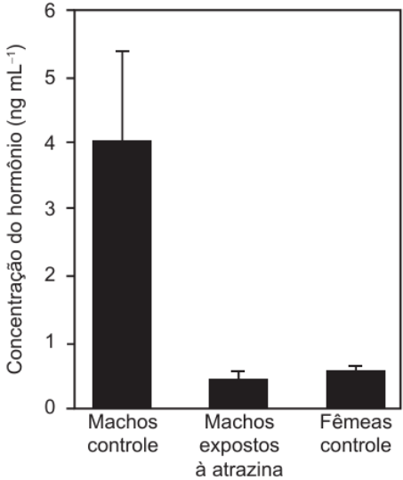

HAYES, T. B. et al. Hermaphroditic, Demasculinized Frogs After Exposure to the Herbicide Atrazine at Low Ecologically Relevant Doses. Proceedings of the National Academy of Sciences, n. 8, 2002 (adaptado).

Com base nas informações do texto, qual é o hormônio cujas concentrações estão representadas na figura?

A Estrogênio.

B Feromônio.

© Testosterona.

D Somatotrofina.

E Hormônio folículo estimulante.

#  Questão 139 (H14 | Enem 2020) Dificuldade 562,4

Grupos de proteção ao meio ambiente conseguem resgatar muitas aves aquáticas vítimas de vazamentos de petróleo. Essas aves são lavadas com água e detergente neutro para a retirada completa do óleo de seu corpo e, posteriormente, são aquecidas, medicadas, desintoxicadas e alimentadas. Mesmo após esses cuidados, o retorno ao ambiente não pode ser imediato, pois elas precisam recuperar a capacidade de flutuação.

Para flutuar, essas aves precisam

A recuperar o tônus muscular.

B restaurar a massa corporal.

ⓒ substituir as penas danificadas.

D restablecer a capacidade de homeotermia.

E refazer a camada de cera impermeabilizante das penas.

#  Questão 140 (H14 | Enem 2017) Dificuldade 593,0

A reação em cadeia da polimerase (PCR, na sigla em inglês) é uma técnica de biologia molecular que permite replicação in vitro do DNA de forma rápida. Essa técnica surgiu na década de 1980 e permitiu avanços científicos em todas as áreas de investigação genômica. A dupla hélice é estabilizada por ligações hidrogênio, duas entre as bases adenina (A) e timina (T) e três entre as bases guanina (G) e citosina (C). Inicialmente, para que o DNA possa ser replicado, a dupla hélice precisa ser totalmente desnaturada (desenrolada) pelo aumento da temperatura, quando são desfeitas as ligações hidrogênio entre as diferentes bases nitrogenadas.

Qual dos segmentos de DNA será o primeiro a desnaturar totalmente durante o aumento da temperatura na reação de PCR?

A 

B 

ⓒ 

Ⓓ 

E 

##  Questão 141 (H14 | Enem 2016) Dificuldade 637,9

A figura ilustra o movimento da seiva xilêmica em uma planta.

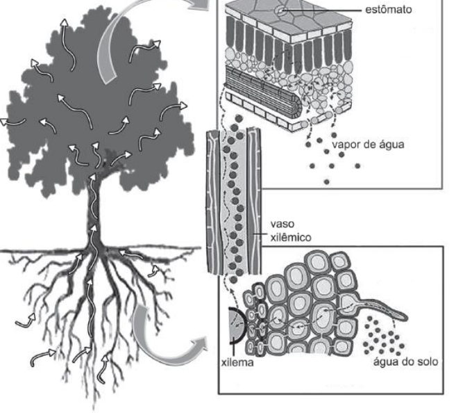

CORREIA, S. Teoria da tensão-coesão-adesão. Revista de Ciência Elementar, n. 1, 2014 (adaptado).

Mesmo que essa planta viesse a sofrer ação contínua do vento e sua copa crescesse voltada para baixo, essa seiva continuaria naturalmente seu percurso.

O que garante o transporte dessa seiva é a

A gutação.

B gravidade.

C respiração.

D fotossíntese.

E transpiração.

#  Questão 142 (H14 | Enem 2018) Dificuldade 638,2

Para serem absorvidos pelas células do intestino humano, os lipídios ingeridos precisam ser primeiramente emulsificados. Nessa etapa da digestão, torna-se necessária a ação dos ácidos biliares, visto que os lipídios apresentam uma natureza apolar e são insolúveis em água.

Esses ácidos atuam no processo de modo a

A hidrolisar os lipídios.

Ⓑagir como detergentes.

© tornar os lipídios anfílicos.

promover a secreção de lipases.

E estimular o trânsito intestinal dos lipídios.

#  Questão 143 (H14 | Enem 2018) Dificuldade 654,5

Anabolismo e catabolismo são processos celulares antagônicos, que são controlados principalmente pela ação hormonal. Por exemplo, no fígado a insulina atua como um hormônio com ação anabólica, enquanto o glucagon tem ação catabólica e ambos são secretados em resposta ao nível de glicose sanguínea.

Em caso de um indivíduo com hipoglicemia, o hormônio citado que atua no catabolismo induzirá o organismo a

A realizar a fermentação láica.

B metabolizar aerobicamente a glicose.

© produzir aminoácidos a partir de ácidos graxos.

D transformar ácidos graxos em glicogênio.

E estimular a utilização do glicogênio.

#  Questão 144 (H14 | Enem 2021) Dificuldade 665,7

Um dos exames clínicos mais tradicionais para medir a capacidade reflexa dos indivíduos é o exame do reflexo patelar. Esse exame consiste na estimulação da patela, um pequeno osso localizado na parte anterior da articulação do joelho, com um pequeno martelo. A resposta reflexa ao estímulo é caracterizada pelo levantamento da perna em que o estímulo foi aplicado.

Qual região específica do sistema nervoso coordena essa resposta?

A Ponte.

B Medula.

Cerebelo.

D Hipotálamo.

E Neuro-hipófise.

##  Questão 145 (H14 | Enem 2017) Dificuldade 667,2

A retina é um tecido sensível à luz, localizado na parte posterior do olho, onde ocorre o processo de formação de imagem. Nesse tecido, encontram-se vários tipos celulares específicos. Um desses tipos celulares são os cones, os quais convertem os diferentes comprimentos de onda da luz visível em sinais elétricos, que são transmitidos pelo nervo óptico até o cérebro.

Disponível em: www.portaldaretina.com.br. Acesso em: 13 jun. 2012
(adaptado).

Em relação à visão, a degeneração desse tipo celular irá

A comprometer a capacidade de visão em cores.

B impedir a projeção dos raios luminosos na retina.

* provocar a formação de imagens invertidas na retina.

Ⓓ causar dificuldade de visualização de objetos próximos.

E acarretar a perda da capacidade de alterar o diâmetro da pupila.

#  Questão 146 (H14 | Enem 2022) Dificuldade 750,1

Antimicrobianos são substâncias naturais ou sintéticas que têm capacidade de matar ou inibir o crescimento de microrganismos. A tabela apresenta uma lista de antimicrobianos hipotéticos, bem como suas ações e efeitos sobre o metabolismo microbiano.

| Antimicrobiano | Ação | Efeito |
| --- | --- | --- |
| 1 | Une-se aos ribossomos | Impede a síntese proteica |
| 2 | Une-se aos microtúbulos | Impede a segregação das cromátides |
| 3 | Une-se aos fosfolipídeos da membrana plasmática | Reduz a permeabilidade da membrana plasmática |
| 4 | Interfere na síntese de timina | Inibe a síntese de DNA |
| 5 | Interfere na síntese de uracila | Impede a síntese de RNA |

Qual dos antimicrobianos deve ser utilizado para curar uma infecção causada por um fungo sem afetar as bactérias da microbiota normal do organismo?

A 1

B 2

© 3

Ⓟ 4

E 5

#  Questão 147 (H14 | Enem 2021) Dificuldade 881,5

Durante o desenvolvimento embrionário humano ocorre uma comunicação entre os átrios direito e esquerdo através do forame oval (ou forame de Botal). Essa comunicação não causa prejuízos à circulação do bebê em formação, exceto se ela perdurar após o nascimento.

Os prejuízos no período embrionário são evitados porque a circulação fetal se assemelha à dos(as)

A aves, porque a pequena circulação e a grande circulação estão presentes.

B répteis, porque a mistura de sangue é minimizada por um metabolismo lento.

crocodilianos, porque a separação dos ventrículos impede a mistura sanguínea.

peixes, porque a circulação é simples, ocorrendo uma passagem única pelo coração.

E anfíbios, porque pressões diferenciais isolam temporalmente o sangue venoso do arterial.

#  Competência 4

Compreender interações entre organismos e ambiente, em particular aquelas relacionadas à saúde humana, relacionando conhecimentos científicos, aspectos culturais e características individuais.

#  Habilidade 15

Interpretar modelos e experimentos para explicar fenômenos ou processos biológicos em qualquer nível de organização dos sistemas biológicos.

##  Questão 148 (H15 | Enem 2020) Dificuldade 512,8

O exame parasitológico de fezes é utilizado para detectar ovos de parasitos. Um dos métodos utilizados, denominado de centrífugo-flutuação, considera a densidade dos ovos em relação a uma solução de densidade 1,15 g mL⁻$^{1}$. Assim, ovos que flutuam na superfície dessa solução são detectados. Os dados de densidade dos ovos de alguns parasitos estão apresentados na tabela.

| Parasito | Densidade (g $mL^{-1})$ |
| --- | --- |
| Ancylostoma | 1,06 |
| Ascaris lumbricoides | 1,11 |
| Ascaris suum | 1,13 |
| Schistosoma mansoni | 1,18 |
| Taenia saginata | 1,30 |

ZERBINI, A. M. Identificação e análise de viabilidade de ovos de helmintos em um sistema de tratamento de esgotos domésticos constituídos de reatores anaeróbios e rampas de escoamento superficial. Belo Horizonte: Prosab, 2001 (adaptado)

Considerando-se a densidade dos ovos e da solução, ovos de quais parasitos podem ser detectados por esse método?

A. lumbricoides, A. suum e S. mansoni.

Ⓑ S. mansoni, T. saginata e Ancylostoma.

Ancylostoma, A. lumbricoides e A. suum.

D T. saginata, S. mansoni e A. lumbricoides.

E A. lumbricoides, A. suum e T. saginata.

##  Questão 149 (H15 | Enem 2018) Dificuldade 544,9

No ciclo celular atuam moléculas reguladoras. Dentre elas, a proteína p53 é ativada em resposta a mutações no DNA, evitando a progressão do ciclo até que os danos sejam reparados, ou induzindo a célula à autodestruição.

ALBERTS, B. et al. Fundamentos da biologia celular. Porto Alegre: Artmed, 2011 (adaptado).

A ausência dessa proteína poderá favorecer a

A redução da síntese de DNA, acelerando o ciclo celular.

B saída imediata do ciclo celular, antecipando a proteção do DNA.

© ativação de outras proteínas reguladoras, induzindo a apoptose.

D manutenção da estabilidade genética, favorecendo a longevidade.

E proliferação celular exagerada, resultando na formação de um tumor.

###  Questão 150 (H15 | Enem 2019) Dificuldade 597,9

A fluidez da membrana celular é caracterizada pela capacidade de movimento das moléculas componentes dessa estrutura. Os seres vivos mantêm essa propriedade de duas formas: controlando a temperatura e/ou alterando a composição lipídica da membrana. Neste último aspecto, o tamanho e o grau de insaturação das caudas hidrocarbônicas dos fosfolipídios, conforme representados na figura, influenciam significativamente a fluidez. Isso porque quanto maior for a magnitude das interações entre os fosfolipídios, menor será a fluidez da membrana.

Representação simplificada da estrutura de um fosfolipídio

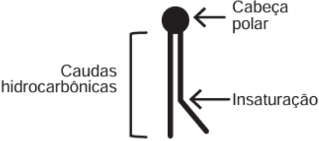

Assim, existem bicamadas lipídicas com diferentes composições de fosfolipídios, como as mostradas de la V.

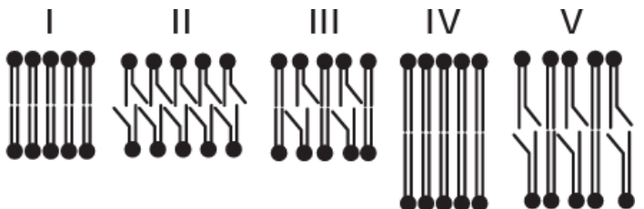

Qual das bicamadas lipídicas apresentadas possui maior fluidez?

A I

B II

C III

D IV

E V

#  Questão 151 (H15 | Enem 2021) Dificuldade 612,8

A sequência de nucleotídeos do RNA mensageiro, presentes em um gene de um fungo, constituída de sete códons, está escrita a seguir.

| 1 | 2 | 3 | 4 | 5 | 6 | 7 |
| --- | --- | --- | --- | --- | --- | --- |
| AUG | UUU | GUU | CAA | UGU | AGU | UAG |

Pesquisadores submeteram a sequência a mutações independentes. Sabe-se que os códons UAG e UAA são terminais, ou seja, indicam a interrupção da tradução.

Qual mutação produzirá a menor proteína?

A Deleção de G no códon 3.

B Substituição de C por U no códon 4.

© Substituição de G por C no códon 6.

D Substituição de A por G no códon 7.

E Deleção dos dois primeiros nucleotídeos no códon 5.

#  Questão 152 (H15 | Enem 2016) Dificuldade 614,5

As proteínas de uma célula eucariótica possuem peptídeos sinais, que são sequências de aminoácidos responsáveis pelo seu endereçamento para as diferentes organelas, de acordo com suas funções. Um pesquisador desenvolveu uma nanopartícula capaz de carregar proteínas para dentro de tipos celulares específicos. Agora ele quer saber se uma nanopartícula carregada com uma proteína bloqueadora do ciclo de Krebs in vitro é capaz de exercer sua atividade em uma célula cancerosa, podendo cortar o aporte energético e destruir essas células.

Ao escolher essa proteína bloqueadora para carregar as nanopartículas, o pesquisador deve levar em conta um peptídeo sinal de endereçamento para qual organela?

A Núcleo.

B Mitocôndria.

C Peroxissomo.

Ⓓ Complexo golgiense.

E Retículo endoplasmático.

##  Questão 153 (H15 | Enem 2016) Dificuldade 649,1

Um pesquisador investigou o papel da predação por peixes na densidade e tamanho das presas, como possível controle de populações de espécies exóticas em costões rochosos. No experimento colocou uma tela sobre uma área da comunidade, impedindo o acesso dos peixes ao alimento, e comparou o resultado com uma área adjacente na qual os peixes tinham acesso livre. O quadro apresenta os resultados encontrados após 15 dias de experimento.

| Espécie exótica | Área com tela | Área com tela | Área sem tela | Área sem tela |
| --- | --- | --- | --- | --- |
| Espécie exótica | Densidade (indivíduos/ m²) | Tamanho médio dos indivíduos (cm) | Densidade (indivíduos/ m²) | Tamanho médio dos indivíduos (cm) |
| Alga | 100 | 15 | 110 | 18 |
| Craca | 300 | 2 | 150 | 1,5 |
| Mexilhão | 380 | 3 | 200 | 6 |
| Ascídia | 55 | 4 | 58 | 3,8 |

O pesquisador concluiu corretamente que os peixes controlam a densidade dos(as)

A algas, estimulando seu crescimento.

B cracas, predando especialmente animais pequenos.

© mexilhões, predando especialmente animais pequenos.

D quatro espécies testadas, predando indivíduos pequenos.

E ascídias, apesar de não representarem os menores organismos.

#  Questão 154 (H15 | Enem 2022) Dificuldade 649,4

As células da epiderme da folha da Tradescantia pallida purpurea, uma herbácea popularmente conhecida como trapoeraba-roxa, contém um vacúolo onde se encontra um pigmento que dá a coloração arroxeada a esse tecido. Em um experimento, um corte da epiderme de uma folha da trapoeraba-roxa foi imerso em ambiente hipotônico e, logo em seguida, foi colocado em uma lâmina e observado em microscópio óptico.

Durante a observação desse corte, foi possível identificar o(a)

A acúmulo do solvente com fragmentação da organela.

B rompimento da membrana celular com liberação do citosol.

aumento do vacúolo com diluição do pigmento no seu interior.

quebra da parede celular com extravasamento do pigmento.

E murchamento da célula com expulsão do pigmento do vacúolo.

#  Questão 155 (H15 | Enem 2022) Dificuldade 652,8

Em uma aula prática de bioquímica, para medir a atividade catalítica da enzima catalase, foram realizados seis ensaios independentes, nas mesmas condições, variando-se apenas a temperatura. A catalase decompõe o peróxido de hidrogênio ($H_2O_2$), produzindo água e oxigênio. Os resultados dos ensaios estão apresentados no quadro.

| Ensaio | Temperatura (°C) | Resultado |
| --- | --- | --- |
| Ensaio | Temperatura (°C) | Decomposição de $H_{2}O_{2}$ (10$^{-12}$ mol/min) |
| 1 | 10 | 8,0 |
| 2 | 15 | 10,5 |
| 3 | 20 | 9,5 |
| 4 | 25 | 5,0 |
| 5 | 30 | 3,6 |
| 6 | 35 | 3,1 |

Os diferentes resultados dos ensaios justificam-se pelo(a)

A variação do pH do meio.

B aumento da energia de ativação.

consumo da enzima durante o ensaio.

D diminuição da concentração do substrato.

E modificação da estrutura tridimensional da enzima.

#  Questão 156 (H15 | Enem 2017) Dificuldade 692,5

Visando explicar uma das propriedades da membrana plasmática, fusionou-se uma célula de camundongo com uma célula humana, formando uma célula híbrida. Em seguida, com o intuito de marcar as proteínas de membrana, dois anticorpos foram inseridos no experimento, um específico para as proteínas de membrana do camundongo e outro para as proteínas de membrana humana. Os anticorpos foram visualizados ao microscópio por meio de fluorescência de cores diferentes.

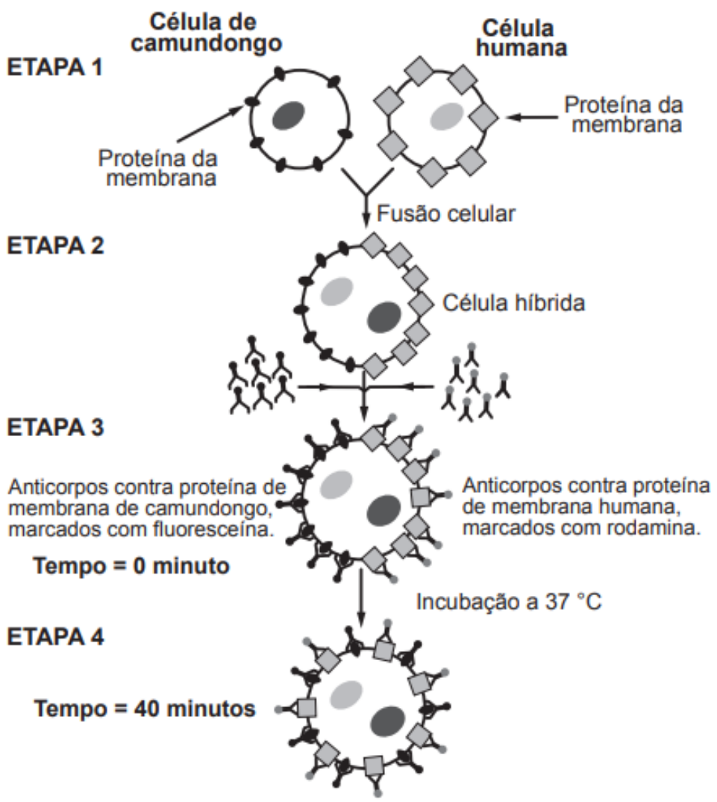

ALBERTS, B. et al. Biologia molecular da célula. Porto Alegre: Artes Médicas, 1997 (adaptado).

A mudança observada da etapa 3 para a etapa 4 do experimento ocorre porque as proteínas

A movimentam-se livremente no plano da bicamada lipídica.

B permanecem confinadas em determinadas regiões da bicamada.

© auxiliam o deslocamento dos fosfolipídios da membrana plasmática.

são mobilizadas em razão da inserção de anticorpos.

E são bloqueadas pelos anticorpos.

#  Competência 4

Compreender interações entre organismos e ambiente, em particular aquelas relacionadas à saúde humana, relacionando conhecimentos científicos, aspectos culturais e características individuais.

#  Habilidade 16

Compreender o papel da evolução na produção de padrões, processos biológicos ou na organização taxonômica dos seres vivos.

##  Questão 157 (H16 | Enem 2021) Dificuldade 476,6

Estudo aponta que a extinção de preguiças-gigantes, cuja base da dieta eram frutos e sementes, provocou impactos consideráveis na vegetação do Pantanal brasileiro. A flora, embora não tenha desaparecido, tornou-se menos abundante que no passado, além de ocupar áreas mais restritas.

BICUDO, F. Jardineiros da pesada. Ecologia. Pesquisa Fapesp, ed. 231, maio 2015 (adaptado).

O evento descrito com a flora ocorreu em razão da redução

A da produção de flores.

Ⓑdo tamanho das plantas.

© de fatores de disseminação das sementes.

D da quantidade de sementes por fruto.

E dos hábitats disponíveis para as plantas.

##  Questão 158 (H16 | Enem 2020) Dificuldade 572,0

Uma população (momento A) sofre isolamento em duas subpopulações (momento B) por um fator de isolamento (I). Passado um tempo, essas subpopulações apresentam características fenotípicas e genotípicas que as distinguem (momento C), representadas na figura pelas tonalidades de cor. O posterior desaparecimento do fator de isolamento I pode levar, no momento D, às situações D1 e D2.

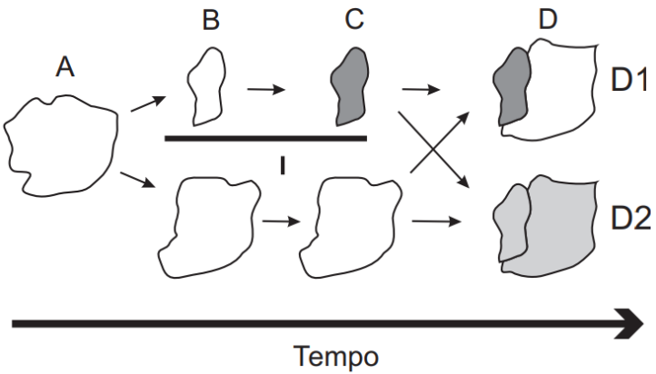

A representação indica que, no momento D, na situação

A D1 ocorre um novo fator de isolamento geográfico.

B D1 existe uma única população distribuída em gradiente.

© D1 ocorrem duas populações separadas por isolamento reprodutivo.

D D2 coexistem duas populações com características fenotípicas distintas.

E D2 foram preservadas as mesmas características fenotípicas da população original A.

##  Questão 159 (H16 | Enem 2016) Dificuldade 574,7

Apesar da grande diversidade biológica, a hipótese de que a vida na Terra tenha tido uma única origem comum é aceita pela comunidade científica. Uma evidência que apoia essa hipótese é a observação de processos biológicos comuns a todos os seres vivos atualmente existentes.

Um exemplo de tal processo é o(a)

A desenvolvimento embrionário.

B reprodução sexuada.

C respiração aeróbica.

D excreção urinária.

E síntese proteica.

#  Questão 160 (H16 | Enem 2022) Dificuldade 591,1

Desde a proposição da teoria de seleção natural por Darwin, os seres vivos nunca mais foram olhados da mesma forma. No que diz respeito à reprodução de anfíbios anuros, os cientistas já descreveram diferentes padrões reprodutivos, como os exemplificados a seguir:

Espécie 1 – As fêmeas produzem cerca de 5 000 gametas, que são fecundados na água, em lagoas temporárias de estação chuvosa. Todo o desenvolvimento embrionário, do ovo à metamorfose, ocorre, nesse ambiente, independente dos pais.

Espécie 2 – As fêmeas produzem aproximadamente 200 gametas, que são depositados em poças próximas a corpos-d'água. Os embriões são vigiados pelos machos durante boa parte do seu desenvolvimento.

Espécie 3 – As fêmeas produzem por volta de 20 gametas, que são fecundados sobre a superfície das folhas de plantas cujos galhos estão dispostos acima da superfície de corpos-d'água e aí se desenvolvem até a eclosão.

Espécie 4 – As fêmeas produzem poucos gametas que, quando fecundados, são “abocanhados” pelos machos. Os embriões se desenvolvem no interior do saco vocal do macho até a metamorfose, quando saem através da boca do pai.

Os padrões descritos evidenciam que

A as fêmeas influenciam o comportamento dos machos.

o cuidado parental é necessário para o desenvolvimento.

o grau de evolução determina o comportamento reprodutivo.

o sucesso reprodutivo pode ser garantido por estratégias diferentes.

o ambiente induz modificação na produção do número de gametas femininos.

#  Questão 161 (H16 | Enem 2018) Dificuldade 642,4

Insetos podem apresentar três tipos de desenvolvimento. Um deles, a holometabolia (desenvolvimento completo), é constituído pelas fases de ovo, larva, pupa e adulto sexualmente maduro, que ocupam diversos hábitats. Os insetos com holometabolia pertencem às ordens mais numerosas em termos de espécies conhecidas.

Esse tipo de desenvolvimento está relacionado a um maior número de espécies em razão da

A proteção na fase de pupa, favorecendo a sobrevivência de adultos férteis.

B produção de muitos ovos, larvas e pupas, aumentando o número de adultos.

© exploração de diferentes nichos, evitando a competição entre as fases da vida.

D ingestão de alimentos em todas as fases de vida, garantindo o surgimento do adulto.

E utilização do mesmo alimento em todas as fases, otimizando a nutrição do organismo.

#  Questão 162 (H16 | Enem 2019) Dificuldade 670,5

Durante sua evolução, as plantas apresentaram grande diversidade de características, as quais permitiram sua sobrevivência em diferentes ambientes. Na imagem, cinco dessas características estão indicadas por números.

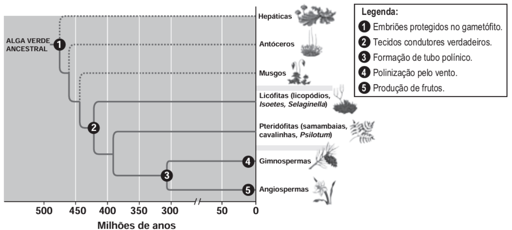

CAMPBELL, N. et al. Biologia. São Paulo: Artmed, 2010 (adaptado).

A aquisição evolutiva que permitiu a conquista definitiva do ambiente terrestre pelas plantas está indicada pelo número

A 1

B 2

  3

D 4

E 5

#  Questão 163 (H16 | Enem 2021) Dificuldade 676,5

Entre 2014 e 2016, as regiões central e oeste da África sofreram uma grave epidemia de febre hemorrágica causada pelo vírus ebola, que se manifesta em até 21 dias após a infecção e cuja taxa de letalidade (enfermos que vão a óbito) pode chegar a 90%. Em regiões de clima tropical e subtropical, um outro vírus também pode causar febre hemorrágica: o vírus da dengue, que, embora tenha período de incubação menor (até 10 dias), apresenta taxa de letalidade abaixo de 1%.

Disponível em: www.who.int. Acesso em: 1 fev. 2017 (adaptado).

Segundo as informações do texto e aplicando princípios de evolução biológica às relações do tipo patógeno-hospedeiro, qual dos dois vírus infecta seres humanos há mais tempo?

A Ebola, pois o maior período de incubação reflete duração mais longa do processo de coevolução patógenohospedeiro.

Ⓑ Dengue, pois o menor período de incubação reflete duração mais longa do processo de coevolução patógenohospedeiro.

Ebola, cuja alta letalidade indica maior eficiência do vírus em parasitar seus hospedeiros, estabelecida ao longo de sua evolução.

Ebola, cujos surtos epidêmicos concentram-se no continente africano, reconhecido como berço da origem evolutiva dos seres humanos.

Dengue, cuja baixa letalidade indica maior eficiência do vírus em parasitar seus hospedeiros, estabelecida ao longo da coevolução patógeno-hospedeiro.

#  Questão 164 (H16 | Enem 2021) Dificuldade 687,9

Nas angiospermas, além da fertilização da oosfera, existe uma segunda fertilização que resulta num tecido triploide.

Essa segunda fertilização foi importante evolutivamente, pois viabilizou a formação de um tecido de

A nutrição para o fruto.

B reserva para o embrião.

© revestimento para a semente.

D proteção para o megagametófito.

E vascularização para a planta jovem.

#  Questão 165 (H16 | Enem 2017) Dificuldade 703,2

A classificação biológica proposta por Whittaker permite distinguir cinco grandes linhas evolutivas utilizando, como critérios de classificação, a organização celular e o modo de nutrição. Woese e seus colaboradores, com base na comparação das sequências que codificam o RNA ribossômico dos seres vivos, estabeleceram relações de ancestralidade entre os grupos e concluíram que os procariontes do reino Monera não eram um grupo coeso do ponto de vista evolutivo.

| Whittaker (1969)Cinco reinos | Wosee (1990)Três domínios |
| --- | --- |
| Monera | Archaea |
| Monera | Eubacteria |
| Protista | Eukarya |
| Fungi | Eukarya |
| Plantae | Eukarya |
| Animalia | Eukarya |

A diferença básica nas classificações citadas é que a mais recente se baseia fundamentalmente em

A tipos de células.

B aspectos ecológicos.

© relações filogenéticas.

D propriedades fisiológicas.

E características morfológicas.

#  Parte IV

##  Competência 5

#  Competência 5

Entender métodos e procedimentos próprios das ciências naturais e aplicá-los em diferentes contextos.

#  Habilidade 17

Relacionar informações apresentadas em diferentes formas de linguagem e representação usadas nas ciências físicas, químicas ou biológicas, como texto discursivo, gráficos, tabelas, relações matemáticas ou linguagem simbólica.

##  Questão 166 (H17 | Enem 2016) Dificuldade 554,8

O aquecimento de um material por irradiação com micro-ondas ocorre por causa da interação da onda eletromagnética com o dipolo elétrico da molécula. Um importante atributo do aquecimento por micro-ondas é a absorção direta da energia pelo material a ser aquecido. Assim, esse aquecimento é seletivo e dependerá, principalmente, da constante dielétrica e da frequência de relaxação do material. O gráfico mostra a taxa de aquecimento de cinco solventes sob irradiação de micro-ondas.

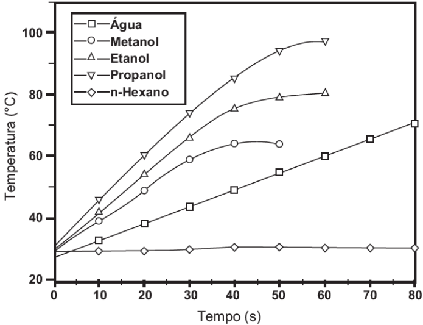

BARBOZA, A. C. R. N. et al. Aquecimento em forno de micro-ondas. Desenvolvimento de alguns conceitos fundamentais. Química Nova, n. 6, 2001 (adaptado).

No gráfico, qual solvente apresenta taxa média de aquecimento mais próxima de zero, no intervalo de 0 s a 40 s?

A $H_2O$

B $CH_3OH$

CH$3CH_2OH$

▶ CH₃CH₂CH₂OH

E $CH_3CH_2CH_2CH_2CH_2CH_3$

#  Questão 167 (H17 | Enem 2022) Dificuldade 596,7

O eixo de rotação da Terra apresenta uma inclinação em relação ao plano de sua órbita em torno do Sol, interferindo na duração do dia e da noite ao longo do ano.

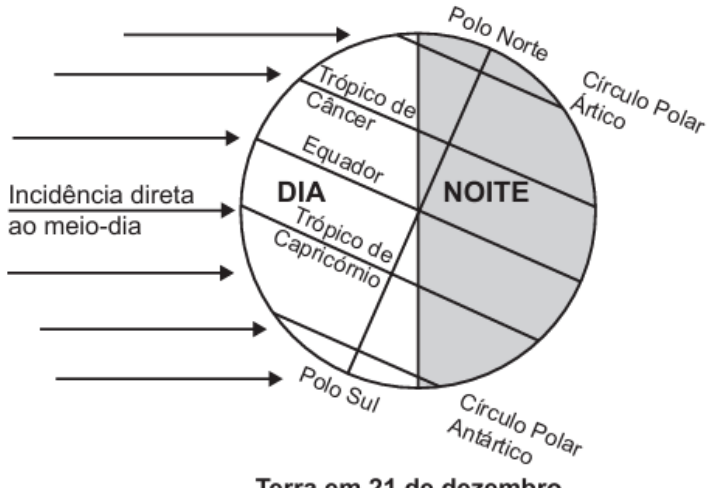

Terra em 21 de dezembro

Uma pessoa instala em sua residência uma placa fotovoltaica, que transforma energia solar em elétrica. Ela monitora a energia total produzida por essa placa em 4 dias do ano, ensolarados e sem nuvens, e lança os resultados no gráfico.

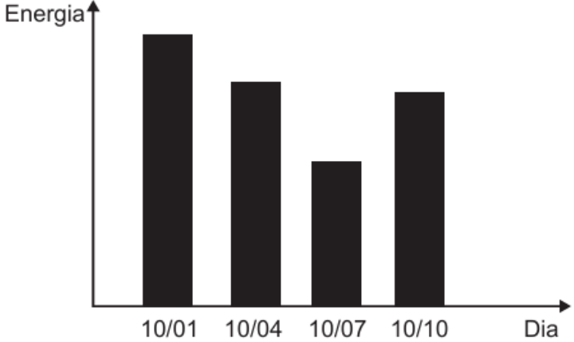

Disponível em: www.fisica.ufpr.br. Acesso em: 27 maio 2022 (adaptado).

Próximo a que região se situa a residência onde as placas foram instaladas?

A Trópico de Capricórnio.

B Trópico de Câncer.

Polo Norte.

D Polo Sul.

E Equador.

#  Questão 168 (H17 | Enem 2022) Dificuldade 601,7

Um grupo de alunos realizou um experimento para observar algumas propriedades dos ácidos, adicionando um pedaço de mármore (CaCO₃) a uma solução aquosa de ácido clorídrico (HCI), observando a liberação de um gás e o aumento da temperatura.

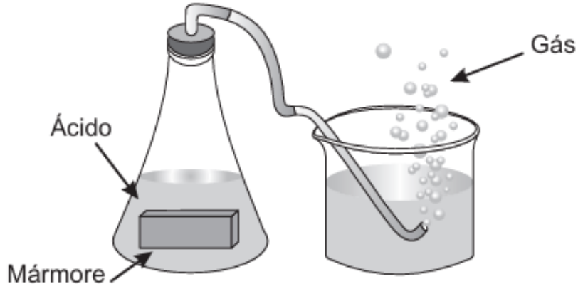

O gás obtido no experimento é c

A $H_2$.

B $O_2$.

ⓒ CO₂.

D CO.

E $Cl_2$

#  Questão 169 (H17 | Enem 2018) Dificuldade 625,8

O processo de formação de novas espécies é lento e repleto de nuances e estágios intermediários, havendo uma diminuição da viabilidade entre cruzamentos. Assim, plantas originalmente de uma mesma espécie que não cruzam mais entre si podem ser consideradas como uma espécie se diferenciando. Um pesquisador realizou cruzamentos entre nove populações — denominadas de acordo com a localização onde são encontradas — de uma espécie de orquídea (Epidendrum denticulatum). No diagrama estão os resultados dos cruzamentos entre as populações. Considere que o doador fornece o pólen para o receptor.

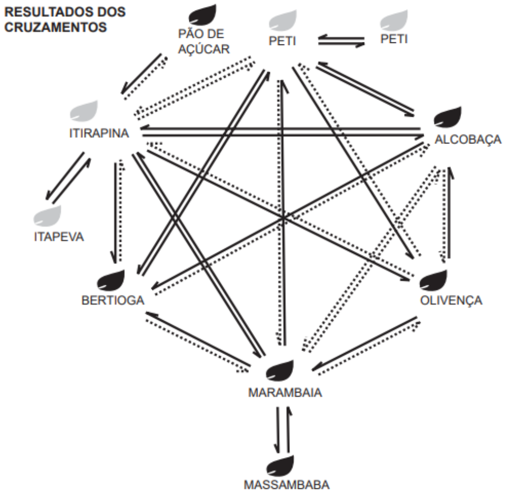

DOADOR → RECEPTOR - Polinização induzida bem-sucedida

DOADOR ...... RECEPTOR - Polinização induzida inviável ou nula

Mata Atlântica  Cerrado

FIORAVANTI, C. Os primeiros passos de novas espécies: plantas e animais se diferenciam por meio de mecanismos surpreendentes. Pesquisa Fapesp, out. 2013 (adaptado).

Em populações de quais localidades se observa um processo de especiação evidente?

A Bertioga e Marambaia; Alcobaça e Olivença.

B Itirapina e Itapeva; Marambaia e Massambaba.

© Itirapina e Marambaia; Alcobaça e Itirapina.

D Itirapina e Peti; Alcobaça e Marambaia.

E Itirapina e Olivença; Marambaia e Peti.

#  Questão 170 (H17 | Enem 2016) Dificuldade 628,0

Os tensoativos são compostos capazes de interagir com substâncias polares e apolares. A parte iônica dos tensoativos interage com substâncias polares, e a parte lipofílica interage com as apolares. A estrutura orgânica de um tensoativo pode ser representada por:

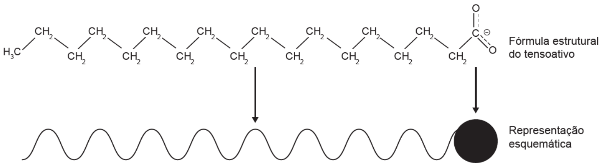

Ao adicionar um tensoativo sobre a água, suas moléculas formam um arranjo ordenado.

Esse arranjo é representado esquematicamente por

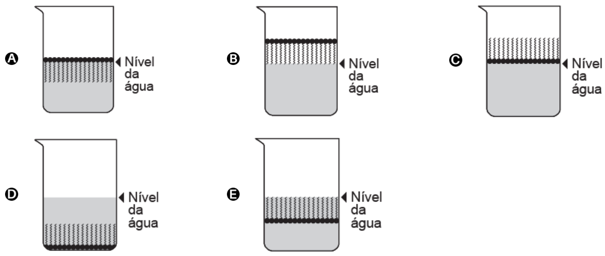

#  Questão 171 (H17 | Enem 2020) Dificuldade 635,7

Um mergulhador fica preso ao explorar uma caverna no oceano. Dentro da caverna formou-se um bolsão de ar, como mostrado na figura, onde o mergulhador se abrigou.

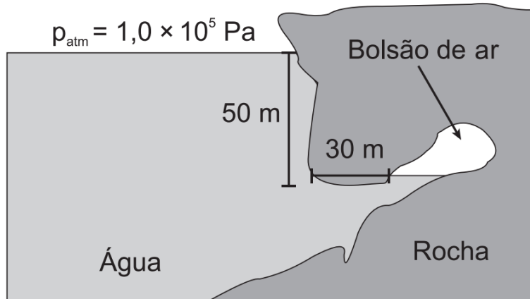

Durante o resgate, para evitar danos a seu organismo, foi necessário que o mergulhador passasse por um processo de descompressão antes de retornar à superfície para que seu corpo ficasse novamente sob pressão atmosférica. O gráfico mostra a relação entre os tempos de descompressão recomendados para indivíduos nessa situação e a variação de pressão.

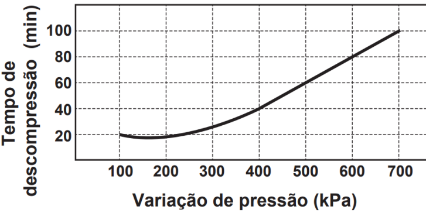

Considere que a aceleração da gravidade seja igual a 10 m s⁻$^{2}$ e que a densidade da água seja de p = 1 000 kg m⁻$^{3}$.

Em minutos, qual é o tempo de descompressão a que o mergulhador deverá ser submetido?

A 100

B 80

©60

D 40

E 20

#  Questão 172 (H17 | Enem 2016) Dificuldade 661,9

A Figura 1 apresenta o gráfico da intensidade, em decibéis (dB), da onda sonora emitida por um alto-falante, que está em repouso, e medida por um microfone em função da frequência da onda para diferentes distâncias: 3 mm, 25 mm, 51 mm e 60 mm. A Figura 2 apresenta um diagrama com a indicação das diversas faixas do espectro de frequência sonora para o modelo de alto-falante utilizado neste experimento.

Figura 1

Resposta de Frequência

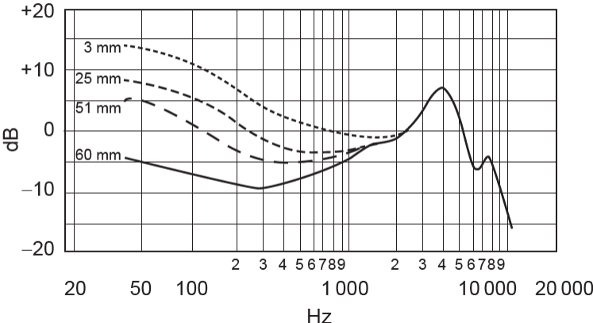

Disponível em: www.batera.com.br. Acesso em: 8 fev. 2015.

Figura 2

Faixas do espectro de frequência sonora

| Subgrave | Grave | Média baixa | Média | Média alta | Aguda |
| --- | --- | --- | --- | --- | --- |
| 20 Hz | 63 Hz | 640 Hz | 6,5 kHz | 5 kHz | 60 kHz |

Disponível em: www.somsc.com.br. Acesso em: 2 abr. 2015.

Relacionando as informações presentes nas figuras 1 e 2, como a intensidade sonora percebida é afetada pelo aumento da distância do microfone ao alto-falante?

A Aumenta na faixa das frequências médias.

B Diminui na faixa das frequências agudas.

Diminui na faixa das frequências graves.

D Aumenta na faixa das frequências médias altas.

Aumenta na faixa das frequências médias baixas.

#  Questão 173 (H17 | Enem 2017) Dificuldade 665,6

Dispositivos eletrônicos que utilizam materiais de baixo custo, como polímeros semicondutores, têm sido desenvolvidos para monitorar a concentração de amônia (gás tóxico e incolor) em granjas avícolas. A polianilina é um polímero semicondutor que tem o valor de sua resistência elétrica nominal quadruplicado quando exposta a altas concentrações de amônia. Na ausência de amônia, a polianilina se comporta como um resistor ôhmico e a sua resposta elétrica é mostrada no gráfico.

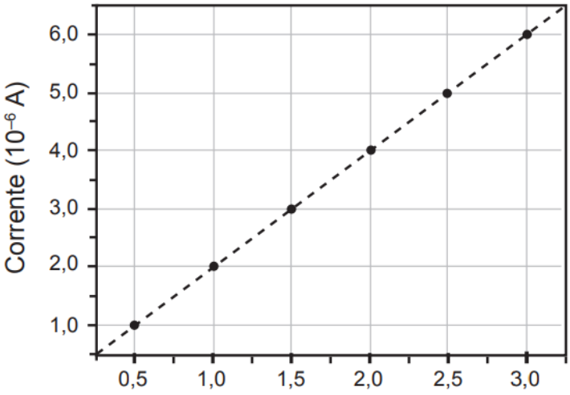

Diferença de potencial (V)

O valor da resistência elétrica da polianilina na presença de altas concentrações de amônia, em ohm, é igual a

A $0.5\times 10^0$ B $2.0\times 10^0$   $2.5\times 10^5$  .

D 5,0 $\times 10^5$ E 2,0 $\times 10^6$

#  Questão 174 (H17 | Enem 2021) Dificuldade 666,7

Cientistas da Universidade de New South Wales, na Austrália, demonstraram em 2012 que a Lei de Ohm é válida mesmo para fios finíssimos, cuja área da seção reta compreende alguns poucos átomos. A tabela apresenta as áreas e comprimentos de alguns dos fios construídos (respectivamente com as mesmas unidades de medida). Considere que a resistividade mantém-se constante para todas as geometrias (uma aproximação confirmada pelo estudo).

|  | Área | Comprimento | Resistência elétrica |
| --- | --- | --- | --- |
| Fio 1 | 9 | 312 | R1 |
| Fio 2 | 4 | 47 | R2 |
| Fio 3 | 2 | 54 | R3 |
| Fio 4 | 1 | 106 | R4 |

WEBER, S. B. et al. Ohm's Law Survives to the Atomic Scale. Science, n. 335, jan. 2012 (adaptado).

As resistências elétricas dos fios, em ordem crescente, são

A R1<R2<R3<R4.

Ⓑ R2 < R1 < R3 < R4.

© R2 < R3 < R1 < R4.

Ⓓ R4 < R1 < R3 < R2.

E R4 < R3 < R2 < R1.

##  Questão 175 (H17 | Enem 2019) Dificuldade 667,3

Em 1808, Dalton publicou o seu famoso livro intitulado Um novo sistema de filosofia química (do original A New System of Chemical Philosophy), no qual continha os cinco postulados que serviam como alicerce da primeira teoria atômica da matéria fundamentada no método científico. Esses postulados são numerados a seguir:

1. A matéria é constituída de átomos indivíveis.

2. Todos os átomos de um dado elemento químico são idênticos em massa e em todas as outras propriedades.

3. Diferentes elementos químicos têm diferentes tipos de átomos; em particular, seus átomos têm diferentes massas.

4. Os átomos são indestrutíveis e nas reações químicas mantêm suas identidades.

5. Átomos de elementos combinam com átomos de outros elementos em proporções de números inteiros pequenos para formar compostos.

Após o modelo de Dalton, outros modelos baseados em outros dados experimentais evidenciaram, entre outras coisas, a natureza elétrica da matéria, a composição e organização do átomo e a quantização da energia no modelo atômico.

OXTOBY, D. W.; GILLIS, H. P.; BUTLER, L. J. Principles of Modern Chemistry. Boston: Cengage Learning, 2012 (adaptado).

Com base no modelo atual que descreve o átomo, qual dos postulados de Dalton ainda é considerado correto?

A 1

B 2

© 3

D 4

E 5

#  Questão 176 (H17 | Enem 2018) Dificuldade 673,1

Alguns materiais sólidos são compostos por átomos que interagem entre si formando ligações que podem ser covalentes, iônicas ou metálicas. A figura apresenta a energia potencial de ligação em função da distância interatômica em um sólido cristalino. Analisando essa figura, observa-se que, na temperatura de zero kelvin, a distância de equilíbrio da ligação entre os átomos ($R_0$) corresponde ao valor mínimo de energia potencial. Acima dessa temperatura, a energia térmica fornecida aos átomos aumenta sua energia cinética e faz com que eles oscilem em torno de uma posição de equilíbrio média (círculos cheios), que é diferente para cada temperatura. A distância de ligação pode variar sobre toda a extensão das linhas horizontais, identificadas com o valor da temperatura, de $T_1$ a $T_4$ (temperaturas crescentes).

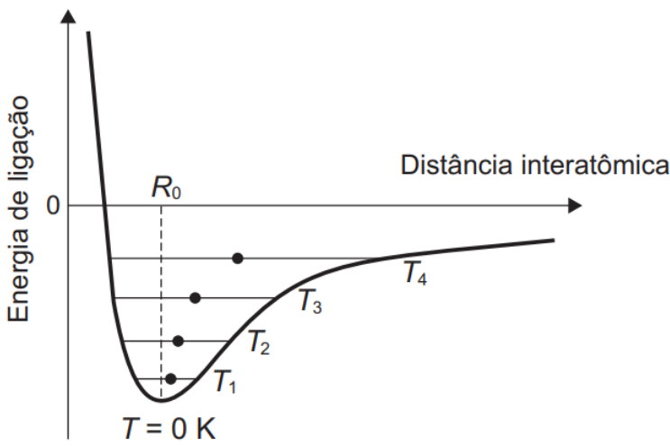

O deslocamento observado na distância média revela o fenômeno da

A ionização.

B dilatação.

© dissociação.

D quebra de ligações covalentes.

E quebra de ligações metálicas.

#  Questão 177 (H17 | Enem 2016) Dificuldade 689,0

A invenção e o acoplamento entre engrenagens revolucionaram a ciência na época e propiciaram a invenção de várias tecnologias, como os relógios. Ao construir um pequeno cronômetro, um relojoeiro usa o sistema de engrenagens mostrado. De acordo com a figura, um motor é ligado ao eixo e movimenta as engrenagens fazendo o ponteiro girar. A frequência do motor é de 18 RPM, e o número de dentes das engrenagens está apresentado no quadro.

| Engrenagem | Dentes |
| --- | --- |
| A | 24 |
| B | 72 |
| C | 36 |
| D | 108 |

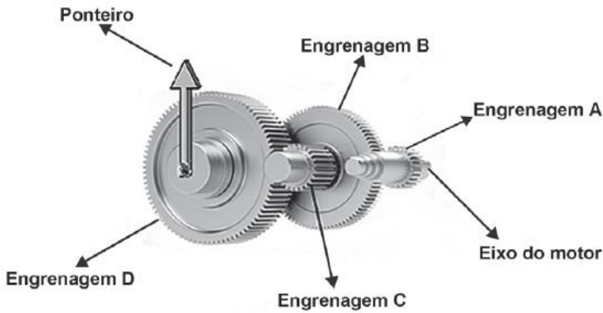

A frequência de giro do ponteiro, em RPM, é

A 1.

B 2.

© 4.

D 81.

E 162.

#  Questão 178 (H17 | Enem 2019) Dificuldade 694,1

Slackline é um esporte no qual o atleta deve se equilibrar e executar manobras estando sobre uma fita esticada. Para a prática do esporte, as duas extremidades da fita são fixadas de forma que ela fique a alguns centímetros do solo. Quando uma atleta de massa igual a 80 kg está exatamente no meio da fita, essa se desloca verticalmente, formando um ângulo de 10° com a horizontal, como esquematizado na figura. Sabe-se que a aceleração da gravidade é igual a 10 m s $^{-2}$, cos(10°) = 0,98 e sen(10°) = 0,17.

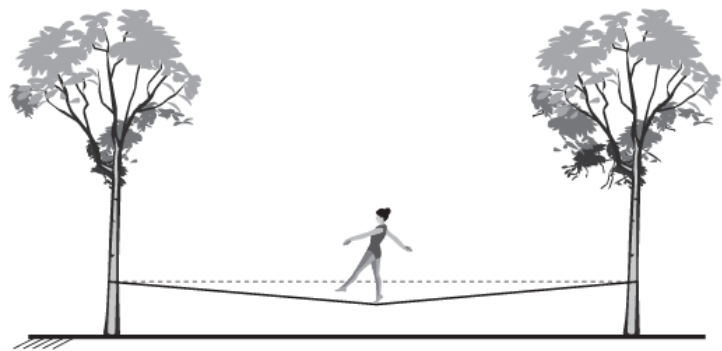

Qual é a força que a fita exerce em cada uma das árvores por causa da presença da atleta?

A 4,0x10^2 N

B 4,1x10^2 N

© 8, $0 \times 10^2$ N

D 2,4x10^3 N

Ⓔ $4,7 \times 10^3$ N

#  Questão 179 (H17 | Enem 2017) Dificuldade 746,9

Em uma linha de transmissão de informações por fibra óptica, quando um sinal diminui sua intensidade para valores inferiores a 10 dB, este precisa ser retransmitido. No entanto, intensidades superiores a 100 dB não podem ser transmitidas adequadamente. A figura apresenta como se dá a perda de sinal (perda óptica) para diferentes comprimentos de onda para certo tipo de fibra óptica.

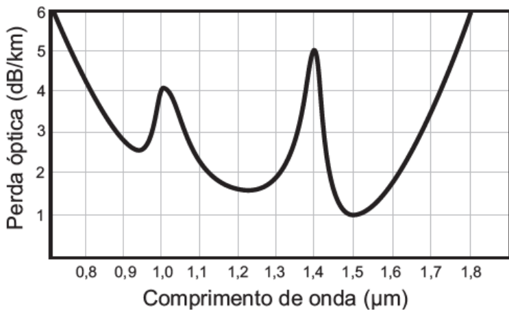

Atenuação e limitações das fibras ópticas. Disponível em: www.gta.ufrj.br. Acesso em: 25 maio 2017 (adaptado).

Qual é a máxima distância, em km, que um sinal pode ser enviado nessa fibra sem ser necessária uma retransmissão?

A 6

B 18

©60

D 90

E 100

#  Competência 5

Entender métodos e procedimentos próprios das ciências naturais e aplicá-los em diferentes contextos.

#  Habilidade 18

Relacionar propriedades físicas, químicas ou biológicas de produtos, sistemas ou procedimentos tecnológicos às finalidades a que se destinam.

Questão 180 (H18 | Enem 2016) Dificuldade 570,4

Em sua formulação, o spray de pimenta contém porcentagens variadas de oleorresina de Capsicum, cujo princípio ativo é a capsaicina, e um solvente (um álcool como etanol ou isopropanol). Em contato com os olhos, pele ou vias respiratórias, a capsaicina causa um efeito inflamatório que gera uma sensação de dor e ardor, levando à cegueira temporária. O processo é desencadeado pela liberação de neuropeptídios das terminações nervosas.

Como funciona o gás de pimenta. Disponível em: http://pessoas.hsw.uol.com.br. Acesso em: 1 mar. 2012 (adaptado).

Quando uma pessoa é atingida com o spray de pimenta nos olhos ou na pele, a lavagem da região atingida com água é ineficaz porque a

A reação entre etanol e água libera calor, intensificando o ardor.

B solubilidade do princípio ativo em água é muito baixa, dificultando a sua remoção.

C permeabilidade da água na pele é muito alta, não permitindo a remoção do princípio ativo.

D solubilização do óleo em água causa um maior espalhamento além das áreas atingidas.

E ardência faz evaporar rapidamente a água, não permitindo que haja contato entre o óleo e o solvente.

##  Questão 181 (H18 | Enem 2022) Dificuldade 601,0

Diversas substâncias são empregadas com a intenção de incrementar o desempenho esportivo de atletas de alto nível. O chamado doping sanguíneo, por exemplo, pela utilização da eritropoietina, é proibido pelas principais federações de esportes no mundo. A eritropoietina é um hormônio produzido pelos rins e fígado e sua principal ação é regular o processo de eritropoiese. Seu uso administrado intravenosamente em quantidades superiores àquelas presentes naturalmente no organismo permite que o indivíduo aumente a sua capacidade de realização de exercícios físicos.

Esse tipo de doping está diretamente relacionado ao aumento da

A frequência cardíaca.

B capacidade pulmonar.

© massa muscular do indivíduo.

D atividade anaeróbica da musculatura.

E taxa de transporte de oxigênio pelo sangue.

#  Questão 182 (H18 | Enem 2017) Dificuldade 633,8

A cromatografia em papel é um método de separação que se baseia na migração diferencial dos componentes de uma mistura entre duas fases imiscíveis. Os componentes da amostra são separados entre a fase estacionária e a fase móvel em movimento no papel. A fase estacionária consiste de celulose praticamente pura, que pode absorver até 22% de água. É a água absorvida que funciona como fase estacionária líquida e que interage com a fase móvel, também líquida (partição líquido-líquido). Os componentes capazes de formar interações intermolecules mais fortes com a fase estacionária migram mais lentamente.

Uma mistura de hexano com 5% (v/v) de acetona foi utilizada como fase móvel na separação dos componentes de um extrato vegetal obtido a partir de pimentões. Considere que esse extrato contém as substâncias representadas.

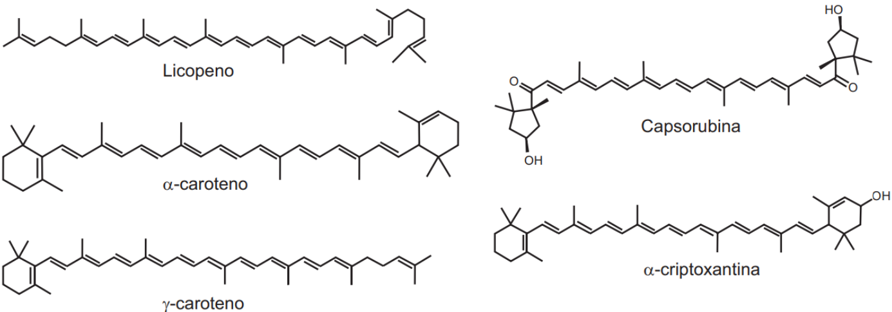

RIBEIRO, N. M.; NUNES, C. R. Análise de pigmentos de pimentões por cromatografia em papel. Química Nova na Escola, n. 29, ago. 2008 (adaptado).

A substância presente na mistura que migra mais lentamente é o(a)

A licopeno.

B a-caroteno.

© y-caroteno.

D capsorubina.

E α-criptoxantina.

#  Questão 183 (H18 | Enem 2022) Dificuldade 641,9

Em um autódromo, os carros podem derrapar em uma curva e bater na parede de proteção. Para diminuir o impacto de uma batida, pode-se colocar na parede uma barreira de pneus, isso faz com que a colisão seja mais demorada e o carro retorne com velocidade reduzida. Outra opção é colocar uma barreira de blocos de um material que se deforma, tornando-a tão demorada quanto a colisão com os pneus, mas que não permite a volta do carro após a colisão.

Comparando as duas situações, como ficam a força média exercida sobre o carro e a energia mecânica dissipada?

A força é maior na colisão com a barreira de pneus, e a energia dissipada é maior na colisão com a barreira de blocos.

B A força é maior na colisão com a barreira de blocos, e a energia dissipada é maior na colisão com a barreira de pneus.

A força é maior na colisão com a barreira de blocos, e a energia dissipada é a mesma nas duas situações.

D A força é maior na colisão com a barreira de pneus, e a energia dissipada é maior na colisão com a barreira de pneus.

A força é maior na colisão com a barreira de blocos, e a energia dissipada é maior na colisão com a barreira de blocos.

#  Questão 184 (H18 | Enem 2021) Dificuldade 653,3

O Prêmio Nobel de Química de 2000 deveu-se à descoberta e ao desenvolvimento de polímeros condutores. Esses materiais têm ampla aplicação em novos dispositivos eletroluminescentes (LEDs), células fotovoltaicas etc. Uma propriedade-chave de um polímero condutor é a presença de ligações duplas conjugadas ao longo da cadeia principal do polímero.

ROCHA FILHO, R. C. Polímeros condutores: descoberta e aplicações. Química Nova na Escola, n. 12, 2000 (adaptado).

Um exemplo desse polímero é representado pela estrutura

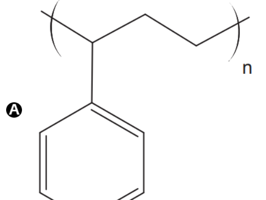

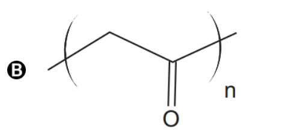

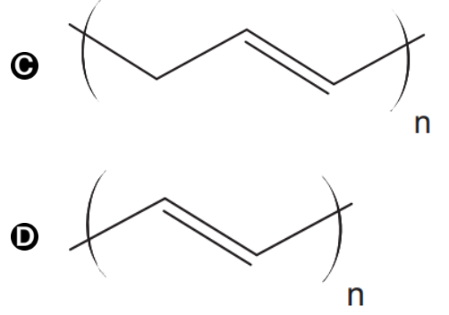

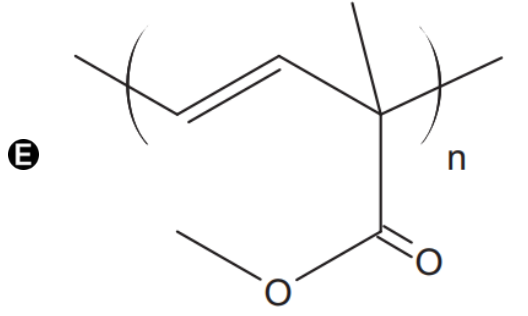

#  Questão 185 (H18 | Enem 2020) Dificuldade 667,7

As panelas de pressão reduzem o tempo de cozimento dos alimentos por elevar a temperatura de ebulição da água. Os usuários conhecedores do utensílio normalmente abaixam a intensidade do fogo em panelas de pressão após estas iniciarem a saída dos vapores.

Ao abaixar o fogo, reduz-se a chama, pois assim evita-se o(a)

aumento da pressão interna e os riscos de explosão.

B dilatação da panela e a desconexão com sua tampa.

perda da qualidade nutritiva do alimento.

D deformação da borracha de vedação.

E consumo de gás desnecessário.

#  Questão 186 (H18 | Enem 2019) Dificuldade 714,9

A utilização de corantes na indústria de alimentos é bastante difundida e a escolha por corantes naturais vem sendo mais explorada por diversas razões. A seguir são mostradas três estruturas de corantes naturais.

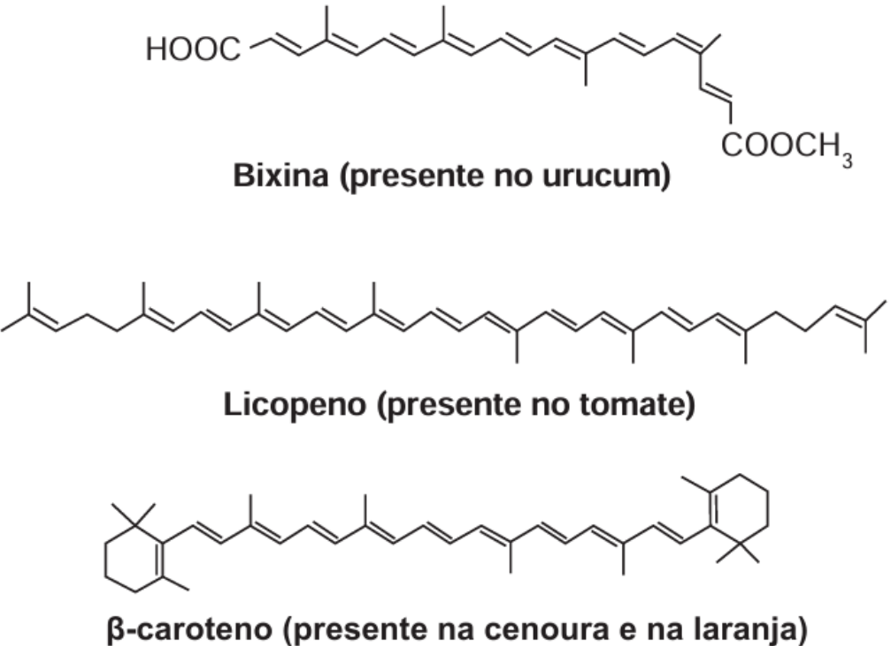

HAMERSKI, L.; REZENDE, M. J. C.; SILVA, B. V. Usando as cores da natureza para atender aos desejos do consumidor: substâncias naturais como corantes na indústria alimentícia. Revista Virtual de Química, n. 3, 2013.

A propriedade comum às estruturas que confere cor a esses compostos é a presença de

A cadeia conjugada.

B cadeia ramificada.

©átomos de carbonos terciários.

D ligações duplas de configuração cis.

E átomos de carbonos de hibridação sp$^{3}$.

#  Questão 187 (H18 | Enem 2017) Dificuldade 739,8

No ar que respiramos existem os chamados “gases inertes”. Trazem curiosos nomes gregos, que significam “o Novo”, “o Oculto”, “o Inativo”. E de fato são de tal modo inertes, tão satisfeitos em sua condição, que não interferem em nenhuma reação química, não se combinam com nenhum outro elemento e justamente por esse motivo ficaram sem ser observados durante séculos: só em 1962 um químico, depois de longos e engenhosos esforços, conseguiu forçar “o Estrangeiro” (o xenônio) a combinar-se fugazmente com o flúor ávido e vivaz, e a façanha pareceu tão extraordinária que lhe foi conferido o Prêmio Nobel.

LEVI, P. A tabela periódica. Rio de Janeiro: Relume-Dumará, 1994 (adaptado).

Qual propriedade do flúor justifica sua escolha com reagente para o processo mencionado?

A Densidade.

B Condutância.

C Electronegatividade.

D Estabilidade nuclear.

E Temperatura de ebulição

#  Questão 188 (H18 | Enem 2018) Dificuldade 755,9

As pessoas que utilizam objetos cujo princípio de funcionamento é o mesmo do das alavancas aplicam uma força, chamada de força potente, em um dado ponto da barra, para superar ou equilibrar uma segunda força, chamada de resistente, em outro ponto da barra. Por causa das diferentes distâncias entre os pontos de aplicação das forças, potente e resistente, os seus efeitos também são diferentes. A figura mostra alguns exemplos desses objetos.

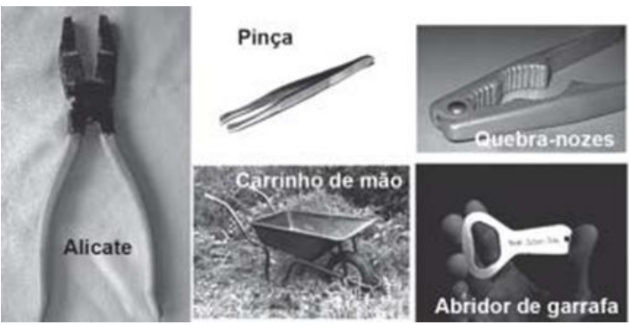

Em qual dos objetos a força potente é maior que a força resistente?

A Pinça.

D Carrinho de mão.

B Alicate.

E Abridor de garrafa.

Quebra-nozes.

#  Questão 189 (H18 | Enem 2016) Dificuldade 765,3

Pesquisadores recuperaram DNA de ossos de mamute (Mammuthus primigenius) encontrados na Sibéria, que tiveram sua idade de cerca de 28 mil anos confirmada pela técnica do carbono-14.

FAPESP. DNA de mamute é revelado. Disponível em: http://agencia.fapesp.br. Acesso em: 13 ago. 2012 (adaptado).

##  A técnica de datação apresentada no texto só é possível devido à

A proporção conhecida entre carbono-14 e carbono-12 na atmosfera ao longo dos anos.

B decomposição de todo o carbono-12 presente no organismo após a morte.

fixação maior do carbono-14 nos tecidos de organismos após a morte.

Ⓓ emissão de carbono-12 pelos tecidos de organismos após a morte.

E transformação do carbono-12 em carbono-14 ao longo dos anos.

##  Questão 190 (H18 | Enem 2019) Anulada pela TRI

O odor que permanece nas mãos após o contato com alho pode ser eliminado pela utilização de um “sabonete de aço inoxidável”, constituído de aço inox (74%), cromo e níquel. A principal vantagem desse “sabonete” é que ele não se desgasta com o uso. Considere que a principal substância responsável pelo odor de alho é a alicina (estrutura I) e que, para que o odor seja eliminado, ela seja transformada na estrutura II.

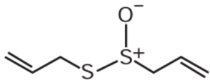

Estrutura I

$$CH_2=CH-CH_2-S-S-CH_2-CH=CH_2$$

Estrutura II

Na conversão de I em II, o “sabonete” atuará como um

A ácido.

B redutor.

ⓒ eletrólito.

D tensoativo.

E catalisador.

#  Competência 5

Entender métodos e procedimentos próprios das ciências naturais e aplicá-los em diferentes contextos.

#  Habilidade 19

Avaliar métodos, processos ou procedimentos das ciências naturais que contribuam para diagnosticar ou solucionar problemas de ordem social, econômica ou ambiental.

##  Questão 191 (H19 | Enem 2020) Dificuldade 492,5

A enorme quantidade de resíduos gerados pelo consumo crescente da sociedade traz para a humanidade uma preocupação socioambiental, em especial pela quantidade de lixo produzido. Além da reciclagem e do reuso, pode-se melhorar ainda mais a qualidade de vida, substituindo polímeros convencionais por polímeros biodegradáveis. Esses polímeros têm grandes vantagens socioambientais em relação aos convencionais porque

A não são tóxicos.

B não precisam ser reciclados.

© não causam poluição ambiental quando descartados.

são degradados em um tempo bastante menor que os convencionais.

E apresentam propriedades mecânicas semelhantes aos convencionais.

##  Questão 192 (H19 | Enem 2021) Dificuldade 597,6

A simples atitude de não jogar direto no lixo ou no ralo da pia o óleo de cozinha usado pode contribuir para a redução da poluição ambiental. Mas o que fazer com o óleo vegetal que não será mais usado? Não existe um modelo ideal de descarte, mas uma alternativa simples tem sido reaproveitá-lo para fazer sabão. Para isso, são necessários, além do próprio óleo, água e soda cáustica.

LOBO, I. Sabão feito com óleo de cozinha. Disponível em: http://pga.pgr.mpf.gov.br. Acesso em: 29 fev. 2012 (adaptado).

Com base no texto, a reação química que permite o reaproveitamento do óleo vegetal é denominada

A redução.

  esterificação.

B epoxidação.

E saponificação.

© substituição.

##  Questão 193 (H19 | Enem 2019) Dificuldade 602,2

Estudos mostram o desenvolvimento de biochips utilizados para auxiliar o diagnóstico de diabetes melito, doença evidenciada pelo excesso de glicose no organismo. O teste é simples e consiste em duas reações sequenciais na superfície do biochip, entre a amostra de soro sanguíneo do paciente, enzimas específicas e reagente (iodeto de potássio, KI), conforme mostrado na imagem.

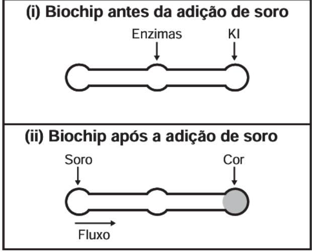

Após a adição de soro sanguíneo, o fluxo desloca-se espontaneamente da esquerda para a direita (ii) promovendo reações sequenciais, conforme as equações 1 e 2. Na primeira, há conversão de glicose do sangue em ácido glucônico, gerando peróxido de hidrogênio:

###  Equação 1

$$C_6H_{12}O_6(aq) + O_2(g) + H_2O(l) \xrightarrow{enzimas} C_6H_{12}O_7(aq) + H_2O_2(aq)$$

Na segunda, o peróxido de hidrogênio reage com íons iodeto gerando o íon tri-iodeto, água e oxigênio.

#  Equação 2

$$2H_2O_2(aq) + 3I^-(aq) \rightarrow I_3^-(aq) + 2H_2O(l) + O_2(g)$$

GARCIA, P. T. et al. A Handheld Stamping Process to Fabricate Microfluidic Paper-Based Analytical Devices with Chemically Modified Surface for Clinical Assays. RSC Advances, v. 4, 13 ago. 2014 (adaptado).

O tipo de reação que ocorre na superfície do biochip, nas duas reações do processo, é

A análise.

B síntese.

oxirredução.

D complexação.

E ácido-base.

