#  ÍNDICE

Página 1 | Apresentação

Página 3 | Índice

Página 5 | Utilizando o Material

Página 8 | Parte I – Fundamentos Teóricos

Página 9 | As 30 Habilidades e a Matriz de Referência

Página 23 | A Dificuldade dos Itens e a Teoria de Resposta ao Item

Página 28 | Parte II – 540 Questões (Enem 2012 a Enem 2023)

Página 29 | Competência 1 (Q001 a Q083)

Página 64 | Competência 2 (Q084 a Q135)

Página 90 | Competência 3 (Q136 a Q209)

Página 120 | Competência 4 (Q210 a Q276)

Página 148 | Competência 5 (Q277 a Q343)

Página 181 | Competência 6 (Q344 a Q420)

Página 223 | Competência 7 (Q421 a Q498)

Página 257 | Competência 8 (Q499 a Q540)

Página 274 | Gabaritos

Página 284 | Análise Estatística

Página 286 | Parte III – Anexos – 180 Questões (Enem 2009 a Enem 2011 | Enem 2024)

Página 287 | Anexo I – Enem 2009 (Q541 a Q585)

Página 310 | Anexo II – Enem 2010 (Q586 a Q630)

Página 334 | Anexo III – Enem 2011 (Q631 a Q675)

Página 357 | Anexo IV – Enem 2024 (Q676 a Q720)

Página 378 | Parte IV – Encerramento

Página 379 | Considerações Finais

Página 381 | Sobre o Autor – Conheça a trajetória do Professor Fredão

#  COMO UTILIZAR ESTE MATERIAL

Este eBook foi pensado para ser uma ferramenta de estudo precisa e estratégica, compatível com a estrutura e metodologia do Enem. Ao longo das próximas páginas, você encontrará as questões da prova organizadas por competências, habilidades e níveis de dificuldade, além de conteúdos explicativos a respeito da Matriz de Referência do Enem e da Teoria de Resposta ao Item (TRI), utilizada no cálculo da nota do Enem.

A seguir, explicamos como o material está estruturado e oferecemos sugestões práticas para aproveitar cada parte da melhor maneira possível.

##  Parte I – Fundamentos Teóricos

Antes de começar a resolver questões, é importante entender a lógica por trás da organização do material:

● Em "As 30 Habilidades | Matriz de Referência", você terá uma visão geral de cada uma das 30 habilidades cobradas na área de Ciências da Natureza, e utilizadas para a elaboração dos itens do Enem.

● Em “Dificuldades dos Itens | Parâmetro b da TRI”, explicamos como a TRI (Teoria de Resposta ao Item) funciona e como ela foi usada para ordenar as questões dentro de cada habilidade — da mais fácil para a mais difícil – com base no parâmetro b da TRI publicado nos microdados.

##  Parte II – 540 Questões (Enem 2012 a Enem 2023)

Aqui está o coração do material. Esta parte reúne 540 questões das 12 edições do Enem entre 2012 e 2023, organizadas por competências, de acordo com a Matriz de Referência de Ciências da Natureza.

Cada competência está dividida por habilidades, e, dentro de cada habilidade, as questões estão ordenadas por nível de dificuldade, conforme a TRI, da questão mais fácil para a mais difícil.

Cada questão vem acompanhada de um cabeçalho informativo, com os seguintes dados: ano de aplicação, habilidade associada, dificuldade estimada (parâmetro b) e um ícone que representa a dificuldade, variando de muito fácil (1) a muito difícil () — legenda explicada na Parte I do material.

Questão 001 (H1 | 2017 | 483,5) ①②③④⑤

Essa estrutura permite que você:

● Identifique padrões recorrentes de cobrança e treine suas fragilidades em habilidades específicas;

● Crie microciclos de estudo direcionado (ex: "vou dominar a H1 essa semana");

● Potencialize uma boa coerência pedagógica, avançando gradualmente do fácil ao difícil — e entendendo quais questões você deve acertar e quais pode errar sem comprometer a sua nota final;

● Refaça questões em que errou no passado e revise com um olhar mais estratégico, entendendo qual habilidade era exigida de você e qual era a real dificuldade do item, de acordo com a TRI.

Em resumo, a proposta de organização desse material permite um estudo mais estratégico do que o simples “resolver provas antigas”.

#  Gabaritos e Análises

Logo após as questões, você encontrará os gabaritos organizados pela numeração da questão, para facilitar sua correção. Na sequência, há uma seção de análises estatísticas, que explica como os dados desse eBook serão explorados em maior profundidade nas videoaulas disponíveis na Plataforma Professor Fredão, acessadas, exclusivamente, por quem adquire este eBook.

Parte III – Anexos – 180 Questões (Enem 2009 a Enem 2011 | Enem 2024)

Por se tratar de provas nas quais, aparentemente, foram aproveitados itens elaborados anteriormente à atualização da Matriz de Referência em 2009, as edições de 2009, 2010 e 2011 são trazidas como anexos no eBook. Essas edições contêm todos os itens daquele ano de prova, com a ordenação por dificuldade (da questão mais fácil à mais difícil), além da indicação da habilidade cobrada.

Já a prova do Enem 2024, a mais recente, foi deixada como anexo por um motivo simples: não teria sido possível finalizar o material a tempo do lançamento da Coleção Enem por Habilidades e Dificuldades, caso fosse necessário aguardar a divulgação dos microdados do Enem 2024, que geralmente ocorre em meados de abril/maio. Dessa forma, nessa 1ª Edição do eBook, optou-se por deixar a prova de 2024 como um dos anexos.

#  Parte IV-Encerramento

As seções finais trazem algumas considerações finais a respeito do desenvolvimento dos materiais dessa coleção, além do texto Sobre o Autor, que apresenta a trajetória profissional do Professor Fredão.

##  Recomendações Finais

● Use sua nota mais recente no Enem como ponto de partida. Por exemplo, se sua nota foi 650:

o Evite errar questões com dificuldade abaixo de 600. Se errar, corrija imediatamente;

○ Foque em dominar as questões com dificuldade variando de 600 a 700;

o Ao consolidar essa faixa, avance gradualmente para as questões de dificuldade acima de 700.

Esse uso inteligente dos dados alinha seus estudos com a lógica da TRI e potencializa sua proficiência (nota no Enem) com estratégia.

● Começando agora? Inicia pelas questões mais fáceis de cada habilidade. Esse passo certamente te auxiliará na construção de uma base sólida e coerente pedagogicamente.

● Use o material como uma ferramenta recorrente: para revisar, montar simulados, mapear habilidades, reconhecer padrões e acompanhar sua evolução.

● Quer ir além? Explore os conteúdos da Plataforma Professor Fredão, seja com as videoaulas às quais terá acesso, ou, no caso de professores, gestores e mentores, com o curso Tríade Enem — que conecta a Matriz, a TRI e os Microdados para uma compreensão completa da prova.

Este material foi feito para te acompanhar durante toda a sua preparação. Use com estratégia, constância e consciência. E, claro: conte conosco nessa jornada rumo à sua melhor nota no Enem e à tão sonhada aprovação no curso dos seus sonhos.

#  AS 30 HABILIDADES

Matriz de Referência

#  MATRIZ DE REFERÊNCIA

"O termo Matriz de Referência ou Quadro Conceitual (em inglês Framework) é utilizado especificamente no contexto das avaliações em larga escala para definir o construto e os fundamentos teóricos de cada teste ou questionário que compõe a avaliação, indicar as habilidades ou traços latentes a serem medidos e orientar a elaboração de itens. Além disso, também orienta a construção de escalas de proficiência, que especificam os níveis em que os estudantes se encontram e quais habilidades provavelmente são capazes de realizar no contexto da avaliação."

Disponível em: https://www.gov.br/inep/pt-br/areas-de-atuacao/avaliacao-e-exames-educacionais/pisa/matrizes-de-referencia. Acesso em 09 out. 23.

A Matriz de Referência do Enem é, sem dúvidas, o principal documento da prova do Enem. Apesar disso, poucos alunos (e me arrisco a dizer que, até mesmo, poucos professores) já pararam para ler o documento e entender, de fato, como é construída a prova do Enem.

O arquivo, disponibilizado no site do INEP, começa apresentando os EIXOS COGNITIVOS, comuns às quatro áreas de conhecimento: (1) Linguagens, Códigos e suas Tecnologias; (2) Matemática e suas Tecnologias; (3) Ciências da Natureza e suas Tecnologias; e () Ciências Humanas e suas Tecnologias.

Na sequência, são apresentadas as COMPETÊNCIAS DE ÁREA de Ciências da Natureza e suas Tecnologias e, para cada competência, as HABILIDADES associadas a ela. É com base nestas habilidades que são elaborados os itens da prova do Enem!

Por fim, são apresentados os OBJETOS DE CONHECIMENTO associados às matrizes de referência, com os conteúdos da forma como costumam ser apresentados no Ensino Médio.

#  EIXOS COGNITIVOS

São cinco os eixos cognitivos presentes na Matriz de Referência do ENEM:

● EIXO I – Dominar linguagens (DL)

Dominar a norma culta da Língua Portuguesa e fazer uso das linguagens matemática, artística e científica e das línguas espanhola e inglesa.

● EIXO II – Compreender fenômenos (CF)

Construir e aplicar conceitos das várias áreas do conhecimento para a compreensão de fenômenos naturais, de processos histórico-geográficos, da produção tecnológica e das manifestações artísticas.

● EIXO III – Enfrentar situações-problema (SP)

Selecionar, organizar, relacionar, interpretar dados e informações representados de diferentes formas, para tomar decisões e enfrentar situações problema.

● EIXO IV – Construir argumentação (CA)

Relacionar informações, representadas em diferentes formas, e conhecimentos disponíveis em situações concretas, para construir argumentação consistente.

● EIXO V – Elaborar propostas (EP)

Recorrer aos conhecimentos desenvolvidos na escola para elaboração de propostas de intervenção solidária na realidade, respeitando os valores humanos e considerando a diversidade sociocultural.

Como veremos na próxima seção, a Matriz de Referência de Ciências da Natureza e suas Tecnologias é composta de 8 COMPETÊNCIAS de área, cada uma contando com 3 a 5 HABILIDADES associadas a ela, totalizando as 30 HABILIDADES que serão utilizadas neste material para separar as 540 questões das aplicações regulares do Enem de 2012 a 2023. Além disso, serão indicadas as habilidades de cada uma das questões das aplicações regulares do Enem 2009, do Enem 2010, do Enem 2011 e do Enem 2024 nos anexos disponibilizados no final deste material.

#  COMPETÊNCIAS E HABILIDADES

A Matriz de Referência de Ciências da Natureza e suas Tecnologias é composta por 8 Competências de Área (C1 a C8), cada uma delas com a presença de três a cinco habilidades, totalizando 30 Habilidades.

A seguir, são apresentadas cada uma dessas competências e as habilidades associadas a elas.

##  Competência de Área 1 (C1)

Compreender as ciências naturais e as tecnologias a elas associadas como construções humanas, percebendo seus papéis nos processos de produção e no desenvolvimento econômico e social da humanidade.

A C1 apresenta quatro habilidades:

###  ● Habilidade 1

Reconhecer características ou propriedades de fenômenos ondulatórios ou oscilatórios, relacionando-os a seus usos em diferentes contextos;

###  ● Habilidade 2

Associar a solução de problemas de comunicação, transporte, saúde ou outro, com o correspondente desenvolvimento científico e tecnológico;

###  ● Habilidade 3

Confrontar interpretações científicas com interpretações baseadas no senso comum, ao longo do tempo ou em diferentes culturas;

###  ● Habilidade 4

Avaliar propostas de intervenção no ambiente, considerando a qualidade da vida humana ou medidas de conservação, recuperação ou utilização sustentável da biodiversidade.

#  Competência de Área 2 (C2)

Identificar a presença e aplicar as tecnologias associadas às ciências naturais em diferentes contextos.

A C2 apresenta três habilidades:

##  ● Habilidade 5

Dimensionar circuitos ou dispositivos elétricos de uso cotidiano;

##  ● Habilidade 6

Relacionar informações para compreender manuais de instalação ou utilização de aparelhos, ou sistemas tecnológicos de uso comum;

##  ● Habilidade 7

Selecionar testes de controle, parâmetros ou critérios para a comparação de materiais e produtos, tendo em vista a defesa do consumidor, a saúde do trabalhador ou a qualidade de vida.

#  Competência de Área 3 (C3)

Associar intervenções que resultam em degradação ou conservação ambiental a processos produtivos e sociais e a instrumentos ou ações científico-tecnológicos.

##  A C3 apresenta cinco habilidades:

##  ● Habilidade 8

Identificar etapas em processos de obtenção, transformação, utilização ou reciclagem de recursos naturais, energéticos ou matérias-primas, considerando processos biológicos, químicos ou físicos neles envolvidos;

##  ● Habilidade 9

Compreender a importância dos ciclos biogeuoquímicos ou do fluxo de energia para a vida, ou da ação de agentes ou fenômenos que podem causar alterações nesses processos;

##  ● Habilidade 10

Analisar perturbações ambientais, identificando fontes, transporte e(ou) destino dos poluentes ou prevendo efeitos em sistemas naturais, produtivos ou sociais;

#  ● Habilidade 11

Reconhecer benefícios, limitações e aspectos éticos da biotecnologia, considerando estruturas e processos biológicos envolvidos em produtos biotecnológicos;

###  ● Habilidade 12

Avaliar impactos em ambientes naturais decorrentes de atividades sociais ou econômicas, considerando interesses contraditórios.

#  Competência de Área 4 (C4)

Compreender interações entre organismos e ambiente, em particular aquelas relacionadas à saúde humana, relacionando conhecimentos científicos, aspectos culturais e características individuais.

#  A C4 apresenta quatro habilidades:

##  ● Habilidade 13

Reconhecer mecanismos de transmissão da vida, prevendo ou explicando a manifestação de características dos seres vivos;

###  ● Habilidade 14

Identificar padrões em fenômenos e processos vitais dos organismos, como manutenção do equilíbrio interno, defesa, relações com o ambiente, sexualidade, entre outros;

#  ● Habilidade 15

Interpretar modelos e experimentos para explicar fenômenos ou processos biológicos em qualquer nível de organização dos sistemas biológicos;

##  ● Habilidade 16

Compreender o papel da evolução na produção de padrões, processos biológicos ou na organização taxonômica dos seres vivos.

#  Competência de Área 5 (C5)

Entender métodos e procedimentos próprios das ciências naturais e aplicá-los em diferentes contextos.

##  A C5 apresenta três habilidades:

##  ● Habilidade 17

Relacionar informações apresentadas em diferentes formas de linguagem e representação usadas nas ciências físicas, químicas ou biológicas, como texto discursivo, gráficos, tabelas, relações matemáticas ou linguagem simbólica;

##  ● Habilidade 18

Relacionar propriedades físicas, químicas ou biológicas de produtos, sistemas ou procedimentos tecnológicos às finalidades a que se destinam;

##  ● Habilidade 19

Avaliar métodos, processos ou procedimentos das ciências naturais que contribuam para diagnosticar ou solucionar problemas de ordem social, econômica ou ambiental.

###  Competência de Área 6 (C6)

Apropriar-se de conhecimentos da física para, em situações problema, interpretar, avaliar ou planejar intervenções científico-tecnológicas.

#  A C6 apresenta quatro habilidades:

##  ● Habilidade 20

Caracterizar causas ou efeitos dos movimentos de partículas, substâncias, objetos ou corpos celestes;

#  ● Habilidade 21

Utilizar leis físicas e (ou) químicas para interpretar processos naturais ou tecnológicos inseridos no contexto da termodinâmica e(ou) do eletromagnetismo;

##  ● Habilidade 22

Compreender fenômenos decorrentes da interação entre a radiação e a matéria em suas manifestações em processos naturais ou tecnológicos, ou em suas implicações biológicas, sociais, econômicas ou ambientais;

##  ● Habilidade 23

Avaliar possibilidades de geração, uso ou transformação de energia em ambientes específicos, considerando implicações éticas, ambientais, sociais e/ou econômicas.

#  Competência de Área 7 (C7)

Apropriar-se de conhecimentos da química para, em situações problema, interpretar, avaliar ou planejar intervenções científico-tecnológicas.

A C7 apresenta quatro habilidades:

##  ● Habilidade 24

Utilizar códigos e nomenclatura da química para caracterizar materiais, substâncias ou transformações químicas;

##  ● Habilidade 25

Caracterizar materiais ou substâncias, identificando etapas, rendimentos ou implicações biológicas, sociais, econômicas ou ambientais de sua obtenção ou produção;

##  ● Habilidade 26

Avaliar implicações sociais, ambientais e/ou econômicas na produção ou no consumo de recursos energéticos ou minerais, identificando transformações químicas ou de energia envolvidas nesses processos;

##  ● Habilidade 27

Avaliar propostas de intervenção no meio ambiente aplicando conhecimentos químicos, observando riscos ou benefícios.

#  Competência de Área 8 (C8)

Apropriar-se de conhecimentos da biologia para, em situações problema, interpretar, avaliar ou planejar intervenções científico-tecnológicas.

A C8 apresenta três habilidades:

##  ● Habilidade 28

Associar características adaptativas dos organismos com seu modo de vida ou com seus limites de distribuição em diferentes ambientes, em especial em ambientes brasileiros;

##  ● Habilidade 29

Interpretar experimentos ou técnicas que utilizam seres vivos, analisando implicações para o ambiente, a saúde, a produção de alimentos, matérias primas ou produtos industriais;

#  ● Habilidade 30

Avaliar propostas de alcance individual ou coletivo, identificando aquelas que visam à preservação e a implementação da saúde individual, coletiva ou do ambiente.

#  OBJETOS DO CONHECIMENTO

Como comentado na seção anterior, as competências de área estão intimamente ligadas aos conhecimentos e objetos do conhecimento apresentados na Matriz de Referência de Ciências da Natureza e suas Tecnologias.

Considerados os quatro componentes, o de Ciências da Natureza corresponde ao mais detalhado no que diz respeito aos objetos do conhecimento. São quatro páginas de descrição, divididas da seguinte maneira:

##  Física

● Conhecimentos básicos e fundamentais;

● O movimento, equilíbrio e a descoberta de leis físicas;

● Energia, trabalho e potência;

● A Mecânica e o funcionamento do Universo;

● Fenômenos Elétricos e Magnéticos;

● Oscilações, ondas, óptica e radiação;

● O calor e os fenômenos térmicos.

##  Química

● Transformações Químicas;

● Representação das transformações químicas;

● Materiais, suas propriedades e usos;

• Água;

● Transformações Químicas e Energia;

● Dinâmica das Transformações Químicas;

● Transformação Química e Equilíbrio;

● Compostos de Carbono;

● Relações da Química com as Tecnologias, a Sociedade e o Meio Ambiente;

● Energias Químicas no Cotidiano.

##  Biologia

● Moléculas, células e tecidos;

● Hereditariedade e diversidade da vida;

● Identidade dos seres vivos;

● Ecologia e ciências ambientais;

● Origem e evolução da vida;

● Qualidade de vida das populações humanas.

Vejamos, em detalhes, tudo o que pode ser cobrado dentro de cada um desses conhecimentos.

#  FÍSICA

##  Conhecimentos básicos e fundamentais

● Noções de ordem de grandeza.

● Notação Científica.

● Sistema Internacional de Unidades.

● Metodologia de investigação: a procura de regularidades e de sinais na interpretação física do mundo.

● Observações e mensurações: representação de grandezas físicas como grandezas mensuráveis.

● Ferramentas básicas: gráficos e vetores.

● Conceituação de grandezas vetoriais e escalares.

● Operações básicas com vetores.

##  O movimento, equilíbrio e a descoberta de leis físicas

● Grandezas fundamentais da mecânica: tempo, espaço, velocidade e aceleração.

● Relação histórica entre força e movimento.

● Descrições do movimento e sua interpretação: quantificação do movimento e sua descrição matemática e gráfica.

● Casos especiais de movimentos e suas regularidades observáveis.

● Conceito de inércia.

● Noção de sistemas de referência inerciais e não inerciais

● Noção dinâmica de massa e quantidade de movimento (momento linear).

● Força e variação da quantidade de movimento.

● Leis de Newton

● Centro de massa e a ideia de ponto material.

● Conceito de forças externas e internas.

● Lei da conservação da quantidade de movimento (momento linear) e teorema do impulso.

● Momento de uma força (torque).

● Condições de equilíbrio estático de ponto material e de corpos rígidos.

● Força de atrito, força peso, força normal de contato e tração

● Diagramas de forças

● Identificação das forças que atuam nos movimentos circulares

● Noção de força centrípeta e sua quantificação.

● A hidrostática: aspectos históricos e variáveis relevantes

● Empuxo.

● Princípios de Pascal, Arquimedes e Stevin: condições de flutuação, relação entre diferença de nível e pressão hidrostática.

##  Energia, trabalho e potência

● Conceituação de trabalho, energia e potência

● Conceito de energia potencial e de energia cinética.

● Conservação de energia mecânica e dissipação de energia

● Trabalho da força gravitacional e energia potencial gravitacional.

● Forças conservativas e dissipativas.

###  A Mecânica e o funcionamento do Universo

● Força peso.

● Aceleração gravitacional

● Lei da Gravitação Universal

● Leis de Kepler.

● Movimentos de corpos celestes.

● Influência na Terra: marés e variações climáticas.

● Concepções históricas sobre a origem do universo e sua evolução.

#  FÍSICA

##  Fenômenos Elétricos e Magnéticos

● Carga elétrica e corrente elétrica.

● Lei de Coulomb.

● Campo elétrico e potencial elétrico.

● Linhas de campo. Superfícies equipotenciais.

● Poder das pontas.

• Blindagem.

● Capacitores.

● Efeito Joule.

● Lei de Ohm.

● Resistência elétrica e resistividade.

● Relações entre grandezas elétricas: tensão, corrente, potência e energia.

● Circuitos elétricos simples.

● Correntes contínua e alternada.

● Medidores elétricos.

● Representação gráfica de circuitos.

● Símbolos convencionais.

● Potência e consumo de energia em dispositivos elétricos.

● Campo magnético.

● Imãs permanentes.

● Linhas de campo magnético.

● Campo magnético terrestre.

##  Oscilações, ondas, óptica e radiação

● Feixes e frentes de ondas.

● Reflexão e refração.

● Óptica geométrica: lentes e espelhos.

● Formação de imagens.

● Instrumentos ópticos simples.

● Fenômenos ondulatórios.

● Pulsos e ondas.

● Período, frequência, ciclo.

● Propagação: relação entre velocidade, frequência e comprimento de onda.

● Ondas em diferentes meios de propagação.

##  O calor e os fenômenos térmicos

● Conceitos de calor e de temperatura.

● Escalas termométricas.

● Transferência de calor e equilíbrio térmico.

● Capacidade calorífica e calor específico.

● Condução do calor.

● Dilatação térmica.

● Mudanças de estado físico e calor latente de transformação.

● Comportamento de Gases ideais.

● Máquinas térmicas.

● Ciclo de Carnot.

● Leis da Termodinâmica.

● Aplicações e fenômenos térmicos de uso cotidiano.

● Compreensão de fenômenos climáticos relacionados ao ciclo da água

#  QUÍMICA

##  Transformações Químicas

● Evidências de transformações químicas.

● Interpretando transformações químicas.

● Sistemas Gasosos: Lei dos gases.

● Equação geral dos gases ideais, Princípio de Avogadro, conceito de molécula; massa molar, volume molar dos gases.

● Teoria cinética dos gases.

● Misturas gasosas.

● Modelo corpuscular da matéria.

● Modelo atômico de Dalton.

● Natureza elétrica da matéria: Modelo Atômico de Thomson, Rutherford, Rutherford-Bohr.

● Átomos e sua estrutura.

● Número atômico, número de massa, isótopos, massa atômica.

● Elementos químicos e Tabela Periódica.

● Reações químicas.

##  Representação das transformações químicas

● Fórmulas químicas.

● Balanceamento de equações químicas.

● Aspectos quantitativos das transformações químicas.

● Leis ponderais das reações químicas.

● Determinação de fórmulas químicas.

● Grandezas Químicas: massa, volume, mol, massa molar, constante de Avogadro.

● Cálculos estequiométricos.

##  Materiais, suas propriedades e usos

● Propriedades de materiais.

● Estados físicos de materiais.

● Mudanças de estado.

● Misturas: tipos e métodos de separação.

● Substâncias químicas: classificação e características gerais.

● Metais e Ligas metálicas.

● Ferro, cobre e alumínio.

● Ligações metálicas.

● Substâncias iônicas: características e propriedades.

● Substâncias iônicas do grupo: cloreto, carbonato, nitrato e sulfato.

● Ligação ionica.

● Substâncias moleculares: características e propriedades.

● Substâncias moleculares: $H_2, O_2, N_2, Cl_2, NH_3, H_2O, HCl, CH_4$.

● Ligação Covalente.

● Polaridade de moléculas.

● Forças intermoleculares.

● Relação entre estruturas, propriedade e aplicação das substâncias.

#  QUÍMICA

##  Água

● Ocorrência e importância na vida animal e vegetal.

● Ligação, estrutura e propriedades.

● Sistemas em Solução Aquosa: Soluções verdadeiras, soluções coloidais e suspensões.

● Solubilidade.

● Concentração das soluções.

● Aspectos qualitativos das propriedades coligativas das soluções.

● Ácidos, Bases, Sais e Óxidos: definição, classificação, propriedades, formulação e nomenclatura.

● Conceitos de ácidos e base.

● Principais propriedades dos ácidos e bases: indicadores, condutibilidade elétrica, reação com metais, reação de neutralização.

##  Transformações Químicas e Energia

● Transformações químicas e energia calorífica.

● Calor de reação.

● Entalpia.

● Equações termoquímicas.

● Lei de Hess.

● Transformações químicas e energia elétrica.

● Reação de oxirredução.

● Potenciais padrão de redução.

• Pilha.

● Eltróise.

● Leis de Faraday.

● Transformações nucleares.

● Conceitos fundamentais da radioatividade.

● Reações de fissão e fusão nuclear.

● Desintegração radioativa e radioisótopos.

##  Dinâmica das Transformações Químicas

● Transformações Químicas e velocidade.

● Velocidade de reação.

● Energia de ativação.

● Fatores que alteram a velocidade de reação: concentração, pressão, temperatura e catalisador.

##  Transformação Química e Equilíbrio

● Caracterização do sistema em equilíbrio.

● Constante de equilíbrio.

● Produto iônico da água, equilíbrio ácido-base e pH.

● Solubilidade dos sais e hidrólise.

● Fatores que alteram o sistema em equilíbrio.

● Aplicação da velocidade e do equilíbrio químico no cotidiano.

#  QUÍMICA

##  Compostos de Carbono

● Características gerais dos compostos orgânicos.

● Principais funções orgânicas.

● Estrutura e propriedades de Hidrocarbonetos.

● Estrutura e propriedades de compostos orgânicos oxigenados.

● Fermentação.

● Estrutura e propriedades de compostos orgânicos nitrogenados.

● Macromoléculas naturais e sintéticas.

● Noções básicas sobre polímeros.

● Amido, glicogênio e celulose.

● Borracha natural e sintética.

● Polietileno, poliestireno, PVC, Teflon, nálon.

● Óleos e gorduras, sabões e detergentes sintéticos.

● Proteínas e enzimas.

##  Relações da Química com as Tecnologias, a Sociedade e o Meio Ambiente

● Química no cotidiano.

● Química na agricultura e na saúde.

● Química nos alimentos.

● Química e ambiente.

● Aspectos científico-tecnológicos, socioeconômicos e ambientais associados à

● obtenção ou produção de substâncias químicas.

● Indústria Química: obtenção e utilização do cloro, hidróxido de sódio, ácido sulfúrico, amônia e ácido nítrico.

● Mineração e Metalurgia.

● Poluição e tratamento de água.

● Poluição atmosférica.

● Contaminação e proteção do ambiente.

##  Energias Químicas no Cotidiano

● Petróleo, gás natural e carvão.

● Madeira e hulha.

● Biomassa.

● Biocombustíveis.

● Impactos ambientais de combustíveis fosseis.

● Energia nuclear.

● Lixo atômico.

● Vantagens e desvantagens do uso de energia nuclear.

#  BIOLOGIA

##  Moléculas, células e tecidos

● Estrutura e fisiologia celular: membrana, citoplasma e núcleo.

● Divisão celular.

● Aspectos bioquímicos das estruturas celulares.

● Aspectos gerais do metabolismo celular.

● Metabolismo energético: fotossíntese e respiração.

● Codificação da informação genética.

● Síntese proteica.

● Diferenciação celular.

● Principais tecidos animais e vegetais.

● Origem e evolução das células.

● Noções sobre células-tronco, clonagem e

● tecnologia do DNA recombinante.

● Aplicações de biotecnologia na produção de alimentos, fármacos e componentes biológicos.

● Aplicações de tecnologias relacionadas ao DNA a investigações científicas, determinação da paternidade, investigação criminal e identificação de indivíduos.

● Aspectos éticos relacionados ao desenvolvimento biotecnológico.

● Biotecnologia e sustentabilidade.

##  Hereditariedade e diversidade da vida

● Princípios básicos que regem a transmissão de características hereditárias.

● Concepções pré-mendelianas sobre a hereditariedade.

● Aspectos genéticos do funcionamento do corpo humano.

● Antígenos e anticorpos.

● Grupos sanguíneos, transplantes e doenças autoimunes.

● Neoplasias e a influência de fatores ambientais.

● Mutações gênicas e cromossômicas.

● Aconselhamento genético.

● Fundamentos genéticos da evolução.

● Aspectos genéticos da formação e manutenção da diversidade biológica.

##  Identidade dos seres vivos

● Níveis de organização dos seres vivos.

● Vírus, procariontes e eucariontes.

● Autótrofos e heterótrofos.

● Seres unicelulares e pluricelulares.

● Sistemática e as grandes linhas da evolução dos seres vivos.

● Tipos de ciclo de vida.

● Evolução e padrões anatômicos e fisiológicos observados nos seres vivos.

● Funções vitais dos seres vivos e sua relação com a adaptação desses organismos a diferentes ambientes.

● Embriologia, anatomia e fisiologia humana.

● Evolução humana.

● Biotecnologia e sistemática.

#  BIOLOGIA

##  Ecologia e ciências ambientais

● Ecossistemas.

● Fatores bióticos e abióticos.

● Habitat e nicho ecológico.

● A comunidade biológica: teia alimentar, sucessão e comunidade clímax.

● Dinâmica de populações.

● Interações entre os seres vivos.

● Ciclos biogeoaquímicos.

● Fluxo de energia no ecosistema.

● Biogeografia.

● Biomas brasileiros.

● Exploração e uso de recursos naturais.

● Problemas ambientais: mudanças climáticas, efeito estufa; desmatamento; erosão; poluição da água, do solo e do ar.

● Conservação e recuperação de ecossistemas.

● Conservação da biodiversidade.

● Tecnologias ambientais.

● Noções de saneamento básico.

● Noções de legislação ambiental: água, florestas, unidades de conservação; biodiversidade.

##  Origem e evolução da vida

● A biologia como ciência: história, métodos, técnicas e experimentação.

● Hipóteses sobre a origem do Universo, da Terra e dos seres vivos.

● Teorias de evolução.

● Explicações pré-darwinistas para a modificação das espécies.

● A teoria evolutiva de Charles Darwin.

● Teoria sintética da evolução.

● Seleção artificial e seu impacto sobre ambientes naturais e sobre populações humanas.

##  Qualidade de vida das populações humanas

● Aspectos biológicos da pobreza e do desenvolvimento humano.

● Indicadores sociais, ambientais e econômicos.

● Índice de desenvolvimento humano.

● Principais doenças que afetam a população brasileira: caracterização, prevenção e profilaxia.

● Noções de primeiros socorros.

● Doenças sexualmente transmissíveis.

● Aspectos sociais da biologia: uso indevido de drogas; gravidez na adolescência; obesidade.

● Violência e segurança pública.

● Exercícios físicos e vida saudável.

● Aspectos biológicos do desenvolvimento sustentável.

● Legislação e cidadania.

#  DIFICULDADES DOS ITENS

Teoria de Resposta ao Item (TRI)

#  A TEORIA DE RESPOSTA AO ITEM

A Teoria de Resposta ao Item (TRI) propõe modelos estatísticos que visam medir traços latentes de uma pessoa, ou seja, características que não podem ser observadas diretamente, como é o caso do Enem, no qual desejamos medir a habilidade do candidato em determinadas áreas de conhecimento.

A partir de tais modelos matemáticos/estatísticos, a TRI busca representar a probabilidade de um indivíduo dar uma resposta certa a um item como função dos parâmetros do item e da habilidade do respondente, de tal sorte que quanto maior for a habilidade/profiência do candidato, maior será a sua probabilidade de acerto no item.

De maneira bem simplificada, o processo de cálculo da sua nota no Enem envolve as seguintes etapas:

● Estima-se os três parâmetros dos itens (discriminação do item, dificuldade do item e acerto ao acaso);

● Cria-se uma escala de proficiência (régua) para cada uma das quatro áreas de conhecimento (Matemática, Linguagens, Ciências da Natureza e Ciências Humanas);

● Em cada régua posicionam-se os itens mais
fáceis à esquerda e os mais difíceis à direita.

O grande diferencial da TRI é o fato de que tanto a dificuldade dos itens quanto as proficiências dos participantes são posicionados na mesma régua. A partir daí, deseja-se analisar o quão coerente é o conjunto de respostas de determinado candidato.

Para entender melhor esse conceito de coerência, imagine uma analogia com competições de salto com vara. O brasileiro Thiago Braz possui o recorde olímpico da modalidade, tendo saltado 6,03 m em 2 016. Logo, é esperado que ele salte 5,50 m com relativa facilidade e que, à medida em que o sarrafo seja colocado em alturas mais elevadas, ele tenha mais dificuldades ao saltar.

Fonte: Agência Reuters

É justamente isso que a TRI faz! Para que um candidato tenha uma alta proficiência, é esperado que ele consiga “saltar” sarrafos mais baixos com relativa facilidade, isto é, que ele consiga acertar os itens mais fáceis da prova com tranquilidade.

Assim, há uma maior coerência em um competidor que salte sarrafos mais baixos e tenha dificuldade em saltar os mais altos, do que em um competidor que consegue saltar alguns sarrafos mais altos, mas falha com frequência nas tentativas de saltos em sarrafos mais baixos. A imagem abaixo ilustra uma situação hipotética em que dois estudantes acertaram 5 das 10 questões de um teste. Mas com coerências bem distintas...

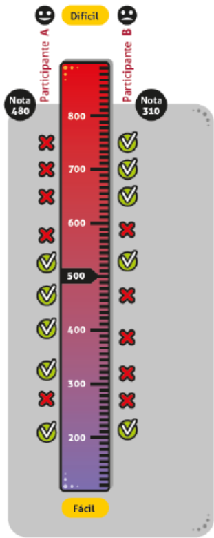

Fonte: INEP

Nota-se que o Participante B acertou as três questões posicionadas na porção superior da régua, ou seja, consideradas mais difíceis. Entretanto, errou 4 das 5 consideradas mais fáceis, o que não é coerente. Por sua vez, o Participante A acertou 5 dentre as 6 mais fáceis e errou as 4 consideradas mais difíceis, o que é coerente pedagogicamente. Dessa forma, o Participante A obteve uma nota 480, superior à nota 310 obtida pelo Participante B.

Para que tenhamos vejamos a importância de uma boa coerência pedagógica no Enem, a tabela abaixo traz a frequência de candidatos, as menores notas, as notas médias e as maiores notas atingidas por todos os candidatos que tiveram de 23 a 44 acertos na prova de matemática do Enem 2022.

Note que, mesmo para o patamar de 40 acertos, a nota do candidato pode variar quase 100 pontos! E que tivemos candidato com 41 acertos e nota menor do que outro com 32 acertos!

| Freq. | Acertos | Minima | Média | Máxima |
| --- | --- | --- | --- | --- |
| 22262 | 23 | 482,8 | 741,0 | 807,5 |
| 18572 | 24 | 508,3 | 754,0 | 820,0 |
| 15660 | 25 | 551,1 | 767,0 | 834,3 |
| 13520 | 26 | 618,7 | 779,5 | 841,4 |
| 11539 | 27 | 679,4 | 791,6 | 853,3 |
| 10175 | 28 | 722,7 | 803,6 | 859,7 |
| 8784 | 29 | 735,3 | 815,1 | 870,1 |
| 7516 | 30 | 759,1 | 826,2 | 878,5 |
| 6448 | 31 | 773,0 | 837,1 | 885,7 |
| 5432 | 32 | 770,8 | 847,8 | 898,3 |
| 4648 | 33 | 799,7 | 859,5 | 907,5 |
| 3615 | 34 | 806,8 | 871,0 | 925,3 |
| 2883 | 35 | 818,8 | 882,6 | 931,5 |
| 2072 | 36 | 837,7 | 895,3 | 944,4 |
| 1490 | 37 | 848,4 | 908,9 | 955,8 |
| 1104 | 38 | 848,9 | 921,6 | 967,4 |
| 667 | 39 | 880,6 | 936,2 | 973,3 |
| 384 | 40 | 888,5 | 947,9 | 978,0 |
| 211 | 41 | 896,3 | 960,2 | 981,3 |
| 87 | 42 | 936,8 | 968,7 | 983,9 |
| 24 | 43 | 958,1 | 978,3 | 985,7 |
| 6 | 44 | 985,7 | 985,7 | 985,7 |
| . | 45 | . | . | . |

Fonte: Microdados ENEM 2022

Para finalizar, a título de curiosidade (já que o objetivo deste material não é o de te transformar em um especialista na TRI), o Modelo Logístico Unidimensional de 3 Parâmetros (MLU3P) utilizado no Enem usa a seguinte expressão para o cálculo da probabilidade de acerto de um determinado item:

$$P = c + \frac{1 - c}{1 + e^{a(\theta - b)}},$$

sendo P a probabilidade de acerto do item por um candidato com habilidade/proficiência/traço latente $\theta$, em um item com parâmetros a, b e c pela TRI. Ao estimar os valores dos parâmetros acima, a equação dá origem à chamada Curva Característica do Item (CCI), que é a base do modelo MLU3P e fornece informações gráficas relevantes a respeito da qualidade dos itens.

A partir da CCI, cada questão é posicionada em uma “régua” de dificuldade, no local onde a probabilidade de acerto é próxima de 0,65, valor que que representa que participantes neste nível possuem alta probabilidade de terem obtido o conhecimento necessário para responder corretamente o item.

Questões consideradas mais fáceis são, então, posicionadas na porção inferior da régua, enquanto as mais difíceis se encontram na porção superior. O grande diferencial da TRI é o fato de que tanto os itens quanto os participantes são posicionados na mesma régua.

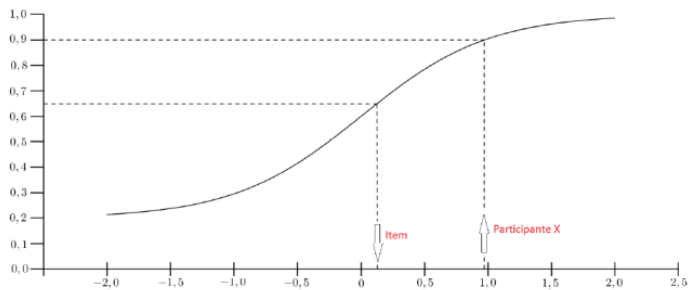

Na figura acima, por exemplo, temos a CCI de um item posicionado próximo ao valor 0,2, o que significa que ele está 0,2 desvios acima da média. Traduzindo para os valores de referência do Enem (média igual a 500 e desvio padrão igual a 100), este item estaria posicionado no nível de dificuldade 520.

É justamente essa transformação do parâmetro B divulgado nos microdados que utilizaremos neste material! Assim, um parâmetro B igual a 2,137, por exemplo, refletirá em um item com dificuldade igual a 500 + 100*2,137 = 713,7.

Na mesma figura, um participante X que tenha uma proficiência calculada com valor próximo a 600 tem aproximadamente 90% de chance de acertar o item. Naturalmente, o participante pode errar o item. Mas, o mais coerente, é que ele o acerte. Por esse motivo, a coerência das respostas é tão importante na TRI: por mais que um aluno acerte 44 dos 45 itens da matemática, se ele tiver errado um item fácil, para o qual a CCI indicaria uma chance de acerto próxima a 100%, a sua nota pode ser reduzida quando comparada à de um outro aluno que acertou 44 dos 45 itens, mas errando o item mais difícil da prova, para o qual a CCI indicaria uma chance de acerto, por exemplo, inferior a 50%.

Caso queira se aprofundar um pouco mais na TRI, deixo abaixo um QR Code que leva ao meu TCC.

#  PARÂMETRO B DE DIFICULDADE

Desde o início de 2022, o novo formato de apresentação dos microdados do Enem pelo INEP trouxe uma ótima novidade: a divulgação dos parâmetros do Modelo Logístico Unidimensional de 3 Parâmetros (modelo 3LP) para cada um dos itens aplicados nas provas do Enem utilizando a Teoria de Resposta ao Item (TRI).

De maneira simples e objetiva, há três parâmetros que são utilizados neste modelo: o parâmetro de discriminação do item (parâmetro a); o parâmetro de dificuldade do item (parâmetro b) e o parâmetro da assíntota inferior do item, também conhecido como parâmetro do acerto ao acaso ou parâmetro do chute (parâmetro c).

Neste material, a organização das questões dentro de cada habilidade levou em consideração o parâmetro b, uma vez que ele nos permite ranquear os itens pelas dificuldades, do mais fácil ao mais difícil.

#  IDENTIFICANDO A DIFICULDADE

“Fredão, como faço pra saber se um item é fácil, intermediário ou difícil, de acordo com os valores que aparecem no cabeçalho do item?”

Já me antecipando à principal pergunta que será feita quando vocês forem utilizar esse material, venho dar algumas explicações para vocês.

Em primeiro lugar, o parâmetro B é representado em uma escala padronizada e corresponde a um número real, que pode variar no intervalo de $-\infty a + \infty$. Para a escala utilizada no Enem, a dificuldade corresponde ao valor $500+100 \times B$. Assim, um item com $B = 2,137$ possui dificuldade $713,7$.

Utilizando como referência dados do livro Avaliação Educacional: fundamentos, metodologia e aplicações no contexto brasileiro, da Coleção PROFMAT, do professor Dr. Mauro Rabelo(*) , a partir da dificuldade, os itens poderiam ser classificados como

● Muito fáceis: dificuldade inferior a 373,0;

● Fáceis: dificuldade de 373,0 a 448,9;

● Medianos: dificuldade de 449,0 a 551,9;

● Difíceis: dificuldade de 552,0 a 627,9;

● Muito difíceis: dificuldade superior a 627,9.

Tais valores refletem uma expectativa, de acordo com uma Distribuição Normal Padrão (Gaussiana), de que a avaliação educacional contenha:

● 10% de itens muito fáceis;

● 20% de itens fáceis;

● 40% de itens medianos;

● 20% de itens difíceis;

● 10% de itens muito difíceis.

Trazendo essa análise para a realidade da Parte II deste material, com 540 questões, são esperadas

● 54 questões muito fáceis;

● 108 questões fáceis;

● 216 questões medianas;

● 108 questões difíceis;

● 54 questões muito difíceis.

Porém, a realidade encontrada nos microdados difere dessa expectativa, o que era alertado no livro citado. Considerando as faixas indicadas, teríamos:

● 0 questões muito fáceis;

● 3 questões fáceis;

● 46 questões medianas;

● 158 questões difíceis;

● 324 questões muito difíceis;

● além de 9 questões anuladas (8 pela TRI).

Como corrigir essa distorção? Bom, farei aqui uma proposta baseada na análise dos microdados das 540 questões dos anos de 2012 a 2023, no qual a dificuldade média foi de 646,6 em Ciências da Natureza, além de um desvio padrão de 81,1. Usando esses valores, em conjunto com os dados da tabela do referido livro e uma aproximação para efeito de simplificação das análises, considerarei como itens:

● Muito fáceis: dificuldade inferior a 560,0;

● Fáceis: dificuldade de 560,0 a 619,9;

● Medianos: dificuldade de 620,0 a 679,9;

● Difíceis: dificuldade de 680,0 a 739,9;

● Muito difíceis: dificuldade a partir de 740,0.

Assim, teremos, neste material, 64 itens considerados como muito fáceis (1), 126 como fáceis (2), 185 como medianos (3), 108 como difíceis (4) e 48 como muito difíceis (5), o que considero bem próximo ao esperado de uma avaliação educacional como o ENEM!

#  Observação sobre a prova do ENEM 2019 (e 2017, em menor escala)

Após a elaboração desta Coleção e a separação dos itens de acordo com as suas dificuldades, observeal algumas aparentes inconsistências nos parâmetros relativos à prova de Matemática do Enem 2019.

Em um material gratuito divulgado em 2020, chamado de O Guia Definitivo da Matemática do Enem, fiz uma série de análises relativas à prova de 2019, baseado nos microdados que, naquele momento, ainda não apresentavam os parâmetros dos itens. Alguns resultados obtidos naquele material foram confirmados em 2022 após a divulgação dos parâmetros como, por exemplo, a questão da catraca (141 do caderno cinza), que não permitiu a convergência do algoritmo de estimação da TRI, algo que já havia sido relatado como uma suspeita no Guia. Além disso, algumas das questões que esperava que fossem as mais fáceis da prova, de fato se mostraram muito fáceis pelo parâmetro B, como é o caso de uma questão que envolvia notação científica.

Porém, algumas das questões que esperava que estivessem entre as mais difíceis, não figuraram entre as muito difíceis e, sequer, entre as difíceis. Duas se destacam aqui: as questões do pistão (seguramente uma das mais difíceis da história do Enem) e a questão do alerta (que tinha um peguinha sinistro!).

Para terem ideia: eu gabaritei essa prova e tirei 985,5. Um ex-aluno errou apenas as duas questões citadas acima e tirou 984,2, ou seja, praticamente a mesma nota!!! Isso só se justifica pelo fato de a coerência pedagógica dele ter sido praticamente perfeita, o que implicaria em ele ter errado dois dos itens mais difíceis (ou justamente os dois mais difíceis) da prova do Enem 2019.

Por esse motivo, os itens relativos à prova do Enem 2019 devem ser analisados com cautela no que diz respeito à sua classificação pela dificuldade! Em menor escala, mas também presente, estão algumas supostas inconsistências nas dificuldades da prova do Enem 2017, como é o caso da questão do caminhão cegonha, certamente uma das mais difíceis daquele ano e, também, da história da prova do Enem na matemática!

Ressalva: Apesar de o alerta acima se referir à prova de Matemática e suas Tecnologias, fica também a ressalva para os demais componentes (Linguagens, Ciências Humanas e Ciências da Natureza), uma vez que os supostos erros podem ter sido propagados também para esses componentes.

#  PARTE

##  540 QUESTÕES

Do Enem 2012 ao Enem 2023

#  COMPETÊNCIA

##  1

Questões de 001 a 083

#  H1: Fenômenos Ondulatórios e Oscilatórios

##  Competência 1

Compreender as ciências naturais e as tecnologias a elas associadas como construções humanas, percebendo seus papéis nos processos de produção e no desenvolvimento econômico e social da humanidade.

##  Habilidade 1

Reconhecer características ou propriedades de fenômenos ondulatórios ou oscilatórios, relacionando-os a seus usos em diferentes contextos.

Questão 001 (H1 | 2015 | 517,2) ①②③④⑤

Ao ouvir uma flauta e um piano emitindo a mesma nota musical, consegue-se diferenciar esses instrumentos um do outro.

Essa diferenciação se deve principalmente ao(à)

A intensidade sonora do som de cada instrumento musical.

Ⓑ potência sonora do som emitido pelos diferentes instrumentos musicais.

ⓒ diferente velocidade de propagação do som emitido por cada instrumento musical.

timbre do som, que faz com que os formatos das ondas de cada instrumento sejam diferentes.

E altura do som, que possui diferentes frequências para diferentes instrumentos musicais.

Questão 002 (H1 | 2014 | 580,3) ①②③④⑤

Quando adolescente, as nossas tardes, após as aulas, consistiam em tomar às mãos o violão e o dicionário de acordes de Almir Chediak e desafiar nosso amigo Hamilton a descobrir, apenas ouvindo o acorde, quais notas eram escolhidas. Sempre perdíamos a aposta, ele possui o ouvido absoluto.

O ouvido absoluto é uma característica perceptual de poucos indivíduos capazes de identificar notas isoladas sem outras referências, isto é, sem precisar relacioná-las com outras notas de uma melodia.

LENT, R. O cérebro do meu professor de acordeão. Disponível em: http://cienciahoje.uol.com.br. Acesso em: 15 ago. 2012 (adaptado).

No contexto apresentado, a propriedade física das ondas que permite essa distinção entre as notas é a

A frequência.

B intensidade.

C forma da onda.

D amplitude da onda.

E velocidade de propagação.

Questão 003 (H1 | 2012 | 595,7) ①②③④⑤

Em um dia de chuva muito forte, constatou-se uma goteira sobre o centro de uma piscina coberta, formando um padrão de ondas circulares. Nessa situação, observou-se que caíam duas gotas a cada segundo. A distância entre duas cristas consecutivas era de 25 cm e cada uma delas se aproximava da borda da piscina com velocidade de 1,0 m/s. Após algum tempo a chuva diminuiu e a goteira passou a cair uma vez por segundo.

Com a diminuição da chuva, a distância entre as cristas e a velocidade de propagação da onda se tornaram, respectivamente,

A maior que 25 cm e maior que 1,0 m/s.

B maior que 25 cm e igual a 1,0 m/s.

menor que 25 cm e menor que 1,0 m/s.

menor que 25 cm e igual a 1,0 m/s.

E igual a 25 cm e igual a 1,0 m/s.

Questão 004 (H1 | 2022 | 603,4) ①②③④⑤

Em 2002, um mecânico da cidade mineira de Uberaba (MG) teve uma ideia para economizar o consumo de energia elétrica e iluminar a própria casa num dia de sol. Para isso, ele utilizou garrafas plásticas PET com água e cloro, conforme ilustram as figuras. Cada garrafa foi fixada ao telhado de sua casa em um buraco com diâmetro igual ao da garrafa, muito maior que o comprimento de onda da luz. Nos últimos dois anos, sua ideia já alcançou diversas partes do mundo e deve atingir a marca de 1 milhão de casas utilizando a “luz engarrafada”.

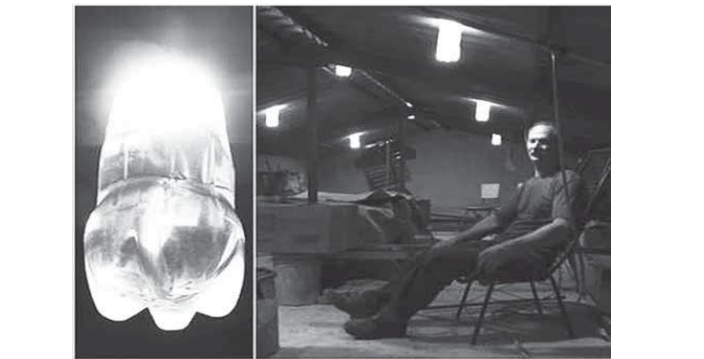

ZOBEL, G. Brasileiro inventor de “luz engarrafada” tem ideia espalhada pelo mundo. Disponível em: www.bbc.com. Acesso em: 23 jun. 2022 (adaptado).

Que fenômeno óptico explica o funcionamento da “luz engarrafada”?

A Difração.

B Absorção.

Polarização.

D Reflexão.

E Refração.

#  Questão 005 (H1 | 2016 | 606,0) ①②③④⑤

O morcego emite pulsos de curta duração de ondas ultrassônicas, os quais voltam na forma de ecos após atingirem objetos no ambiente, trazendo informações a respeito das suas dimensões, suas localizações e dos seus possíveis movimentos. Isso se dá em razão da sensibilidade do morcego em detectar o tempo gasto para os ecos voltarem, bem como das pequenas variações nas frequências e nas intensidades dos pulsos ultrassônicos. Essas características lhe permitem caçar pequenas presas mesmo quando estão em movimento em relação a si. Considere uma situação unidimensional em que uma mariposa se afasta, em movimento retilíneo e uniforme, de um morcego em repouso.

A distância e velocidade da mariposa, na situação descrita, seriam detectadas pelo sistema de um morcego por quais alterações nas características dos pulsos ultrassônicos?

A Intensidade diminuída, o tempo de retorno aumentado e a frequência percebida diminuída.

B Intensidade aumentada, o tempo de retorno diminuído e a frequência percebida diminuída.

Intensidade diminuída, o tempo de retorno diminuído e a frequência percebida aumentada.

D Intensidade diminuída, o tempo de retorno aumentado e a frequência percebida aumentada.

E Intensidade aumentada, o tempo de retorno aumentado e a frequência percebida aumentada.

#  Questão 006 (H1 | 2021 | 623,2) ①②③④⑤

O eletrocardiograma é um exame cardíaco que mede a intensidade dos sinais elétricos advindos do coração. A imagem apresenta o resultado típico obtido em um paciente saudável e a intensidade do sinal (VEC ) em função do tempo.

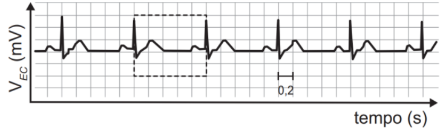

De acordo com o eletrocardiograma apresentado, qual foi o número de batimentos cardíacos por minuto desse paciente durante o exame?

A 30

B 60

©100

D 120

E 180

##  Questão 007 (H1 | 2018 | 642,9) ①②③④⑤

O sonorizador é um dispositivo físico implantado sobre a superfície de uma rodovia de modo que provoque uma trepidação e ruído quando da passagem de um veículo sobre ele, alertando para uma situação atípica à frente, como obras, pedágios ou travessia de pedestres. Ao passar sobre os sonorizadores, a suspensão do veículo sofre vibrações que produzem ondas sonoras, resultando em um barulho peculiar. Considere um veículo que passe com velocidade constante igual a 108 km/h sobre um sonorizador cujas faixas são separadas por uma distância de 8 cm.

Disponível em: www.denatran.gov.br. Acesso em: 2 set. 2015
(adaptado).

A frequência da vibração do automóvel percebida pelo condutor durante a passagem nesse sonorizador é mais próxima de

A 8,6 hertz.

Ⓑ 13,5 hertz.

© 375 hertz.

D 1 350 hertz.

E 4860 hertz.

#  Questão 008 (H1 | 2013 | 658,4) ①②③④⑤

Uma manifestação comum das torcidas em estádios de futebol é a ola mexicana. Os espectadores de uma linha, sem sair do lugar e sem se deslocarem lateralmente, ficam de pé e se sentam, sincronizados com os da linha adjacente. O efeito coletivo se propaga pelos espectadores do estádio, formando uma onda progressiva, conforme ilustração.

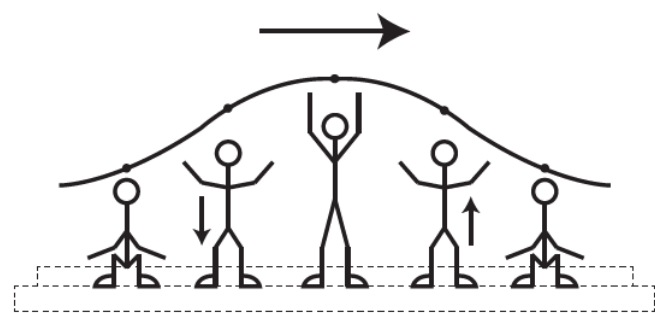

Calcula-se que a velocidade de propagação dessa "onda humana" é 45 km/h, e que cada período de oscilação contém 16 pessoas, que se levantam e sentam organizadamente e distanciadas entre si por 80 cm.

Disponível em: www.ufsm.br. Acesso em: 7 dez. 2012 (adaptado). Nessa ola mexicana, a frequência da onda, em hertz, é um valor mais próximo de

A 0,3.

B 0,5.

● 1,0.

D 1,9.

E 3,7.

A acuidade visual associada à redução das pupilas é fisicamente explicada pela diminuição

A da intensidade luminosa incidente na retina.

da difração dos feixes luminosos que atravessam a pupila.

da intensidade dos feixes luminosos em uma direção por polarização.

do desvio dos feixes luminosos refratados no interior do olho.

E das reflexões dos feixes luminosos no interior do olho.

#  Questão 010 (H1 | 2017 | 662,1) ①②③④⑤

O trombone de Quincke é um dispositivo experimental utilizado para demonstrar o fenômeno da interferência de ondas sonoras. Uma fonte emite ondas sonoras de determinada frequência na entrada do dispositivo. Essas ondas se dividem pelos dois caminhos (ADC e AEC) e se encontram no ponto C, a saída do dispositivo, onde se posiciona um detector. O trajeto ADC pode ser aumentado pelo deslocamento dessa parte do dispositivo. Com o trajeto ADC igual ao AEC, capta-se um som muito intenso na saída. Entretanto, aumentando-se gradativamente o trajeto ADC, até que ele fique como mostrado na figura, a intensidade do som na saída fica praticamente nula. Desta forma, conhecida a velocidade do som no interior do tubo (320 m/s), é possível determinar o valor da frequência do som produzido pela fonte.

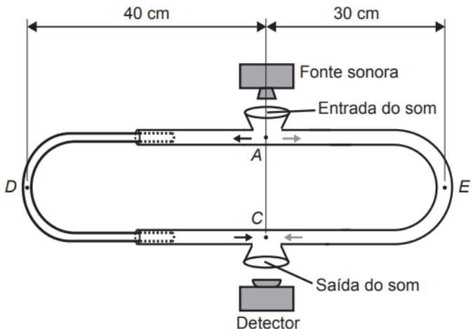

O valor da frequência, em hertz, do som produzido pela fonte sonora é

A 3200.

B 1 600.

800.

D 640.

E 400.

#  Questão 011 (H1 | 2021 | 665,7) ①②③④⑤

O sino dos ventos é composto por várias barras metálicas de mesmo material e espessura, mas de comprimentos diferentes, conforme a figura.

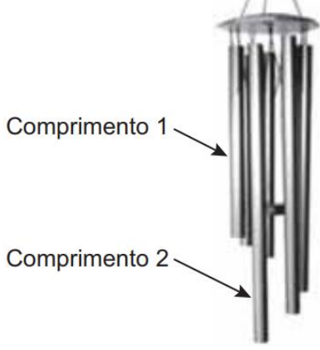

Considere $f_1$ e $v_1$, respectivamente, como a frequência fundamental e a velocidade de propagação do som emitido pela barra de menor comprimento, e $f_2$ e $v_2$ são essas mesmas grandezas para o som emitido pela barra de maior comprimento.

As relações entre as frequências fundamentais e entre as velocidades de propagação são, respectivamente,

A $f_1 < f_2 e v_1 < v_2$.

B $f_1 < f_2 e v_1 = v_2$.

ⓒ  $f_1<f_2~e~v_1>v_2.$

D $f_1 > f_2 e v_1 = v_2$.

E $f_1 > f_2 e v_1 > v_2$.

#  Questão 012 (H1 | 2015 | 666,0) ①②③④⑤

Será que uma miragem ajudou a afundar o Titanic? O fenômeno ótico conhecido como Fata Morgana pode fazer com que uma falsa parede de água apareça sobre o horizonte molhado. Quando as condições são favoráveis, a luz refletida pela água fria pode ser desviada por uma camada incomum de ar quente acima, chegando até o observador, vinda de muitos ângulos diferentes. De acordo com estudos de pesquisadores da Universidade de San Diego, uma Fata Morgana pode ter obscurecido os icebergs da visão da tripulação que estava a bordo do Titanic. Dessa forma, a certa distância, o horizonte verdadeiro fica encoberto por uma névoa escurecida, que se parece muito com águas calmas no escuro.

O fenômeno ótico que, segundo os pesquisadores, provoca a Fata Morgana é a

A ressonância.

B refração.

© difração.

D reflexão.

E difusão.

##  Questão 013 (H1 | 2019 | 666,7) ①②③④⑤

Quando se considera a extrema velocidade com que a luz se espalha por todos os lados e que, quando vêm de diferentes lugares, mesmo totalmente opostos, [os raios luminosos] se atravessam uns aos outros sem se atrapalharem, compreende-se que, quando vemos um objeto luminoso, isso não poderia ocorrer pelo transporte de uma matéria que venha do objeto até nós, como uma flecha ou bala atravessa o ar; pois certamente isso repugna bastante a essas duas propriedades da luz, principalmente a última.

HUYGENS, C. In: MARTINS, R. A. Tratado sobre a luz, de Cristian Huygens. Caderno de História e Filosofia da Ciência, supl. 4, 1986.

O texto contesta que concepção acerca do comportamento da luz?

A O entendimento de que a luz precisa de um meio de propagação, difundido pelos defensores da existência do éter.

B O modelo ondulatório para a luz, o qual considera a possibilidade de interferência entre feixes luminosos.

© O modelo corpuscular defendido por Newton, que descreve a luz como um feixe de partículas.

D A crença na velocidade infinita da luz, defendida pela maioria dos filósofos gregos.

A ideia defendida pelos gregos de que a luz era produzida pelos olhos.

#  Questão 014 (H1 | 2020 | 669,5) ①②③④⑤

Os fones de ouvido tradicionais transmitem a música diretamente para os nossos ouvidos. Já os modelos dotados de tecnologia redutora de ruído — Cancelamento de Ruído (CR) — além de transmitirem música, também reduzem todo ruído inconsistente à nossa volta, como o barulho de turbinas de avião e aspiradores de pó. Os fones de ouvido CR não reduzem realmente barulhos irregulares como discursos e choros de bebês. Mesmo assim, a supressão do ronco das turbinas do avião contribui para reduzir a “fadiga de ruído”, um cansaço persistente provocado pela exposição a um barulho alto por horas a fio. Esses aparelhos também permitem que nós ouçamos músicas ou assistamos a vídeos no trem ou no avião a um volume muito menor (e mais seguro).

Disponível em: http://tecnologia.uol.com.br. Acesso em: 21 abr. 2015 (adaptado).

A tecnologia redutora de ruído CR utilizada na produção de fones de ouvido baseia-se em qual fenômeno ondulatório?

A Absorção.

B Interferência.

Polarização.

D Reflexão.

E Difração.

#  Questão 015 (H1 | 2013 | 670,5) ①② ④⑤

Em um piano, o Dó central e a próxima nota Dó (Dó maior) apresentam sons parecidos, mas não idênticos. É possível utilizar programas computacionais para expressar o formato dessas ondas sonoras em cada uma das situações como apresentado nas figuras, em que estão indicados intervalos de tempo idênticos (T).

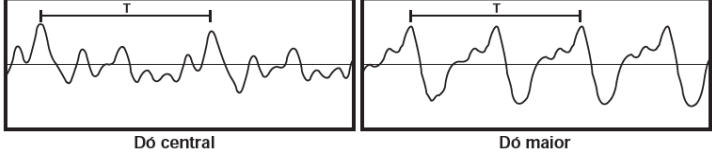

A razão entre as frequências do Dó central e do Dó maior é de:

① $\frac{1}{2}$

B 2.

© 1.

D $\frac{1}{4}$

Ⓑ4.

#  Questão 016 (H1 | 2014 | 685,9) ①②③④⑤

Ao sintonizarmos uma estação de rádio ou um canal de TV em um aparelho, estamos alterando algumas características elétricas de seu circuito receptor. Das inúmeras ondas eletromagnéticas que chegam simultaneamente ao receptor, somente aquelas que oscilam com determinada frequência resultarão em máxima absorção de energia.

O fenômeno descrito é a

A difração.

B refração.

polarização.

D interferência.

E ressonância.

##  Questão 017 (H1 | 2014 | 692,6) ①②③⑤

Christiaan Huygens, em 1656, criou o relógio de pêndulo. Nesse dispositivo, a pontualidade baseia-se na regularidade das pequenas oscilações do pêndulo. Para manter a precisão desse relógio, diversos problemas foram contornados. Por exemplo, a haste passou por ajustes até que, no início do século XX, houve uma inovação, que foi sua fabricação usando uma liga metálica que se comporta regularmente em um largo intervalo de temperaturas.

YODER, J. G. Unrolling Time: Christiaan Huygens and the mathematization of nature. Cambridge: Cambridge University Press, 2004 (adaptado).

Desprezando a presença de forças dissipativas e considerando a aceleração da gravidade constante, para que esse tipo de relógio realize corretamente a contagem do tempo, é necessário que o(a)

A comprimento da haste seja mantido constante.

B massa do corpo suspenso pela haste seja pequena.

© material da haste possua alta condutividade térmica.

D amplitude da oscilação seja constante a qualquer temperatura.

E energía potencial gravitacional do corpo suspenso se mantenha constante.

#  Questão 018 (H1 | 2023 | 702,0) ①②③④⑤

Informações digitais – dados – são gravadas em discos ópticos, como CD e DVD, na forma de cavidades microscópicas. A gravação e a leitura óptica dessas informações são realizadas por um laser (fonte de luz monocromática). Quanto menores as dimensões dessas cavidades, mais dados são armazenados na mesma área do disco. O fator limitante para a leitura de dados é o espalhamento da luz pelo efeito de difração, fenômeno que ocorre quando a luz atravessa um obstáculo com dimensões da ordem de seu comprimento de onda. Essa limitação motivou o desenvolvimento de lasers com emissão em menores comprimentos de onda, possibilitando armazenar e ler dados em cavidades cada vez menores.

Em qual região espectral se situa o comprimento de onda do laser que otimiza o armazenamento e a leitura de dados em discos de uma mesma área?

A Violeta.

B Azul.

C Verde.

D Vermelho.

E Infravermelho.

#  Questão 019 (H1 | 2023 | 706,7) ①②③ ⑤

Na tirinha de Maurício de Sousa, os personagens Cebolinha e Cascão fazem uma brincadeira utilizando duas latas e um barbante. Ao perceberem que o som pode ser transmitido através do barbante, resolvem alterar o comprimento do barbante para ficar cada vez mais extenso. As demais condições permaneceram inalteradas durante a brincadeira.

SOUSA, M. Disponível em: www.monica.com.br. Acesso em: 2 out. 2012 (adaptado).

Na prática, à medida que se aumenta o comprimento do barbante, ocorre a redução de qual característica da onda sonora?

A Altura.

B Período.

C Amplitude.

D Velocidade.

E Comprimento de onda.

#  Questão 020 (H1 | 2018 | 707,7) ①②③④⑤

A figura representa um prisma óptico, constituído de um material transparente, cujo índice de refração é crescente com a frequência da luz que sobre ele incide. Um feixe luminoso, composto por luzes vermelha, azul e verde, incide na face A, emerge na face B e, após ser refletido por um espelho, incide num filme para fotografia colorida, revelando três pontos.

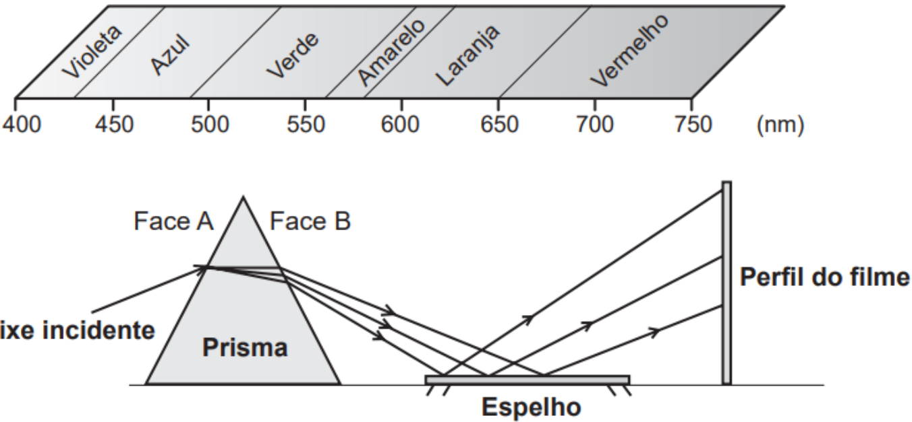

Observando os pontos luminosos revelados no filme, de baixo para cima, constatam-se as seguintes cores:

A Vermelha, verde, azul.

B Verde, vermelha, azul.

Azul, verde, vermelha.

D Verde, azul, vermelha.

E Azul, vermelha, verde.

#  Questão 021 (H1 | 2016 | 719,6) ①②③④⑤

Uma ambulância A em movimento retílineo e uniforme aproxima-se de um observador O, em repouso. A sirene emite um som de frequência constante $f_A$. O desenho ilustra as frentes de onda do som emitido pela ambulância. O observador possui um detector que consegue registrar, no esboço de um gráfico, a frequência da onda sonora detectada em função do tempo $f_O(t)$, antes e depois da passagem da ambulância por ele.

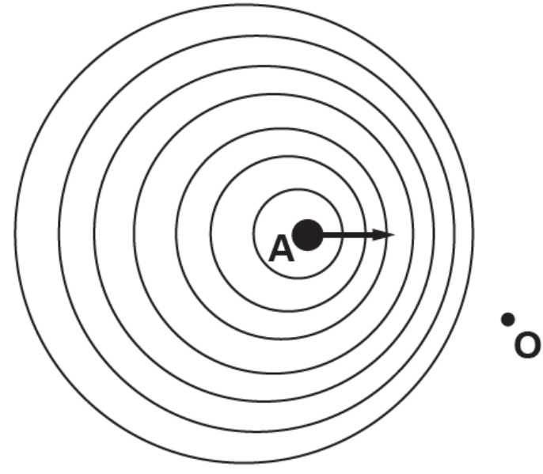

Qual esboço gráfico representa a frequência $f_0(t)$ detectada pelo observador?

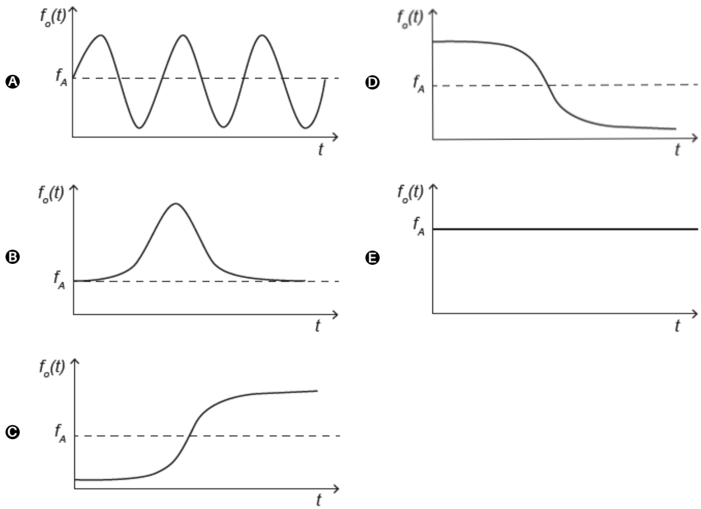

#  Questão 022 (H1 | 2017 | 746,8) ①②③④ ⑤

O brinquedo pula-pula (cama elástica) é composto por uma lona circular flexível horizontal presa por molas à sua borda. As crianças brincam pulando sobre ela, alterando e suas formas de energia. Ao pular verticalmente, desprezando o atrito com o ar e os movimentos de rotação do corpo enquanto salta, uma criança realiza um movimento periódico vertical em torno da posição de equilíbrio da lona ($h = 0$), passando pelos pontos de máxima e de mínima alturas, $h_{máx}$ e $h_{mín}$, respectivamente.

Esquematicamente, o esboço do gráfico da energia cinética da criança em função de sua posição vertical na situação descrita é

A

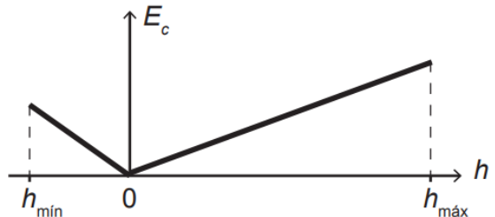

B

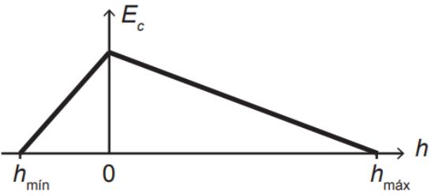

©

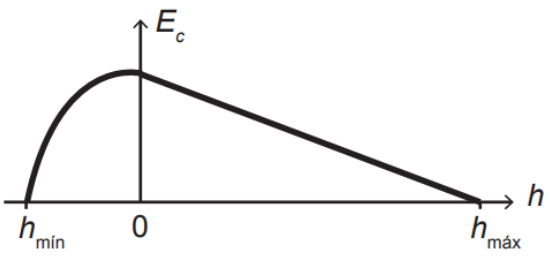

D

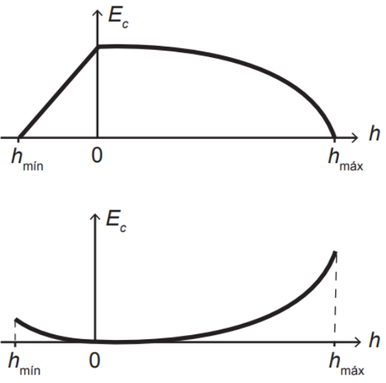

#  Questão 023 (H1 | 2020 | 762,9) ①②③④⑤

Dois engenheiros estão verificando se uma cavidade perfurada no solo está de acordo com o planejamento de uma obra, cuja profundidade requerida é de 30 m. O teste é feito por um dispositivo denominado oscilador de áudio de frequência variável, que permite relacionar a profundidade com os valores da frequência de duas ressonâncias consecutivas, assim como em um tubo sonoro fechado. A menor frequência de ressonância que o aparelho mediu foi 135 Hz. Considere que a velocidade do som dentro da cavidade perfurada é de 360 m $s^{-1}$.

Se a profundidade estiver de acordo com o projeto, qual será o valor da próxima frequência de ressonância que será medida?

A 137 Hz

B 138 Hz

© 141 Hz

Ⓓ 144 Hz

E 159 Hz

#  Questão 024 (H1 | 2015 | 916,1) ①②③④⑤

Certos tipos de superfícies na natureza podem refletir luz de forma a gerar um efeito de arco-íris. Essa característica é conhecida como iridescência e ocorre por causa do fenômeno da interferência de película fina. A figura ilustra o esquema de uma fina camada iridescente de óleo sobre uma poça d'água. Parte do feixe de luz branca incidente ① reflete na interface ar/óleo e sofre inversão de fase ② o que equivale a uma mudança de meio comprimento de onda. A parte refratada do feixe ③ incide na interface óleo/água e sofre reflexão sem inversão de fase ④. O observador indicado enxergará aquela região do filme com coloração equivalente à do comprimento de onda que sofre interferência completamente construtiva entre os raios ② e ⑤, mas essa condição só é possível para uma espessura mínima da película. Considere que o caminho percorrido em ③ e ④ corresponde ao dobro da espessura E da película de óleo.

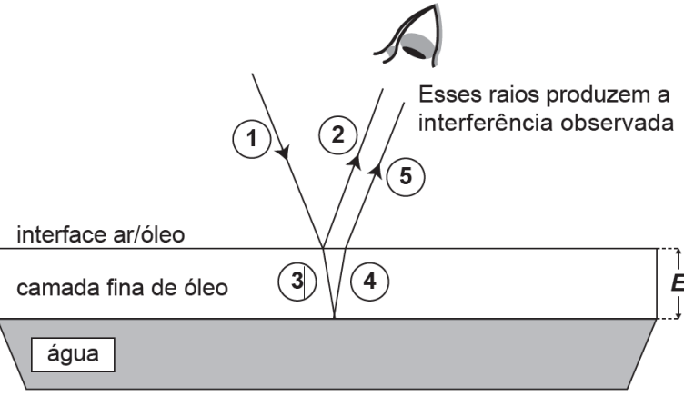

Disponível em: http://2011.igem.org. Acesso em: 18 nov. 2014
(adaptado).

Expressa em termos do comprimento de onda $(\lambda)$, a espessura mínima é igual a

A $\frac{\lambda}{4}$.

B $\frac{\lambda}{2}$.

© $\frac{3\lambda}{4}$.

D $\lambda$ .

E 2λ.

#  Questão 025 (H1 | 2022 | Anulada pela TRI)

O sinal sonoro oriundo da queda de um grande bloco de gelo de uma geleira é detectado por dois dispositivos situados em um barco, sendo que o detector A está imerso em água e o B, na proa da embarcação. Saba se que a velocidade do som na

água é de 1 540 $\frac{m}{s}$ e no ar é de 340 $\frac{m}{s}$.

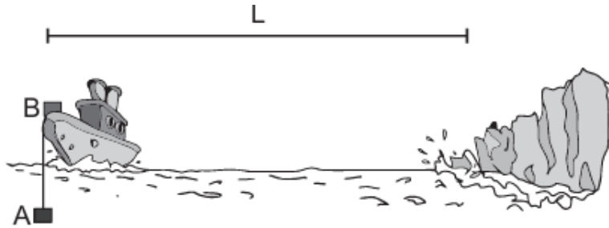

Os gráficos indicam, em tempo real, o sinal sonoro detectado pelos dois dispositivos, os quais foram ligados simultaneamente em um instante anterior à queda do bloco de gelo. Ao comparar pontos correspondentes desse sinal em cada dispositivo, é possível obter informações sobre a onda sonora.

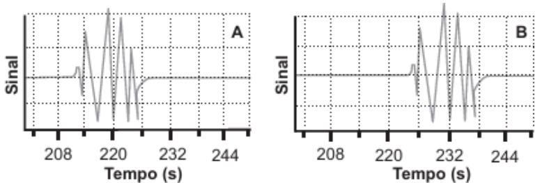

A distância L, em metro, entre o barco e a geleira é mais próxima de

A 339 000.

B 78 900.

© 14 400.

D 5 240.

E 100.

#  Competência 1

Compreender as ciências naturais e as tecnologias a elas associadas como construções humanas, percebendo seus papéis nos processos de produção e no desenvolvimento econômico e social da humanidade.

#  Habilidade 2

Associar a solução de problemas de comunicação, transporte, saúde ou outro, com o correspondente desenvolvimento científico e tecnológico.

##  Questão 026 (H2 | 2023 | 454,4) ①②③④⑤

É comum em viagens de avião sermos solicitados a desligar aparelhos cujo funcionamento envolva a emissão ou a recepção de ondas eletromagnéticas, como celulares. A justificativa dada para esse procedimento é, entre outras coisas, a necessidade de eliminar fontes de sinais eletromagnéticos que possam interferir nas comunicações, via rádio, dos pilotos com a torre de controle.

Essa interferência poderá ocorrer somente se as ondas emitidas pelo celular e as recebidas pelo rádio do avião

A forem ambas audíveis.

B tiverem a mesma potência.

tiverem a mesma frequência.

D tiverem a mesma intensidade.

E propagarem-se com velocidades diferentes.

##  Questão 027 (H2 | 2018 | 537,9) ①②③④⑤

Companhias que fabricam jeans usam cloro para o clareamento, seguido de lavagem. Algumas estão substituindo o cloro por substâncias ambientalmente mais seguras como peróxidos, que podem ser degradados por enzimas chamadas peroxidases. Pensando nisso, pesquisadores inseriram genes codificadores de peroxidases em leveduras cultivadas nas condições de clareamento e lavagem dos jeans e selecionaram as sobreviventes para produção dessas enzimas.

TORTORA, G. J.; FUNKE, B. R.; CASE, C. L. Microbiologia. Rio de Janeiro: Artmed, 2016 (adaptado).

Nesse caso, o uso dessas leveduras modificadas objetiva

A reduzir a quantidade de resíduos tóxicos nos efluentes da lavagem.

Ⓑ eliminar a necessidade de tratamento da água consumida.

elevar a capacidade de clareamento dos jeans.

D aumentar a resistência do jeans a peróxidos.

E associar ação bactericida ao clareamento.

##  Questão 028 (H2 | 2015 | 555,0) ①②③④⑤

Tanto a febre amarela quanto a dengue são doenças causadas por vírus do grupo dos arbovírus, pertencentes ao gênero Flavivirus, existindo quatro sorotipos para o vírus causador da dengue. A transmissão de ambas acontece por meio da picada de mosquitos, como o Aedes aegypti. Entretanto, embora compartilhem essas características, hoje somente existe vacina, no Brasil, para a febre amarela e nenhuma vacina efetiva para a dengue.

MINISTÉRIO DA SAÚDE. Fundação Nacional de Saúde. Dengue: Instruções para pessoal de combate ao vetor. Manual de Normas Técnicas. Disponível em: http://portal.saude.gov.br. Acesso em: 7 ago. 2012 (adaptado).

Esse fato pode ser atribuído à

A maior taxa de mutação do vírus da febre amarela do que do vírus da dengue.

B alta variabilidade antigênica do vírus da dengue em relação ao vírus da febre amarela.

menor adaptação do vírus da dengue à população humana do que do vírus da febre amarela.

Ⓓ presença de dois tipos de ácidos nucleicos no vírus da dengue e somente um tipo no vírus da febre amarela.

E baixa capacidade de indução da resposta imunológica pelo vírus da dengue em relação ao da febre amarela.

#  Questão 029 (H2 | 2021 | 559,1) 1 ②③④⑤

O emprego de células de combustível a hidrogênio pode ser uma tecnologia adequada ao transporte automotivo. O quadro apresenta características de cinco tecnologias mais proeminentes de células de combustível.

| Tipo de célula de combustível | Temperatura operacional (°C) | Eletrólito | Semirreações nos eletrodos |
| --- | --- | --- | --- |
| AFC | 90 - 100 | Hidróxido de potássio aquoso | $H_{2}$ + 2 $OH^{-}$ → 2 $H_{2}O$ + 2 $e^{-}$1/2 $O_{2}$ + $H_{2}O$ + 2 $e^{-}$ → 2 $OH^{-}$ |
| MSFC | 600 - 1 000 | Carbonatos de lítio, sódio e/ou potássio fundidos | $H_{2}$ + $CO_{3}^{2-}$ → $H_{2}O$ + $CO_{2}$ + 2 $e^{-}$1/2 $O_{2}$ + $CO_{2}$ + 2 $e^{-}$ → $CO_{3}^{2-}$ |
| PEM | 60 - 100 | Ácido poliperfluorossulfônico sólido | $H_{2}$ → 2 $H^{+}$ + 2 $e^{-}$1/2 $O_{2}$ + 2 $H^{+}$ + 2 $e^{-}$ → $H_{2}O$ |
| PAFC | 175 - 200 | Ácido fosfórico líquido | $H_{2}$ → 2 $H^{+}$ + 2 $e^{-}$1/2 $O_{2}$ + 2 $H^{+}$ + 2 $e^{-}$ → $H_{2}O$ |
| SOFC | 600 - 1 000 | Óxido de zircônio(IV) sólido | $H_{2}$ → 2 $H^{+}$ + 2 $e^{-}$1/2 $O_{2}$ + 2 $H^{+}$ + 2 $e^{-}$ → $H_{2}O$ |

Testes operacionais com esses tipos de células têm indicado que as melhores alternativas para veículos são as que operam em baixos níveis de energia térmica, são formadas por membranas de eletrólitos poliméricos e ocorrem em meio ácido.

THOMAS, S; ZALBOWITZ, M. Full cells: green power. Los Alamos National Laboratory. Los Alamos, NM, 1999 (adaptado).

A tecnología testada mais adequada para o emprego em veículos automotivos é a célula de combustível

A AFC.

B MSFC.

C PEM.

D PAFC.

E SOFC.

#  Questão 030 (H2 | 2017 | 591,2) ①②③④⑤

Em uma colisão frontal entre dois automóveis, a força que o cinto de segurança exerce sobre o tórax e abdômen do motorista pode causar lesões graves nos órgãos internos. Pensando na segurança do seu produto, um fabricante de automóveis realizou testes em cinco modelos diferentes de cinto. Os testes simularam uma colisão de 0,30 segundo de duração, e os bonecos que representavam os ocupantes foram equipados com acelerômetros. Esse equipamento registra o módulo da desaceleração do boneco em função do tempo. Os parâmetros como massa dos bonecos, dimensões dos cintos e velocidade imediatamente antes e após o impacto foram os mesmos para todos os testes. O resultado final obtido está no gráfico de aceleração por tempo.

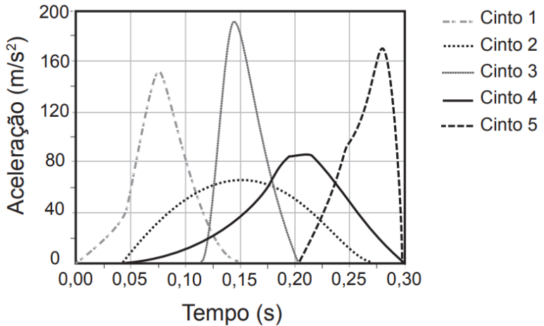

Qual modelo de cinto oferece menor risco de lesão interna ao motorista?

A 1

B 2

©3

D 4

E 5

#  Questão 031 (H2 | 2019 | 607,5) ①②③④⑤

O “The Kidney Project” é um projeto realizado por cientistas que pretendem desenvolver um rim biônico que executará a maioria das funções biológicas do órgão. O rim biônico possuirá duas partes que incorporam recentes avanços de nanotecnologia, filtração de membrana e biologia celular. Esse projeto significará uma grande melhoria na qualidade de vida para aquelas pessoas que dependem da hemodiálise para sobrevivência.

O dispositivo criado promoverá diretamente a

A remoção da ureia.

B excreção de lipídios.

© síntese de vasopressina.

D transformação de amônia.

E fabricação de aldosterona.

##  Questão 032 (H2 | 2012 | 609,6) ①②③④⑤

Para diminuir o acúmulo de lixo e o desperdício de materiais de valor econômico e, assim, reduzir a exploração de recursos naturais, adotou-se, em escala internacional, a política dos três erres: Redução, Reutilização e Reciclagem.

Um exemplo de reciclagem é a utilização de

A garrafas de vidro retornáveis para cerveja ou refrigerante.

B latas de alumínio como material para fabricação de lingotes.

© sacos plásticos de supermercado como acondicionantes de lixo caseiro.

D embalagens plásticas vazias e limpas para acondicionar outros alimentos.

E garrafas PET recortadas em tiras para fabricação de cerdas de vassouras.

#  Questão 033 (H2 | 2017 | 611,2) ①②③④⑤

Os medicamentos são rotineiramente utilizados pelo ser humano com o intuito de diminuir ou, por muitas vezes, curar possíveis transtornos de saúde. Os antibióticos são grupos de fármacos inseridos no tratamento de doenças causadas por bactérias.

Na terapêutica das doenças mencionadas, alguns desses fármacos atuam

A ativando o sistema imunológico do hospedeiro.

B interferindo na cascata bioquímica da inflamação.

Removendo as toxinas sintetizadas pelas bactérias.

Ⓓ combatendo as células hosppedeiras das bactérias.

E danificando estruturas específicas da célula bacteriana.

#  Questão 034 (H2 | 2022 | 620,5) ①②③④⑤

A fim de classificar as melhores rotas em um aplicativo de trânsito, um pesquisador propõe um modelo com base em circuitos elétricos. Nesse modelo, a corrente representa o número de carros que passam por um ponto da pista no intervalo de 1 s. A diferença de potencial (d.d.p.) corresponde à quantidade de energia por carro necessária para o deslocamento de 1 m. De forma análoga à lei de Ohm, cada via é classificada pela sua resistência, sendo a de maior resistência a mais congestionada. O aplicativo mostra as rotas em ordem crescente, ou seja, da rota de menor para a de maior resistência.

Como teste para o sistema, são utilizadas três possíveis vias para uma viagem de A até B, com os valores de d.d.p. e corrente conforme a tabela.

| Rota | d.d.p. $\left(\frac{J}{carro \cdot m}\right)$ | Corrente $\left(\frac{carro}{s}\right)$ |
| --- | --- | --- |
| 1 | 510 | 4 |
| 2 | 608 | 4 |
| 3 | 575 | 3 |

Nesse teste, a ordenação das rotas indicadas pelo aplicativo será

A 1, 2, 3.

B 1, 3, 2.

© 2, 1, 3.

ⓑ 3,1,2.

E 3,2,1.

#  Questão 035 (H2 | 2023 | 621,0) ①②③④⑤

Para que uma molécula dê origem a um medicamento de administração oral, além de apresentar atividade farmacológica, deve ser capaz de atingir o local de ação. Para tanto, essa molécula não deve se degradar no estômago (onde o meio é fortemente ácido e há várias enzimas que reagem mediante catálise ácida), deve ser capaz de atravessar as membranas celulares e ser solúvel no plasma sanguíneo (sistema aquoso). Para os fármacos cujas estruturas são formadas por cadeias carbônicas longas contendo pelo menos um grupamento amino, um recurso tecnológico empregado é sua conversão no cloridrato correspondente. Essa conversão é representada, de forma genérica, pela equação química:

$$R_3N + HCl \rightarrow (R_3NH)^+Cl^-$$

O aumento da eficiência de circulação do fármaco no sangue, promovido por essa conversão, deve-se ao incremento de seu(sua)

A basicidade.

B lipofilicidade.

© caráter iônico.

Ⓓ cadeia carbônica.

E estado de oxidação.

##  Questão 036 (H2 | 2014 | 639,6) ①②③④⑤

Na década de 1990, células do cordão umbilical de recém-nascidos humanos começaram a ser guardadas por criopreservação, uma vez que apresentam alto potencial terapêutico em consequência de suas características peculiares.

O poder terapêutico dessas células baseia-se em sua capacidade de

A multiplicação lenta.

B comunicação entre células.

adesão a diferentes tecidos.

D diferenciação em células especializadas.

E reconhecimento de células semelhantes.

#  Questão 037 (H2 | 2022 | 642,4) ①②③④⑤

O protozoário Trypanosoma cruzi, causador da doença de Chagas, pode ser a nova arma da medicina contra o câncer. Pesquisadores brasileiros conseguiram criar uma vacina contra a doença usando uma variação do protozoário incapaz de desencadear a patologia (não patogênico). Para isso, realizaram uma modificação genética criando um T. cruzi capaz de produzir também moléculas fabricadas pelas células tumorais. Quando o organismo inicia o combate ao protozoário, entra em contato também com a molécula tumoral, que passa a ser vista também pelo sistema imune como um indicador de células do protozoário. Depois de induzidas as defesas, estas passam a destruir todas as células com a molécula tumoral, como se lutassem apenas contra o protozoário.

Disponível em: www.estadao.com.br. Acesso em: 1 mar. 2012 (adaptado). Qual o mecanismo utilizado no experimento para enganar as células de defesa, fazendo com que ataquem o tumor?

A Autoimunidade.

B Hipersensibilidade.

C Ativação da resposta inata.

D Apresentação de antígeno específico.

E Desencadeamento de processo anti-inflamatório.

#  Questão 038 (H2 | 2020 | 657,2) ①②③④⑤

Pesquisadores dos Estados Unidos desenvolveram uma nova técnica, que utiliza raios de luz infravermelha (invisíveis a olho nu) para destruir tumores. Primeiramente, o paciente recebe uma injeção com versões modificadas de anticorpos que têm a capacidade de “grudar” apenas nas células cancerosas. Sozinhos, eles não fazem nada contra o tumor. Entretanto, esses anticorpos estão ligados a uma molécula, denominada IR700, que funcionará como uma “microbomba”, que irá destruir o câncer. Em seguida, o paciente recebe raios infravermelhos. Esses raios penetram no corpo e chegam até a molécula IR700, que é ativada e libera uma substância que ataca a célula cancerosa.

Disponível em: http://super.abril.com.br. Acesso em: 13 dez. 2012 (adaptado).

Com base nas etapas de desenvolvimento, o nome apropriado para a técnica descrita é

A Radioterapia.

B Cromoterapia.

Quimioterapia.

D Fotoimunoterapia.

E Terapia magnética.

##  Questão 039 (H2 | 2012 | 658,3) ①②③④⑤

Os freios ABS são uma importante medida de segurança no trânsito, os quais funcionam para impedir o travamento das rodas do carro quando o sistema de freios é acionado, liberando as rodas quando estão no limiar do deslizamento. Quando as rodas travam, a força de frenagem é governada pelo atrito cinético.

As representações esquemáticas da força de atrito $f_{at}$ entre os pneus e a pista, em função da pressão $p$ aplicada no pedal de freio, para carros sem ABS e com ABS, respectivamente, são:

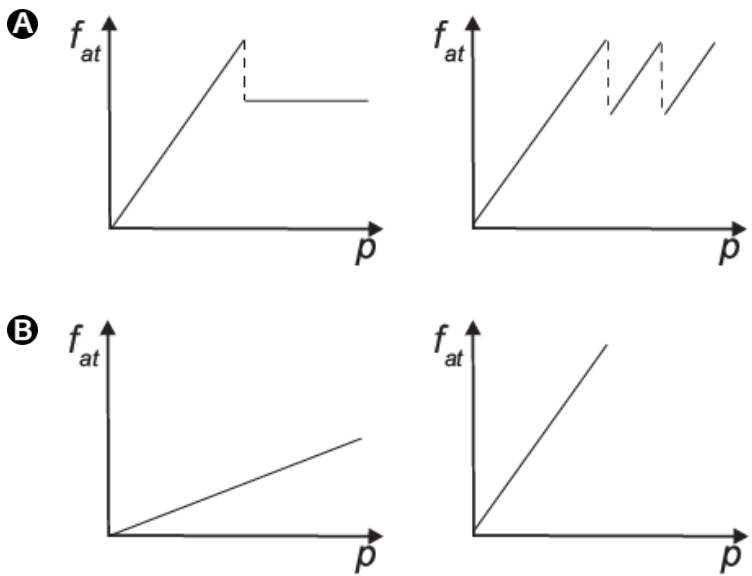

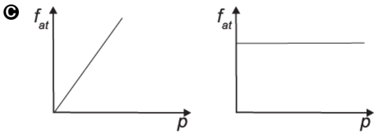

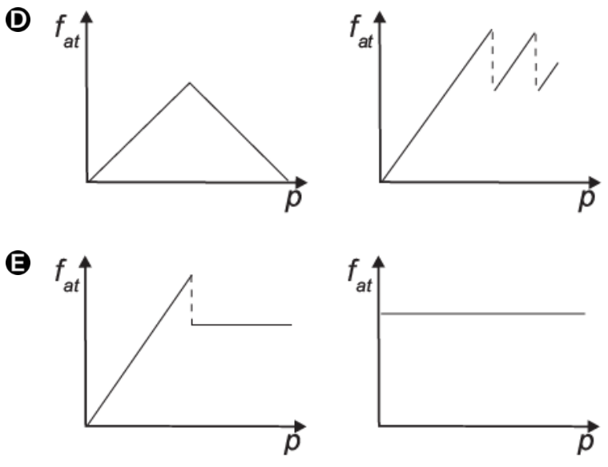

Questão 040 (H2 | 2016 | 658,7) ①②③④⑤

A lipofilia é um dos fatores fundamentais para o planejamento de um fármaco. Ela mede o grau de afinidade que a substância tem com ambientes apolares, podendo ser avaliada por seu coeficiente de partição.

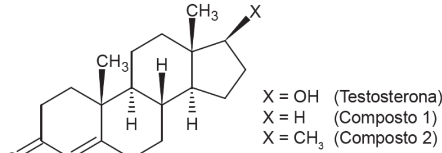

NOGUEIRA, L. J.; MONTANARI, C. A.; DONNICI, C. L. Histórico da evolução da química medicinal e a importância da lipofilia: de Hipócrates e Galeno a Paracelsus e as contribuições de Overton e de Hansch. Revista Virtual de Química, n. 3, 2009 (adaptado).

Em relação ao coeficiente de partição da testosterona, as lipofilias dos compostos 1 e 2 são, respectivamente,

A menor e menor que a lipofilia da testosterona.

B menor e maior que a lipofilia da testosterona.

© maior e menor que a lipofilia da testosterona.

D maior e maior que a lipofilia da testosterona.

E menor e igual à lipofilia da testosterona.

Questão 041 (H2 | 2016 | 665,8) ①②③④⑤

Uma invenção que significou um grande avanço tecnológico na Antiguidade, a polia composta ou a associação de polias, é atribuída a Arquimedes (287 a.C. a 212 a.C.). O aparato consiste em associar uma série de polias móveis a uma polia fixa. A figura exemplifica um arranjo possível para esse aparato. É relatado que Arquimedes teria demonstrado para o rei Hierão um outro arranjo desse aparato, movendo sozinho, sobre a areia da praia, um navio repleto de passageiros e cargas, algo que seria impossível sem a participação de muitos homens. Suponha que a massa do navio era de 3 000 kg, que o coeficiente de atrito estático entre o navio e a areia era de 0,8 e que Arquimedes tenha puxado o navio com uma força $\bar{F}$, paralela à direção do movimento e de módulo igual a 400 N. Considere os fios e as polias ideais, a aceleração da gravidade igual a 10 m/s$^{2}$ e que a superfície da praia é perfeitamente horizontal.

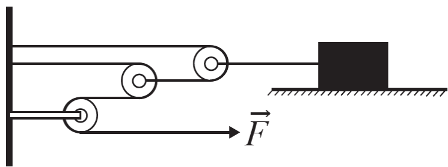

Disponível em: www.histedbr.fae.unicamp.br. Acesso em: 28 fev. 2013 (adaptado).

O número mínimo de polias móveis usadas, nessa situação, por Arquimedes foi

A 3

B 6

C 7

D 8

E 10.

Questão 042 (H2 | 2013 | 671,3) ①②③④⑤

Para oferecer acessibilidade aos portadores de dificuldades de locomoção, é utilizado, em ônibus e automóveis, o elevador hidráulico. Nesse dispositivo é usada uma bomba elétrica, para forçar um fluido a passar de uma tubulação estreita para outra mais larga, e dessa forma acionar um pistão que movimenta a plataforma. Considere um elevador hidráulico cuja área da cabeça do pistão seja cinco vezes maior do que a área da tubulação que sai da bomba. Desprezando o atrito e considerando uma aceleração gravitacional de 10 m/s$^{2}$, deseja-se elevar uma pessoa de 65 kg em uma cadeira de rodas de 15 kg sobre a plataforma de 20 kg.

Qual deve ser a força exercida pelo motor da bomba sobre o fluido, para que o cadeirante seja elevado com velocidade constante?

A 20 N

B 100 N

C 200 N

D 1000 N

E 5000 N

Questão 043 (H2 | 2018 | 676,5) ①②③④⑤

Pesquisas demonstram que nanodispositivos baseados em movimentos de dimensões atômicas, induzidos por luz, poderão ter aplicações em tecnologias futuras, substituindo micromotores, sem a necessidade de componentes mecânicos. Exemplo de movimento molecular induzido pela luz pode ser observado pela flexão de uma lâmina delgada de silício, ligado a um polímero de azobenzeno e a um material suporte, em dois comprimentos de onda, conforme ilustrado na figura. Com a aplicação de luz ocorrem reações reversíveis da cadeia do polímero, que promovem o movimento observado.

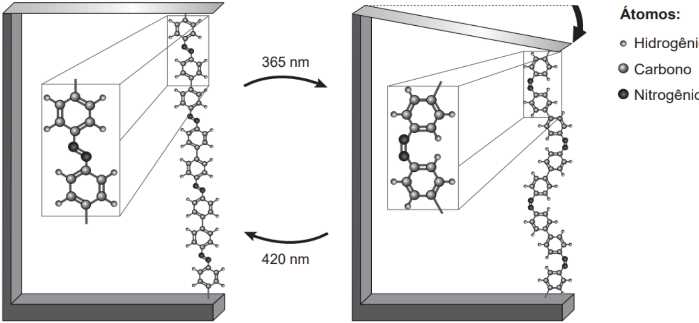

TOMA, H. E. A nanotecnologia das moléculas. Química Nova na Escola, n. 21, maio 2005 (adaptado).

O fenômeno de movimento molecular, promovido pela incidência de luz, decorre do(a)

A movimento vibracional dos átomos, que leva ao encurtamento e à relaxação das ligações.

B isomerização das ligações N=N, sendo a forma cis do polímero mais compacta que a trans.

tautomerização das unidades monoméricas do polímero, que leva a um composto mais compacto.

D ressonância entre os elétrons $\pi$ do grupo azo e os do anel aromático que encurta as ligações duplas.

E variação conformacional das ligações N=N, que resulta em estruturas com diferentes áreas de superfície.

Questão 044 (H2 | 2019 | 678,1) ①②③④⑤

A agricultura de precisão reúne técnicas agrícolas que consideram particularidades locais do solo ou lavoura a fim de otimizar o uso de recursos. Uma das formas de adquirir informações sobre essas particularidades é a fotografia aérea de baixa altitude realizada por um veículo aéreo não tripulado (vant). Na fase de aquisição é importante determinar o nível de sobreposição entre as fotografias. A figura ilustra como uma sequência de imagens é coletada por um vant e como são formadas as sobreposições frontais.

Vant com câmera fotográfica

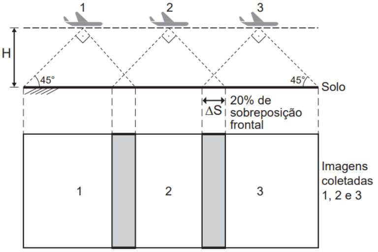

O operador do vant recebe uma encomenda na qual as imagens devem ter uma sobreposição frontal de 20% em um terreno plano. Para realizar a aquisição das imagens, seleciona uma altitude H fixa de voo de 1 000 m, a uma velocidade constante de 50 m s $^{-1}$. A abertura da câmera fotográfica do vant é de 90°. Considere tg(45°) = 1.

Natural Resources Canada. Concepts of Aerial Photography. Disponível em: www.nrcan.gc.ca. Acesso em: 26 abr. 2019 (adaptado).

Com que intervalo de tempo o operador deve adquirir duas imagens consecutivas?

A 40 segundos.

B 32 segundos.

C 28 segundos.

D 16 segundos.

E 8 segundos.

Questão 045 (H2 | 2015 | 695,2) ①②③④⑤

Para obter a posição de um telefone celular, a polícia baseia-se em informações do tempo de resposta do aparelho em relação às torres de celular da região de onde se originou a ligação. Em uma região, um aparelho está na área de cobertura de cinco torres, conforme o esquema.

Considerando que as torres e o celular são puntiformes e que estão sobre um mesmo plano, qual o número mínimo de torres necessárias para se localizar a posição do telefone celular que originou a ligação?

A Uma.

B Duas.

© Três.

D Quatro.

E Cinco.

#  Questão 046 (H2 | 2014 | 712,7) ①②③⑤

É comum aos fotógrafos tirar fotos coloridas em ambientes iluminados por lâmpadas fluorescentes, que contêm uma forte composição de luz verde. A consequência desse fato na fotografia é que todos os objetos claros, principalmente os brancos, aparecerão esverdeados. Para equilibrar as cores, deve-se usar um filtro adequado para diminuir a intensidade da luz verde que chega aos sensores da câmera fotográfica. Na escolha desse filtro, utiliza-se o conhecimento da composição das cores-luz primárias: vermelho, verde e azul; e das cores-luz secundárias: amarelo = vermelho + verde, ciano = verde + azul e magenta = vermelho + azul.

Disponível em: http://nautilus.fis.uc.pt. Acesso em: 20 maio 2014 (adaptado).

Na situação descrita, qual deve ser o filtro utilizado para que a fotografia apresente as cores naturais dos objetos?

A Ciano.

B Verde.

C Amarelo.

D Magenta.

E Vermelho.

#  Competência 1

Compreender as ciências naturais e as tecnologias a elas associadas como construções humanas, percebendo seus papéis nos processos de produção e no desenvolvimento econômico e social da humanidade.

#  Habilidade 3

Confrontar interpretações científicas com interpretações baseadas no senso comum, ao longo do tempo ou em diferentes culturas.

Questão 047 (H3 | 2023 | 385,1) 1 ②③④⑤

Os mais antigos cozinhavam o feijão na panela de ferro a fim de acabar com a palidez de seus filhos. Alguns chegavam até a colocar um prego enferrujado nesse cozimento para liberar o ferro contido nele. Sabe-se que esse elemento pode ser encontrado na sua forma metálica ou iônica, sendo essencial para a manutenção da vida humana.

As estratégias citadas eram utilizadas com o objetivo de

A tratar a diarreia.

B prevenir a anemia.

C evitar as verminoses.

D remediar o raquitismo.

E combater a febre amarela.

Questão 048 (H3 | 2015 | 465,8) 1 ②③④⑤

A definição de queimadura é bem ampla, porém, basicamente, é a lesão causada pela ação direta ou indireta produzida pela transferência de calor para o corpo. A sua manifestação varia desde bolhas (flictenas) até formas mais graves, capazes de desencadear respostas sistêmicas proporcionais à gravidade da lesão e sua respectiva extensão. Muitas vezes, os primeiros socorros prestados à vítima, ao invés de ajudar, acabam agravando ainda mais a situação do paciente.

Disponível em: www.bombeiros-bm.rs.gov.br. Acesso em: 28 fev. 2012 (adaptado).

Ao se deparar com um indivíduo que sofreu queimadura com formação de flictena, o procedimento de primeiros socorros que deve ser realizado antes de encaminhar o paciente ao hospital é

A colocar gelo sobre a flictena para amenizar o ardor.

Ⓑ utilizar manteiga para evitar o rompimento da flictena.

© passar creme dental para diminuir a ardência da flictena.

D perfurar a flictena para que a água acumulada seja liberada.

E cobrir a flictena com gazes molhadas para evitar a desidratação.

Questão 049 (H3 | 2019 | 541,5)   ②③④⑤

Em 1962, um jingle (vinheta musical) criado por Heitor Carillo fez tanto sucesso que extrapolou as fronteiras do rádio e chegou à televisão ilustrado por um desenho animado. Nele, uma pessoa respondia ao fantasma que batia em sua porta, personificando o “frio”, que não o deixaria entrar, pois não abriria a porta e compraria lãs e cobertores para aquecer sua casa. Apesar de memorável, tal comercial televisivo continha incorreções a respeito de conceitos físicos relativos à calorimetria.

DUARTE, M. Jingle é a alma do negócio: livro revela os bastidores das músicas de propagandas. Disponível em: https://guiadoscuriosos.uol.com.br. Acesso em: 24 abr. 2019 (adaptado).

Para solucionar essas incorreções, deve-se associar à porta e aos cobertores, respectivamente, as funções de

A Aquecer a casa e os corpos.

B Evitar a entrada do frio na casa e nos corpos.

C Minimizar a perda de calor pela casa e pelos corpos.

D Diminuir a entrada do frio na casa e aquecer os corpos.

Aquecer a casa e reduzir a perda de calor pelos corpos.

#  H3: Ciência versus Senso Comum

Questão 050 (H3 | 2020 | 547,5) ①②③④⑤

Nos desenhos animados, com frequência se vê um personagem correndo na direção de um abismo, mas, ao invés de cair, ele continua andando no vazio e só quando percebe que não há nada sob seus pés é que ele para de andar e cai verticalmente. No entanto, para observar uma trajetória de queda num experimento real, pode-se lançar uma bolinha, com velocidade constante (   ), sobre a superfície de uma mesa e verificar o seu movimento de queda até o chão.

Qual figura melhor representa a trajetória de queda da bolinha?

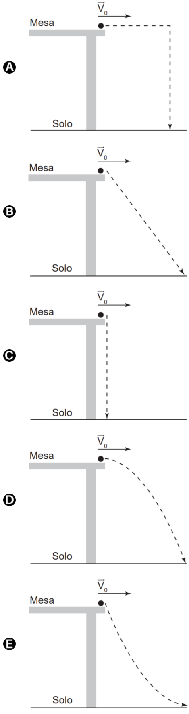

Questão 051 (H3 | 2022 | 549,5) ①②③④⑤

De modo geral, a palavra “aromático” invoca associações agradáveis, como cheiro de café fresco ou de um pão doce de canela. Associações similares ocorriam no passado da história da química orgânica, quando os compostos ditos “aromáticos” apresentavam um odor agradável e foram isolados de óleos naturais. À medida que as estruturas desses compostos eram elucidadas, foi se descobrindo que vários deles continham uma unidade estrutural específica. Os compostos aromáticos que continham essa unidade estrutural tornaram-se parte de uma grande família, muito mais com base em suas estruturas eletrônicas do que nos seus cheiros, como as substâncias a seguir, encontradas em óleos vegetais.

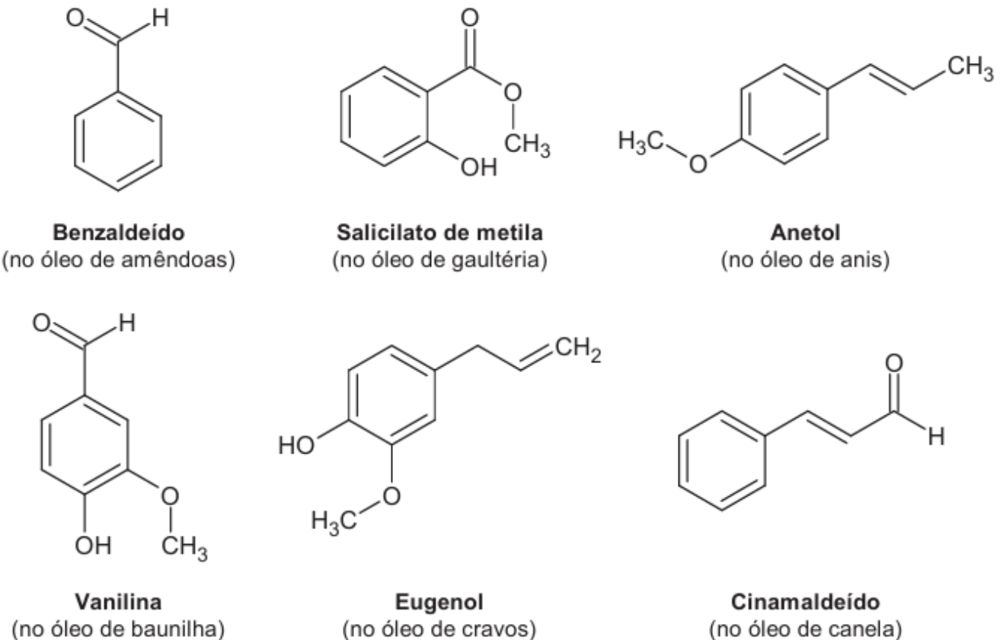

SOLOMONS, T. W. G.; FRYHLE, C. B. Química orgânica. Rio de Janeiro: LTC, 2009 (adaptado).

A característica estrutural dessa família de compostos é a presença de

A ramificações.

B insaturações.

anel benzênico.

D átomos de oxigênio.

E carbonos assimétricos.

Questão 052 (H3 | 2020 | 563,1) ①②③④⑤

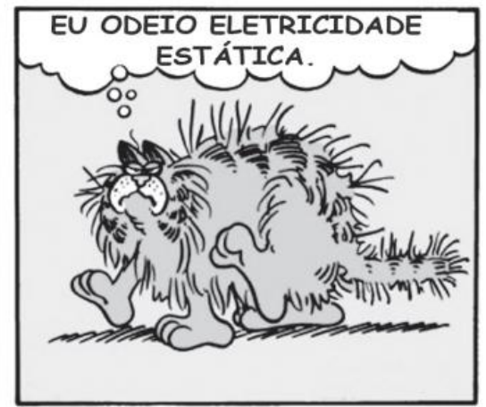

DAVIS, J. Disponível em: http://garfield.com. Acesso em: 10 fev. 2015.

Por qual motivo ocorre a eletrização ilustrada na tirinha?

A Troca de átomos entre a calça e os pelos do gato.

B Diminuição do número de prótons nos pelos do gato.

Criação de novas partículas eletrizadas nos pelos do gato.

D Movimentação de elétrons entre a calça e os pelos do gato.

E Repulsão entre partículas elétricas da calça e dos pelos do gato.

#  Questão 053 (H3 | 2021 | 565,1) ①②③④⑤

No seu estudo sobre a queda dos corpos, Aristóteles afirmava que se abandonarmos corpos leves e pesados de uma mesma altura, o mais pesado chegaria mais rápido ao solo. Essa ideia está apoiada em algo que é difícil de refutar, a observação direta da realidade baseada no senso comum.

Após uma aula de física, dois colegas estavam discutindo sobre a queda dos corpos, e um tentava convencer o outro de que tinha razão:

Colega A: “O corpo mais pesado cai mais rápido que um menos pesado, quando largado de uma mesma altura. Eu provo, largando uma pedra e uma rolha. A pedra chega antes. Pronto! Tá provado!”.

Colega B: “Eu não acho! Peguei uma folha de papel esticado e deixei cair. Quando amassei, ela caiu mais rápido. Como isso é possível? Se era a mesma folha de papel, deveria cair do mesmo jeito. Tem que ter outra explicação!”.

HÜLSENDEGER, M. Uma análise das concepções dos alunos sobre a queda dos corpos. Caderno Brasileiro de Ensino de Física, n. 3, dez. 2004 (adaptado).

O aspecto físico comum que explica a diferença de comportamento dos corpos em queda nessa discussão é o(a)

A peso dos corpos.

B resistência do ar.

© massa dos corpos.

D densidade dos corpos.

E aceleração da gravidade.

#  Questão 054 (H3 | 2021 | 571,7) ①②③④⑤

##  TEXT TO I

No cordel intitulado Senhor dos Anéis, de autoria de Gonçalo Ferreira da Silva, lê-se a sextilha:

##  A distância em relação

Ao nosso planeta amado

Pouco menos que a do Sol

Ele está distanciado

E menos denso que a água

Quando no normal estado

MEDEIROS, A.; AGRA, J. T. M., A astronomia na literatura de cordel, Física na Escola, n. 1, abr. 2010 (fragmento).

##  TEXTO II

Distâncias médias dos planetas ao Sol e suas densidades médias:

| Planetas | Distância média ao Sol (u.a.) | Densidade relativa média |
| --- | --- | --- |
| *Mercúrio | 0,39 | 5,6 |
| *Vênus | 0,72 | 5,2 |
| *Terra | 1,0 | 5,5 |
| *Marte | 1,5 | 4,0 |
| **Ceres | 2,8 | 2,1 |
| *Júpiter | 5,2 | 1,3 |
| *Saturno | 9,6 | 0,7 |
| *Urano | 19 | 1,2 |
| *Netuno | 30 | 1,7 |
| **Plutão | 40 | 2,0 |
| **Éris | 68 | 2,5 |

u.a. = 149 600 000 km, é a unidade astronômica, *Planeta clássico, **Planeta-anão

Características dos planetas. Disponível em: www.astronoo.com.
Acesso em: 8 nov. 2019 (adaptado).

Considerando os versos da sexilha e as informações da tabela, a qual planeta o cordel faz referência?

A Mercúrio.

B Júpiter.

Urano.

D Saturno.

E Netuno.

###  Questão 055 (H3 | 2016 | 593,8) ①②③④⑤

Primeiro, em relação àquilo a que chamamos água, quando congela, parece-nos estar a olhar para algo que se tornou pedra ou terra, mas quando derrete e se dispersa, esta torna-se bafo e ar; o ar, quando é queimado, torna-se fogo; e, inversamente, o fogo, quando se contrai e se extingue, regressa à forma do ar; o ar, novamente concentrado e contraído, torna-se nuvem e nevoeiro, mas, a partir destes estados, se for ainda mais comprimido, torna-se água corrente, e de água torna-se novamente terra e pedras; e deste modo, como nos parece, dão geração uns aos outros de forma cíclica.

PLATÃO. Timeu-Crítias. Coimbra: CECH, 2011.

Do ponto de vista da ciência moderna, os “quatro elementos” descritos por Platão correspondem, na verdade, às fases sólida, líquida, gasosa e plasma da matéria. As transições entre elas são hoje entendidas como consequências macroscópicas de transformações sofridas pela matéria em escala microscópica.

Excetuando-se a fase de plasma, essas transformações sofridas pela matéria, em nível microscópico, estão associadas a uma

A troca de átomos entre as diferentes moléculas do material.

B transmutação nuclear dos elementos químicos do material.

© redistribuição de prótons entre os diferentes átomos do material.

D mudança na estrutura espacial formada pelos diferentes constituintes do material.

E alteração nas proporções dos diferentes isótopos de cada elemento presente no material.

#  Questão 056 (H3 | 2017 | 603,5) ①②③④⑤

Na Idade Média, para elaborar preparados a partir de plantas produtoras de óleos essenciais, as coletas das espécies eram realizadas ao raiar do dia. Naquela época, essa prática era fundamentada misticamente pelo efeito mágico dos raios lunares, que seria anulado pela emissão dos raios solares. Com a evolução da ciência, foi comprovado que a coleta de algumas espécies ao raiar do dia garante a obtenção de material com maiores quantidades de óleos essenciais.

A explicação científica que justifica essa prática se baseia na

A volatilização das substâncias de interesse.

B polimerização dos óleos catalisada pela radiação solar.

© solubilização das substâncias de interesse pelo orvalho.

D oxidação do óleo pelo oxigênio produzido na fotossíntese.

E liberação das moléculas de óleo durante o processo de fotossíntese.

#  Questão 057 (H3 | 2012 | 603,8) ①②③④⑤

Em certos locais, larvas de moscas, criadas em arroz cozido, são utilizadas como iscas para pesca. Alguns criadores, no entanto, acreditam que essas larvas surgem espontaneamente do arroz cozido, tal como preconizado pela teoria da geração espontânea.

Essa teoria começou a ser refutada pelos cientistas ainda no século XVII, a partir dos estudos de Redi e Pasteur, que mostraram experimentalmente que

A seres vivos podem ser criados em laboratório.

B a vida se originou no planeta a partir de microrganismos.

o ser vivo é oriundo da reprodução de outro ser vivo pré-existente.

D seres vermiformes e microrganismos são evolutivamente aparentados.

E vermes e microrganismos são gerados pela matéria existente nos cadáveres e nos caldos nutritivos, respectivamente.

##  Questão 058 (H3 | 2019 | 615,7) ①②③④⑤

Uma cozinheira colocou sal a mais no feijão que estava cozinhando. Para solucionar o problema, ela acrescentou batatas cruas e sem tempero dentro da panela. Quando terminou de cozinhá-lo, as batatas estavam salgadas, porque absorveram parte do caldo com excesso de sal. Finalmente, ela adicionou água para completar o caldo do feijão.

O sal foi absorvido pelas batatas por

A osmose, por envolver apenas o transporte do solvente.

B fagocitose, porque o sal transportado é uma substância sólida.

exocitose, uma vez que o sal foi transportado da água para a batata.

D pinocitose, porque o sal estava diluído na água quando foi transportado.

E difusão, porque o transporte ocorreu a favor do gradiente de concentração.

#  Questão 059 (H3 | 2018 | 616,9) ①②③④⑤

Em desenhos animados é comum vermos a personagem tentando impulsionar um barco soprando ar contra a vela para compensar a falta de vento. Algumas vezes usam o próprio fôlego, foles ou ventiladores. Estudantes de um laboratório didático resolveram investigar essa possibilidade. Para isso, usaram dois pequenos carros de plástico, A e B, instalaram, sobre estes, pequenas ventoinhas e fixaram verticalmente uma cartolina de curvatura parabólica para desempenhar uma função análoga à vela de um barco. No carro B inverteu-se o sentido da ventoinha e manteve-se a vela, a fim de manter as características físicas do barco, massa e formato da cartolina. As figuras representam os carros produzidos. A montagem do carro A busca simular a situação dos desenhos animados, pois a ventoinha está direcionada para a vela.

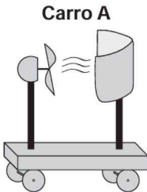

Carro B

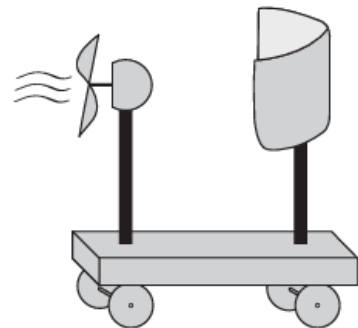

Com os carros orientados de acordo com as figuras, os estudantes ligaram as ventoinhas, aguardaram o fluxo de ar ficar permanente e determinaram os módulos das velocidades médias dos carros $\mathbf{A}$ (VA) e $\mathbf{B}$ (VB) para o mesmo intervalo de tempo.

A respeito das intensidades das velocidades médias e do sentido de movimento do carro , os estudantes observaram que

A $V_A = 0$; $V_B > 0$; o carro A não se move.

B 0 < $V_A < V_B$; o carro A se move para a direita.

© 0 < $V_{A}$ < $V_{B}$; o carro A se move para a esquerda.

D 0 < $V_B < V_A$; o carro A se move para a direita.

E $0 < V_B < VA$; o carro A se move para a esquerda.

#  Questão 060 (H3 | 2023 | 627,1) ①②③④⑤

Um garoto comprou vários abacates na feira, mas descobriu que eles não estavam maduros o suficiente para serem consumidos. Sua mãe recomendou que ele colocasse os abacates em um recipiente fechado, pois isso aceleraria seu amadurecimento. Com certa dúvida, o garoto realizou esta experiência: colocou alguns abacates no recipiente e deixou os demais em uma fruteira aberta. Surpreendendo-se ele percebeu que os frutos que estavam no recipiente fechado amadureceram mais rapidamente.

A aceleração desse processo é causada por

A acúmulo de gás etileno.

B redução da umidade do ar.

ⓒ aumento da concentração de CO₂.

D diminuição da intensidade luminosa.

E isolamento do contato com $O_2$ atmosférico.

#  Questão 061 (H3 | 2017 | 635,3) ①②③④⑤

Um fato corriqueiro ao se cozinhar arroz é o derramamento de parte da água de cozimento sobre a chama azul do fogo, mudando-a para uma chama amarela. Essa mudança de cor pode suscitar interpretações diversas, relacionadas às substâncias presentes na água de cozimento. Além do sal de cozinha (NaCl), nela se encontram carboidratos, proteínas e sais minerais.

Cientificamente, sabe-se que essa mudança de cor da chama ocorre pela

A reação do gás de cozinha com o sal, volatilizando gás cloro.

B emissão de fótons pelo sódio, excitado por causa da chama.

© produção de derivado amarelo, pela reação com o carboidrato.

D reação do gás de cozinha com a água, formando gás hidrogênio.

E excitação das moléculas de proteínas, com formação de luz amarela.

#  Questão 062 (H3 | 2016 | 657,7) ①② ④⑤

Num experimento, um professor deixa duas bandejas de mesma massa, uma de plástico e outra de alumínio, sobre a mesa do laboratório. Após algumas horas, ele pede aos alunos que avaliem a temperatura das duas bandejas, usando para isso o tato. Seus alunos afirmam, categoricamente, que a bandeja de alumínio encontra-se numa temperatura mais baixa. Intrigado, ele propõe uma segunda atividade, em que coloca um cubo de gelo sobre cada uma das bandejas, que estão em equilíbrio térmico com o ambiente, e os questiona em qual delas a taxa de derretimento do gelo será maior.

O aluno que responder corretamente ao questionamento do professor dirá que o derretimento ocorrerá

A mais rapidamente na bandeja de alumínio, pois ela tem uma maior condutividade térmica que a de plástico.

B mais rapidamente na bandeja de plástico, pois ela tem inicialmente uma temperatura mais alta que a de alumínio.

© mais rapidamente na bandeja de plástico, pois ela tem uma maior capacidade térmica que a de alumínio.

D mais rapidamente na bandeja de alumínio, pois ela tem um calor específico menor que a de plástico.

E com a mesma rapidez nas duas bandejas, pois apresentarão a mesma variação de temperatura.

#  Questão 063 (H3 | 2014 | 675,4) ①②③④⑤

Para entender os movimentos dos corpos, Galileu discutiu o movimento de uma esfera de metal em dois planos inclinados sem atritos e com a possibilidade de se alterarem os ângulos de inclinação, conforme mostra a figura. Na descrição do experimento, quando a esfera de metal é abandonada para descer um plano inclinado de um determinado nível, ela sempre atinge, no plano ascendente, no máximo, um nível igual àquele em que foi abandonada.

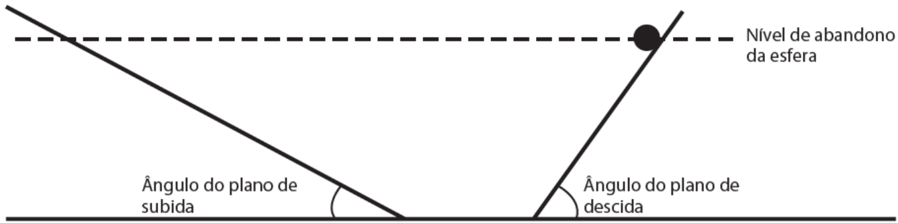

Galileu e o plano inclinado. Disponível em: www.fisica.ufpb.br. Acesso em: 21 ago. 2012 (adaptado).

Se o ângulo de inclinação do plano de subida for reduzido a zero, a esfera

A manterá sua velocidade constante, pois o impulso resultante sobre ela será nulo.

B manterá sua velocidade constante, pois o impulso da descida continuará a empurrá-la.

© diminuirá gradativamente a sua velocidade, pois não haverá mais impulso para empurrá-la.

D diminuirá gradativamente a sua velocidade, pois o impulso resultante será contrário ao seu movimento.

E aumentará gradativamente a sua velocidade, pois não haverá nenhum impulso contrário ao seu movimento.

#  Questão 064 (H3 | 2022 | 677,9) ①②③④⑤

Um Buraco Negro é um corpo celeste que possui uma grande quantidade de matéria concentrada em uma pequena região do espaço, de modo que sua força gravitacional é tão grande que qualquer partícula fica aprisionada em sua superfície, inclusive a luz. O raio dessa região caracteriza uma superfície-limite, chamada de horizonte de eventos, da qual nada consegue escapar. Considere que o Sol foi instantaneamente substituído por um Buraco Negro com a mesma massa solar, de modo que o seu horizonte de eventos seja de aproximadamente 3,0 km.

SCHWARZSCHILD, K. On the Gravitational Field of a Mass Point According to Einstein's Theory. Disponível em: arxiv.org. Acesso em: 26 maio 2022 (adaptado).

Após a substituição descrita, o que aconteceria aos planetas do Sistema Solar?

A Eles se moveriam em órbitas espirais, aproximando-se sucessivamente do Buraco Negro.

B Eles oscilariam aleatoriamente em torno de suas órbitas elípticas originais.

Eles se moveriam em direção ao centro do Buraco Negro.

D Eles passariam a precessionar mais rapidamente.

E Eles manteriam suas órbitas inalteradas.

#  Questão 065 (H3 | 2018 | 693,8) ①②③④⑤

Um estudante relatou que o mapeamento do DNA da cevada foi quase todo concluído e seu código genético desvendado. Chamou atenção para o número de genes que compõem esse código genético e que a semente da cevada, apesar de pequena, possui um genoma mais complexo que o humano, sendo boa parte desse código constituída de sequências repetidas. Nesse contexto, o conceito de código genético está abordado de forma equivocada.

Cientificamente esse conceito é definido como

A trincas de nucleotídeos que codificam os aminoácidos.

B localização de todos os genes encontrados em um genoma.

© codificação de sequências repetidas presentes em um genoma.

Ⓓ conjunto de todos os RNAs mensageiros transcritos em um organismo.

E todas as sequências de pares de bases presentes em um organismo.

#  Questão 066 (H3 | 2012 | 709,8) ①②③④⑤

A falta de conhecimento em relação ao que vem a ser um material radioativo e quais os efeitos, consequências e usos da irradiação pode gerar o medo e a tomada de decisões equivocadas, como a apresentada no exemplo a seguir.

“Uma companhia aérea negou-se a transportar material médico por este portar um certificado de esterilização por irradiação.”

Física na Escola, v. 8, n. 2, 2007 (adaptado).

A decisão tomada pela companhia é equivocada, pois

o material é incapaz de acumular radiação, não se tornando radioativo por ter sido irradiado.

a utilização de uma embalagem é suficiente para bloquear a radiação emitida pelo material.

a contaminação radioativa do material não se prolifera da mesma forma que as infecções por microrganismos.

o material irradiado emite radiação de intensidade abaixo daquela que ofereceria risco à saúde.

o intervalo de tempo após a esterilização é suficiente para que o material não emita mais radiação.

#  Questão 067 (H3 | 2013 | 784,4) ①②③④⑤

Um circuito em série é formado por uma pilha, uma lâmpada incandescente e uma chave interruptora. Ao se ligar a chave, a lâmpada acende quase instantaneamente, irradiando calor e luz. Popularmente, associa-se o fenômeno da irradiação de energia a um desgaste da corrente elétrica, ao atravessar o filamento da lâmpada, e à rapidez com que a lâmpada começa a brilhar. Essa explicação está em desacordo com o modelo clássico de corrente.

De acordo com o modelo mencionado, o fato de a lâmpada acender quase instantaneamente está relacionado à rapidez com que

A o fluido elétrico se desloca no circuito.

Ⓑas cargas negativas móveis atravessam o circuito.

a bateria libera cargas móveis para o filamento da lâmpada.

o campo elétrico se estabelece em todos os pontos do circuito.

E as cargas positivas e negativas se chocam no
filamento da lâmpada.

##  Questão 068 (H3 | 2014 | Anulada pela TRI)

Embora seja um conceito fundamental para a biologia, o termo “evolução” pode adquirir significados diferentes no senso comum. A ideia de que a espécie humana é o ápice do processo evolutivo é amplamente difundida, mas não é compartilhada por muitos cientistas.

Para esses cientistas, a compreensão do processo citado baseia-se na ideia de que os seres vivos, ao longo do tempo, passam por

A modificação de características.

Ⓑ incremento no tamanho corporal.

C complexificação de seus sistemas.

D melhoria de processos e estruturas.

E especialização para uma determinada finalidade.

#  Competência 1

Compreender as ciências naturais e as tecnologias a elas associadas como construções humanas, percebendo seus papéis nos processos de produção e no desenvolvimento econômico e social da humanidade.

#  Habilidade 4

Avaliar propostas de intervenção no ambiente, considerando a qualidade da vida humana ou medidas de conservação, recuperação ou utilização sustentável da biodiversidade.

Questão 069 (H4 | 2023 | 514,7) 1 ②③④⑤

O número de abelhas encontra-se em declínio em várias regiões do mundo, inclusive no Brasil, sendo que vários fatores contribuem para o colapso de suas colmeias. Nos Estados Unidos, bombas de sementes de espécies vegetais nativas têm sido utilizadas para combater o desaparecimento desses insetos. Elas são pequenas bolinhas recheadas com sementes, adubo e argila. Quando são arremessadas e ficam expostas ao sol e à chuva, germinam até mesmo em solo pouco fértil.

DARAYA, V. Disponível em: http://planetasustentavel.abril.com.br. Acesso em: 2 fev. 2015 (adaptado).

Esse método contribui para a preservação das abelhas porque

A reduz sua predação.

B reduz o uso de pesticidas.

© reduz a competição por abrigo.

D aumenta a oferta de alimento.

E aumenta os locais de reprodução.

Questão 070 (H4 | 2019 | 525,5) ①②③④⑤

No quadro estão apresentadas informações sobre duas estratégias de sobrevivência que podem ser adotadas por algumas espécies de seres vivos.

|  | Estratégia 1 | Estratégia 2 |
| --- | --- | --- |
| Hábitat | Mais instável e imprevisível | Mais estável e previsível |
| Potencial biótico | Muito elevado | Baixo |
| Duração da vida | Curta e com reprodução precoce | Longa e com reprodução tardia |
| Descendentes | Muitos e com tamanho corporal pequeno | Poucos e com tamanho corporal maior |
| Tamanho populacional | Variável | Constante |

Na recuperação de uma área desmatada deveriam ser reintroduzidas primeiramente as espécies que adotam qual estratégia?

A Estratégia 1, pois essas espécies produzem descendentes pequenos, o que diminui a competição com outras espécies.

Ⓑ Estratégia 2, pois essas espécies têm uma longa duração da vida, o que favorece a produção de muitos descendentes.

Estratégia 1, pois essas espécies apresentam um elevado potencial biótico, o que facilita a rápida recolonização da área desmatada.

Estratégia 2, pois essas espécies estão adaptadas a hábitats mais estáveis, o que corresponde ao ambiente de uma área desmatada.

E Estratégia 2, pois essas espécies apresentam um tamanho populacional constante, o que propicia uma recolonização mais estável da área desmatada.

Questão 071 (H4 | 2012 | 526,6) ①②③④⑤

Pesticidas são contaminantes ambientais altamente tóxicos aos seres vivos e, geralmente, com grande persistência ambiental. A busca por novas formas de eliminação dos pesticidas tem aumentado nos últimos anos, uma vez que as técnicas atuais são economicamente dispendiosas e paliativas. A biorremediação de pesticidas utilizando microrganismos tem se mostrado uma técnica muito promissora para essa finalidade, por apresentar vantagens econômicas e ambientais.

Para ser utilizado nesta técnica promissora, um microrganismo deve ser capaz de

A transferir o contaminante do solo para a água.

B absorver o contaminante sem alterá-lo quimicamente.

apresentar alta taxa de mutação ao longo das gerações.

D estimular o sistema imunológico do homem contra o contaminante.

E metabolizar o contaminante, liberando subprodutos menos tóxicos ou atóxicos.

#  Questão 072 (H4 | 2021 | 530,9) 1 ②③④⑤

Uma escola iniciou o processo educativo para implantação da coleta seletiva e destino de materiais recicláveis. Para atingir seus objetivos, a instituição planejou:

1) sensibilizar a comunidade escolar, desenvolvendo atividades em sala e extraclasse de maneira contínua;

2) capacitar o pessoal responsável pela limpeza da escola quanto aos novos procedimentos adotados com a coleta seletiva; e

3) distribuir coletores de materiais recicláveis específicos nas salas, pátio e outros ambientes para acondicionamento dos resíduos.

Para completar a ação proposta no ambiente escolar, o que falta ser inserido no planejamento?

A Realizar campanhas educativas de sensibilização em bairros vizinhos para fortalecer a coleta seletiva.

B Firmar parceria com a prefeitura ou cooperativa de catadores para recolhimento dos materiais recicláveis e destinação apropriada.

© Organizar visitas ao lixão ou aterro local para identificar aspectos importantes sobre a disposição final do lixo.

Divulgar na rádio local, no jornal impresso e nas redes sociais que a escola está realizando a coleta seletiva.

E Colocar recipientes coletores de lixo reciclável fora da escola para entrega voluntária pela população.

#  Questão 073 (H4 | 2020 | 563,2) ①②③④⑤

Plantas pioneiras são as que iniciam o processo natural de cicatrização de uma área desprovida de vegetação. Em geral, têm pequeno porte e crescem muito rápido, desenvolvem-se a pleno sol e são pouco exigentes quanto às condições do solo. Produzem grande quantidade de sementes e possuem ciclo de vida curto.

BLUM, C. T. Lista preliminar de espécies vegetais pioneiras nativas do Paraná – versão 2008. Disponível em: www.chaua.org.br. Acesso em: 10 fev. 2015.

Essas plantas são importantes em um projeto de restauração ambiental, pois promovem, no solo,

A aumento da incidência de luz solar.

B diminuição da absorção de água.

o estabilização da umidade.

D elevação de temperatura.

E liberação de oxigênio.

#  Questão 074 (H4 | 2022 | 585,5) ①②③④⑤

Os resultados de um ensaio clínico randomizado na Indonésia apontaram uma redução de 77% dos casos de dengue nas áreas que receberam o mosquito Aedes aegypti infectado com a bactéria Wolbachia. Trata-se da mesma técnica utilizada no Brasil pelo Método Wolbachia, iniciativa conduzida pela Fundação Oswaldo Cruz — Fiocruz. Essa bactéria induz a redução da carga viral no mosquito e, consequentemente, o número de casos de dengue na área, sendo repassada por meio do cruzamento entre os insetos. Como essa bactéria é um organismo intracelular e o vírus também precisa entrar nas células para se reproduzir, ambos necessitarão de recursos comuns.

COSTA, G. Agência Fiocruz de Notícias. Estudo confirma eficácia do Método Wolbachia para dengue. Disponível em: https://portal.fiocruz.br. Acesso em: 3 jun. 2022 (adaptado).

Essa tecnologia utilizada no combate à dengue consiste na

A predação do vírus pela bactéria.

B esterilização de mosquitos infectados.

C alteração no genótipo do mosquito pela bactéria.

Ⓓ competição do vírus e da bactéria no hospedeiro.

E inserção de material genético do vírus na bactéria.

#  Questão 075 (H4 | 2018 | 601,6) ①②③④⑤

Corredores ecológicos visam mitigar os efeitos da fragmentação dos ecossistemas promovendo a ligação entre diferentes áreas, com o objetivo de proporcionar o deslocamento de animais, a dispersão de sementes e o aumento da cobertura vegetal. São instituídos com base em informações como estudos sobre o deslocamento de espécies, sua área de vida (área necessária para o suprimento de suas necessidades vitais e reprodutivas) e a distribuição de suas populações.

Disponível em: www.mma.gov.br. Acesso em: 30 nov. 2017
(adaptado).

Nessa estratégia, a recuperação da biodiversidade é efetiva porque

A propicia o fluxo gênico.

B intensifica o manejo de espécies.

© amplia o processo de ocupação humana.

D aumenta o número de indivíduos nas populações.

E favorece a formação de ilhas de proteção integral.

##  Questão 076 (H4 | 2020 | 612,4) ①②③④⑤

A fragmentação dos hábitats é caracterizada pela formação de ilhas da paisagem original, circundadas por áreas transformadas. Esse tipo de interferência no ambiente ameaça a biodiversidade. Imagine que uma população de onças foi isolada em uma mata pequena. Elas se extinguiriam mesmo sem terem sido abatidas. Diversos componentes da ilha de hábitat, como o tamanho, a heterogeneidade, o seu entorno, a sua conectividade e o efeito de borda são determinantes para a persistência ou não das espécies originais.

Uma medida que auxilia na conservação da biodiversidade nas ilhas mencionadas no texto compreende a

A formação de micro-hábitats.

B ampliação do efeito de borda.

C construção de corredores ecológicos.

D promoção da sucessão ecológica.

E introdução de novas espécies de animais e vegetais.

#  Questão 077 (H4 | 2013 | 615,4) ①②③④⑤

Entre as substâncias usadas para o tratamento de água está o sulfato de alumínio que, em meio alcalino, forma partículas em suspensão na água, às quais as impurezas presentes no meio se aderem.

O método de separação comumente usado para retirar o sulfato de alumínio com as impurezas aderidas é a

A flotação.

B levigação.

C ventilação.

D peneiração.

E centrifugação.

#  Questão 078 (H4 | 2012 | 615,8) ①②③④⑤

Os tubos de PVC, material organoclorado sintético, são normalmente utilizados como encanamento na construção civil. Ao final da sua vida útil, uma das formas de descarte desses tubos pode ser a incineração. Nesse processo libera-se HCIf (g), cloreto de hidrogênio, dentre outras substâncias. Assim, é necessário um tratamento para evitar o problema da emissão desse poluente.

Entre as alternativas possíveis para o tratamento, é apropriado canalizar e borbulhar os gases provenientes da incineração em

A água dura.

B água de cal.

© água salobra.

D água destilada.

E água desmineralizada.

#  Questão 079 (H4 | 2023 | 621,5) ①②③④⑤

Os solos amazônicos, ricos em silicato, não são apropriados para o cultivo por serem incapazes de reter nutrientes. Contudo, descobertas arqueológicas têm demonstrado que os antigos habitantes da Amazônia dominavam a técnica de preparo de um insumo agrícola natural, denominado terra preta. Esse insumo era constituído principalmente de uma espécie de biocarvão (biochar) obtido da queima de matéria orgânica, como troncos de árvores, pedaços de ossos e esterco, capaz de manter um solo fértil por anos.

Admite-se que o efeito do biocarvão na fertilização do solo estava, em parte, relacionado à presença de grupos orgânicos do tipo carboxilato em sua superfície, carregados negativamente (—COO⁻). Esses grupos atraem íons positivos necessários como nutrientes, tais quais os provenientes do potássio (K), do cálcio (Ca) e do magnésio (Mg), além de micronutrientes, como zinco (Zn) e ferro (Fe). Essa ligação no solo fertilizado é predominantemente iônica, conforme ilustra a figura, em que M⁺ representa os cátions metálicos. De acordo com a escala de Pauling, a eletronegatividade do elemento oxigênio é igual a 3,44.

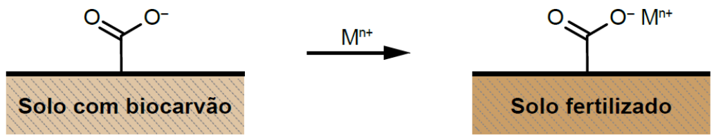

O quadro apresenta os valores de eletronegatividade desses cinco elementos metálicos.

| Elemento metálico | Eletronegatividade |
| --- | --- |
| K | 0,82 |
| Ca | 1,00 |
| Mg | 1,31 |
| Zn | 1,65 |
| Fe | 1,83 |

MICHALOVIC, M. Ancient Soil Chemists of the Amazon. ChemMatters, fev. 2009 (adaptado).

O cátion que resultará em uma interação de maior caráter iônico com o anion carboxilato será aquele proveniente do elemento

A potássio.

B cálcio.

C magnésio.

D zinco.

E ferro.

Questão 080 (H4 | 2016 | 641,3) ①②③④⑤

O Painel Intergovernamental de Mudanças Climáticas (na sigla em inglês, IPCC) prevê que nas próximas décadas o planeta passará por mudanças climáticas e propõe estratégias de mitigação e adaptação a elas. As estratégias de mitigação são direcionadas à causa dessas mudanças, procurando reduzir a concentração de gases de efeito estufa na atmosfera. As estratégias de adaptação, por sua vez, são direcionadas aos efeitos dessas mudanças, procurando preparar os sistemas humanos às mudanças climáticas já em andamento, de modo a reduzir seus efeitos negativos.

IPCC, 2014. Climate Change 2014: synthesis report. Disponível em: http://ar5-syr.ipcc.ch. Acesso em: 22 out. 2015 (adaptado).

Considerando as informações do texto, qualação representa uma estratégia de adaptação?

A Construção de usinas eólicas.

B Tratamento de resíduos sólidos.

Aumento da eficiência dos veículos.

Ⓓ Adoção de agricultura sustentável de baixo carbono.

E Criação de diques de contenção em regiões costeiras.

Questão 081 (H4 | 2014 | 675,2) ①② ④⑤

O biodiesel não é classificado como uma substância pura, mas como uma mistura de ésteres derivados dos ácidos graxos presentes em sua matéria-prima. As propriedades do biodiesel variam com a composição do óleo vegetal ou gordura animal que lhe deu origem, por exemplo, o teor de ésteres saturados é responsável pela maior estabilidade do biodiesel frente à oxidação, o que resulta em aumento da vida útil do biocombustível. O quadro ilustra o teor médio de ácidos graxos de algumas fontes oleaginosas.

| Fonte oleaginosa | Teor médio do ácido graxo (% em massa) | Teor médio do ácido graxo (% em massa) | Teor médio do ácido graxo (% em massa) | Teor médio do ácido graxo (% em massa) | Teor médio do ácido graxo (% em massa) | Teor médio do ácido graxo (% em massa) |
| --- | --- | --- | --- | --- | --- | --- |
| Fonte oleaginosa | Mirístico (C14:0) | Palmítico (C16:0) | Esteárico (C18:0) | Oleico (C18:1) | Linoleico (C18:2) | Linolênico (C18:3) |
| Milho | < 0,1 | 11,7 | 1,9 | 25,2 | 60,6 | 0,5 |
| Palma | 1,0 | 42,8 | 4,5 | 40,5 | 10,1 | 0,2 |
| Canola | < 0,2 | 3,5 | 0,9 | 64,4 | 22,3 | 8,2 |
| Algodão | 0,7 | 20,1 | 2,6 | 19,2 | 55,2 | 0,6 |
| Amendoim | < 0,6 | 11,4 | 2,4 | 48,3 | 32,0 | 0,9 |

MA, F.; HANNA, M. A. Biodiesel Production: a review. Bioresource Technology, Londres, v. 70, n. 1, jan. 1999 (adaptado).

Qual das fontes oleaginosas apresentadas produziria um biodiesel de maior resistência à oxidação?

A Milho.

B Palma.

@ Canola.

D Algodão.

E Amendoim.

#  Questão 082 (H4 | 2017 | 777,2) ①②③④⑤

Os botos-cinza (Sotalia guianensis), mamíferos da família dos golfinhos, são excelentes indicadores da poluição das áreas em que vivem, pois passam toda a sua vida — cerca de 30 anos — na mesma região. Além disso, a espécie acumula mais contaminantes em seu organismo, como o mercúrio, do que outros animais da sua cadeia alimentar.

MARCOLINO, B. Sentinelas do mar. Disponível em: http://cienciahoje.uol.com.br. Acesso em: 1 ago. 2012 (adaptado).

Os botos-cinza acumulam maior concentração dessas substâncias porque

A são animais herbívoros.

B são animais detritívoros.

são animais de grande porte.

D digerem o alimento lentamente.

E estão no topo da cadeia alimentar.

#  Questão 083 (H4 | 2015 | 903,3) ①②③④⑤

A química verde permite o desenvolvimento tecnológico com danos reduzidos ao meio ambiente, e encontrar rotas limpas tem sido um grande desafio. Considere duas rotas diferentes utilizadas para a obtenção de ácido adípico, um insumo muito importante para a indústria têxtil e de plastificantes.

Rota tradicional (marrom)

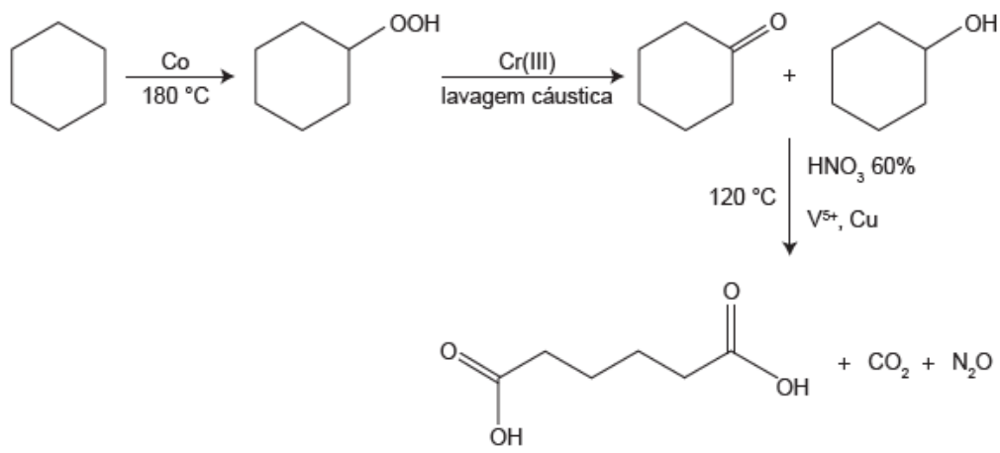

Rota verde

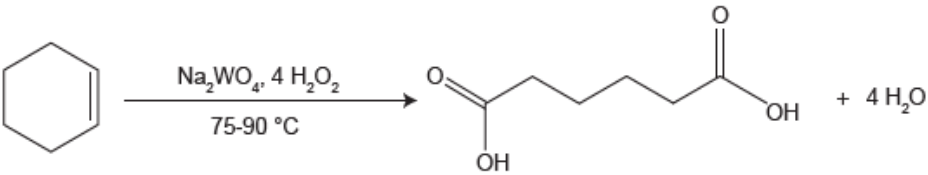

LENARDÃO, E. J. et al. Green chemistry – os 12 princípios da química verde e sua inserção nas atividades de ensino e pesquisa. Química Nova, n. 1, 2003 (adaptado). Que fator contribui positivamente para que a segunda rota de síntese seja verde em comparação à primeira?

A Etapa única na síntese.

B Obtenção do produto puro.

© Ausência de reagentes oxidantes.

Ⓓ Ausência de elementos metálicos no processo.

E Gasto de energia nulo na separação do produto.

#  COMPETÊNCIA

##  2

Questões de O84 a 135

#  H5: Circuitos Elétricos no Cotidiano

##  Competência 2

Identificar a presença e aplicar as tecnologias associadas às ciências naturais em diferentes contextos.

##  Habilidade 5

Dimionar circuitos ou dispositivos elétricos de uso cotidiano.

Questão 084 (H5 | 2015 | 547,1) ①②③④⑤1

Um estudante, precisando instalar um computador, um monitor e uma lâmpada em seu quarto, verificou que precisaria fazer a instalação de duas tomadas e um interruptor na rede elétrica. Decidiu esboçar com antecedência o esquema elétrico.

"O circuito deve ser tal que as tomadas e a lâmpada devem estar submetidas à tensão nominal da rede elétrica e a lâmpada deve poder ser ligada ou desligada por um interruptor sem afetar os outros dispositivos" – pensou.

Símbolos adotados:

Lâmpada:   Tomada:   Interruptor: -

Qual dos circuitos esboçados atende às exigências?

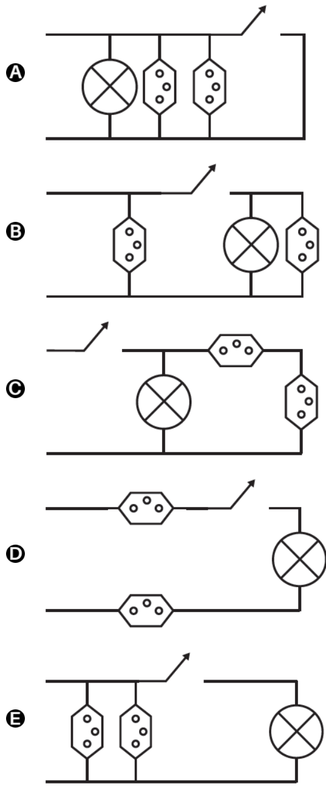

Questão 085 (H5 | 2021 | 617,4) ①②③④⑤

É possível ligar aparelhos elétricos de baixa corrente utilizando materiais comuns de laboratório no lugar das tradicionais pilhas. A ilustração apresenta uma montagem que faz funcionar um cronômetro digital.

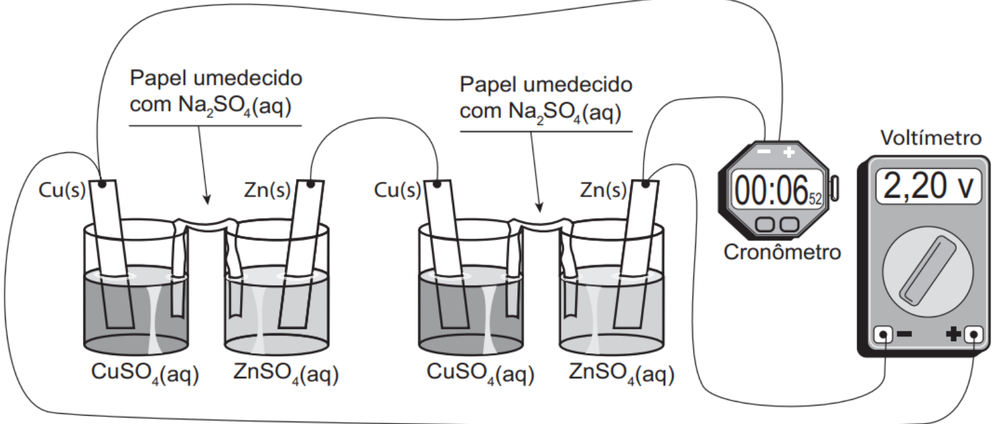

Utilizando a representação de projetos elétricos, o circuito equivalente a esse sistema é

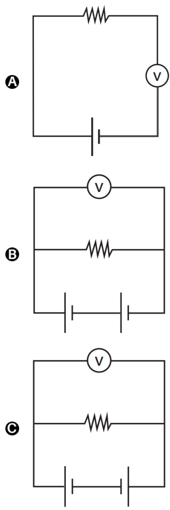

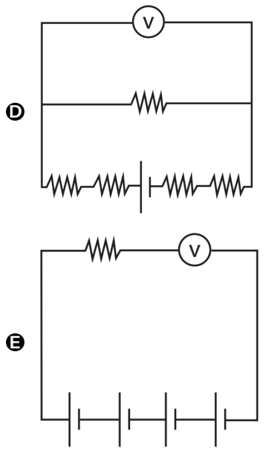

#  H5: Circuitos Elétricos no Cotidiano

Questão 086 (H5 | 2017 | 618,8) ①②③④⑤

Fusível é um dispositivo de proteção contra sobrecorrente em circuitos. Quando a corrente que passa por esse componente elétrico é maior que sua máxima corrente nominal, o fusível queima. Dessa forma, evita que a corrente elevada danifique os aparelhos do circuito. Suponha que o circuito elétrico mostrado seja alimentado por uma fonte de tensão U e que o fusível suporte uma corrente nominal de 500 mA.

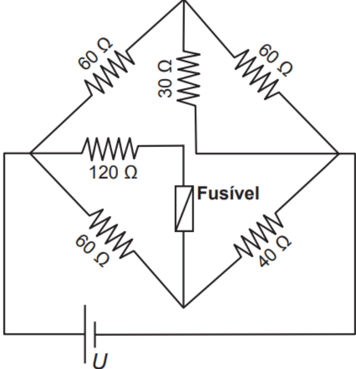

Qual é o máximo valor da tensão U para que o fusível não queime?

A 20 V

B 40 V

©60 V

Ⓓ 120 V

E 185 V

Questão 087 (H5 | 2016 | 620,5) ①②③④⑤

Três lâmpadas idênticas foram ligadas no circuito esquematizado. A bateria apresenta resistência interna desprezível, e os fios possuem resistência nula. Um técnico fez uma análise do circuito para prever a corrente elétrica nos pontos: A, B, C, D e E; e rotulou essas correntes de lA, lB, lC, lD e lE, respectivamente.

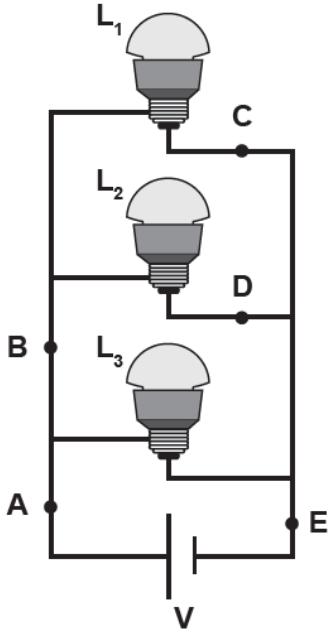

O técnico concluiu que as correntes que apresentam o mesmo valor são

A $l_A = l_E e l_C = l_D$.

B $I_A = I_B = I_E$ e $I_C = I_D$.

ⓒ $I_A = I_B$, apenas.

D $I_A = I_B = I_E$, apenas.

E $l_C = l_B$, apenas.

##  Questão 088 (H5 | 2017 | 627,0) ①②③④⑤

Em algumas residências, cercas eletrificadas são utilizadas com o objetivo de afastar possíveis invasores. Uma cerca eletrificada funciona com uma diferença de potencial elétrico de aproximadamente 10 000 V. Para que não seja letal, a corrente que pode ser transmitida através de uma pessoa não deve ser maior do que 0,01 A. Já a resistência elétrica corporal entre as mãos e os pés de uma pessoa é da ordem de 1 000 Ω.

Para que a corrente não seja letal a uma pessoa que toca a cerca eletrificada, o gerador de tensão deve possuir uma resistência interna que, em relação à do corpo humano, é

A praticamente nula.

B aproximadamente igual.

© milhares de vezes maior.

D da ordem de 10 vezes maior.

E da ordem de 10 vezes menor.

#  H5: Circuitos Elétricos no Cotidiano

Questão 089 (H5 | 2018 | 631,7) ①②③④⑤

Muitos smartphones e tablets não precisam mais de teclas, uma vez que todos os comandos podem ser dados ao se pressionar a própria tela. Inicialmente essa tecnologia foi proporcionada por meio das telas resistivas, formadas basicamente por duas camadas de material condutor transparente que não se encostam até que alguém as pressione, modificando a resistência total do circuito de acordo com o ponto onde ocorre o toque. A imagem é uma simplificação do circuito formado pelas placas, em que A e B representam pontos onde o circuito pode ser fechado por meio do toque.

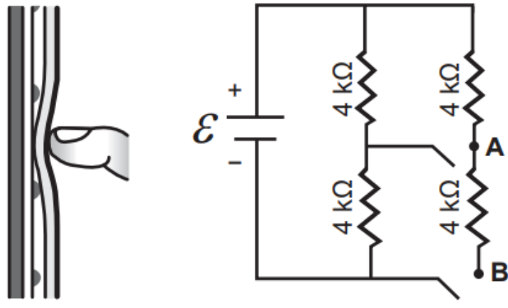

Qual é a resistência equivalente no circuito provocada por um toque que fecha o circuito no ponto A?

A 1,3 kΩ.

B 4,0 kΩ.

© 6,0 kΩ.

D 6,7 kΩ.

E 12,0 kΩ.

Questão 090 (H5 | 2018 | 650,3) ①②③④⑤

Ao pesquisar um resistor feito de um novo tipo de material, um cientista observou o comportamento mostrado no gráfico tensão versus corrente.

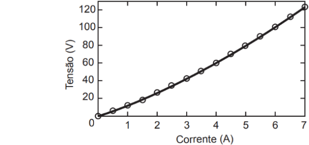

Após a análise do gráfico, ele concluiu que a tensão em função da corrente é dada pela equação $V = 10i + i^2$ O gráfico da resistência elétrica (R) do resistor em função da corrente (i) é

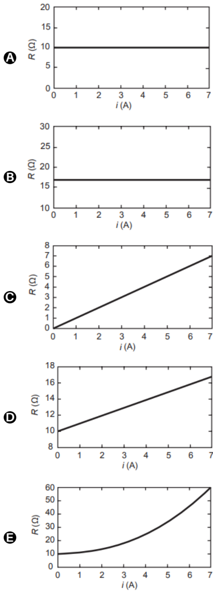

#  H5: Circuitos Elétricos no Cotidiano

Questão 091 (H5 | 2020 | 655,4) ①②③④⑤

Uma pessoa percebe que a bateria de seu veículo fica descarregada após cinco dias sem uso. No início desse período, a bateria funcionava normalmente e estava com o total de sua carga nominal, de 60 Ah. Pensando na possibilidade de haver uma corrente de fuga, que se estabelece mesmo com os dispositivos elétricos do veículo desligados, ele associa um amperímetro digital ao circuito do veículo.

Qual dos esquemas indica a maneira com que o amperímetro deve ser ligado e a leitura por ele realizada?

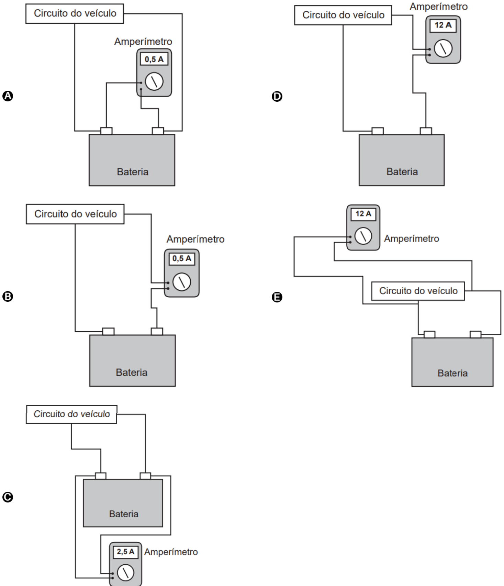

#  Questão 092 (H5 | 2014 | 658,5) ①②③④⑤

Um sistema de iluminação foi construído com um circuito de três lâmpadas iguais conectadas a um gerador (G) de tensão constante. Esse gerador possui uma chave que pode ser ligada nas posições A ou B.

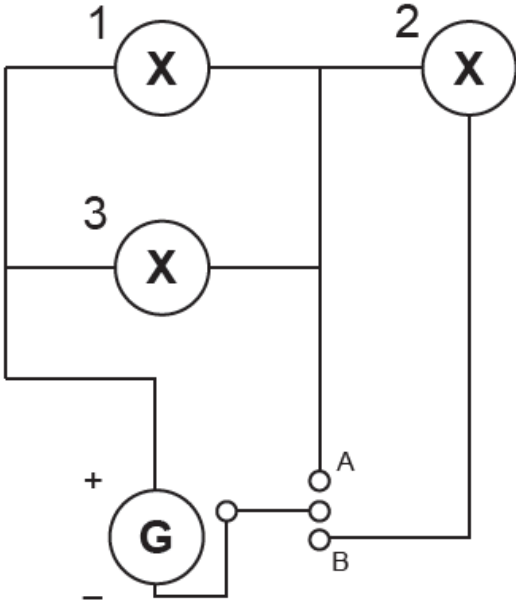

Considerando o funcionamento do circuito dado, a lâmpada 1 brilhará mais quando a chave estiver na posição

A B, pois a corrente será maior nesse caso.

B B, pois a potência total será maior nesse caso.

© A, pois a resistência equivalente será menor nesse caso.

D B, pois o gerador fornecerá uma maior tensão nesse caso.

A, pois a potência dissipada pelo gerador será menor nesse caso.

#  Questão 093 (H5 | 2021 | 696,7) ①②③④⑤

O quadro lista alguns dispositivos eletrônicos que estão presentes no dia a dia, bem como a faixa de força eletromotriz necessária ao seu funcionamento.

| Dispositivo eletrônico | Dispositivo eletrônico | Faixa de força eletromotriz (V) |
| --- | --- | --- |
| I | Relógio de parede | 1,2 a 1,5 |
| II | Celular | 3,5 a 3,8 |
| III | Câmera digital | 7,5 a 7,8 |
| IV | Carrinho de controle remoto | 10,5 a 10,9 |
| V | Notebook/Laptop | 19,5 a 20,0 |

Considere que uma bateria é construída pela associação em série de três pilhas de lítio-iodo, nas condições-padrão, conforme as semiequações de redução apresentadas.

$$I_2 + 2e^- \rightarrow 2I^- \qquad E^\circ = +0,54 \text{ V}$$

Essa bateria é adequada para o funcionamento de qual dispositivo eletrônico?

A I

B II

C III

D IV

E V

##  Questão 094 (H5 | 2013 | 699,4) ①②③ ⑤

O chuveiro elétrico é um dispositivo capaz de transformar energia elétrica em energia térmica, o que possibilita a elevação da temperatura da água. Um chuveiro projetado para funcionar em 110 V pode ser adaptado para funcionar em 220 V, de modo a manter inalterada sua potência.

Uma das maneiras de fazer essa adaptação é trocar a resistência do chuveiro por outra, de mesmo material e com o(a)

A dobro do comprimento do fio.

B metade do comprimento do fio.

metade da área da seção reta do fio.

D quádruplo da área da seção reta do fio.

E quarta parte da área da seção reta do fio.

#  H5: Circuitos Elétricos no Cotidiano

Questão 095 (H5 | 2013 | 703,1) ①②③④⑤

Um eletricista analisa o diagrama de uma instalação elétrica residencial para planejar medições de tensão e corrente em uma cozinha. Nesse ambiente existem uma geladeira (G), uma tomada (T) e uma lâmpada (L), conforme a figura. O eletricista deseja medir a tensão elétrica aplicada à geladeira, a corrente total e a corrente na lâmpada. Para isso, ele dispõe de um voltímetro (V) e dois amperímetros (A).

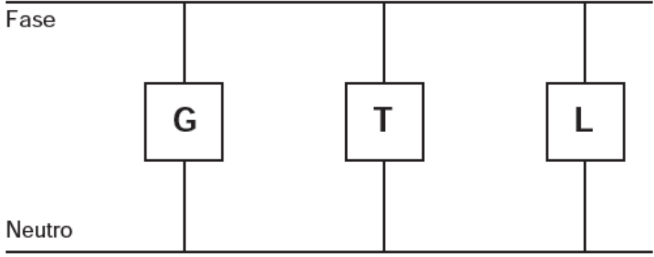

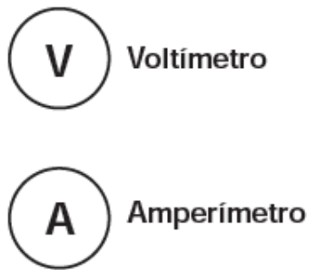

Para realizar essas medidas, o esquema da ligação desses instrumentos está representado em:

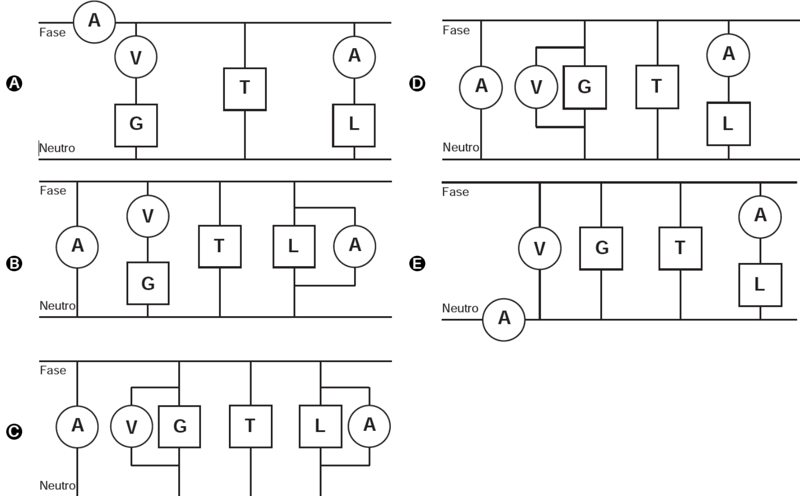

#  Questão 096 (H5 | 2020 | 708,8) ①②③④⑤

Um estudante tem uma fonte de tensão com corrente contínua que opera em tensão fixa de 12 V. Como precisa alimentar equipamentos que operam em tensões menores, ele emprega quatro resistores de 100 $\Omega$ para construir um divisor de tensão. Obtém-se este divisor associando os resistores, como exibido na figura. Os aparelhos podem ser ligados entre os pontos A, B, C, D e E, dependendo da tensão especificada.

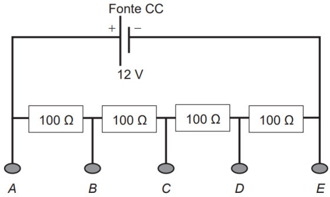

Ele tem um equipamento que opera em 9,0 V com uma resistência interna de 10 kΩ.

Entre quais pontos do divisor de tensão esse equipamento deve ser ligado para funcionar corretamente e qual será o valor da intensidade da corrente nele estabelecida?

A Entre A e C; 30 mA.

Ⓑ Entre B e E; 30 mA.

ⓒ Entre A e D; 1,2mA.

D Entre Be E; 0,9 mA.

E Entre A e E; 0,9 mA.

#  Questão 097 (H5 | 2021 | 712,2) ①②③ ⑤

Um garoto precisa montar um circuito que acenda três lâmpadas de cores diferentes, uma de cada vez. Ele dispõe das lâmpadas, de fios, uma bateria e dois interruptores, como ilustrado, junto com seu símbolo de três pontos. Quando esse interruptor fecha AB, abre BC e vice-versa.

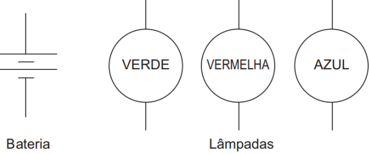

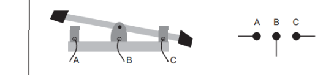

O garoto fez cinco circuitos elétricos usándo os dois interruptores, mas apenas um satisfaz a sua necessidade.

##  Esse circuito é representado por

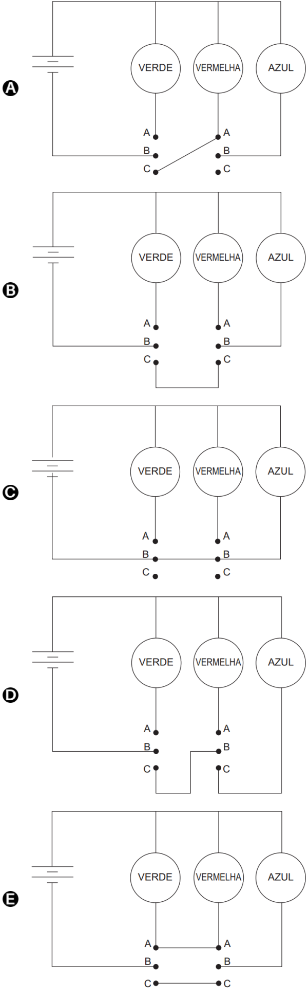

#  Questão 098 (H5 | 2016 | 718,6) ①②③④⑤

Por apresentar significativa resistividade elétrica, o grafite pode ser utilizado para simular resistores elétricos em circuitos desenhados no papel, com o uso de lápis e lapiseiras. Dependendo da espessura e do comprimento das linhas desenhadas, é possível determinar a resistência elétrica de cada traçado produzido. No esquema foram utilizados três tipos de lápis diferentes (2H, HB e 6B) para efetuar três traçados distintos.

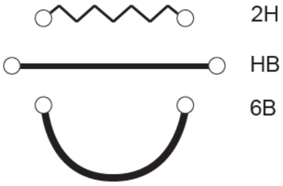

Munido dessas informações, um estudante pegou uma folha de papel e fez o desenho de um sorvete de casquinha utilizando-se desses traçados. Os valores encontrados nesse experimento, para as resistências elétricas (R), medidas com o auxílio de um ohmímetro ligado nas extremidades das resistências, são mostrados na figura. Verificou-se que os resistores obedeciam à Lei de Ohm.

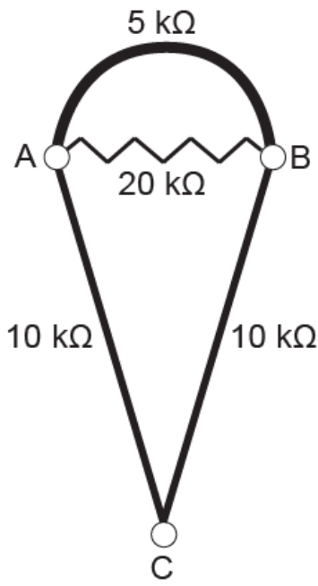

Na sequência, conectou o ohmímetro nos terminais A e B do desenho e, em seguida, conectou-o nos terminais B e C, anotando as leituras $R_{AB}$ e $R_{BC}$, respectivamente.

Ao estabelecer a razão $\frac{R_{AB}}{R_{BC}}$, qual resultado o estudante obteve?

A 1

B $\frac{4}{7}$

© $\frac{10}{27}$

D $\frac{14}{81}$

E 4 81

#  Questão 099 (H5 | 2023 | 733,4) ①②③④⑤

O circuito com três lâmpadas incandescentes idênticas, representado na figura, consiste em uma associação mista de resistores. Cada lâmpada ($L_1, L_2$ e $L_3$) é associada, em paralelo, a um resistor de resistência $R$, formando um conjunto. Esses conjuntos são associados em série, tendo todas as lâmpadas o mesmo brilho quando ligadas à fonte de energia. Após vários dias em uso, apenas a lâmpada $L_2$ queima, enquanto as demais permanecem acesas.

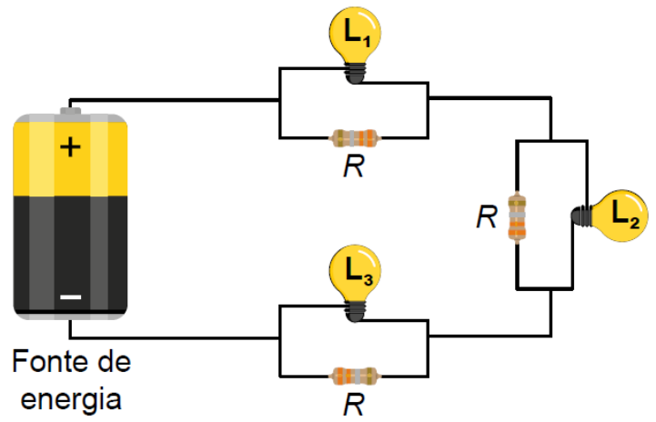

Em relação à situação em que todas as lâmpadas funcionam, após a queima de L₂, os brilhos das lâmpadas serão

A os mesmos.

B mais intensos.

© menos intensos.

D menos intenso para $L_1$ e o mesmo para $L_3$.

E mais intenso para $L_1$ e menos intenso para $L_3$.

#  H5: Circuitos Elétricos no Cotidiano

##  Questão 100 (H5 | 2012 | 733,6) ①②③④⑤

Para ligar ou desligar uma mesma lâmpada a partir de dois interruptores, conectam-se os interruptores para que a mudança de posição de um deles faça ligar ou desligar a lâmpada, não importando qual a posição do outro. Esta ligação é conhecida como interruptores paralelos. Este interruptor é uma chave de duas posições constituída por um polo e dois terminais, conforme mostrado nas figuras de um mesmo interruptor. Na Posição I a chave conecta o polo ao terminal superior, e na Posição II a chave o conecta ao terminal inferior.

O circuito que cumpre a finalidade de funcionamento descrita no texto é:

A

B

©

D

E

##  Questão 101 (H5 | 2019 | 742,4) ①②③④⑤

Uma casa tem um cabo elétrico mal dimensionado, de resistência igual a 10 Ω, que a conecta à rede elétrica de 120 V. Nessa casa, cinco lâmpadas, de resistência igual a 200 Ω, estão conectadas ao mesmo circuito que uma televisão de resistência igual a 50 Ω, conforme ilustrado no esquema. A televisão funciona apenas com tensão entre 90 V e 130 V.

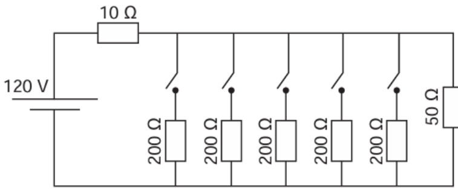

O número máximo de lâmpadas que podem ser ligadas sem que a televisão pare de funcionar é

A 1.

B 2.

© 3.

D 4.

E 5.

Questão 102 (H5 | 2013 | 838,6) ①②③④⑤

Medir temperatura é fundamental em muitas aplicações, e apresentar a leitura em mostradores digitais é bastante prático. O seu funcionamento é baseado na correspondência entre valores de temperatura e de diferença de potencial elétrico. Por exemplo, podemos usar o circuito elétrico apresentado, no qual o elemento sensor de temperatura ocupa um dos braços do circuito ($R_s$) e a dependência da resistência com a temperatura é conhecida.

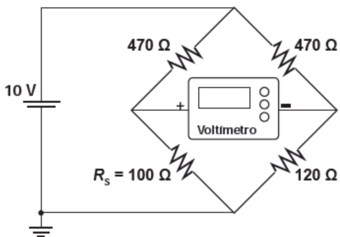

Para um valor de temperatura em que $R_s = 100 \Omega$,

a leitura apresentada pelo voltímetro será de

A + 6,2 V.

B + 1,7 V.

© +0,3 V.

D -0,3 V.

● -6,2 V.

#  Questão 103 (H5 | 2022 | Anulada pela TRI)

Uma lanterna funciona com três pilhas de resistência interna igual a 0,5 $\Omega$ cada, ligadas em série. Quando posicionadas corretamente, devem acender a lâmpada incandescente de especificações 4,5 W e 4,5 V. Cada pilha na posição correta gera uma f.e.m. (força eletromotriz) de 1,5 V. Uma pessoa, ao trocar as pilhas da lanterna, comete o equívoco de inverter a posição de uma das pilhas. Considere que as pilhas mantêm contato independentemente da posição.

Com esse equívoco, qual é a intensidade de corrente que passa pela lâmpada ao se ligar a lanterna?

A 0,25 A

B 0,33 A

© 0,75 A

D 1,00 A

E 1,33 A

#  Competência 2

Identificar a presença e aplicar as tecnologias associadas às ciências naturais em diferentes contextos.

#  Habilidade 6

Relacionar informações para compreender manuais de instalação ou utilização de aparelhos, ou sistemas tecnológicos de uso comum.

Questão 104 (H6 | 2020 | 585,0) ①②③④⑤

Para garantir que produtos eletrônicos estejam armazenados de forma adequada antes da venda, algumas empresas utilizam cartões indicadores de umidade nas embalagens desses produtos. Alguns desses cartões contêm um sal de cobalto que muda de cor em presença de água, de acordo com a equação química:

$$CoCl_2(s) + 6 H_2O(g) \rightleftharpoons CoCl_2 \cdot 6 H_2O(s) \quad \Delta H < 0$$

Como você procederia para reutilizar, num curto intervalo de tempo, um cartão que já estivesse com a coloração rosa?

A Resfriaria no congelador.

B Borrifaria com spray de água.

Envolveria com papel alumínio.

D Aqueceria com secador de cabelos.

Embrulharia em guardanapo de papel.

##  Questão 105 (H6 | 2014 | 595,9) ①②③④⑤

Uma pessoa, lendo o manual de uma ducha que acabou de adquirir para a sua casa, observa o gráfico, que relaciona a vazão na ducha com a pressão, medida em metros de coluna de água (mca).

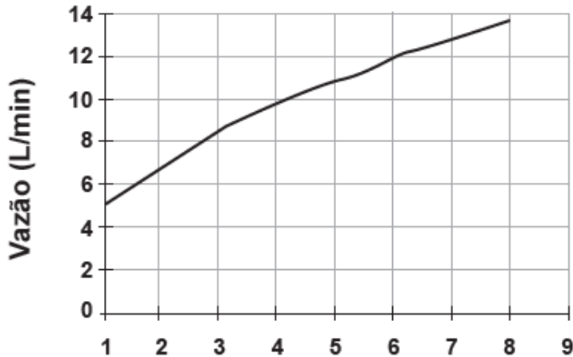

Pressão Estática (mca)

Nessa casa residem quatro pessoas. Cada uma delas toma um banho por dia, com duração média de 8 minutos, permanecendo o registro aberto com vazão máxima durante esse tempo. A ducha é instalada em um ponto seis metros abaixo do nível da lâmina de água, que se mantém constante dentro do reservatório.

Ao final de 30 dias, esses banhos consumirão um volume de água, em litros, igual a

A 69 120.

B 17 280.

© 11 520.

D 8 640

E 2880

#  Questão 106 (H6 | 2019 | 599,7) ①②③④⑤

Dois amigos se encontram em um posto de gasolina para calibrar os pneus de suas bicicletas. Uma das bicicletas é de corrida (bicicleta A) e a outra, de passeio (bicicleta B). Os pneus de ambas as bicicletas têm as mesmas características, exceto que a largura dos pneus de A é menor que a largura dos pneus de B. Ao calibrarem os pneus das bicicletas A e B, respectivamente com pressões de calibração PA e PB, os amigos observam que o pneu da bicicleta A deforma, sob mesmos esforços, muito menos que o pneu da bicicleta B. Pode-se considerar que as massas de ar comprimido no pneu da bicicleta A, MA, e no pneu da bicicleta B, MB, são diretamente proporcionais aos seus volumes.

Comparando as pressões e massas de ar comprimido nos pneus das bicicletas, temos:

A $pA < PB \ e M A < m B$

B $pA > PB \ e M A < m B$

© pA> pB  e  mA=mB

Ⓓ $pA < PB \ e M A = mB$

E $pA > pB \ e M_A > m_B$

#  Questão 107 (H6 | 2017 | 620,2) ①②③④⑤

No manual fornecido pelo fabricante de uma ducha elétrica de 220 V é apresentado um gráfico com a variação da temperatura da água em função da vazão para três condições (morno, quente e superquente). Na condição superquente, a potência dissipada é de 6 500 W. Considere o calor específico da água igual a 4 200 J/(kg °C) e densidade da água igual a 1 kg/L.

Elevação de temperatura × Curva vazão

1 - MORNO

2-QUENTE

3 - SUPERQUENTE

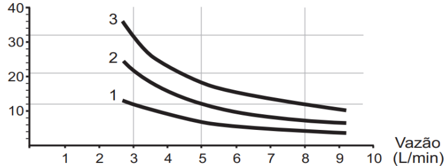

Com base nas informações dadas, a potência na condição morno corresponde a que fração da potência na condição superquente?

A $\frac{1}{3}$

B $\frac{1}{5}$

© $\frac{3}{5}$

D $\frac{3}{8}$

E $\frac{5}{8}$

#  Questão 108 (H6 | 2021 | 640,7) ①②③④⑤

O alcoolômetro Gay Lussac é um instrumento destinado a medir o teor de álcool, em porcentagem de volume (v/v), de soluções de água e álcool na faixa de 0 °GL a 100 °GL, com divisões de 0,1 °GL. A concepção do alcoolômetro se baseia no princípio de flutuabilidade de Arquimedes, semelhante ao funcionamento de um densímetro. A escala do instrumento é aferida a 20 °C, sendo necessária a correção da medida, caso a temperatura da solução não esteja na temperatura de aferição. É apresentada parte da tabela de correção de um alcoolômetro, com a temperatura

| Tabela de correção do alcoolômetro com temperatura 20 °C | Tabela de correção do alcoolômetro com temperatura 20 °C | Tabela de correção do alcoolômetro com temperatura 20 °C | Tabela de correção do alcoolômetro com temperatura 20 °C | Tabela de correção do alcoolômetro com temperatura 20 °C | Tabela de correção do alcoolômetro com temperatura 20 °C | Tabela de correção do alcoolômetro com temperatura 20 °C |
| --- | --- | --- | --- | --- | --- | --- |
| °GL | Leitura da temperatura (°C) | Leitura da temperatura (°C) | Leitura da temperatura (°C) | Leitura da temperatura (°C) | Leitura da temperatura (°C) | Leitura da temperatura (°C) |
| °GL | 20 | 21 | 22 | 23 | 24 | 25 |
| 35 | 35,0 | 34,6 | 34,2 | 33,8 | 33,4 | 33,0 |
| 36 | 36,0 | 35,6 | 35,2 | 34,8 | 34,4 | 34,0 |

Manual alcoolômetro Gay Lussac. Disponível em: www.incoterm.com.br. Acesso em: 4 dez. 2018 (adaptado).

É necessária a correção da medida do instrumento, pois um aumento na temperatura promove o(a)

A aumento da dissociação da água.

B aumento da densidade da água e do álcool.

© mudança do volume dos materiais por dilatação.

Ⓓ aumento da concentração de alcool durante a medida.

E alteração das propriedades químicas da mistura alcool e água.

#  Questão 109 (H6 | 2018 | 646,1) ①②③④⑤

A identificação de riscos de produtos perigosos para o transporte rodoviário é obrigatória e realizada por meio da sinalização composta por um painel de segurança, de cor alaranjada, e um rótulo de risco. As informações inseridas no painel de segurança e no rótulo de risco, conforme determina a legislação, permitem que se identifique o produto transportado e os perigos a ele associados.

A sinalização mostrada identifica uma substância que está sendo transportada em um caminhão.

Os três algarismos da parte superior do painel indicam o “Número de risco”. O número 268 indica tratar-se de um gás (2), tóxico (6) e corrosivo (8). Os quatro dígitos da parte inferior correspondem ao “Número ONU”, que identifica o produto transportado.

BRASIL. Resolução n. 420, de 12/02/2004, da Agência Nacional de Transportes Terrestres (ANTT)/Ministério dos Transportes (adaptado).

ABNT. NBR 7500: identificação para o transporte terrestre, manuseio, movimentação e armazenamento de produtos. Rio de Janeiro, 2004 (adaptado).

Considerando a identificação apresentada no caminhão, o código 1005 corresponde à substância

Aeteno (C2H4).

B nitrogênio ($N_2$).

© amônia ($NH_3$).

D propano ($C_3H_8$).

E dióxido de carbono ($CO_2$).

#  Questão 110 (H6 | 2020 | 673,0) ①②③④⑤

Mesmo para peixes de aquário, como o peixe arcoíris, a temperatura da água fora da faixa ideal (26 °C a 28 °C), bem como sua variação brusca, pode afetar a saúde do animal. Para manter a temperatura da água dentro do aquário na média desejada, utilizam-se dispositivos de aquecimento com termostato. Por exemplo, para um aquário de 50 L, pode-se utilizar um sistema de aquecimento de 50 W otimizado para suprir sua taxa de resfriamento.

Essa taxa pode ser considerada praticamente constante, já que a temperatura externa ao aquário é mantida pelas estufas. Utilize para a água o calor específico 4,0 kJ kg⁻$^{1}$ K⁻$^{1}$ e a densidade 1 kg L⁻$^{1}$.

Se o sistema de aquecimento for desligado por 1 h, qual o valor mais próximo para a redução da temperatura da água do aquário?

A 4,0°C

Ⓡ 3,6°C

© 0,9℃

D 0,6℃

E 0,3°C

##  Questão 111 (H6 | 2021 | 677,4) ①②③④⑤

Analisando a ficha técnica de um automóvel popular, verificam-se algumas características em relação ao seu desempenho. Considerando o mesmo automóvel em duas versões, uma delas funcionando a álcool e outra, a gasolina, tem-se os dados apresentados no quadro, em relação ao desempenho de cada motor.

| Parâmetro | Motor a gasolina | Motor a álcool |
| --- | --- | --- |
| Aceleração | de 0 a 100 km/h em 13,4 s | de 0 a 100 km/h em 12,9 s |
| Velocidade máxima | 165 km/h | 163 km/h |

Considerando desprezível a resistência do ar, qual versão apresenta a maior potência?

A Como a versão a gasolina consegue a maior aceleração, esta é a que desenvolve a maior potência.

B Como a versão a gasolina atinge o maior valor de energia cinética, esta é a que desenvolve a maior potência.

ⓒ Como a versão a álcool apresenta a maior taxa de variação de energia cinética, esta é a que desenvolve a maior potência.

Ⓓ Como ambas as versões apresentam a mesma variação de velocidade no cálculo da aceleração, a potência desenvolvida é a mesma.

E Como a versão a gasolina fica com o motor trabalhando por mais tempo para atingir os 100 km/h, esta é a que desenvolve a maior potência.

#  Questão 112 (H6 | 2023 | 677,9) ①②③④⑤

O fogão por indução funciona a partir do surgimento de uma corrente elétrica induzida no fundo da panela, com consequente transformação de energia elétrica em calor por efeito Joule. A principal vantagem desses fogões é a eficiência energética, que é substancialmente maior que a dos fogões convencionais.

A corrente elétrica mencionada é induzida por

A radiação.

B condução.

campo elétrico variável.

Ⓓ campo magnético variável.

E ressonância eletromagnética.

#  Questão 113 (H6 | 2023 | 698,9) ①②③ ⑤

Em uma indústria alimentícia, para produção de doce de leite, utiliza-se um tacho de parede oca com uma entrada para vapor de água a 120 °C e uma saída para água líquida em equilíbrio com o vapor a 100 °C. Ao passar pela parte oca do tacho, o vapor de água transforma-se em líquido, liberando energia. A parede transfere essa energia para o interior do tacho, resultando na evaporação de água e consequente concentração do produto.

No processo de concentração do produto, é utilizada energia proveniente

A somente do calor latente de vaporização.

B somente do calor latente de condensação.

ⓒdo calor sensível e do calor latente de vaporização.

do calor sensível e do calor latente de condensação.

do calor latente de condensação e do calor latente de vaporização.

##  Questão 114 (H6 | 2018 | 700,3) ①②③④⑤

Nos manuais de instalação de equipamentos de som há o alerta aos usuários para que observem a correta polaridade dos fios ao realizarem as conexões das caixas de som. As figuras ilustram o esquema de conexão das caixas de som de um equipamento de som mono, no qual os alto-falantes emitem as mesmas ondas. No primeiro caso, a ligação obedece às especificações do fabricante e no segundo mostra uma ligação na qual a polaridade está invertida.

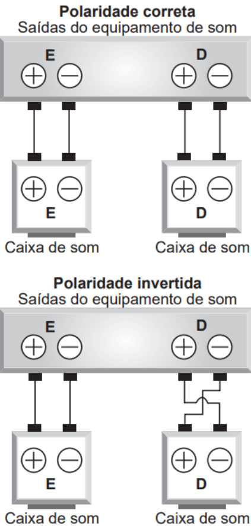

O que ocorre com os alto-falantes E e D se forem conectados de acordo com o segundo esquema?

A O alto-falante E funciona normalmente e o D entra em curto-circuito e não emite som.

B O alto-falante E emite ondas sonoras com frequências ligeiramente diferentes do alto-falante D provocando o fenômeno de batimento.

© O alto-falante E emite ondas sonoras com frequências e fases diferentes do alto-falante D provocando o fenômeno conhecido como ruído.

O alto-falante E emite ondas sonoras que apresentam um lapso de tempo em relação às emitidas pelo alto-falante D provocando o fenômeno de reverberação.

O alto-falante E emite ondas sonoras em oposição de fase às emitidas pelo alto-falante D provocando o fenômeno de interferência destrutiva nos pontos equidistantes aos alto-falantes.

#  Questão 115 (H6 | 2019 | 704,7) ①②③④⑤

Numa feira de ciências, um estudante utilizará o disco de Maxwell (ioiô) para demonstrar o princípio da conservação da energia. A apresentação consistirá em duas etapas:

Etapa 1 - a explicação de que, à medida que o disco desce, parte de sua energia potencial gravitacional é transformada em energia cinética de translação e energia cinética de rotação;

Etapa 2 - o cálculo da energia cinética de rotação do disco no ponto mais baixo de sua trajetória, supondo o sistema conservativo.

Ao preparar a segunda etapa, ele considera a aceleração da gravidade igual a 10 m s-2 e a velocidade linear do centro de massa do disco desprezível em comparação com a velocidade angular. Em seguida, mede a altura do topo do disco em relação ao chão no ponto mais baixo de sua trajetória, obtendo $\frac{1}{3}$ da altura da haste do brinquedo.

As especificações de tamanho do brinquedo, isto é, de comprimento (C), largura (L) e altura (A), assim como da massa de seu disco de metal, foram encontradas pelo estudante no recorte de manual ilustrado a seguir.

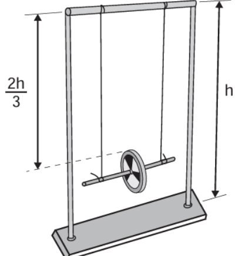

Conteúdo: base de metal, hastes metálicas, barra superior, disco de metal.

Tamanho (C × L × A): 300 mm × 100 mm × 410 mm Massa do disco de metal: 30 g

O resultado do cálculo da etapa 2, em joule, é

A 4, $10\times10^{-2}$

B 8, $20 \times 10^{-2}$.

© 1,23  $\times 10^{-1}$  .

D 8,20x104.

$\blacksquare$ 1,23×10$^{5}$.

#  Questão 116 (H6 | 2012 | 717,0) ①②③④⑤

O mecanismo que permite articular uma porta (de um móvel ou de acesso) é a dobradiça. Normalmente, são necessárias duas ou mais dobradiças para que a porta seja fixada no móvel ou no portal, permanecendo em equilíbrio e podendo ser articulada com facilidade.

No plano, o diagrama vetorial das forças que as dobradiças exercem na porta está representado em

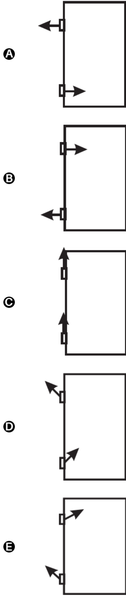

#  Questão 117 (H6 | 2022 | 740,1) ①②③④⑤

O manual de uma ducha elétrica informa que seus três níveis de aquecimento (morno, quente e superquente) apresentam as seguintes variações de temperatura da água em função de sua vazão:

| Vazão $\left(\frac{L}{\min}\right)$ | ΔT (°C) | ΔT (°C) | ΔT (°C) |
| --- | --- | --- | --- |
| Vazão $\left(\frac{L}{\min}\right)$ | Morno | Quente | Superquente |
| 3 | 10 | 20 | 30 |
| 6 | 5 | 10 | 15 |

Utiliza-se um disjuntor para proteger o circuito dessa ducha contra sobrecargas elétricas em qualquer nível de aquecimento. Por padrão, o disjuntor é especificado pela corrente nominal igual ao múltiplo de 5 A imediatamente superior à corrente máxima do circuito. Considere que a ducha deve ser ligada em 220 V e que toda a energia é dissipada através da resistência do chuveiro e convertida em energia térmica transferida para a água, que apresenta calor específico de 4,2 J g °C e densidade de 1 000 g L.

O disjuntor adequado para a proteção dessa ducha é especificado por

A 60 A.

Ⓑ 30 A.

C 20 A.

D 10 A.

E 5A.

#  Questão 118 (H6 | 2020 | 880,0) ①②③④⑤

Os manuais de refrigerador apresentam a recomendação de que o equipamento não deve ser instalado próximo a fontes de calor, como fogão e aquecedores, ou em local onde incida diretamente a luz do sol. A instalação em local inadequado prejudica o funcionamento do refrigerador e aumenta o consumo de energia.

O não atendimento dessa recomendação resulta em aumento do consumo de energia porque

a o fluxo de calor por condução no condensador sofre considerável redução.

a temperatura da substância refrigerante no condensador diminui mais rapidamente.

© o fluxo de calor promove significativa elevação da temperatura no interior do refrigerador.

a liquefação da substância refrigerante no condensador exige mais trabalho do compressor.

E as correntes de convecção nas proximidades do condensador ocorrem com maior dificuldade.

##  Questão 119 (H6 | 2015 | 6605,5) ①②③④⑤

Um garoto foi à loja comprar um estilingue e encontrou dois modelos: um com borracha mais “dura” e outro com borracha mais “mole”. O garoto concluiu que o mais adequado seria o que proporcionasse maior alcance horizontal, D , para as mesmas condições de arremesso, quando submetidos à mesma força aplicada. Sabe-se que a constante elástica $k_d$ (do estilingue mais “duro”) é o dobro da constante elástica $k_m$ (do estilingue mais “mole”). A razão entre os alcances $\frac{D_d}{D_m}$, referentes aos estilingues com borrachas “dura” e “mole”, respectivamente, é igual a

A $\frac{1}{4}$.

B $\frac{1}{2}$.

©1.

D 2.

Ⓑ4.

#  Competência 2

Identificar a presença e aplicar as tecnologias associadas às ciências naturais em diferentes contextos.

#  Habilidade 7

Selecionar testes de controle, parâmetros ou critérios para a comparação de materiais e produtos, tendo em vista a defesa do consumidor, a saúde do trabalhador ou a qualidade de vida.

Questão 120 (H7 | 2017 | 549,3) ①②③④⑤

As centrífugas são equipamentos utilizados em laboratórios, clínicas e indústrias. Seu funcionamento faz uso da aceleração centrífuga obtida pela rotação de um recipiente e que serve para a separação de sólidos em suspensão em líquidos ou de líquidos misturados entre si.

RODITI, I. Dicionário Houaiss de física. Rio de Janeiro: Objetiva, 2005 (adaptado).

Nesse aparelho, a separação das substâncias ocorre em função

A das diferentes densidades.

B dos diferentes raios de rotação.

ⓒ das diferentes velocidades angulares.

D das diferentes quantidades de cada substância.

E da diferente coesão molecular de cada substância.

##  Questão 121 (H7 | 2020 | 595,1) ①②③④⑤

As moedas despertam o interesse de colecionadores, numismatas e investidores há bastante tempo. Uma moeda de 100% cobre, circulante no período do Brasil Colônia, pode ser bastante valiosa. O elevado valor gera a necessidade de realização de testes que validem a procedência da moeda, bem como a veracidade de sua composição. Sabendo que a densidade do cobre metálico é próxima de 9 g cm$^{-3}$, um investidor negocia a aquisição de um lote de quatro moedas A, B, C e D fabricadas supostamente de 100% cobre e massas 26 g, 27 g, 10 g e 36 g, respectivamente. Com o objetivo de testar a densidade das moedas, foi realizado um procedimento em que elas foram sequencialmente inseridas em uma proveta contendo 5 mL de água, conforme esquematizado.

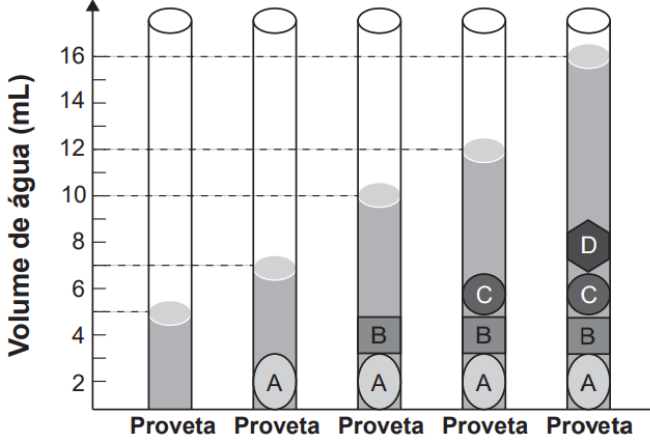

Com base nos dados obtidos, o investidor adquiriu as moedas

A A B.

Ⓑ AeC.

C BeC.

D BeD.

E C D.

Questão 122 (H7 | 2020 | 595,8) ①②③④⑤

A Torre Eiffel, com seus 324 metros de altura, feita com treliças de ferro, pesava 7 300 toneladas quando terminou de ser construída em 1889. Um arquiteto resolve construir um protótipo dessa torre em escala 1:100, usando os mesmos materiais (cada dimensão linear em escala de 1:100 do monumento real). Considere que a torre real tenha uma massa $M_{torre}$ e exerça na fundação sobre a qual foi erguida uma pressão $P_{torre}$. O modelo construído pelo arquiteto terá uma massa $M_{modelo}$ e exercerá uma pressão $P_{modelo}$.

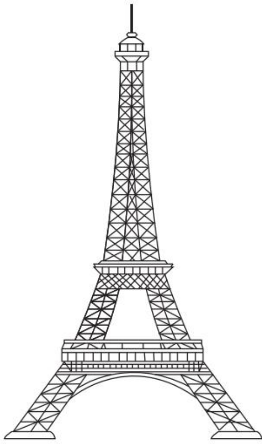

Como a pressão exercida pela torre se compara com a pressão exercida pelo protótipo? Ou seja, qual é a razão entre as pressões $\frac{(P_{\text{torre}})}{(P_{\text{modelo}})}$?

A $10^0$

B 10^1

ⓒ $10^2$

D 10^4

E $10^6$

Questão 123 (H7 | 2014 | 610,6) ①②③④⑤

As lentes fotocromáticas escurecem quando expostas à luz solar por causa de reações químicas reversíveis entre uma espécie incolor e outra colorida. Diversas reações podem ser utilizadas, e a escolha do melhor reagente para esse fim se baseia em três principais aspectos: (i) o quanto escurece a lente; (ii) o tempo de escurecimento quando exposta à luz solar; e (iii) o tempo de esmaecimento em ambiente sem forte luz solar. A transmitância indica a razão entre a quantidade de luz que atravessa o meio e a quantidade de luz qu incide sobre ele.

Durante um teste de controle para o desenvolvimento de novas lentes fotocromáticas, foram analisadas cinco amostras, que utilizam reagentes químicos diferentes. No quadro, são apresentados os resultados.

| Amostra | Tempo de escurecimento (segundo) | Tempo de esmaecimento (segundo) | Transmitância média da lente quando exposta à luz solar (%) |
| --- | --- | --- | --- |
| 1 | 20 | 50 | 80 |
| 2 | 40 | 30 | 90 |
| 3 | 20 | 30 | 50 |
| 4 | 50 | 50 | 50 |
| 5 | 40 | 20 | 95 |

Considerando os três aspectos, qual é a melhor amostra de lente fotocromática para se utilizar em óculos?

A 1

B 2

© 3

D 4

E 5

#  Questão 124 (H7 | 2015 | 651,8) ①②③④⑤

A radiação ultravioleta (UV) é dividida, de acordo com três faixas de frequência, em UV-A, UV-B e UV-C, conforme a figura.

Para selecionar um filtro solar que apresente absorção máxima na faixa UV-B, uma pessoa analisou os espectros de absorção da radiação UV de cinco filtros solares:

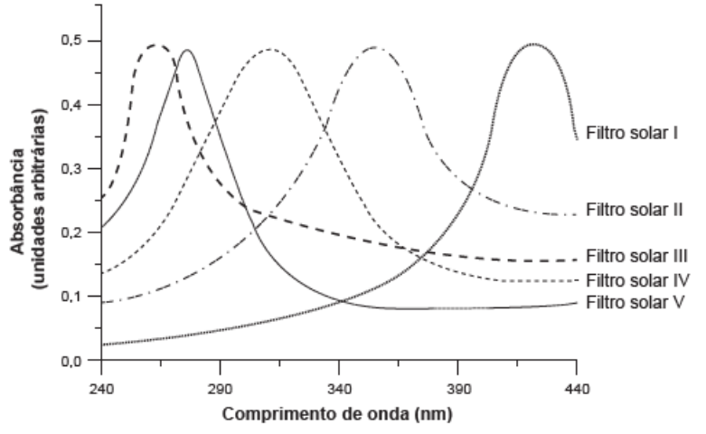

Considere: velocidade da luz = 3,0×10$^{8}$ m/s e 1 nm = 1,0×10$^{-9}$ m.

O filtro solar que a pessoa deve selecionar é o

A V.

B IV.

C III.

D II.

E I.

#  Questão 125 (H7 | 2012 | 659,2) ①②③④⑤

Um consumidor desconfia que a balança do supermercado não está aferindo corretamente a massa dos produtos. Ao chegar a casa resolve conferir se a balança estava descalibrada. Para isso, utiliza um recipiente provido de escala volumétrica, contendo

1,0 litro d'água. Ele coloca uma porção dos legumes que comprou dentro do recipiente e observa que a água atinge a marca de 1,5 litro e também que a porção não ficara totalmente submersa, com $\frac{1}{3}$ de seu volume fora d'água. Para concluir o teste, o consumidor, com ajuda da internet, verifica que a densidade dos legumes, em questão, é a metade da densidade da água, onde, $\rho_{\text{água}} = 1 \cdot \frac{g}{cm^3}$. No

supermercado a balança registrou a massa da porção de legumes igual a 0,500 kg (meio quilograma).

Considerando que o método adotado tenha boa precisão, o consumidor concluiu que a balança estava descalibrada e deveria ter registrado a massa da porção de legumes igual a

A 0,073 kg.

B 0,167 kg.

© 0,250 kg.

▶ 0,375 kg.

E 0,750 kg.

#  Questão 126 (H7 | 2019 | 659,6) ①②③④⑤

Um dos parâmetros de controle de qualidade de polpas de frutas destinadas ao consumo como bebida é a acidez total expressa em ácido cítrico, que corresponde à massa dessa substância em 100 gramas de polpa de fruta. O ácido cítrico é uma molécula orgânica que apresenta três hidrogênios ionizáveis (ácido triprótico) e massa molar 192 g mol $^{-1}$. O quadro indica o valor mínimo desse parâmetro de qualidade para polpas comerciais de algumas frutas.

| Polpa de fruta | Valor mínimo da acidez total expressa em ácido cítrico (g/100 g) |
| --- | --- |
| Acerola | 0,8 |
| Caju | 0,3 |
| Cupuaçu | 1,5 |
| Graviola | 0,6 |
| Maracujá | 2,5 |

A acidez total expressa em ácido cítrico de uma amostra comercial de polpa de fruta foi determinada. No procedimento, adicionou-se água destilada a 2,2 g da amostra e, após a solubilização do ácido cítrico, o sólido remanescente foi filtrado. A solução obtida foi titulada com solução de hidróxido de sódio 0,01 mol L$^{-1}$, em que se consumiram 24 mL da solução básica (titulante).

BRASIL. Ministério da Agricultura e do Abastecimento. Instrução normativa n. 1, de 7 de janeiro de 2000. Disponível em: www.agricultura.gov.br. Acesso em: 9 maio 2019 (adaptado).

Entre as listadas, a amostra analisada pode ser de qual polpa de fruta?

A Apenas caju.

B Apenas maracujá.

Caju ou graviola.

D Acerola ou cupuaçu.

E Cupuaçu ou graviola.

#  Questão 127 (H7 | 2017 | 660,6) ①②③④⑤

A toxicidade de algumas substâncias é normalmente representada por um índice conhecido como DL50 (dose letal mediana). Ele representa a dosagem aplicada a uma população de seres vivos que mata 50% desses indivíduos e é normalmente medido utilizando-se ratos como cobaias. Esse índice é muito importante para os seres humanos, pois ao se extrapolar os dados obtidos com o uso de cobaias, pode-se determinar o nível tolerável de contaminação de alimentos, para que possam ser consumidos de forma segura pelas pessoas. O quadro apresenta três pesticidas e suas toxicidades. A unidade mg/kg indica a massa da substância ingerida pela massa da cobaia.

| Pesticidas | $DL_{50}$ (mg/kg) |
| --- | --- |
| Diazinon | 70 |
| Malation | 1 000 |
| Atrazina | 3 100 |

Sessenta ratos, com massa de 200 g cada, foram divididos em três grupos de vinte. Três amostras de ração, contaminadas, cada uma delas com um dos pesticidas indicados no quadro, na concentração de 3 mg por grama de ração, foram administradas para cada grupo de cobaias. Cada rato consumiu 100 g de ração.

Qual(ais) grupo(s) terá(ão) uma mortalidade mínima de 10 ratos?

a O grupo que se contaminou somente com atrazina.

B O grupo que se contaminou somente com diazinon.

© Os grupos que se contaminaram com atrazina e malation.

Ⓓ Os grupos que se contaminaram com diazinon e malation.

E Nenhum dos grupos contaminados com atrazina, diazinon e malation.

#  Questão 128 (H7 | 2023 | 662,2) ①②③④⑤

Uma academia decide trocar gradualmente seus aparelhos de musculação. Agora, os frequentadores que utilizam os aparelhos do tipo 1 podem também utilizar os aparelhos do tipo 2, representados na figura, para elevar cargas correspondentes às massas $M_1$ e $M_2$, com velocidade constante. A fim de que o exercício seja realizado com a mesma força $\vec{F}$, os usuários devem ser orientados a respeito da relação entre as cargas nos dois tipos de aparelhos, já que as polias fixas apenas mudam a direção das forças, enquanto a polia móvel divide as forças.

Em ambos os aparelhos, considere as cordas inextensíveis, as massas das polias e das cordas desprezíveis e que não há dissipação de energia.

Aparelho do tipo 1

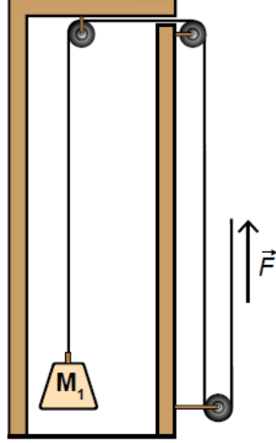

Aparelho do tipo 2

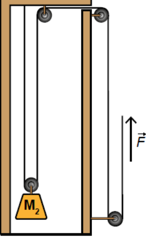

Para essa academia, qual deve ser a razão informada aos usuários?

A $\frac{1}{4}$

B $\frac{1}{2}$

©1

D 2

E 4

#  Questão 129 (H7 | 2021 | 666,3) ①②③④⑤

Um técnico analisou um lote de analgésicos que supostamente estava fora das especificações. A composição prevista era 100 mg de ácido acetilsalicílico por comprimido (princípio ativo, cuja estrutura está apresentada na figura), além do amido e da celulose (componentes inertes). O técnico realizou os seguintes testes:

1) obtenção da massa do comprimido;

2) medição da densidade do comprimido;

3) verificação do pH com papel indicador;

4) determinação da temperatura de fusão do comprimido;

5) titulação com solução aquosa de NaOH.

Após a realização dos testes, o lote do medicamento foi reprovado porque a quantidade de ácido acetilsalicílico por comprimido foi de apenas 40% da esperada.

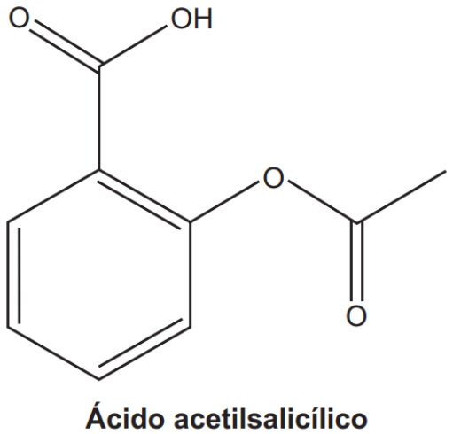

O teste que permitiu reprovar o lote de analgésicos foi o de número

A 1.

B 2.

© 3.

D 4.

E 5.

#  Questão 130 (H7 | 2016 | 679,5) ①②③④⑤

Em meados de 2003, mais de 20 pessoas morreram no Brasil após terem ingerido uma suspensão de sulfato de bário utilizada como contraste em exames radiológicos. O sulfato de bário é um sólido pouquíssimo solúvel em água, que não se dissolve mesmo na presença de ácidos. As mortes ocorreram porque um laboratório farmacêutico forneceu o produto contaminado com carbonato de bário, que é solúvel em meio ácido. Um simples teste para verificar a existência de íons bário solúveis poderia ter evitado a tragédia. Esse teste consiste em tratar a amostra com solução aquosa de HCl e, após filtrar para separar os compostos insolúveis de bário, adiciona-se solução aquosa de H₂SO₄ sobre o filtrado e observa-se por 30 min.

TUBINO, M.; SIMONI, J. A. Refletindo sobre o caso Celobar®. Química Nova, n. 2, 2007 (adaptado).

A presença de íons bário solúveis na amostra é indicada pela

A liberação de calor.

B alteração da cor para rosa.

ⓒ precipitação de um sólido branco.

D formação de gás hidrogênio.

E volatilização de gás cloro.

#  Questão 131 (H7 | 2018 | 698,0) ①②③⑤

Visando a melhoria estética de um veículo, o vendedor de uma loja sugere ao consumidor que ele troque as rodas de seu automóvel de aro 15 polegadas para aro 17 polegadas, o que corresponde a um diâmetro maior do conjunto roda e pneu.

Duas consequências provocadas por essa troca de aro são:

Elevar a posição do centro de massa do veículo tornando-o mais instável e aumentar a velocidade do automóvel em relação à indicada no velocímetro.

Abaxar a posição do centro de massa do veículo tornando-o mais instável e diminuir a velocidade do automóvel em relação à indicada no velocímetro.

C Elevar a posição do centro de massa do veículo tornando-o mais estável e aumentar a velocidade do automóvel em relação à indicada no velocímetro.

Abaxar a posição do centro de massa do veículo tornando-o mais estável e diminuir a velocidade do automóvel em relação à indicada no velocímetro.

Elevar a posição do centro de massa do veículo tornando-o mais estável e diminuir a velocidade do automóvel em relação à indicada no velocímetro.

#  Questão 132 (H7 | 2013 | 702,4) ①②③ ⑤

Para serrar ossos e carnes congeladas, um açougueiro utiliza uma serra de fita que possui três polias e um motor. O equipamento pode ser montado de duas formas diferentes, P e Q. Por questão de segurança, é necessário que a serra possua menor velocidade linear.

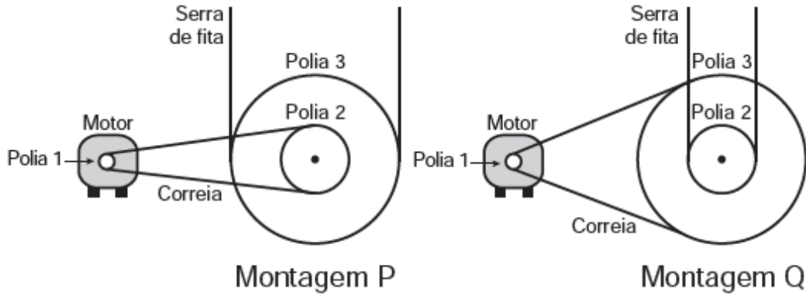

Por qual montagem o açougueiro deve optar e qual a justificativa desta opção?

A Q, pois as polias 1 e 3 giram com velocidades lineares iguais em pontos periféricos e a que tiver maior raio terá menor frequência.

B Q, pois as polias 1 e 3 giram com frequências iguais e a que tiver maior raio terá menor velocidade linear em um ponto periférico.

© P, pois as polias 2 e 3 giram com frequências diferentes e a que tiver maior raio terá menor velocidade linear em um ponto periférico.

Ⓓ P, pois as polias 1 e 2 giram com diferentes velocidades lineares em pontos periféricos e a que tiver menor raio terá maior frequência.

E Q, pois as polias 2 e 3 giram com diferentes velocidades lineares em pontos periféricos e a que tiver maior raio terá menor frequência.

#  Questão 133 (H7 | 2023 | 767,4) ①②③④⑤

Em uma indústria, o controle da dureza da água é importante quando ela é utilizada em caldeiras, uma vez que sais pouco solúveis, formados a partir de sulfatos e carbonatos, podem acumular-se no interior das tubulações, causando obstruções. Para avaliar a água utilizada nessa indústria, foram realizados testes de qualidade que consideraram os seguintes parâmetros:

| Teste | Parâmetro medido |
| --- | --- |
| 1 | Cálcio |
| 2 | Cloreto |
| 3 | Turbidez |
| 4 | Coliformes totais |
| 5 | Sólidos sedimentáveis |

Qual teste deve ser considerado para controlar a formação desse tipo de obstrução de tubulações?

A 1

B 2

C 3

D 4

E 5

#  Questão 134 (H7 | 2019 | 836,5) ①②③④⑤

O objetivo de recipientes isolantes térmicos é minimizar as trocas de calor com o ambiente externo. Essa troca de calor é proporcional à condutividade térmica k e à área interna das faces do recipiente, bem como à diferença de temperatura entre o ambiente externo e o interior do recipiente, além de ser inversamente proporcional à espessura das faces.

A fim de avaliar a qualidade de dois recipientes A (40cm×40cm×40cm) e B (60cm×40cm×40cm), de faces de mesma espessura, uma estudante compara suas condutividades térmicas kA e kB. Para isso suspende, dentro de cada recipiente, blocos idênticos de gelo a 0 °C, de modo que suas superfícies estejam em contato apenas com o ar. Após um intervalo de tempo, ela abre os recipientes enquanto ambos ainda contêm um pouco de gelo e verifica que a massa de gelo que se fundiu no recipiente B foi o dobro da que se fundiu no recipiente A.

A razão $\frac{k_A}{k_B}$ é mais próxima de

A 0,50.

B 0,67.

© 0,75.

D 1,33.

E 2,00.

#  Questão 135 (H7 | 2022 | Anulada pela TRI)

Um pai faz um balanço utilizando dois segmentos paralelos e iguais da mesma corda para fixar uma tábua a uma barra horizontal. Por segurança, opta por um tipo de corda cuja tensão de ruptura seja 25% superior à tensão máxima calculada nas seguintes condições:

● O ângulo máximo atingido pelo balanço em relação à vertical é igual a 90°;

● Os filhos utilizarão o balanço até que tenham uma massa de 24 kg.

Além disso, ele aproxima o movimento do balanço para o movimento circular uniforme, considera que a aceleração da gravidade é igual a 10 (21) e despreza forças dissipativas.

Qual é a tensão de ruptura da corda escolhida?

A 120 N

B 300 N

360 N

Ⓓ 450 N

E 900 N

#  COMPETÊNCIA
3

Questões de 136 a 209

#  Competência 3

Associar intervenções que resultam em degradação ou conservação ambiental a processos produtivos e sociais e a instrumentos ou ações científico-tecnológicos.

#  Habilidade 8

Identificar etapas em processos de obtenção, transformação, utilização ou reciclagem de recursos naturais, energéticos ou matérias-primas, considerando processos biológicos, químicos ou físicos neles envolvidos.

Questão 136 (H8 | 2021 | 567,3) ①②③④⑤

A imagem apresenta as etapas do funcionamento de uma estação individual para tratamento do esgoto residencial.

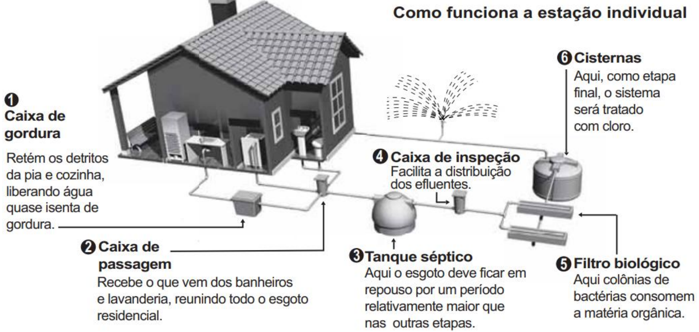

TAVARES, K. Estações de tratamento de esgoto individuais permitem a reutilização da água. Disponível em: https://extra.globo.com. Acesso em: 18 nov. 2014 (adaptado).

Em qual etapa decanta-se o lodo a ser separado do esgoto residencial?

A 1

B 2

© 3

D 5

E 6

#  Questão 137 (H8 | 2019 | 586,8) ①②③④⑤

Na família Retroviridae encontram-se diversos vírus que infectam aves e mamíferos, sendo caracterizada pela produção de DNA a partir de uma molécula de RNA. Alguns retrovírus infectam exclusivamente humanos, não necessitando de outros hospedeiros, reservatórios ou vetores biológicos. As infecções ocasionadas por esses vírus vêm causando mortes e grandes prejuízos ao desenvolvimento social e econômico. Nesse contexto, pesquisadores têm produzido medicamentos que contribuem para o tratamento dessas doenças.

Que avanços tecnológicos têm contribuído para o tratamento dessas infecções virais?

A Melhoria dos métodos de controle dos vetores desses vírus.

B Fabricação de soros mutagênicos para combate desses vírus.

© Investimento da indústria em equipamentos de proteção individual.

D Produção de vacinas que evitam a infecção das células hospedeiras.

E Desenvolvimento de antirretrovirais que dificultam a reprodução desses vírus.

#  Questão 138 (H8 | 2023 | 601,2) ①②③④⑤

Barbatimão é o nome popular de uma árvore cuja casca é utilizada para fins medicinais. Essa casca é constituída principalmente de dois tecidos vegetais: periderme e floema. A extração da casca tem levado à morte muitos indivíduos dessa espécie, quando o corte retira um anel completo ao longo da circunferência do tronco. Aqueles que têm parte da casca retirada sem completar essa circunferência podem sobreviver.

A morte desses indivíduos, decorrente da retirada do anel completo da casca, é provocada pela interrupção da

A fotossíntese.

B transpiração.

troca de gases.

D formação de brotos.

E nutrição das raízes.

##  Questão 139 (H8 | 2012 | 602,8) ①②③④⑤

O boato de que os lacres das latas de alumínio teriam um alto valor comercial levou muitas pessoas a juntarem esse material na expectativa de ganhar dinheiro com sua venda. As empresas fabricantes de alumínio esclarecem que isso não passa de uma “lenda urbana”, pois ao retirar o anel da lata, dificulta-se a reciclagem do alumínio. Como a liga do qual é feito o anel contém alto teor de magnésio, se ele não estiver junto com a lata, fica mais fácil ocorrer a oxidação do alumínio no forno. A tabela apresenta as semirreações e os valores de potencial padrão de redução de alguns metais:

| Semirreação | Potencial Padrão de Redução (V) |
| --- | --- |
| $Li^{+}$ + $e^{-}$ → Li | -3,05 |
| $ K^++e^-\to K $ | -2,93 |
| $ \text{Mg}^{2+}+2\,\text{e}^{-}\rightarrow\text{Mg} $ | -2,36 |
| $Al^{3+}$ + 3 $e^{-}$ → Al | -1,66 |
| $ \text{Zn}^{2+}+2\,\text{e}^{-}\rightarrow\text{Zn} $ | -0,76 |
| $ \text{Cu}^{2+}+2\,\text{e}^{-}\rightarrow\text{Cu} $ | +0,34 |

Disponível em: www.sucatas.com. Acesso em: 28 fev. 2012
(adaptado).

Com base no texto e na tabela, que metais poderiam entrar na composição do anel das latas com a mesma função do magnésio, ou seja, proteger o alumínio da oxidação nos fornos e não deixar diminuir o rendimento da sua reciclagem?

Somente o lítio, pois ele possui o menor potencial de redução.

B Somente o cobre, pois ele possui o maior potencial de redução.

Somente o potássio, pois ele possui potencial de redução mais próximo do magnésio.

D Somente o cobre e o zinco, pois eles sofrem oxidação mais facilmente que o alumínio.

E Somente o lítio e o potássio, pois seus potenciais de redução são menores do que o do alumínio.

Questão 140 (H8 | 2016 | 629,9) ①②③④⑤

O esquema representa, de maneira simplificada, o processo de produção de etanol utilizando milho como matéria-prima.

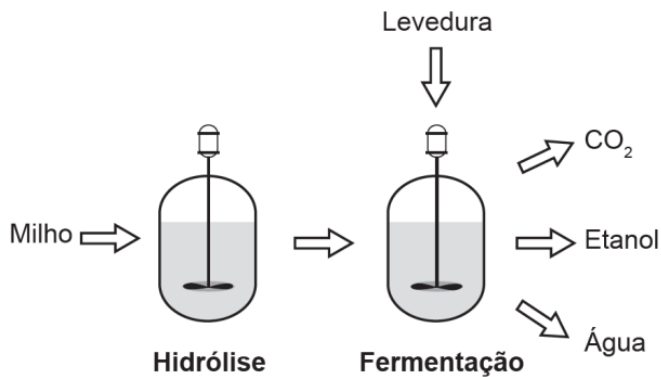

A etapa de hidrólise na produção de etanol a partir do milho é fundamental para que

A a glicose seja convertida em sacarose.

B as enzimas dessa planta sejam ativadas.

© a maceração favoreça a solubilização em água.

o amido seja transformado em substratos utilizáveis pela levedura.

os grãos com diferentes composições químicas sejam padronizados.

Questão 141 (H8 | 2017 | 634,4) ①② ④⑤

Diversos produtos naturais podem ser obtidos de plantas por processo de extração. O lapachol é da classe das naftoquinonas. Sua estrutura apresenta uma hidroxila enólica (pKₐ = 6,0) que permite que este composto seja isolado da serragem dos ipês por extração com solução adequada, seguida de filtração simples. Considere que pKₐ = -log Kₐ, em que Kₐ é a constante ácida da reação de ionização do lapachol.

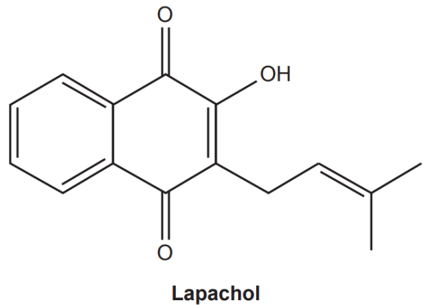

COSTA, P. R. R. et al. Ácidos e bases em química orgânica. Porto Alegre: Bookman, 2005 (adaptado).

Qual solução deve ser usada para extração do lapachol da serragem do ipê com maior eficiência?

A Solução de Na₂CO₃ para formar um sal de lapachol.

B Solução-tampão ácido acético/acetato de sódio (pH = 4,5).

ⓒ Solução de NaCl a fim de aumentar a força iônica do meio.

D Solução de Na₂SO₄ para formar um par iônico com lapachol.

E Solução de HCI a fim de extraí-lo por meio de reação ácido-base.

Questão 142 (H8 | 2015 | 658,2) ①②③④⑤

O ar atmosférico pode ser utilizado para armazenar o excedente de energia gerada no sistema elétrico, diminuindo seu desperdício, por meio do seguinte processo: água e gás carbônico são inicialmente removidos do ar atmosférico e a massa de ar restante é resfriada até -198 °C. Presente na proporção de 78% dessa massa de ar, o nitrogênio gasoso é liquefeito, ocupando um volume 700 vezes menor. A energia excedente do sistema elétrico é utilizada nesse processo, sendo parcialmente recuperada quando o nitrogênio líquido, exposto à temperatura ambiente, entra em ebulição e se expande, fazendo girar turbinas que convertem energia mecânica em energia elétrica.

MACHADO, R. Disponível em: www.correibraziliense.com.br.
Acesso em: 9 set. 2013 (adaptado).

No processo descrito, o excedente de energia elétrica é armazenado pela

A expansão do nitrogênio durante a ebulição.

B absorção de calor pelo nitrogênio durante a ebulição.

● realização de trabalho sobre o nitrogênio durante a liquefação.

D retirada de água e gás carbônico da atmosfera antes do resfriamento.

E liberação de calor do nitrogênio para a vizinhança durante a liquefação.

Questão 143 (H8 | 2019 | 659,2) ①②③④⑤

Uma das técnicas de reciclagem química do polímero PET [poli(tereftalato de etileno)] gera o tereftalato de metila e o etanodiol, conforme o esquema de reação, e ocorre por meio de uma reação de transesterificação.

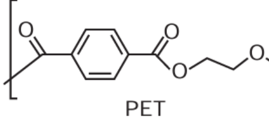

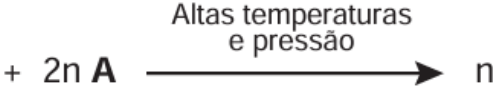

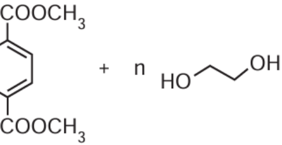

O composto A, representado no esquema de reação, é o

A metano.

B metanol.

©éter metílico.

D ácido etanoico.

anidrido etanoico.

Questão 144 (H8 | 2017 | 666,8) ①② ④⑤

A eletrólise é um processo não espontâneo de grande importância para a indústria química. Uma de suas aplicações é a obtenção do gás cloro e do hidróxido de sódio, a partir de uma solução aquosa de cloreto de sódio. Nesse procedimento, utiliza-se uma célula eletroquímica, como ilustrado.

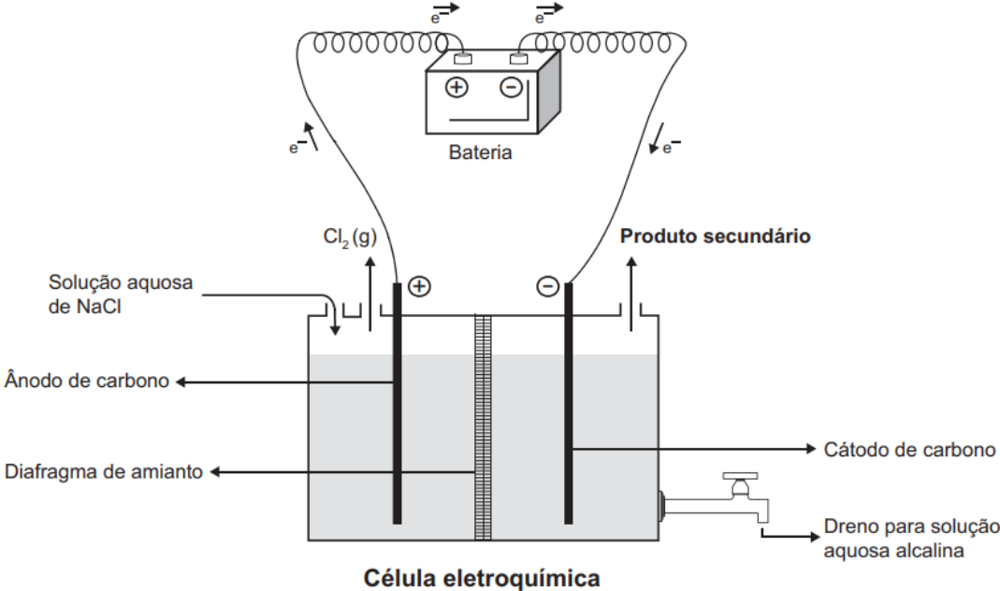

SHREVE, R. N.; BRINK Jr., J. A. Indústrias de processos químicos. Rio de Janeiro: Guanabara Koogan, 1997 (adaptado).

No processo eletrolítico ilustrado, o produto secundário obtido é o

A vapor de água.

B oxigênio molecular.

ⓒ hipoclorito de sódio.

D hidrogênio molecular.

E cloreto de hidrogênio.

#  H8: Etapas de Processos Biológicos, Químicos ou Físicos

Questão 145 (H8 | 2021 | 679,8) ①②③④⑤

Com o aumento da população de suínos no Brasil, torna-se necessária a adoção de métodos para reduzir o potencial poluidor dos resíduos dessa agroindústria, uma vez que, comparativamente ao esgoto doméstico, os dejetos suínos são 200 vezes mais poluentes. Sendo assim, a utilização desses resíduos como matéria-prima na obtenção de combustíveis é uma alternativa que permite diversificar a matriz energética nacional, ao mesmo tempo em que parte dos recursos hídricos do país são preservados.

BECK, A. M. Resíduos suínos como alternativa energética sustentável. XXVII Encontro Nacional de Engenharia de Produção. Anais ENEGEP, Foz do Iguaçu, 2007 (adaptado).

O biocombustível a que se refere o texto é o

A etanol.

B biogás.

Cbutano.

D metanol.

E biodiesel.

Questão 146 (H8 | 2020 | 688,4) ①②③ ⑤

A obtenção de óleos vegetais, de maneira geral, passa pelas etapas descritas no quadro.

| Etapa | Subetapa | O que ocorre |
| --- | --- | --- |
| Preparação da matéria-prima | Seleção dos grãos | Separação das sujidades mais grossas |
| Preparação da matéria-prima | Descascamento | Separação de polpa e casca |
| Preparação da matéria-prima | Trituração | Rompimento dos tecidos e das paredes das células |
| Preparação da matéria-prima | Cozimento | Aumento da permeabilidade das membranas celulares |
| Extração do óleo bruto | Prensagem | Remoção parcial do óleo |
| Extração do óleo bruto | Extração | Obtenção do óleo bruto com hexano |
| Extração do óleo bruto | Destilação | Separação do óleo e do solvente |

Qual das subetapas do processo é realizada em função apenas da polaridade das substâncias?

A Trituração.

B Cozimento.

© Prensagem.

D Extração.

E Destilação.

Questão 147 (H8 | 2016 | 701,3) ①②③④⑤

A usina de Itaipu é uma das maiores hidrelétricas do mundo em geração de energia. Com 20 unidades geradoras e 14 000 MW de potência total instalada, apresenta uma queda de 118,4 m e vazão nominal de 690 m$^{3}$/s por unidade geradora. O cálculo da potência teórica leva em conta a altura da massa de água represada pela barragem, a gravidade local (10 m/s$^{2}$) e a densidade da água (1 000 kg/m$^{3}$). A diferença entre a potência teórica e a instalada é a potência não aproveitada.

Disponível em: www.itaipu.gov.br. Acesso em: 11 maio 2013 (adaptado).

Qual é a potência, em MW, não aproveitada em cada unidade geradora de Itaipu?

A 0

B 1,18

$\odot$ 116,96

D 816,96

E 13 183,04

Questão 149 (H8 | 2022 | 751,7) ①②③④⑤

A água bruta coletada de mananciais apresenta alto índice de sólidos suspensos, o que a deixa com um aspecto turvo. Para se obter uma água límpida e potável, ela deve passar por um processo de purificação numa estação de tratamento de água. Nesse processo, as principais etapas são, nesta ordem: coagulação, decantação, filtração, desinfecção e fluoretação.

Qual é a etapa de retirada de grande parte desses sólidos?

A Coagulação.

B Decantação.

C Filtração.

D Desinfecção.

E Fluoretação.

Questão 148 (H8 | 2013 | 709,0) ①②③⑤

Eu também podia decompor a água, se fosse salgada ou acidulada, usando a pilha de Daniell como fonte de força. Lembro o prazer extraordinário que sentia ao decompor um pouco de água em uma taça para ovos quentes, vendo-a separar-se em seus elementos, o oxigênio em um eletrodo, o hidrogênio no outro. A eletricidade de uma pilha de 1 volt parecia tão fraca, e, no entanto, podia ser suficiente para desfazer um composto químico, a água...

SACKS, O. Tio Tungstênio: memórias de uma infância química. São Paulo: Cia. das Letras, 2002.

O fragmento do romance de Oliver Sacks relata a separação dos elementos que compõem a água. O princípio do método apresentado é utilizado industrialmente na

A obtenção de ouro a partir de pepitas.

B obtenção de calcário a partir de rochas.

obtenção de alumínio a partir da bauxita.

D obtenção de ferro a partir de seus óxidos.

E obtenção de amônia a partir de hidrogênio e nitrogênio.

Questão 150 (H8 | 2018 | 757,3) ①②③④⑤

A hidroxilamina ($NH_2OH$) é extremamente reativa em reações de substituição nucleofílica, justificando sua utilização em diversos processos. A reação de substituição nucleofílica entre o anidrido acético e a hidroxilamina está representada.

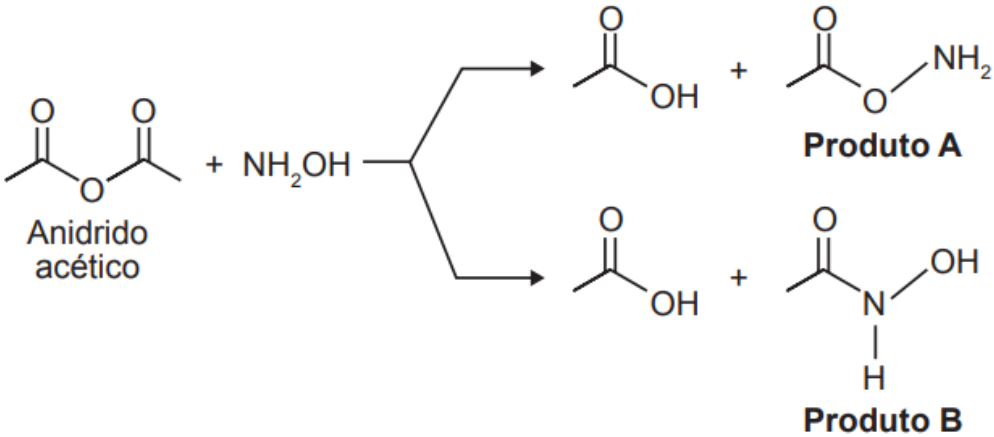

O produto A é favorecido em relação ao B, por um fator de $10^5$. Em um estudo de possível substituição do uso de hidroxilamina, foram testadas as moléculas numeradas de 1 a 5.

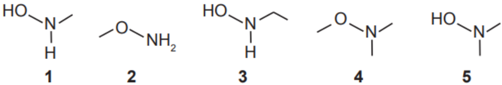

Dentre as moléculas testadas, qual delas apresentou menor reatividade?

A 1

B 2

© 3

D 4

E 5

#  Questão 151 (H8 | 2014 | Anulada pela TRI)

Para impedir a contaminação microbiana do suprimento de água, deve-se eliminar as emissões de efluentes e, quando necessário, tratá-lo com desinfetante. O ácido hipocloroso (HCIO), produzido pela reação entre cloro e água, é um dos compostos mais empregados como desinfetante. Contudo, ele não atua somente como oxidante, mas também como um ativo agente de cloração. A presença de matéria orgânica dissolvida no suprimento de água clorada pode levar à formação de clorofórmio ($CHCl_3$) e outras espécies orgânicas cloradas tóxicas.

SPIRO, T. G.; STIGLIANI, W. M. Química ambiental. São Paulo: Pearson, 2009 (adaptado).

Visando eliminar da água o clorofórmio e outras moléculas orgânicas, o tratamento adequado é a

A filtração, com o uso de filtros de carvão ativo.

B fluoretação, pela adição de fluoreto de sódio.

© coagulação, pela adição de sulfato de alumínio.

D correção do pH, pela adição de carbonato de sódio.

E floculação, em tanques de concreto com a água em movimento.

#  Competência 3

Associar intervenções que resultam em degradação ou conservação ambiental a processos produtivos e sociais e a instrumentos ou ações científicotecnológicos.

##  Habilidade 9

Compreender a importância dos ciclos biogeuoquímicos ou do fluxo de energia para a vida, ou da ação de agentes ou fenômenos que podem causar alterações nesses processos.

##  Questão 152 (H9 | 2021 | 551,4) ①②③④⑤

Na cidade de São Paulo, as ilhas de calor são responsáveis pela alteração da direção do fluxo da brisa marítima que deveria atingir a região de mananciais. Mas, ao cruzar a ilha de calor, a brisa marítima agora encontra um fluxo de ar vertical, que transfere para ela energia térmica absorvida das superfícies quentes da cidade, deslocando-a para altas altitudes. Dessa maneira, há condensação e chuvas fortes no centro da cidade, em vez de na região de mananciais. A imagem apresenta os três subsistemas que trocam energia nesse fenômeno.

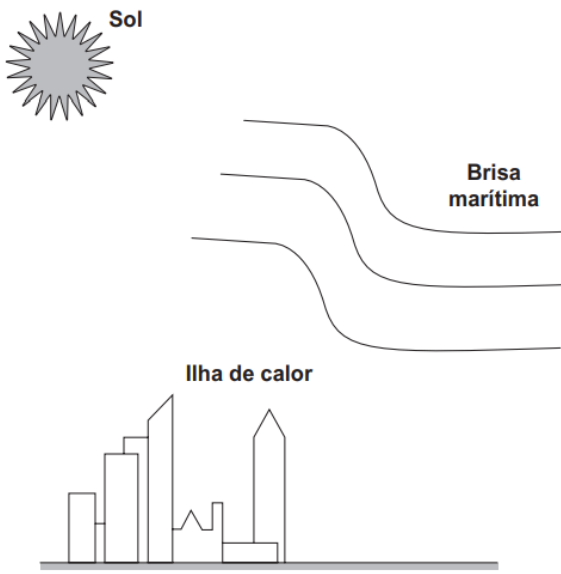

No processo de fortes chuvas no centro da cidade de São Paulo, há dois mecanismos dominantes de transferência de calor: entre o Sol e a ilha de calor, e entre a ilha de calor e a brisa marítima.

VIVEIROS, M. Ilhas de calor afastam chuvas de represas. Disponível em: www2.feis.unesp.br. Acesso em: 3 dez. 2019 (adaptado).

Esses mecanismos são, respectivamente,

A irradiação e convecção.

B irradiação e irradiação.

© condução e irradiação.

D convecção e irradiação.

E convecção e convecção.

##  Questão 153 (H9 | 2020 | 567,4) ①②③④⑤

Grandes reservatórios de óleo leve de melhor qualidade e que produz petróleo mais fino foram descobertos no litoral brasileiro numa camada denominada pré-sal, formada há 150 milhões de anos.

A utilização desse recurso energético acarreta para o ambiente um desequilíbrio no ciclo do

A nitrogênio, devido à nitrificação ambiental transformando amônia em nitrito.

B nitrogenênio, devido ao aumento dos compostos nitrogenados no ambiente terrestre.

● carbono, devido ao aumento dos carbonatos dissolvidos no ambiente marinho.

Ⓓ carbono, devido à liberação das cadeias carbônicas aprisionadas abaixo dos sedimentos.

E fósforo, devido à liberação dos fosfatos acumulados no ambiente marinho.

#  Questão 154 (H9 | 2012 | 577,5) ①②③④⑤

Paleontólogos estudam fósseis e esqueletos de dinossauros para tentar explicar o desaparecimento desses animais. Esses estudos permitem afirmar que esses animais foram extintos há cerca de 65 milhões de anos. Uma teoria aceita atualmente é a de que um asteroide colidiu com a Terra, formando uma densa nuvem de poeira na atmosfera.

De acordo com essa teoria, a extinção ocorreu em função de modificações no planeta que

A desestabilizaram o relógio biológico dos animais, causando alterações no código genético.

B reduziram a penetração da luz solar até a superfície da Terra, interferindo no fluxo energético das teias tróficas.

ⓒ causaram uma série de intoxicações nos animais, provocando a bioacumulação de partículas de poeira nos organismos.

D resultaram na sedimentação das partículas de poeira levantada com o impacto do meteoro, provocando o desaparecimento de rios e lagos.

E evitaram a precipitação de água até a superfície da Terra, causando uma grande seca que impediu a retroalimentação do ciclo hidrológico.

#  Questão 155 (H9 | 2016 | 624,4) ①②③④⑤

Ao percorrer o trajeto de uma cadeia alimentar, o carbono, elemento essencial e majoritário da matéria orgânica que compõe os indivíduos, ora se encontra em sua forma inorgânica, ora se encontra em sua forma orgânica. Em uma cadeia alimentar composta por fitoplâncton, zooplâncton, moluscos, crustáceos e peixes ocorre a transição desse elemento da forma inorgânica para a orgânica.

Em qual grupo de organismos ocorre essa transição?

A Fitoplâncton.

B Zooplâncton.

© Moluscos.

D Crustáceos.

Peixes.

#  Questão 156 (H9 | 2015 | 634,2) ①②③④⑤

O nitrogênio é essencial para a vida e o maior reservatório global desse elemento, na forma de $N_2$, é a atmosfera. Os principais responsáveis por sua incorporação na matéria orgânica são microrganismos fixadores de $N_2$, que ocorrem de forma livre ou simbiontes com plantas.

ADUAN, R. E. et al. Os grandes ciclos biogeoquímicos do planeta. Planaltina: Embrapa, 2004 (adaptado).

Animais garantem suas necessidades metabólicas desse elemento pela

A absorção do gás nitrogenênio pela respiração.

B ingestão de moléculas de carboidratos vegetais.

© incorporação de nitritos dissolvidos na água consumida.

Ⓓ transferência da matéria orgânica pelas cadeias tróficas.

E protocooperação com microrganismos fixadores de nitrogênio.

#  Questão 157 (H9 | 2021 | 640,6) ①②③④⑤

Organismos autótrofos e heterótrofos realizam processos complementares que associam os ciclos do carbono e do oxigênio. O carbono fixado pela energia luminosa ou a partir de compostos inorgânicos é eventualmente degradado pelos organismos, resultando em fontes de carbono como metano ou gás carbônico. Ainda, outros compostos orgânicos são catabolizados pelos seres, com menor rendimento energético, produzindo compostos secundários (subprodutos) que podem funcionar como combustíveis ambientais.

O processo metabólico associado à expressão combustíveis ambientais é a

A fotossíntese.

B fermentação.

C quimiossíntese.

D respiração aeróbica.

E fosforilação oxidativa.

##  Questão 158 (H9 | 2013 | 650,7) ①②③④⑤

Sabe-se que o aumento da concentração de gases como CO₂, CH₄ e N₂O na atmosfera é um dos fatores responsáveis pelo agravamento do efeito estufa. A agricultura é uma das atividades humanas que pode contribuir tanto para a emissão quanto para o sequestro desses gases, dependendo do manejo da matéria orgânica do solo.

ROSA, A. H.; COELHO, J. C. R. Cadernos Temáticos de Química Nova na Escola, São Paulo, n. 5, nov. 2003 (adaptado).

De que maneira as práticas agrícolas podem ajudar a minimizar o agravamento do efeito estufa?

A Evitando a rotação de culturas.

B Liberando o CO2 presente no solo.

Aumentando a quantidade de matéria orgânica do solo.

D Queimando a matéria orgânica que se deposita no solo.

E Atenuando a concentração de resíduos vegetais do solo.

#  Questão 159 (H9 | 2013 | 655,2) ①②③④⑤

Plantas terrestres que ainda estão em fase de crescimento fixam grandes quantidades de CO₂, utilizando-o para formar novas moléculas orgânicas, e liberam grande quantidade de O₂. No entanto, em florestas maduras, cujas árvores já atingiram o equilíbrio, o consumo de O₂ pela respiração tende a igualar sua produção pela fotossíntese. A morte natural de árvores nessas florestas afeta temporariamente a concentração de O₂ e de CO₂ próximo à superfície do solo onde elas caíram.

A concentração de $O_2$ próximo ao solo, no local da queda, será

A menor, pois haverá consumo de $O_2$ durante a decomposição dessas árvores.

B maior, pois haverá economia de O₂ pela ausência das árvores mortas.

© maior, pois haverá liberação de O₂ durante a fotossíntese das árvores jovens.

D igual, pois haverá consumo e produção de $O_2$ pelas árvores maduras restantes.

E menor, pois haverá redução de O₂ pela falta da fotossíntese realizada pelas árvores mortas.

#  Questão 160 (H9 | 2018 | 659,5) ①②③④⑤

As células e os organismos precisam realizar trabalho para permanecerem vivos e se reproduzirem. A energia metabólica necessária para a realização desse trabalho é oriunda da oxidação de combustíveis, gerados no ciclo do carbono, por meio de processos capazes de interconverter diferentes formas da energia.

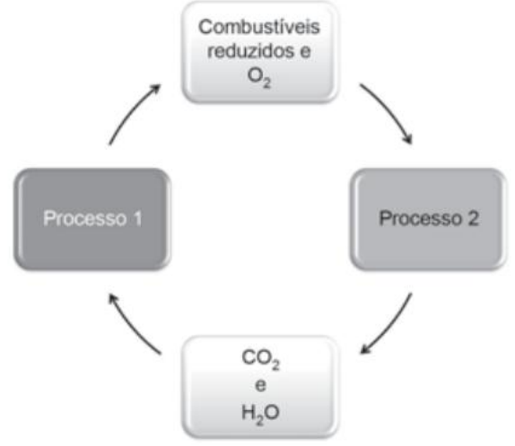

NELSON, D. L.; COX, M. M. Lehninger: principios de bioquímica. São Paulo: Sarvier, 2002 (adaptado).

Nesse ciclo, a formação de combustíveis está vinculada à conversão de energia

A térmica em cinética.

B química em térmica.

ⓒ eletroquímica em calor.

D cinética em eletromagnética.

E eletromagnética em química.

##  Questão 161 (H9 | 2017 | 661,0) ①②③④⑤

Uma grande virada na moderna história da agricultura ocorreu depois da Segunda Guerra Mundial. Após a guerra, os governos haviam se deparado com um enorme excedente de nitrato de amônio, ingrediente usado na fabricação de explosivos. A partir daí as fábricas de munição foram adaptadas para começar a produzir fertilizantes tendo como componente principal os nitratos.

SOUZA, F. A. Agricultura natural/orgânica como instrumento de fixação biológica e manutenção do nitrogênio no solo: um modelo sustentável de MDL. Disponível em: www.planetaorganico.com.br. Acesso em: 17 jul. 2015 (adaptado).

No ciclo natural do nitrogênio, o equivalente ao principal componente desses fertilizantes industriais é produzido na etapa de

A nitratação.

B nitrosação.

c amonificação.

D desnitrificação.

E fixação biológica do N2.

#  Questão 162 (H9 | 2014 | 662,4) ①②③④⑤

A aplicação excessiva de fertilizantes nitrogenados na agricultura pode acarretar alterações no solo e na água pelo acúmulo de compostos nitrogenados, principalmente a forma mais oxidada, favorecendo a proliferação de algas e plantas aquáticas e alterando o ciclo do nitrogênio, representado no esquema. A espécie nitrogenada mais oxidada tem sua quantidade controlada por ação de microrganismos que promovem a reação de redução dessa espécie, no processo denominado desnitrificação.

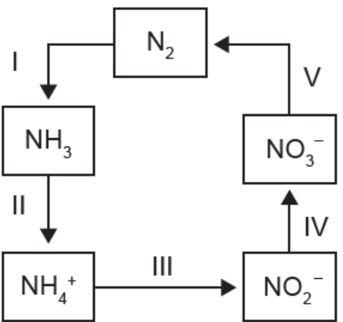

O processo citado está representado na etapa

A I.

B II.

C III.

D IV.

E V.

#  Questão 163 (H9 | 2022 | 670,4) ①②③④⑤

Os ursos, por não apresentarem uma hibernação verdadeira, acordam por causa da presença de termogenina, uma proteína mitocondrial que impede a chegada dos prótons até a ATP sintetase, gerando calor. Esse calor é importante para aquecer o organismo, permitindo seu despertar.

SADAVA, D. et al. Vida: a ciência da biologia. Porto Alegres Artmed, 2009 (adaptado).

Em qual etapa do metabolismo energético celular a termogenina interfere?

A Glicóise.

B Fermentação lática.

Ciclo do ácido cítrico.

D Oxidação do piruvato.

E Fosforilação oxidativa.

##  Questão 164 (H9 | 2018 | 677,7) ①②③④⑤

O alemão Fritz Haber recebeu o Prêmio Nobel de química de 1918 pelo desenvolvimento de um processo viável para a síntese da amônia ($NH_3$). Em seu discurso de premiação, Haber justificou a importância do feito dizendo que:

“Desde a metade do século passado, tornou-se conhecido que um suprimento de nitrogênio é uma necessidade básica para o aumento das safras de alimentos; entretanto, também se sabia que as plantas não podem absorver o nitrogênio em sua forma simples, que é o principal constituinte da atmosfera. Elas precisam que o nitrogênio seja combinado [...] para poderem assimilá-lo.

Economias agrícolas basicamente mantêm o balanço do nitrogênio ligado. No entanto, com o advento da era industrial, os produtos do solo são levados de onde cresce a colheita para lugares distantes, onde são consumidos, fazendo com que o nitrogênio ligado não retorne à terra da qual foi retirado.

Isso tem gerado a necessidade econômica mundial de abastecer o solo com nitrogênio ligado. [...] A demanda por nitrogênio, tal como a do carvão, indica quão diferente nosso modo de vida se tornou com relação ao das pessoas que, com seus próprios corpos, fertilizam o solo que cultivam.

Desde a metade do último século, nós vinhamos aproveitando o suprimento de nitrogênio do salitre que a natureza tinha depositado nos desertos montanhosos do Chile. Comparando o rápido crescimento da demanda com a extensão calculada desses depósitos, ficou claro que em meados do século atual uma emergência seríssima seria inevitável, a menos que a química encontrasse uma saída."

HABER, F. The Synthesis of Ammonia from its Elements. Disponível em: www.nobelprize.org. Acesso em: 13 jul. 2013 (adaptado).

De acordo com os argumentos de Haber, qual fenômeno teria provocado o desequilíbrio no “balanço do nitrogênio ligado”?

A O esgotamento das reservas de salitre no Chile.

Ⓑ O aumento da exploração de carvão vegetal e carvão mineral.

© A redução da fertilidade do solo nas economias agrícolas.

Ⓓ A intensificação no fluxo de pessoas do campo para as cidades.

E A necessidade das plantas de absorverem sais de nitrogenênio disponíveis no solo.

Questão 165 (H9 | 2022 | 678,7) ①②③④⑤

O esquema representa o ciclo do nitrogênio:

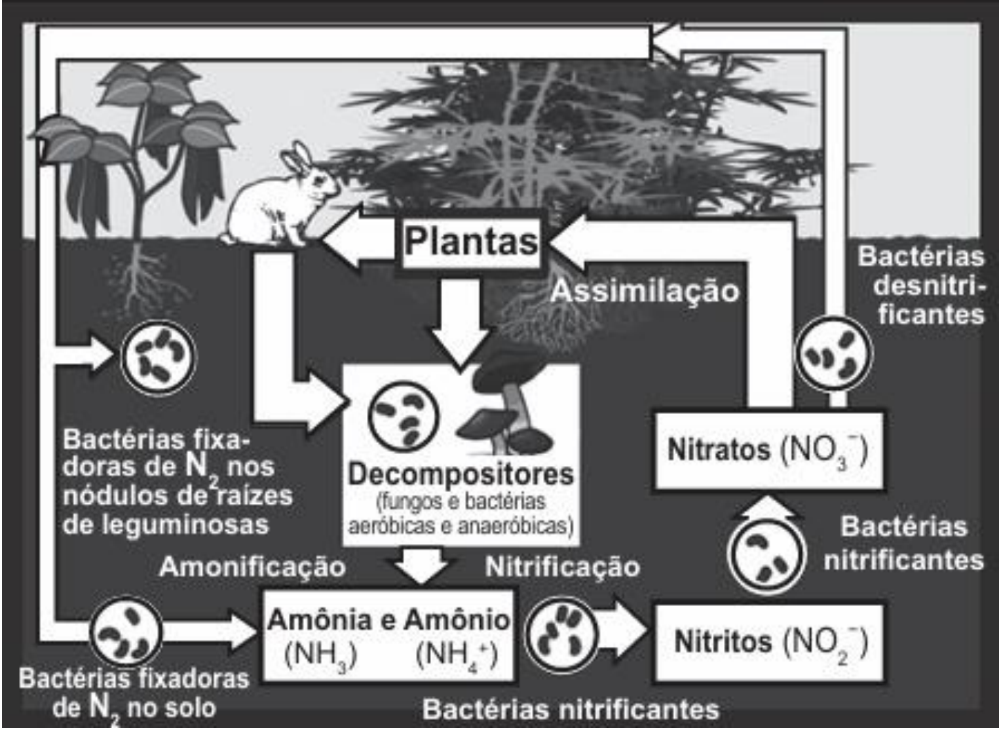

A chuva ácida interfere no ciclo do nitrogênio, principalmente, por proporcionar uma diminuição do pH do solo e da atmosfera, alterando a concentração dos compostos presentes nesse ciclo.

Disponível em: http://scienceprojectideasforkids.com. Acesso em: 6 ago. 2012 (adaptado).

Em um solo de menor pH, será favorecida a formação de

A $N_2$.

B $NH_3$.

C $NH_{4}^{+}$

$$\text{D} NO_{2}^{-}.$$

$$\text{E} NO_{3}^{-}.$$

#  Questão 166 (H9 | 2023 | 681,7) ①②③ ⑤

O ciclo do nitrogênio é composto por várias etapas, conforme a figura, sendo cada uma desempenhada por um grupo específico de microrganismos.

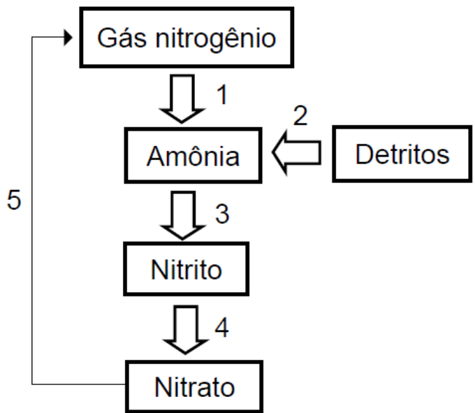

Se o grupo dos microrganismos decompositores fosse exterminado, qual etapa não ocorreria?

A 1

B 2

C 3

D 4

E 5

#  Questão 167 (H9 | 2019 | 721,4) ①②③⑤

Glicólise é um processo que ocorre nas células, convertendo glicose em piruvato. Durante a prática de exercícios físicos que demandam grande quantidade de esforço, a glicose é completamente oxidada na presença de $O_2$. Entretanto, em alguns casos, as células musculares podem sofrer um déficit de $O_2$ e a glicose ser convertida em duas moléculas de ácido lático. As equações termoquímicas para a combustão da glicose e do ácido lático são, respectivamente, mostradas a seguir:

$$C_6H_{12}O_6(s) + 6O_2(g) \rightarrow 6CO_2(g) + 6H_2O(l) \quad \Delta_c H = -2800 \text{ kJ}$$

O processo anaeróbico é menos vantajoso energeticamente porque

A libera 112 kJ por mol de glicose.

B libera 467 kJ por mol de glicose.

libera 2 688 kJ por mol de glicose.

D absorve 1 344 kJ por mol de glicose.

E absorve 2 800 kJ por mol de glicose.

Questão 168 (H9 | 2019 | 879,9) ①②③④⑤

O 2,4-dinitrofenol (DNP) é conhecido como desacoplador da cadeia de elétrons na mitocôndria e apresenta um efeito emagrecedor. Contudo, por ser perigoso e pela ocorrência de casos letais, seu uso como medicamento é proibido em diversos países, inclusive no Brasil. Na mitocôndria, essa substância captura, no espaço intermembranas, prótons (H+) provenientes da atividade das proteínas da cadeia respiratória, retornando-os à matriz mitocondrial. Assim, esses prótons não passam pelo transporte enzimático na membrana interna.

GRUNDLINGH, J. et al. 2,4-Dinitrophenol (DNP): a Weight Loss Agent with Significant Acute Toxicity and Risk of Death. Journal of Medical Toxicology, v. 7, 2011 (adaptado).

O efeito emagrecedor desse composto está relacionado ao(à)

A obstrução da cadeia respiratória, resultando em maior consumo celular de ácidos graxos.

B bloqueio das reações do ciclo de Krebs, resultando em maior gasto celular de energia.

© diminuição da produção de acetil CoA, resultando em maior gasto celular de piruvato.

D inibição da glicóise, resultando em maior absorção celular da glicose sanguínea.

E redução da produção de ATP, resultando em maior gasto celular de nutrientes.

#  Competência 3

Associar intervenções que resultam em degradação ou conservação ambiental a processos produtivos e sociais e a instrumentos ou ações científico-tecnológicos.

#  Habilidade 10

Analisar perturbações ambientais, identificando fontes, transporte e(ou) destino dos poluentes ou prevendo efeitos em sistemas naturais, produtivos ou sociais.

Questão 169 (H10 | 2012 | 436,1) 1 ②③④⑤

Medidas de saneamento básico são fundamentais no processo de promoção de saúde e qualidade de vida da população. Muitas vezes, a falta de saneamento está relacionada com o aparecimento de várias doenças. Nesse contexto, um paciente dá entrada em um pronto atendimento relatando que há 30 dias teve contato com águas de enchente. Ainda informa que nesta localidade não há rede de esgoto e drenagem de águas pluviais e que a coleta de lixo é inadequada. Ele apresenta os seguintes sintomas: febre, dor de cabeça e dores musculares.

Disponível em: http://portal.saude.gov.br. Acesso em: 27 fev. 2012 (adaptado).

Relacionando os sintomas apresentados com as condições sanitárias da localidade, há indicações de que o paciente apresenta um caso de

A difteria.

B botulismo.

tuberculose.

D leptospirose.

E meningite meningocóica.

##  Questão 170 (H10 | 2019 | 515,6)   ②③④⑤

A poluição radioativa compreende mais de 200 nuclídeos, sendo que, do ponto de vista de impacto ambiental, destacam-se o césio-137 e o estrôncio-90. A maior contribuição de radionuclídeos antropogênicos no meio marinho ocorreu durante as décadas de 1950 e 1960, como resultado dos testes nucleares realizados na atmosfera. O estrôncio-90 pode se acumular nos organismos vivos e em cadeias alimentares e, em razão de sua semelhança química, pode participar no equilíbrio com carbonato e substituir o cálcio em diversos processos biológicos.

FIGUEIRA, R. C. L.; CUNHA, I. I. L. A contaminação dos oceanos por radionucídeos antropogênicos. Química Nova, n. 21, 1998 (adaptado).

Ao entrar numa cadeia alimentar da qual o homem faz parte, em qual tecido do organismo humano o estrôncio-90 será acumulado predominantemente?

A Cartilaginoso.

B Sanguíneo.

C Muscular.

D Nervoso.

E Ósseo.

